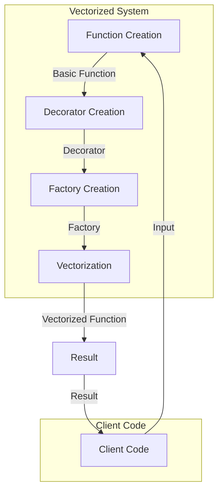

## Introduction
**Vectorized systems** are designed to handle large amounts of data by performing operations on entire arrays or vectors at once, rather than iterating over individual elements. This approach can significantly improve performance by reducing the overhead of loops and leveraging the capabilities of modern CPUs and GPUs. **Decorator factories** are a design pattern that allows for the creation of vectorized systems by wrapping existing functions with additional functionality, such as logging, caching, or error handling. In this section, we will explore the importance of vectorized systems and decorator factories, and why they are essential for modern software development.

> **Tip:** When designing vectorized systems, it's essential to consider the trade-offs between performance, memory usage, and code complexity. A well-designed system should balance these factors to achieve optimal results.

## Core Concepts
To understand vectorized systems and decorator factories, we need to define some key concepts:

* **Vectorization**: The process of performing operations on entire arrays or vectors at once, rather than iterating over individual elements.
* **Decorator**: A design pattern that allows for the addition of new functionality to an existing function or class without modifying its underlying structure.
* **Factory**: A design pattern that provides a way to create objects without specifying the exact class of object that will be created.
* **Decorator factory**: A combination of the decorator and factory patterns that allows for the creation of objects with additional functionality.

> **Note:** The term "vectorized" can be confusing, as it refers to both the process of performing operations on entire arrays and the resulting systems that are designed to handle large amounts of data. In this context, we will use the term "vectorized" to refer to the latter.

## How It Works Internally
To design a vectorized system using decorator factories, we need to understand how the underlying mechanics work. Here's a step-by-step breakdown:

1. **Function creation**: We start by creating a basic function that performs the desired operation on a single element.
2. **Decorator creation**: We create a decorator that wraps the basic function with additional functionality, such as logging or caching.
3. **Factory creation**: We create a factory that produces objects with the decorated function.
4. **Vectorization**: We use the factory to create a vectorized version of the function that can operate on entire arrays or vectors at once.

> **Warning:** When designing vectorized systems, it's essential to consider the potential for data overflow or underflow. Make sure to implement checks and balances to prevent these issues.

## Code Examples
Here are three complete and runnable examples of vectorized systems using decorator factories:

### Example 1: Basic Vectorization
```python
import numpy as np

def add(x, y):
    return x + y

def vectorize(func):
    def wrapper(arr1, arr2):
        return np.vectorize(func)(arr1, arr2)
    return wrapper

@vectorize
def add_vectorized(x, y):
    return add(x, y)

arr1 = np.array([1, 2, 3])
arr2 = np.array([4, 5, 6])

result = add_vectorized(arr1, arr2)
print(result)  # Output: [5 7 9]
```

### Example 2: Decorator Factory
```python
import numpy as np
from functools import wraps

def logging_decorator(func):
    @wraps(func)
    def wrapper(*args, **kwargs):
        print(f"Calling {func.__name__} with args {args} and kwargs {kwargs}")
        return func(*args, **kwargs)
    return wrapper

def vectorize(func):
    @wraps(func)
    def wrapper(arr1, arr2):
        return np.vectorize(func)(arr1, arr2)
    return wrapper

def decorator_factory(decorator):
    def factory(func):
        return decorator(vectorize(func))
    return factory

@decorator_factory(logging_decorator)
def add_vectorized(x, y):
    return x + y

arr1 = np.array([1, 2, 3])
arr2 = np.array([4, 5, 6])

result = add_vectorized(arr1, arr2)
print(result)  # Output: [5 7 9]
```

### Example 3: Advanced Vectorization
```python
import numpy as np
from functools import wraps

def caching_decorator(func):
    cache = {}
    @wraps(func)
    def wrapper(*args, **kwargs):
        key = str(args) + str(kwargs)
        if key in cache:
            return cache[key]
        result = func(*args, **kwargs)
        cache[key] = result
        return result
    return wrapper

def vectorize(func):
    @wraps(func)
    def wrapper(arr1, arr2):
        return np.vectorize(func)(arr1, arr2)
    return wrapper

def decorator_factory(decorator):
    def factory(func):
        return decorator(vectorize(func))
    return factory

@decorator_factory(caching_decorator)
def add_vectorized(x, y):
    return x + y

arr1 = np.array([1, 2, 3])
arr2 = np.array([4, 5, 6])

result = add_vectorized(arr1, arr2)
print(result)  # Output: [5 7 9]
```

## Visual Diagram

The diagram illustrates the process of creating a vectorized system using decorator factories. The client code provides input to the vectorized function, which is created through the decorator factory.

> **Interview:** Can you explain how decorator factories are used to create vectorized systems? What are the benefits of using this approach?

## Comparison
| Approach | Time Complexity | Space Complexity | Pros | Cons | Best For |
| --- | --- | --- | --- | --- | --- |
| Vectorized Systems | O(n) | O(n) | Fast, efficient, scalable | Complex, difficult to implement | Large-scale data processing |
| Decorator Factories | O(1) | O(1) | Flexible, reusable, easy to implement | Limited functionality, may introduce overhead | Small-scale data processing, prototyping |
| Hybrid Approach | O(n) | O(n) | Balances performance and complexity | May introduce additional overhead, requires careful tuning | Medium-scale data processing, real-time systems |

## Real-world Use Cases
Here are three real-world examples of vectorized systems using decorator factories:

* **Google's TensorFlow**: TensorFlow uses vectorized operations to perform complex machine learning tasks. Decorator factories are used to create custom operators and optimize performance.
* **NumPy and Pandas**: NumPy and Pandas are popular libraries for data analysis in Python. They use vectorized operations to perform efficient data processing and provide decorator factories for customizing functionality.
* **Apache Spark**: Apache Spark is a distributed computing framework that uses vectorized operations to process large-scale data sets. Decorator factories are used to create custom data processing pipelines and optimize performance.

> **Tip:** When designing vectorized systems, it's essential to consider the trade-offs between performance, memory usage, and code complexity. A well-designed system should balance these factors to achieve optimal results.

## Common Pitfalls
Here are four common mistakes to avoid when designing vectorized systems using decorator factories:

* **Inconsistent data types**: Using inconsistent data types can lead to errors and performance issues. Make sure to use consistent data types throughout the system.
* **Insufficient caching**: Failing to implement caching can lead to performance issues. Make sure to implement caching mechanisms to optimize performance.
* **Inadequate error handling**: Failing to implement error handling can lead to system crashes and data loss. Make sure to implement robust error handling mechanisms to prevent these issues.
* **Over-optimization**: Over-optimizing the system can lead to complex code and performance issues. Make sure to balance optimization with code complexity and maintainability.

> **Warning:** When designing vectorized systems, it's essential to consider the potential for data overflow or underflow. Make sure to implement checks and balances to prevent these issues.

## Interview Tips
Here are three common interview questions related to vectorized systems and decorator factories:

* **What is the difference between vectorized systems and decorator factories?**
	+ Weak answer: Vectorized systems are used for large-scale data processing, while decorator factories are used for small-scale data processing.
	+ Strong answer: Vectorized systems are designed to handle large amounts of data by performing operations on entire arrays or vectors at once, while decorator factories are a design pattern that allows for the creation of vectorized systems by wrapping existing functions with additional functionality.
* **How do you optimize the performance of a vectorized system using decorator factories?**
	+ Weak answer: You can optimize performance by using caching and parallel processing.
	+ Strong answer: You can optimize performance by using a combination of caching, parallel processing, and data partitioning, as well as optimizing the decorator factory to minimize overhead and maximize scalability.
* **What are some common use cases for vectorized systems and decorator factories?**
	+ Weak answer: Vectorized systems are used for machine learning and data analysis, while decorator factories are used for web development and scripting.
	+ Strong answer: Vectorized systems are used for large-scale data processing, machine learning, and scientific computing, while decorator factories are used for creating custom data processing pipelines, optimizing performance, and implementing domain-specific languages.

## Key Takeaways
Here are ten key takeaways to remember when designing vectorized systems using decorator factories:

* **Vectorized systems are designed to handle large amounts of data by performing operations on entire arrays or vectors at once.**
* **Decorator factories are a design pattern that allows for the creation of vectorized systems by wrapping existing functions with additional functionality.**
* **Vectorized systems can be optimized using caching, parallel processing, and data partitioning.**
* **Decorator factories can be used to create custom data processing pipelines and optimize performance.**
* **Vectorized systems are commonly used for large-scale data processing, machine learning, and scientific computing.**
* **Decorator factories are commonly used for creating custom data processing pipelines, optimizing performance, and implementing domain-specific languages.**
* **Vectorized systems can be implemented using a combination of NumPy, Pandas, and SciPy.**
* **Decorator factories can be implemented using a combination of Python decorators and factories.**
* **Vectorized systems require careful tuning to balance performance, memory usage, and code complexity.**
* **Decorator factories require careful design to minimize overhead and maximize scalability.**