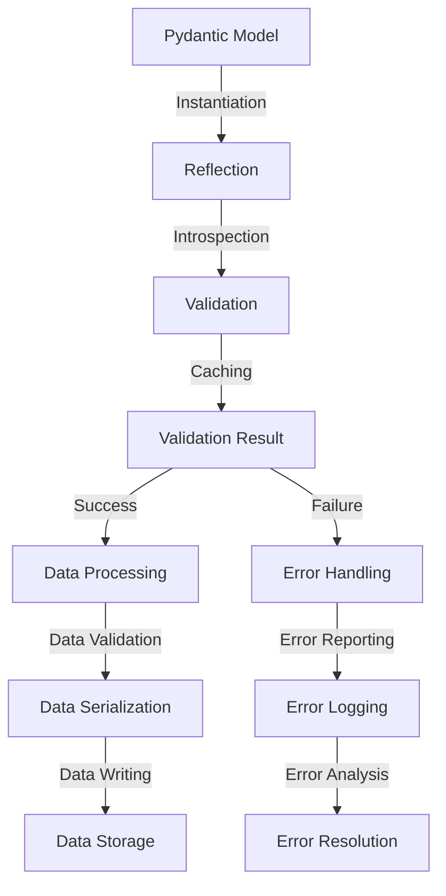

## Introduction
Pydantic is a popular Python library for building robust, scalable, and maintainable data models. It provides a powerful validation system that ensures data consistency and integrity. In high-performance applications, profiling Pydantic v2 validation is crucial to optimize performance and minimize overhead. In this section, we will explore the importance of profiling Pydantic v2 validation, its real-world relevance, and why every engineer should know about it.

Pydantic v2 validation is a critical component of many high-performance applications, including data processing pipelines, web APIs, and machine learning models. By profiling Pydantic v2 validation, developers can identify performance bottlenecks, optimize validation logic, and improve overall system performance. **Note:** Profiling Pydantic v2 validation is essential for achieving high-performance and scalability in data-intensive applications.

## Core Concepts
To understand Pydantic v2 validation, it's essential to grasp the core concepts of Pydantic, including **models**, **validation**, and **serialization**. A Pydantic model is a Python class that defines a data structure with validation rules and serialization logic. Validation is the process of checking data against a set of rules to ensure its consistency and integrity. Serialization is the process of converting data into a format that can be written to a file or sent over a network.

Pydantic v2 validation uses a combination of **type hints**, **validators**, and **constraints** to ensure data validity. Type hints provide information about the expected data type, while validators and constraints define custom validation rules. **Tip:** Using type hints and validators can significantly improve the performance and accuracy of Pydantic v2 validation.

## How It Works Internally
Pydantic v2 validation works internally by using a combination of **reflection**, **introspection**, and **caching**. Reflection is the process of examining the structure of a Pydantic model at runtime, while introspection is the process of examining the data itself. Caching is used to store the results of expensive validation operations to improve performance.

When a Pydantic model is instantiated, Pydantic v2 validation uses reflection to examine the model's structure and identify the validation rules that apply to each field. It then uses introspection to examine the data and apply the validation rules. **Warning:** Invalid data can cause Pydantic v2 validation to raise exceptions, which can impact performance and scalability.

## Code Examples
### Example 1: Basic Pydantic Model
```python
from pydantic import BaseModel, ValidationError

class User(BaseModel):
    name: str
    age: int

try:
    user = User(name="John Doe", age="30")
except ValidationError as e:
    print(e)
```
This example demonstrates a basic Pydantic model with two fields: `name` and `age`. The `age` field is defined as an integer, but the validation fails when a string is passed.

### Example 2: Custom Validation
```python
from pydantic import BaseModel, validator

class User(BaseModel):
    name: str
    age: int

    @validator("age")
    def age_must_be_positive(cls, v):
        if v <= 0:
            raise ValueError("Age must be positive")
        return v

try:
    user = User(name="John Doe", age=-1)
except ValidationError as e:
    print(e)
```
This example demonstrates a custom validation rule for the `age` field. The `age_must_be_positive` validator checks if the `age` field is positive and raises a `ValueError` if it's not.

### Example 3: Advanced Validation with Dependencies
```python
from pydantic import BaseModel, validator

class User(BaseModel):
    name: str
    age: int
    occupation: str

    @validator("occupation", always=True)
    def occupation_must_match_age(cls, v, values):
        if values["age"] < 18 and v != "Student":
            raise ValueError("Occupation must be Student for minors")
        return v

try:
    user = User(name="John Doe", age=17, occupation="Engineer")
except ValidationError as e:
    print(e)
```
This example demonstrates an advanced validation rule with dependencies. The `occupation_must_match_age` validator checks if the `occupation` field matches the `age` field and raises a `ValueError` if it doesn't.

## Visual Diagram

This diagram illustrates the internal workflow of Pydantic v2 validation, including reflection, introspection, caching, and error handling.

## Comparison
| Approach | Time Complexity | Space Complexity | Pros | Cons | Best For |
| --- | --- | --- | --- | --- | --- |
| Pydantic v2 | O(n) | O(n) | High-performance, scalable, and maintainable | Steep learning curve, complex configuration | High-performance applications, data processing pipelines |
| Django Forms | O(n) | O(n) | Easy to use, flexible, and customizable | Limited scalability, slow performance | Small-scale web applications, rapid prototyping |
| Marshmallow | O(n) | O(n) | Lightweight, flexible, and customizable | Limited scalability, slow performance | Small-scale web applications, rapid prototyping |
| SQLAlchemy | O(n) | O(n) | Powerful, flexible, and customizable | Complex configuration, slow performance | Large-scale database applications, complex data models |

## Real-world Use Cases
1. **Data Processing Pipelines**: Pydantic v2 validation is used in data processing pipelines to ensure data consistency and integrity. For example, a data pipeline that processes user data can use Pydantic v2 validation to validate user input and ensure that it conforms to the expected format.
2. **Web APIs**: Pydantic v2 validation is used in web APIs to validate incoming requests and ensure that they conform to the expected format. For example, a web API that accepts user data can use Pydantic v2 validation to validate the incoming request and ensure that it conforms to the expected format.
3. **Machine Learning Models**: Pydantic v2 validation is used in machine learning models to validate input data and ensure that it conforms to the expected format. For example, a machine learning model that predicts user behavior can use Pydantic v2 validation to validate the input data and ensure that it conforms to the expected format.

## Common Pitfalls
1. **Invalid Data**: Invalid data can cause Pydantic v2 validation to raise exceptions, which can impact performance and scalability. **Tip:** Use try-except blocks to catch and handle exceptions raised by Pydantic v2 validation.
2. **Complex Validation Rules**: Complex validation rules can impact performance and scalability. **Warning:** Avoid using complex validation rules that can slow down performance.
3. **Insufficient Caching**: Insufficient caching can impact performance and scalability. **Tip:** Use caching to store the results of expensive validation operations and improve performance.
4. **Incorrect Model Configuration**: Incorrect model configuration can impact performance and scalability. **Warning:** Ensure that the model is configured correctly to avoid performance issues.

## Interview Tips
1. **What is Pydantic v2 validation?**: Pydantic v2 validation is a powerful validation system that ensures data consistency and integrity. **Interview:** Be prepared to explain the core concepts of Pydantic v2 validation, including models, validation, and serialization.
2. **How does Pydantic v2 validation work internally?**: Pydantic v2 validation works internally by using a combination of reflection, introspection, and caching. **Interview:** Be prepared to explain the internal workflow of Pydantic v2 validation, including reflection, introspection, and caching.
3. **What are the benefits of using Pydantic v2 validation?**: The benefits of using Pydantic v2 validation include high-performance, scalability, and maintainability. **Interview:** Be prepared to explain the benefits of using Pydantic v2 validation and how it can improve performance and scalability.

## Key Takeaways
* Pydantic v2 validation is a powerful validation system that ensures data consistency and integrity.
* Pydantic v2 validation works internally by using a combination of reflection, introspection, and caching.
* The benefits of using Pydantic v2 validation include high-performance, scalability, and maintainability.
* Invalid data can cause Pydantic v2 validation to raise exceptions, which can impact performance and scalability.
* Complex validation rules can impact performance and scalability.
* Insufficient caching can impact performance and scalability.
* Incorrect model configuration can impact performance and scalability.
* Pydantic v2 validation is used in data processing pipelines, web APIs, and machine learning models to ensure data consistency and integrity.