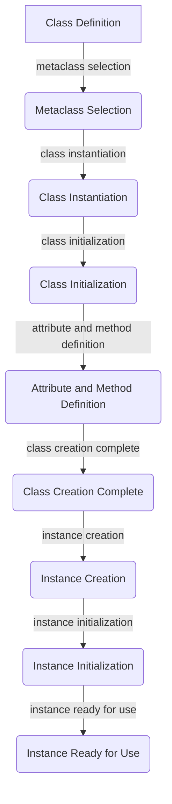

## Introduction
**Metaclasses** are a powerful feature in Python that allows developers to customize the creation of classes. They are essentially classes whose instances are classes. Metaclasses are useful for logging, registration, and other tasks that require modifying or extending the behavior of classes. However, as applications grow in complexity, scaling metaclasses to meet the demands of high-performance applications can be challenging. In this article, we will explore the world of metaclasses, their applications, and how to scale them for high-performance applications.

> **Note:** Metaclasses are an advanced Python feature, and understanding them requires a solid grasp of object-oriented programming and class creation.

## Core Concepts
To understand metaclasses, we need to grasp some core concepts:

* **Classes**: Classes are templates for creating objects. They define the structure and behavior of objects.
* **Metaclasses**: Metaclasses are classes whose instances are classes. They define the structure and behavior of classes.
* **Class creation**: Class creation is the process of creating a new class. This involves defining the class's attributes and methods.
* **Instantiation**: Instantiation is the process of creating a new instance of a class.

> **Tip:** Think of metaclasses as a way to customize the creation of classes. Just as a class defines the structure and behavior of objects, a metaclass defines the structure and behavior of classes.

## How It Works Internally
When a class is created, Python uses a metaclass to instantiate it. The default metaclass in Python is `type`. When we create a class, Python uses the `type` metaclass to instantiate it. Here's a step-by-step breakdown of how it works:

1. **Class definition**: We define a class using the `class` keyword.
2. **Metaclass selection**: Python selects the metaclass to use for the class creation. If we don't specify a metaclass, Python uses the default `type` metaclass.
3. **Class instantiation**: The metaclass instantiates the class, creating a new class object.
4. **Class initialization**: The class object is initialized, and its attributes and methods are defined.

> **Warning:** Custom metaclasses can be complex and error-prone. Make sure to test your metaclasses thoroughly to avoid unexpected behavior.

## Code Examples
Here are three complete and runnable examples of using metaclasses:

### Example 1: Basic Metaclass
```python
class Meta(type):
    def __new__(cls, name, bases, attrs):
        print(f"Creating class {name}")
        return super().__new__(cls, name, bases, attrs)

class MyClass(metaclass=Meta):
    pass

obj = MyClass()
```
This example creates a simple metaclass that prints a message when a class is created.

### Example 2: Logging Metaclass
```python
import logging

class LoggingMeta(type):
    def __new__(cls, name, bases, attrs):
        logging.info(f"Creating class {name}")
        return super().__new__(cls, name, bases, attrs)

class MyClass(metaclass=LoggingMeta):
    def __init__(self):
        logging.info("Initializing MyClass")

obj = MyClass()
```
This example creates a metaclass that logs messages when a class is created and when an instance of the class is initialized.

### Example 3: Registration Metaclass
```python
class Registered(type):
    registry = {}

    def __new__(cls, name, bases, attrs):
        new_cls = super().__new__(cls, name, bases, attrs)
        cls.registry[name] = new_cls
        return new_cls

class MyClass(metaclass=Registered):
    pass

print(Registered.registry)
```
This example creates a metaclass that registers classes as they are created. The registered classes are stored in a dictionary for later use.

## Visual Diagram

This diagram illustrates the process of class creation and instance creation using metaclasses.

> **Interview:** Can you explain how metaclasses work in Python? How would you use a metaclass to customize the creation of classes?

## Comparison
Here's a comparison of different approaches to customizing class creation:

| Approach | Time Complexity | Space Complexity | Pros | Cons | Best For |
| --- | --- | --- | --- | --- | --- |
| Metaclasses | O(1) | O(1) | Customizable, flexible | Complex, error-prone | Complex class creation, logging, registration |
| Class decorators | O(1) | O(1) | Simple, easy to use | Limited flexibility | Simple class modification, logging |
| Inheritance | O(1) | O(1) | Simple, easy to use | Limited flexibility | Simple class modification, code reuse |

## Real-world Use Cases
Here are three real-world examples of using metaclasses:

* **Django**: Django uses metaclasses to create models. The `ModelMeta` metaclass is used to define the structure and behavior of models.
* **Scrapy**: Scrapy uses metaclasses to create spiders. The `SpiderMeta` metaclass is used to define the structure and behavior of spiders.
* **Pydantic**: Pydantic uses metaclasses to create data models. The `ModelMeta` metaclass is used to define the structure and behavior of data models.

> **Tip:** Metaclasses are useful for creating frameworks and libraries that require customized class creation.

## Common Pitfalls
Here are four common mistakes to avoid when using metaclasses:

* **Incorrect metaclass selection**: Make sure to select the correct metaclass for your class creation.
* **Insufficient testing**: Test your metaclasses thoroughly to avoid unexpected behavior.
* **Overly complex metaclasses**: Avoid creating overly complex metaclasses that are difficult to understand and maintain.
* **Metaclass conflicts**: Be aware of potential conflicts between metaclasses and other class creation mechanisms.

> **Warning:** Metaclasses can be complex and error-prone. Make sure to test your metaclasses thoroughly and avoid overly complex metaclasses.

## Interview Tips
Here are three common interview questions related to metaclasses:

* **What is a metaclass?**: A metaclass is a class whose instances are classes. It defines the structure and behavior of classes.
* **How do you use a metaclass to customize class creation?**: You can use a metaclass to customize class creation by defining a metaclass that inherits from `type` and overriding the `__new__` method.
* **What are some common use cases for metaclasses?**: Metaclasses are useful for logging, registration, and other tasks that require modifying or extending the behavior of classes.

> **Interview:** Can you explain how you would use a metaclass to create a logging mechanism for classes?

## Key Takeaways
Here are ten key takeaways to remember:

* **Metaclasses are classes whose instances are classes**.
* **Metaclasses define the structure and behavior of classes**.
* **Metaclasses are useful for logging, registration, and other tasks**.
* **Metaclasses can be complex and error-prone**.
* **Test your metaclasses thoroughly to avoid unexpected behavior**.
* **Avoid overly complex metaclasses**.
* **Be aware of potential conflicts between metaclasses and other class creation mechanisms**.
* **Metaclasses have a time complexity of O(1) and a space complexity of O(1)**.
* **Metaclasses are useful for creating frameworks and libraries that require customized class creation**.
* **Django, Scrapy, and Pydantic are examples of real-world projects that use metaclasses**.

> **Note:** Metaclasses are a powerful feature in Python that can be used to customize the creation of classes. However, they can be complex and error-prone, so make sure to test your metaclasses thoroughly and avoid overly complex metaclasses.