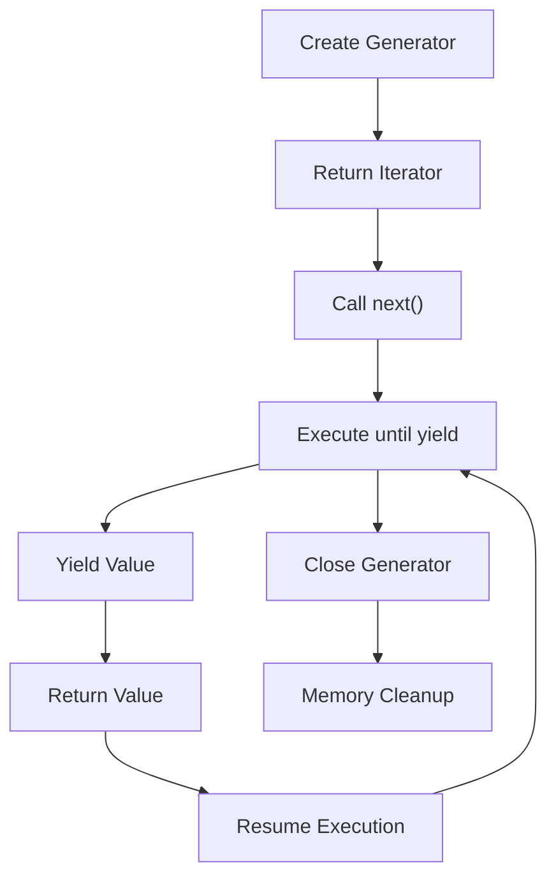

## Introduction
Generators and the `yield` keyword are fundamental concepts in Python that enable efficient and flexible iteration over sequences of data. They are particularly useful when dealing with large datasets or infinite sequences, as they allow for lazy evaluation and memory-efficient computation. In this section, we will explore the basics of generators and yield, their real-world relevance, and why every engineer needs to understand these concepts.

Generators are a type of iterable, similar to lists or tuples, but instead of storing all the values in memory at once, they generate values on-the-fly as they are needed. This approach has several benefits, including reduced memory usage and improved performance. The `yield` keyword is used to define generators and is a crucial part of the iteration protocol in Python.

> **Note:** Generators are often used in conjunction with the `next()` function, which retrieves the next value from an iterator.

## Core Concepts
To understand generators and yield, it's essential to grasp some key concepts:

* **Iterable**: An object that can be iterated over, such as a list, tuple, or generator.
* **Iterator**: An object that keeps track of its position in an iterable and returns the next value when `next()` is called.
* **Generator**: A special type of iterator that uses the `yield` keyword to produce values.
* **Yield**: A keyword that defines a generator and specifies the value to be returned.

A mental model for understanding generators is to think of them as a sequence of values that are generated on-the-fly, rather than all at once. This approach allows for efficient iteration over large datasets and is particularly useful when working with infinite sequences.

## How It Works Internally
When a generator is created, it returns an iterator object that keeps track of its position in the sequence. The `yield` keyword is used to define the values to be generated, and the `next()` function is used to retrieve the next value from the iterator.

Here's a step-by-step breakdown of how generators work internally:

1. A generator is created using a function that contains the `yield` keyword.
2. The generator returns an iterator object that keeps track of its position in the sequence.
3. When `next()` is called on the iterator, the generator executes until it reaches a `yield` statement.
4. The value specified by the `yield` statement is returned to the caller.
5. The generator remembers its position in the sequence and resumes execution from that point when `next()` is called again.

> **Warning:** If a generator is not properly closed, it can lead to memory leaks and other issues. It's essential to use the `close()` method to close the generator when it's no longer needed.

## Code Examples
### Example 1: Basic Generator
```python
def infinite_sequence():
    num = 0
    while True:
        yield num
        num += 1

# Create a generator
gen = infinite_sequence()

# Retrieve the first 10 values
for _ in range(10):
    print(next(gen))
```
This example demonstrates a basic generator that produces an infinite sequence of numbers. The `yield` keyword is used to define the values to be generated, and the `next()` function is used to retrieve the next value from the iterator.

### Example 2: Real-World Pattern
```python
def read_large_file(file_path):
    with open(file_path, 'r') as file:
        for line in file:
            yield line.strip()

# Create a generator
gen = read_large_file('large_file.txt')

# Retrieve the first 10 lines
for _ in range(10):
    print(next(gen))
```
This example demonstrates a real-world pattern for using generators to read large files. The `yield` keyword is used to define the values to be generated, and the `next()` function is used to retrieve the next value from the iterator.

### Example 3: Advanced Usage
```python
def fibonacci(n):
    a, b = 0, 1
    for _ in range(n):
        yield a
        a, b = b, a + b

# Create a generator
gen = fibonacci(10)

# Retrieve the first 10 Fibonacci numbers
for num in gen:
    print(num)
```
This example demonstrates an advanced usage of generators to produce the Fibonacci sequence. The `yield` keyword is used to define the values to be generated, and the `next()` function is used to retrieve the next value from the iterator.

## Visual Diagram

This diagram illustrates the lifecycle of a generator, from creation to closure. The `yield` keyword is used to define the values to be generated, and the `next()` function is used to retrieve the next value from the iterator.

> **Tip:** Generators can be used to implement cooperative multitasking, where tasks yield control to other tasks voluntarily.

## Comparison
| Approach | Time Complexity | Space Complexity | Pros | Cons | Best For |
| --- | --- | --- | --- | --- | --- |
| Generators | O(1) | O(1) | Efficient, flexible, and memory-friendly | Limited control over iteration | Large datasets, infinite sequences |
| Iterators | O(1) | O(1) | Efficient and flexible | Limited control over iteration | Large datasets, infinite sequences |
| Lists | O(n) | O(n) | Easy to implement and use | Memory-intensive and slow | Small datasets, cached results |

## Real-world Use Cases
* **Google**: Uses generators to implement the iteration protocol in their Python runtime environment.
* **Facebook**: Employs generators to handle large datasets and infinite sequences in their data processing pipelines.
* **Dropbox**: Utilizes generators to optimize file transfer and synchronization processes.

## Common Pitfalls
* **Incorrect Usage of Yield**: Using `yield` without a corresponding `next()` call can lead to unexpected behavior.
* **Memory Leaks**: Failing to close generators can result in memory leaks and other issues.
* **Infinite Loops**: Using generators with infinite sequences can lead to infinite loops if not properly handled.
* **Performance Issues**: Using generators with large datasets can lead to performance issues if not optimized properly.

> **Interview:** Can you explain the difference between generators and iterators? How would you implement a generator to produce an infinite sequence of numbers?

## Interview Tips
* **Weak Answer**: A weak answer would be to simply state that generators are used to produce sequences of values without explaining the underlying mechanics.
* **Strong Answer**: A strong answer would be to explain the lifecycle of a generator, including creation, iteration, and closure, and provide examples of real-world usage.
* **Follow-up Questions**: Be prepared to answer follow-up questions, such as how to optimize generator performance or handle edge cases.

## Key Takeaways
* **Generators are Iterables**: Generators are a type of iterable that produce values on-the-fly.
* **Yield Keyword**: The `yield` keyword is used to define the values to be generated.
* **Memory Efficiency**: Generators are memory-efficient and can handle large datasets and infinite sequences.
* **Performance Optimization**: Generators can be optimized for performance by using techniques such as caching and buffering.
* **Real-world Relevance**: Generators are widely used in real-world applications, including data processing, file transfer, and synchronization.
* **Common Pitfalls**: Be aware of common pitfalls, such as incorrect usage of yield, memory leaks, and performance issues.
* **Best Practices**: Follow best practices, such as using generators with infinite sequences and optimizing performance.