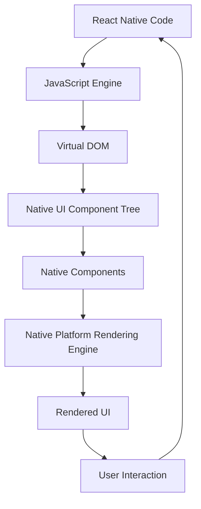

## Introduction
React Native is a popular framework for building cross-platform mobile applications using JavaScript and React. At the heart of every React Native application are its core components, which provide the building blocks for creating user interfaces. In this study guide, we will delve into the world of React Native's core components, including **View**, **Text**, **Image**, **ScrollView**, **FlatList**, and **TextInput**. We will explore what they are, why they matter, and how they are used in real-world applications. Understanding these components is crucial for any React Native developer, as they form the foundation of every mobile app.

## Core Concepts
Before we dive into the specifics of each component, let's define some key terms and concepts:
* **Component**: A self-contained piece of code that represents a UI element, such as a button or a text label.
* **View**: A container component that can hold other components, similar to a `<div>` in HTML.
* **Text**: A component that displays text, similar to a `<p>` or `<span>` in HTML.
* **Image**: A component that displays an image, similar to an `` tag in HTML.
* **ScrollView**: A component that allows users to scroll through a list of content.
* **FlatList**: A component that displays a list of items, optimized for performance.
* **TextInput**: A component that allows users to enter text.

> **Note:** These components are the core building blocks of any React Native application. Understanding how they work and how to use them is essential for creating effective and efficient user interfaces.

## How It Works Internally
When a React Native application is rendered, the JavaScript code is executed by the JavaScript engine, which generates a virtual DOM representation of the UI. This virtual DOM is then used to create a native UI component tree, which is rendered on the mobile device. The core components we will be discussing are all part of this native UI component tree.
Here's a step-by-step breakdown of how it works:
1. The JavaScript engine executes the React Native code and generates a virtual DOM representation of the UI.
2. The virtual DOM is then used to create a native UI component tree, which is rendered on the mobile device.
3. The native UI component tree is composed of native components, such as `UIView` on iOS or `View` on Android.
4. The native components are then rendered on the screen, using the native platform's rendering engine.

## Code Examples
### Example 1: Basic View and Text Components
```javascript
import React from 'react';
import { View, Text } from 'react-native';

const App = () => {
  return (
    <View style={{ flex: 1, justifyContent: 'center', alignItems: 'center' }}>
      <Text>Hello, World!</Text>
    </View>
  );
};

export default App;
```
This example demonstrates the use of the **View** and **Text** components to display a simple "Hello, World!" message.

### Example 2: Image Component
```javascript
import React from 'react';
import { View, Image } from 'react-native';

const App = () => {
  return (
    <View style={{ flex: 1, justifyContent: 'center', alignItems: 'center' }}>
      <Image source={{ uri: 'https://example.com/image.jpg' }} style={{ width: 100, height: 100 }} />
    </View>
  );
};

export default App;
```
This example demonstrates the use of the **Image** component to display an image from a remote URL.

### Example 3: ScrollView and FlatList Components
```javascript
import React, { useState } from 'react';
import { View, Text, ScrollView, FlatList } from 'react-native';

const App = () => {
  const [data, setData] = useState([
    { id: 1, title: 'Item 1' },
    { id: 2, title: 'Item 2' },
    { id: 3, title: 'Item 3' },
    // ...
  ]);

  return (
    <View style={{ flex: 1 }}>
      <ScrollView>
        {data.map((item) => (
          <View key={item.id} style={{ padding: 10, borderBottomWidth: 1, borderBottomColor: '#ccc' }}>
            <Text>{item.title}</Text>
          </View>
        ))}
      </ScrollView>
      <FlatList
        data={data}
        renderItem={({ item }) => (
          <View style={{ padding: 10, borderBottomWidth: 1, borderBottomColor: '#ccc' }}>
            <Text>{item.title}</Text>
          </View>
        )}
        keyExtractor={(item) => item.id.toString()}
      />
    </View>
  );
};

export default App;
```
This example demonstrates the use of the **ScrollView** and **FlatList** components to display a list of items.

## Visual Diagram

This diagram illustrates the flow of how React Native code is executed and rendered on a mobile device.

## Comparison
| Component | Description | Time Complexity | Space Complexity | Pros | Cons |
| --- | --- | --- | --- | --- | --- |
| View | Container component | O(1) | O(1) | Flexible, easy to use | Can be slow for complex layouts |
| Text | Text component | O(1) | O(1) | Simple, easy to use | Limited styling options |
| Image | Image component | O(1) | O(1) | Easy to use, supports remote images | Can be slow for large images |
| ScrollView | Scrollable container component | O(n) | O(n) | Supports scrolling, easy to use | Can be slow for large datasets |
| FlatList | Optimized list component | O(n) | O(1) | Fast, efficient, easy to use | Limited customization options |
| TextInput | Text input component | O(1) | O(1) | Simple, easy to use | Limited styling options |

> **Warning:** When using the **ScrollView** component, be aware that it can be slow for large datasets. Consider using the **FlatList** component instead, which is optimized for performance.

## Real-world Use Cases
1. **Instagram**: Instagram uses React Native to build its mobile app, which features a complex layout with multiple components, including **View**, **Text**, **Image**, and **ScrollView**.
2. **Facebook**: Facebook uses React Native to build its mobile app, which features a news feed with a **FlatList** component.
3. **Uber**: Uber uses React Native to build its mobile app, which features a map view with a **ScrollView** component.

## Common Pitfalls
1. **Using ScrollView for large datasets**: Using **ScrollView** for large datasets can be slow and inefficient. Instead, use **FlatList**, which is optimized for performance.
2. **Not using keyExtractor with FlatList**: Not using **keyExtractor** with **FlatList** can cause items to be rendered incorrectly. Make sure to use **keyExtractor** to ensure that each item has a unique key.
3. **Not handling image loading errors**: Not handling image loading errors can cause the app to crash. Make sure to handle image loading errors using **onError** event.
4. **Not using accessibility features**: Not using accessibility features can make the app inaccessible to users with disabilities. Make sure to use accessibility features, such as **accessible** prop, to make the app accessible.

> **Tip:** When using **FlatList**, make sure to use **keyExtractor** to ensure that each item has a unique key. This will improve performance and prevent items from being rendered incorrectly.

## Interview Tips
1. **What is the difference between ScrollView and FlatList?**: The main difference between **ScrollView** and **FlatList** is that **FlatList** is optimized for performance and is recommended for large datasets. **ScrollView** is simpler and easier to use, but can be slow for large datasets.
2. **How do you handle image loading errors?**: To handle image loading errors, use the **onError** event to catch any errors that occur during image loading. You can also use **onLoad** event to handle successful image loading.
3. **What is the purpose of keyExtractor with FlatList?**: The purpose of **keyExtractor** with **FlatList** is to ensure that each item has a unique key. This improves performance and prevents items from being rendered incorrectly.

> **Interview:** When interviewing for a React Native position, be prepared to answer questions about the core components, including **View**, **Text**, **Image**, **ScrollView**, **FlatList**, and **TextInput**. Make sure to demonstrate your understanding of how they work and how to use them effectively.

## Key Takeaways
* **View** is a container component that can hold other components.
* **Text** is a component that displays text.
* **Image** is a component that displays an image.
* **ScrollView** is a scrollable container component.
* **FlatList** is an optimized list component.
* **TextInput** is a text input component.
* Use **keyExtractor** with **FlatList** to ensure that each item has a unique key.
* Use **onError** event to handle image loading errors.
* Use **accessible** prop to make the app accessible to users with disabilities.
* **FlatList** is optimized for performance and is recommended for large datasets.
* **ScrollView** is simpler and easier to use, but can be slow for large datasets.