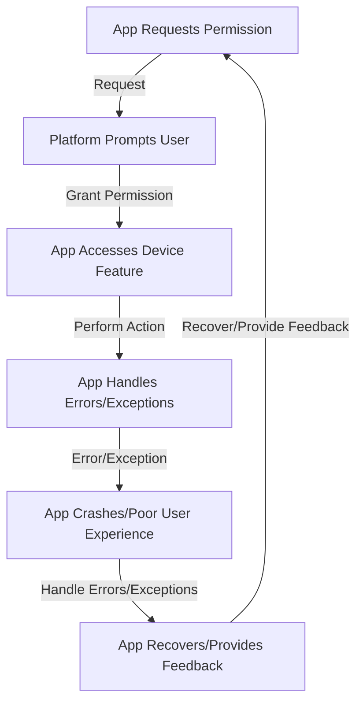

## Introduction
Device APIs are a crucial part of mobile app development, allowing developers to access and utilize various device features such as camera, location, notifications, and biometrics. In the context of React Native, Expo modules provide a convenient and efficient way to access these device APIs. In this section, we will explore the importance of device APIs, their real-world relevance, and why every engineer needs to know about them.

Device APIs are essential for creating engaging and interactive mobile experiences. For instance, a social media app may use the camera API to allow users to take and share photos, while a fitness tracking app may use the location API to track the user's daily activities. Moreover, notifications and biometrics APIs enable developers to send push notifications and authenticate users securely.

> **Note:** Device APIs can significantly enhance the user experience, but they also pose security and privacy concerns. As a developer, it is crucial to handle user data responsibly and comply with platform guidelines and regulations.

## Core Concepts
To work with device APIs, it is essential to understand the following core concepts:

* **Camera API:** allows developers to access the device's camera and take photos or videos.
* **Location API:** provides access to the device's location services, enabling developers to determine the user's current location.
* **Notifications API:** enables developers to send push notifications to users, even when the app is not running in the foreground.
* **Biometrics API:** allows developers to authenticate users using biometric data such as fingerprints or facial recognition.

> **Tip:** When working with device APIs, it is essential to handle permissions and errors properly to avoid app crashes and ensure a seamless user experience.

## How It Works Internally
Under the hood, device APIs work as follows:

1. The app requests access to a specific device feature, such as the camera or location services.
2. The platform (iOS or Android) prompts the user to grant or deny permission.
3. If permission is granted, the app can access the device feature and perform the desired action.
4. The app must handle any errors or exceptions that may occur during the process.

> **Warning:** Failing to handle permissions and errors properly can lead to app crashes, security vulnerabilities, and poor user experience.

## Code Examples
Here are three complete and runnable code examples that demonstrate how to use device APIs with Expo modules:

### Example 1: Basic Camera Usage
```javascript
import React, { useState } from 'react';
import { View, Button } from 'react-native';
import { Camera } from 'expo-camera';

const App = () => {
  const [hasPermission, setHasPermission] = useState(null);
  const [camera, setCamera] = useState(null);

  const requestCameraPermission = async () => {
    const { status } = await Camera.requestCameraPermissionsAsync();
    setHasPermission(status === 'granted');
  };

  const takePicture = async () => {
    if (camera) {
      const photo = await camera.takePictureAsync();
      console.log(photo);
    }
  };

  return (
    <View>
      <Button title="Request Camera Permission" onPress={requestCameraPermission} />
      {hasPermission && (
        <Camera
          ref={(ref) => setCamera(ref)}
          style={{ flex: 1, width: '100%' }}
        >
          <Button title="Take Picture" onPress={takePicture} />
        </Camera>
      )}
    </View>
  );
};

export default App;
```

### Example 2: Real-World Location Tracking
```javascript
import React, { useState, useEffect } from 'react';
import { View, Text } from 'react-native';
import { Location } from 'expo-location';

const App = () => {
  const [location, setLocation] = useState(null);
  const [error, setError] = useState(null);

  const requestLocationPermission = async () => {
    const { status } = await Location.requestForegroundPermissionsAsync();
    if (status !== 'granted') {
      setError('Location permission not granted');
    }
  };

  const getCurrentLocation = async () => {
    try {
      const location = await Location.getCurrentPositionAsync({});
      setLocation(location);
    } catch (error) {
      setError(error.message);
    }
  };

  useEffect(() => {
    requestLocationPermission();
  }, []);

  return (
    <View>
      <Text>Current Location:</Text>
      {location && (
        <Text>
          {location.coords.latitude}, {location.coords.longitude}
        </Text>
      )}
      {error && <Text>{error}</Text>}
      <Button title="Get Current Location" onPress={getCurrentLocation} />
    </View>
  );
};

export default App;
```

### Example 3: Advanced Biometrics Authentication
```javascript
import React, { useState } from 'react';
import { View, Button } from 'react-native';
import { LocalAuthentication } from 'expo-local-authentication';

const App = () => {
  const [isAuthenticated, setIsAuthenticated] = useState(false);

  const authenticate = async () => {
    try {
      const result = await LocalAuthentication.authenticateAsync();
      if (result.success) {
        setIsAuthenticated(true);
      }
    } catch (error) {
      console.error(error);
    }
  };

  return (
    <View>
      <Button title="Authenticate" onPress={authenticate} />
      {isAuthenticated && <Text>Authenticated successfully!</Text>}
    </View>
  );
};

export default App;
```

## Visual Diagram

This diagram illustrates the workflow of requesting device permissions, accessing device features, and handling errors/exceptions.

> **Interview:** Can you explain the workflow of requesting device permissions and accessing device features? How do you handle errors/exceptions in your app?

## Comparison
Here is a comparison table of different approaches to accessing device APIs:

| Approach | Time Complexity | Space Complexity | Pros | Cons | Best For |
| --- | --- | --- | --- | --- | --- |
| Expo Modules | O(1) | O(1) | Easy to use, cross-platform | Limited control, dependencies | Most React Native projects |
| Native Modules | O(n) | O(n) | Fine-grained control, performance | Complex, platform-specific | High-performance, custom requirements |
| Third-Party Libraries | O(n) | O(n) | Convenience, community support | Security risks, dependencies | Rapid prototyping, proof-of-concept |
| Custom Implementation | O(n) | O(n) | Ultimate control, customization | Time-consuming, expertise required | High-security, custom requirements |

## Real-world Use Cases
Here are three real-world use cases of device APIs:

1. **Instagram:** uses the camera API to allow users to take and share photos.
2. **Uber:** uses the location API to track the user's location and provide real-time updates.
3. **Banking Apps:** use biometrics APIs to authenticate users securely and provide a seamless user experience.

## Common Pitfalls
Here are four common pitfalls to watch out for when working with device APIs:

1. **Failing to handle permissions:** can lead to app crashes and poor user experience.
2. **Not handling errors/exceptions:** can lead to app crashes and security vulnerabilities.
3. **Using outdated or deprecated APIs:** can lead to compatibility issues and security risks.
4. **Not testing on multiple devices:** can lead to compatibility issues and poor user experience.

> **Tip:** Always test your app on multiple devices and platforms to ensure compatibility and a seamless user experience.

## Interview Tips
Here are three common interview questions related to device APIs:

1. **What is the difference between Expo modules and native modules?**
	* Weak answer: "Expo modules are easier to use, but native modules provide more control."
	* Strong answer: "Expo modules provide a convenient and cross-platform way to access device features, while native modules offer fine-grained control and performance. However, native modules require more expertise and can be platform-specific."
2. **How do you handle permissions and errors when working with device APIs?**
	* Weak answer: "I just use a try-catch block and handle the error."
	* Strong answer: "I use a combination of try-catch blocks, error handling mechanisms, and permission requests to ensure a seamless user experience and prevent app crashes."
3. **What are some best practices for working with device APIs?**
	* Weak answer: "I just follow the documentation and use the APIs as needed."
	* Strong answer: "I follow best practices such as handling permissions and errors, testing on multiple devices, and using secure and up-to-date APIs to ensure a seamless user experience and prevent security risks."

## Key Takeaways
Here are ten key takeaways to remember when working with device APIs:

* Always handle permissions and errors properly to prevent app crashes and ensure a seamless user experience.
* Use Expo modules for cross-platform and convenient access to device features.
* Use native modules for fine-grained control and performance.
* Test your app on multiple devices and platforms to ensure compatibility and a seamless user experience.
* Use secure and up-to-date APIs to prevent security risks.
* Handle errors and exceptions properly to prevent app crashes and security vulnerabilities.
* Use try-catch blocks and error handling mechanisms to handle errors and exceptions.
* Use permission requests to ensure that the app has the necessary permissions to access device features.
* Follow best practices such as testing on multiple devices and using secure and up-to-date APIs.
* Always follow platform guidelines and regulations when working with device APIs.