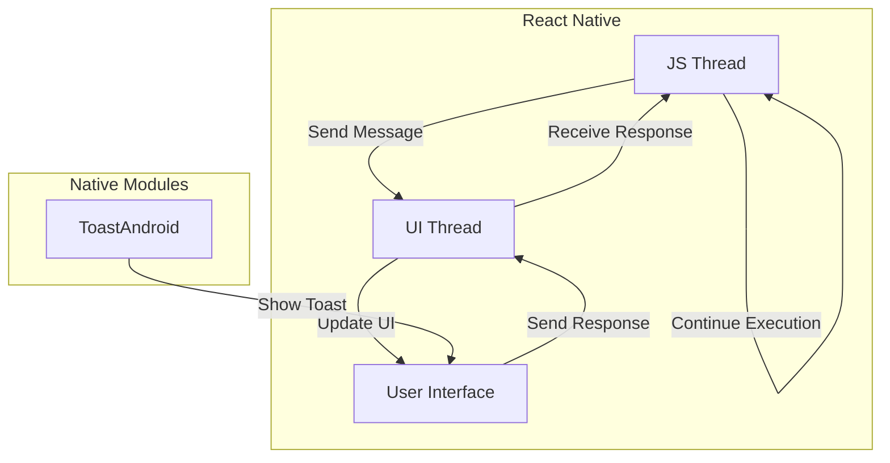

## Introduction
React Native is a popular framework for building cross-platform mobile applications using JavaScript and React. It allows developers to share code between iOS and Android platforms, reducing development time and increasing code reuse. **Why does React Native matter?** It provides a way to build native mobile applications using web technologies, making it easier for web developers to transition to mobile app development. In real-world scenarios, React Native is used by companies like Facebook, Instagram, and Walmart to build their mobile applications.

> **Note:** React Native is not a web application running in a web view, but rather a native application that uses JavaScript and React to render UI components.

## Core Concepts
To understand how React Native works, it's essential to grasp the following core concepts:
* **JS Thread**: The JavaScript thread is responsible for executing JavaScript code, including React components and business logic.
* **UI Thread**: The UI thread is responsible for rendering the user interface and handling user interactions.
* **Bridge (Old)**: The bridge is a communication layer between the JS thread and the UI thread. It allows the JS thread to send messages to the UI thread to update the user interface.
* **JSI (New)**: JSI (JavaScript Interface) is a new communication layer that replaces the old bridge. It provides a more direct and efficient way for the JS thread to interact with the UI thread.

## How It Works Internally
Here's a step-by-step explanation of how React Native works internally:
1. The JS thread executes JavaScript code, including React components and business logic.
2. When the JS thread needs to update the user interface, it sends a message to the UI thread through the bridge (old) or JSI (new).
3. The UI thread receives the message and updates the user interface accordingly.
4. The UI thread sends a response back to the JS thread through the bridge (old) or JSI (new).
5. The JS thread receives the response and continues executing JavaScript code.

> **Warning:** The JS thread and UI thread run in separate threads, which can lead to synchronization issues if not handled properly.

## Code Examples
Here are three complete and runnable code examples that demonstrate how to use React Native:
### Example 1: Basic Usage
```javascript
import React from 'react';
import { View, Text } from 'react-native';

const App = () => {
  return (
    <View>
      <Text>Hello, World!</Text>
    </View>
  );
};

export default App;
```
This example demonstrates how to create a basic React Native application with a single text component.

### Example 2: Real-World Pattern
```javascript
import React, { useState } from 'react';
import { View, Text, Button } from 'react-native';

const App = () => {
  const [count, setCount] = useState(0);

  return (
    <View>
      <Text>Count: {count}</Text>
      <Button title="Increment" onPress={() => setCount(count + 1)} />
    </View>
  );
};

export default App;
```
This example demonstrates how to use the `useState` hook to manage state in a React Native application.

### Example 3: Advanced Usage
```javascript
import React, { useState, useEffect } from 'react';
import { View, Text, Button } from 'react-native';
import { NativeModules } from 'react-native';

const App = () => {
  const [count, setCount] = useState(0);

  useEffect(() => {
    NativeModules.ToastAndroid.show('Hello, World!');
  }, []);

  return (
    <View>
      <Text>Count: {count}</Text>
      <Button title="Increment" onPress={() => setCount(count + 1)} />
    </View>
  );
};

export default App;
```
This example demonstrates how to use the `useEffect` hook to interact with native modules in a React Native application.

## Visual Diagram

This diagram illustrates the communication flow between the JS thread, UI thread, and native modules in a React Native application.

## Comparison
| Approach | Time Complexity | Space Complexity | Pros | Cons | Best For |
| --- | --- | --- | --- | --- | --- |
| Bridge (Old) | O(n) | O(n) | Easy to implement, widely supported | Slow, inefficient | Legacy applications |
| JSI (New) | O(1) | O(1) | Fast, efficient, modern | Limited support, complex implementation | New applications, high-performance requirements |
| Native Modules | O(n) | O(n) | Direct access to native functionality, high performance | Complex implementation, limited platform support | Applications requiring native functionality, high-performance requirements |
| Web View | O(n) | O(n) | Easy to implement, widely supported | Slow, limited platform support | Legacy applications, simple web-based interfaces |

> **Tip:** When choosing an approach, consider the trade-offs between time complexity, space complexity, and platform support.

## Real-world Use Cases
Here are three real-world examples of companies using React Native:
1. **Facebook**: Facebook uses React Native to build their mobile applications, including the Facebook app and Instagram.
2. **Walmart**: Walmart uses React Native to build their mobile applications, including the Walmart app and Walmart Labs.
3. **Uber**: Uber uses React Native to build their mobile applications, including the Uber app and Uber Eats.

## Common Pitfalls
Here are four common mistakes to avoid when using React Native:
1. **Not handling synchronization issues**: Failing to handle synchronization issues between the JS thread and UI thread can lead to crashes and unexpected behavior.
```javascript
// Wrong way
import React, { useState } from 'react';
import { View, Text } from 'react-native';

const App = () => {
  const [count, setCount] = useState(0);

  return (
    <View>
      <Text>Count: {count}</Text>
      <Button title="Increment" onPress={() => setCount(count + 1)} />
    </View>
  );
};

// Right way
import React, { useState, useEffect } from 'react';
import { View, Text, Button } from 'react-native';

const App = () => {
  const [count, setCount] = useState(0);

  useEffect(() => {
    // Handle synchronization issues here
  }, [count]);

  return (
    <View>
      <Text>Count: {count}</Text>
      <Button title="Increment" onPress={() => setCount(count + 1)} />
    </View>
  );
};
```
2. **Not optimizing images**: Failing to optimize images can lead to slow load times and increased memory usage.
```javascript
// Wrong way
import React from 'react';
import { Image } from 'react-native';

const App = () => {
  return (
    <View>
      <Image source={{ uri: 'https://example.com/image.jpg' }} />
    </View>
  );
};

// Right way
import React from 'react';
import { Image } from 'react-native';

const App = () => {
  return (
    <View>
      <Image source={{ uri: 'https://example.com/image.jpg' }} style={{ width: 100, height: 100 }} />
    </View>
  );
};
```
3. **Not handling errors**: Failing to handle errors can lead to crashes and unexpected behavior.
```javascript
// Wrong way
import React from 'react';
import { View, Text } from 'react-native';

const App = () => {
  return (
    <View>
      <Text>Hello, World!</Text>
    </View>
  );
};

// Right way
import React from 'react';
import { View, Text } from 'react-native';

const App = () => {
  try {
    return (
      <View>
        <Text>Hello, World!</Text>
      </View>
    );
  } catch (error) {
    return (
      <View>
        <Text>Error: {error.message}</Text>
      </View>
    );
  }
};
```
4. **Not using memoization**: Failing to use memoization can lead to slow performance and increased memory usage.
```javascript
// Wrong way
import React from 'react';
import { View, Text } from 'react-native';

const App = () => {
  const data = [];
  for (let i = 0; i < 1000; i++) {
    data.push(<Text key={i}>Hello, World!</Text>);
  }
  return (
    <View>
      {data}
    </View>
  );
};

// Right way
import React, { useMemo } from 'react';
import { View, Text } from 'react-native';

const App = () => {
  const data = useMemo(() => {
    const result = [];
    for (let i = 0; i < 1000; i++) {
      result.push(<Text key={i}>Hello, World!</Text>);
    }
    return result;
  }, []);
  return (
    <View>
      {data}
    </View>
  );
};
```
> **Interview:** When asked about common pitfalls in React Native, be sure to mention synchronization issues, image optimization, error handling, and memoization.

## Interview Tips
Here are three common interview questions for React Native:
1. **What is the difference between the JS thread and UI thread in React Native?**
* Weak answer: "The JS thread is for JavaScript code and the UI thread is for native code."
* Strong answer: "The JS thread is responsible for executing JavaScript code, including React components and business logic, while the UI thread is responsible for rendering the user interface and handling user interactions. The two threads communicate with each other through the bridge (old) or JSI (new)."
2. **How do you optimize images in React Native?**
* Weak answer: "I use a library like ImageOptim to compress images."
* Strong answer: "I use a combination of techniques, including resizing images to the correct size, using image compression libraries like ImageOptim, and lazy loading images to reduce memory usage."
3. **How do you handle errors in React Native?**
* Weak answer: "I use a try-catch block to catch errors and log them to the console."
* Strong answer: "I use a combination of techniques, including try-catch blocks to catch errors, error boundaries to catch and handle errors in React components, and logging libraries like Sentry to track and analyze errors."

## Key Takeaways
Here are six key takeaways to remember when working with React Native:
* **Use the JS thread for JavaScript code and the UI thread for native code**.
* **Optimize images using resizing, compression, and lazy loading**.
* **Handle errors using try-catch blocks, error boundaries, and logging libraries**.
* **Use memoization to improve performance and reduce memory usage**.
* **Use the bridge (old) or JSI (new) to communicate between the JS thread and UI thread**.
* **Test and debug your application thoroughly to ensure it works correctly on different platforms and devices**.

> **Tip:** When working with React Native, be sure to follow best practices, such as using a consistent coding style, testing and debugging your application thoroughly, and optimizing performance and memory usage.