## Introduction
State management is a crucial aspect of building robust and scalable applications, particularly in the context of **React** and **React Native**. As applications grow in complexity, managing state becomes increasingly challenging. State management libraries like **Zustand**, **Redux**, and **TanStack Query** provide a structured approach to managing state, making it easier to develop, test, and maintain applications. In this section, we will explore the importance of state management, its real-world relevance, and why every engineer needs to understand this concept.

> **Note:** State management is not unique to React; however, the libraries mentioned above are particularly popular in the React ecosystem.

State management is essential because it helps to:
* Decouple components from each other, making it easier to reason about and test individual components
* Manage side effects, such as API calls or timer events, in a predictable and controlled manner
* Improve performance by reducing unnecessary re-renders and minimizing the amount of data being passed between components

## Core Concepts
To understand state management, it's essential to grasp the following core concepts:
* **State**: The data that changes over time, such as user input, API responses, or timer events.
* **Store**: A centralized location that holds the application's state.
* **Actions**: Payloads that trigger state changes.
* **Reducers**: Pure functions that take the current state and an action, and return a new state.

Mental models that can help solidify these concepts include:
* Thinking of state as a single source of truth, where all components can access and update the same data.
* Imagining actions as messengers that carry information about what needs to change in the state.
* Viewing reducers as gatekeepers that ensure the state is updated correctly and predictably.

Key terminology includes:
* **Immutable state**: State that cannot be changed directly, but instead, a new copy is created with the updated values.
* **Unidirectional data flow**: The idea that state changes flow in one direction, from the store to the components, and not the other way around.

## How It Works Internally
Under the hood, state management libraries like Zustand, Redux, and TanStack Query work by creating a centralized store that holds the application's state. When a component needs to update the state, it dispatches an action to the store. The store then passes the action to the reducer, which updates the state accordingly.

Here's a step-by-step breakdown of the process:
1. The component dispatches an action to the store.
2. The store passes the action to the reducer.
3. The reducer updates the state based on the action.
4. The store notifies the component that the state has changed.
5. The component re-renders with the updated state.

> **Warning:** One common mistake is to mutate the state directly, which can lead to unpredictable behavior and bugs. Instead, always create a new copy of the state with the updated values.

## Code Examples
### Example 1: Basic Zustand Usage
```javascript
import create from 'zustand';

const useStore = create((set) => ({
  count: 0,
  increment: () => set((state) => ({ count: state.count + 1 })),
}));

const Counter = () => {
  const { count, increment } = useStore();
  return (
    <div>
      <p>Count: {count}</p>
      <button onClick={increment}>Increment</button>
    </div>
  );
};
```
This example demonstrates the basic usage of Zustand, where we create a store with a `count` state and an `increment` action.

### Example 2: Real-World Pattern with Redux
```javascript
import { createStore, combineReducers } from 'redux';
import { applyMiddleware } from 'redux';
import thunk from 'redux-thunk';

const initialState = {
  users: [],
  loading: false,
  error: null,
};

const usersReducer = (state = initialState, action) => {
  switch (action.type) {
    case 'FETCH_USERS_REQUEST':
      return { ...state, loading: true };
    case 'FETCH_USERS_SUCCESS':
      return { ...state, users: action.users, loading: false };
    case 'FETCH_USERS_ERROR':
      return { ...state, error: action.error, loading: false };
    default:
      return state;
  }
};

const store = createStore(
  combineReducers({ users: usersReducer }),
  applyMiddleware(thunk)
);

const fetchUsers = () => {
  return (dispatch) => {
    dispatch({ type: 'FETCH_USERS_REQUEST' });
    fetch('https://api.example.com/users')
      .then((response) => response.json())
      .then((users) => dispatch({ type: 'FETCH_USERS_SUCCESS', users }))
      .catch((error) => dispatch({ type: 'FETCH_USERS_ERROR', error }));
  };
};

const Users = () => {
  const { users, loading, error } = useSelector((state) => state.users);
  const dispatch = useDispatch();

  useEffect(() => {
    dispatch(fetchUsers());
  }, [dispatch]);

  if (loading) {
    return <p>Loading...</p>;
  }

  if (error) {
    return <p>Error: {error.message}</p>;
  }

  return (
    <ul>
      {users.map((user) => (
        <li key={user.id}>{user.name}</li>
      ))}
    </ul>
  );
};
```
This example demonstrates a real-world pattern using Redux, where we create a store with a `users` reducer and an action to fetch users from an API.

### Example 3: Advanced Usage with TanStack Query
```javascript
import { useQuery, useQueryClient } from 'react-query';

const fetchUsers = async () => {
  const response = await fetch('https://api.example.com/users');
  return response.json();
};

const Users = () => {
  const { data, error, isLoading } = useQuery('users', fetchUsers);

  if (isLoading) {
    return <p>Loading...</p>;
  }

  if (error) {
    return <p>Error: {error.message}</p>;
  }

  return (
    <ul>
      {data.map((user) => (
        <li key={user.id}>{user.name}</li>
      ))}
    </ul>
  );
};

const useUser = (id) => {
  const { data, error, isLoading } = useQuery(['user', id], () =>
    fetch(`https://api.example.com/users/${id}`).then((response) => response.json())
  );

  if (isLoading) {
    return <p>Loading...</p>;
  }

  if (error) {
    return <p>Error: {error.message}</p>;
  }

  return data;
};
```
This example demonstrates an advanced usage of TanStack Query, where we use the `useQuery` hook to fetch users and a specific user by ID.

## Visual Diagram

```mermaid
sequenceDiagram
  participant Component as "Component"
  participant Store as "Store"
  participant Reducer as "Reducer"
  participant API as "API"

  Note over Component,Store: Initial State
  Component->>Store: Dispatch Action
  Store->>Reducer: Pass Action
  Reducer->>Store: Update State
  Store->>Component: Notify State Change
  Component->>Component: Re-render with Updated State

  Note over Component,API: Fetch Data
  Component->>API: Fetch Users
  API->>Component: Return Users
  Component->>Store: Dispatch Action with Users
  Store->>Reducer: Pass Action
  Reducer->>Store: Update State with Users
  Store->>Component: Notify State Change
  Component->>Component: Re-render with Updated State
```

This diagram illustrates the sequence of events when a component dispatches an action to the store, which updates the state and notifies the component to re-render.

## Comparison
| Approach | Time Complexity | Space Complexity | Pros | Cons | Best For |
| --- | --- | --- | --- | --- | --- |
| Zustand | O(1) | O(1) | Simple, lightweight | Limited scalability | Small to medium-sized applications |
| Redux | O(n) | O(n) | Predictable, scalable | Steep learning curve | Large-scale applications with complex state management |
| TanStack Query | O(1) | O(1) | Simple, caching | Limited support for offline data | Applications with frequent API calls and caching requirements |

## Real-world Use Cases
* **Instagram**: Uses a combination of Redux and React Query to manage state and fetch data from APIs.
* **Facebook**: Employs a custom state management solution built on top of Redux and React.
* **Airbnb**: Utilizes a variant of the Flux architecture, with a custom implementation of the store and reducer.

## Common Pitfalls
* **Mutating state directly**: Instead, create a new copy of the state with the updated values.
* **Not handling errors**: Make sure to handle errors properly, such as displaying an error message to the user.
* **Not optimizing performance**: Use techniques like memoization and caching to improve performance.
* **Not testing thoroughly**: Write comprehensive tests to ensure the state management solution works as expected.

> **Tip:** Use a debugging tool like the Redux DevTools to visualize the state and actions, making it easier to identify issues.

## Interview Tips
* **What is state management?**: Explain the concept of state management, its importance, and how it works.
* **How do you handle errors in state management?**: Describe the approach to handling errors, such as displaying an error message to the user.
* **What is the difference between Redux and Zustand?**: Compare and contrast the two state management libraries, highlighting their strengths and weaknesses.

> **Interview:** Be prepared to answer questions about state management, such as how to implement a simple store and reducer, or how to handle errors and optimize performance.

## Key Takeaways
* State management is crucial for building robust and scalable applications.
* Zustand, Redux, and TanStack Query are popular state management libraries for React.
* Immutable state and unidirectional data flow are essential concepts in state management.
* Memoization and caching can improve performance in state management.
* Error handling and testing are critical aspects of state management.
* Debugging tools like the Redux DevTools can aid in identifying issues.
* State management solutions should be optimized for performance and scalability.
* A deep understanding of state management is essential for building complex applications.