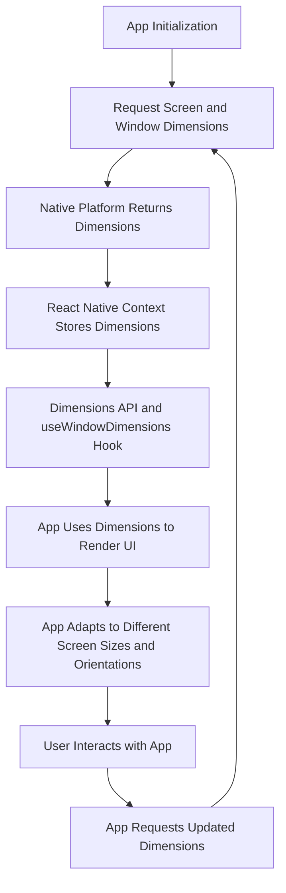

## Introduction
The Dimensions API and `useWindowDimensions` hook are essential tools in React Native for handling screen sizes and responsive layouts. They provide a way to access the dimensions of the screen and the window, allowing developers to create adaptive UI components. In this section, we will explore the importance of these APIs, their real-world relevance, and why every React Native engineer needs to know how to use them effectively.

The Dimensions API and `useWindowDimensions` hook are crucial in today's mobile app development landscape, where devices come in various shapes and sizes. With the rise of foldable phones, tablets, and smartwatches, it's essential to create apps that can adapt to different screen sizes and orientations. By using these APIs, developers can ensure that their apps provide a seamless user experience across various devices.

## Core Concepts
To understand how the Dimensions API and `useWindowDimensions` hook work, it's essential to grasp some core concepts:

* **Screen dimensions**: The size of the screen, including the width and height.
* **Window dimensions**: The size of the window, including the width and height. The window is the area where the app is rendered.
* **Orientation**: The orientation of the screen, either portrait or landscape.
* **Responsive design**: A design approach that allows the app to adapt to different screen sizes and orientations.

**Key terminology:**

* `Dimensions.get('window')`: Returns the dimensions of the window.
* `Dimensions.get('screen')`: Returns the dimensions of the screen.
* `useWindowDimensions()`: A hook that returns the dimensions of the window.

## How It Works Internally
The Dimensions API and `useWindowDimensions` hook work by accessing the native platform's APIs to retrieve the screen and window dimensions. Here's a step-by-step breakdown of how it works:

1. The React Native app initializes and requests the screen and window dimensions from the native platform.
2. The native platform returns the dimensions, which are then stored in the React Native context.
3. The Dimensions API and `useWindowDimensions` hook access the stored dimensions and return them to the app.
4. The app uses the dimensions to render the UI components and adapt to different screen sizes and orientations.

> **Note:** The Dimensions API and `useWindowDimensions` hook use a combination of native platform APIs and JavaScript code to retrieve and store the dimensions. The native platform APIs provide the most up-to-date dimensions, while the JavaScript code handles the logic for accessing and storing the dimensions.

## Code Examples
Here are three complete and runnable code examples that demonstrate the usage of the Dimensions API and `useWindowDimensions` hook:

### Example 1: Basic Usage
```javascript
import React from 'react';
import { View, Text } from 'react-native';
import { Dimensions } from 'react-native';

const App = () => {
  const screenWidth = Dimensions.get('window').width;
  const screenHeight = Dimensions.get('window').height;

  return (
    <View>
      <Text>Screen Width: {screenWidth}</Text>
      <Text>Screen Height: {screenHeight}</Text>
    </View>
  );
};

export default App;
```

### Example 2: Real-World Pattern
```javascript
import React, { useState, useEffect } from 'react';
import { View, Text, Image } from 'react-native';
import { useWindowDimensions } from 'react-native';

const App = () => {
  const { width, height } = useWindowDimensions();
  const [imageWidth, setImageWidth] = useState(0);

  useEffect(() => {
    const imageWidth = width * 0.8;
    setImageWidth(imageWidth);
  }, [width]);

  return (
    <View>
      <Image
        source={{ uri: 'https://example.com/image.jpg' }}
        style={{ width: imageWidth, height: imageWidth }}
      />
    </View>
  );
};

export default App;
```

### Example 3: Advanced Usage
```javascript
import React, { useState, useEffect } from 'react';
import { View, Text, Image } from 'react-native';
import { useWindowDimensions } from 'react-native';

const App = () => {
  const { width, height } = useWindowDimensions();
  const [orientation, setOrientation] = useState('portrait');

  useEffect(() => {
    const handleOrientationChange = () => {
      if (width > height) {
        setOrientation('landscape');
      } else {
        setOrientation('portrait');
      }
    };

    handleOrientationChange();
  }, [width, height]);

  return (
    <View>
      <Text>Orientation: {orientation}</Text>
      {orientation === 'portrait' ? (
        <Image
          source={{ uri: 'https://example.com/image.jpg' }}
          style={{ width: width * 0.8, height: width * 0.8 }}
        />
      ) : (
        <Image
          source={{ uri: 'https://example.com/image.jpg' }}
          style={{ width: height * 0.8, height: height * 0.8 }}
        />
      )}
    </View>
  );
};

export default App;
```

## Visual Diagram

The diagram illustrates the flow of how the Dimensions API and `useWindowDimensions` hook work, from app initialization to user interaction.

## Comparison
Here's a comparison table of different approaches to handling screen sizes and orientations in React Native:

| Approach | Time Complexity | Space Complexity | Pros | Cons | Best For |
| --- | --- | --- | --- | --- | --- |
| Dimensions API | O(1) | O(1) | Easy to use, provides accurate dimensions | Does not handle orientation changes | Simple apps with fixed layouts |
| useWindowDimensions Hook | O(1) | O(1) | Easy to use, handles orientation changes | Requires React Native 0.60 or higher | Apps with dynamic layouts and orientation changes |
| Media Queries | O(n) | O(n) | Allows for complex media queries, handles orientation changes | Can be complex to use, may have performance issues | Apps with complex media queries and orientation changes |
| Custom Solution | O(n) | O(n) | Allows for complete control, handles orientation changes | Can be time-consuming to implement, may have performance issues | Apps with unique layout requirements and orientation changes |

> **Tip:** When choosing an approach, consider the complexity of your app's layout and the required level of control.

## Real-world Use Cases
Here are three real-world production examples of using the Dimensions API and `useWindowDimensions` hook:

1. **Instagram**: Instagram uses the Dimensions API to handle different screen sizes and orientations, ensuring that the app's layout adapts seamlessly to various devices.
2. **TikTok**: TikTok uses the `useWindowDimensions` hook to handle orientation changes and adapt the app's layout to different screen sizes.
3. **Facebook**: Facebook uses a combination of the Dimensions API and custom solutions to handle complex media queries and orientation changes, ensuring that the app's layout is optimized for various devices.

## Common Pitfalls
Here are four common mistakes to avoid when using the Dimensions API and `useWindowDimensions` hook:

1. **Not handling orientation changes**: Failing to handle orientation changes can result in a broken layout.
```javascript
// Wrong
const App = () => {
  const screenWidth = Dimensions.get('window').width;
  return (
    <View>
      <Text>Screen Width: {screenWidth}</Text>
    </View>
  );
};

// Right
const App = () => {
  const { width, height } = useWindowDimensions();
  return (
    <View>
      <Text>Screen Width: {width}</Text>
    </View>
  );
};
```

2. **Not using the correct hook**: Using the wrong hook can result in incorrect dimensions.
```javascript
// Wrong
const App = () => {
  const screenWidth = Dimensions.get('screen').width;
  return (
    <View>
      <Text>Screen Width: {screenWidth}</Text>
    </View>
  );
};

// Right
const App = () => {
  const { width, height } = useWindowDimensions();
  return (
    <View>
      <Text>Screen Width: {width}</Text>
    </View>
  );
};
```

3. **Not handling edge cases**: Failing to handle edge cases can result in a broken layout.
```javascript
// Wrong
const App = () => {
  const { width, height } = useWindowDimensions();
  return (
    <View>
      <Text>Screen Width: {width}</Text>
    </View>
  );
};

// Right
const App = () => {
  const { width, height } = useWindowDimensions();
  if (width === 0 || height === 0) {
    return <View />;
  }
  return (
    <View>
      <Text>Screen Width: {width}</Text>
    </View>
  );
};
```

4. **Not optimizing for performance**: Failing to optimize for performance can result in slow app performance.
```javascript
// Wrong
const App = () => {
  const { width, height } = useWindowDimensions();
  const [imageWidth, setImageWidth] = useState(0);
  useEffect(() => {
    const imageWidth = width * 0.8;
    setImageWidth(imageWidth);
  }, [width, height]);
  return (
    <View>
      <Image
        source={{ uri: 'https://example.com/image.jpg' }}
        style={{ width: imageWidth, height: imageWidth }}
      />
    </View>
  );
};

// Right
const App = () => {
  const { width, height } = useWindowDimensions();
  const imageWidth = width * 0.8;
  return (
    <View>
      <Image
        source={{ uri: 'https://example.com/image.jpg' }}
        style={{ width: imageWidth, height: imageWidth }}
      />
    </View>
  );
};
```

> **Warning:** Failing to handle edge cases and optimize for performance can result in a broken layout and slow app performance.

## Interview Tips
Here are three common interview questions related to the Dimensions API and `useWindowDimensions` hook, along with sample answers:

1. **What is the difference between the Dimensions API and the useWindowDimensions hook?**
```markdown
Weak answer: "The Dimensions API is used to get the screen dimensions, while the useWindowDimensions hook is used to get the window dimensions."
Strong answer: "The Dimensions API provides a way to access the screen and window dimensions, while the useWindowDimensions hook provides a way to access the window dimensions and handle orientation changes. The useWindowDimensions hook is a more convenient and efficient way to handle orientation changes, while the Dimensions API provides more fine-grained control over the dimensions."
```

2. **How do you handle orientation changes in a React Native app?**
```markdown
Weak answer: "I use the Dimensions API to get the screen dimensions and then use a conditional statement to handle orientation changes."
Strong answer: "I use the useWindowDimensions hook to handle orientation changes. The hook provides a way to access the window dimensions and handle orientation changes in a convenient and efficient way. I also use a combination of the Dimensions API and custom solutions to handle complex media queries and orientation changes."
```

3. **What are some common pitfalls to avoid when using the Dimensions API and useWindowDimensions hook?**
```markdown
Weak answer: "I'm not sure, I've never had any issues with the Dimensions API or useWindowDimensions hook."
Strong answer: "Some common pitfalls to avoid include not handling orientation changes, not using the correct hook, not handling edge cases, and not optimizing for performance. It's essential to use the correct hook, handle orientation changes, and optimize for performance to ensure a seamless user experience."
```

> **Interview:** Be prepared to answer questions about the Dimensions API and `useWindowDimensions` hook, and be sure to provide strong answers that demonstrate your understanding of the topic.

## Key Takeaways
Here are six key takeaways to remember when using the Dimensions API and `useWindowDimensions` hook:

* **Use the correct hook**: Use the `useWindowDimensions` hook to handle orientation changes and access the window dimensions.
* **Handle orientation changes**: Use the `useWindowDimensions` hook to handle orientation changes and adapt the app's layout to different screen sizes.
* **Handle edge cases**: Use a combination of the Dimensions API and custom solutions to handle edge cases and ensure a seamless user experience.
* **Optimize for performance**: Use a combination of the Dimensions API and custom solutions to optimize for performance and ensure a fast and responsive app.
* **Use the Dimensions API for fine-grained control**: Use the Dimensions API to access the screen and window dimensions and handle complex media queries.
* **Test thoroughly**: Test the app thoroughly to ensure that it works correctly on different devices and screen sizes.

> **Tip:** Remember to use the correct hook, handle orientation changes, handle edge cases, optimize for performance, use the Dimensions API for fine-grained control, and test thoroughly to ensure a seamless user experience.