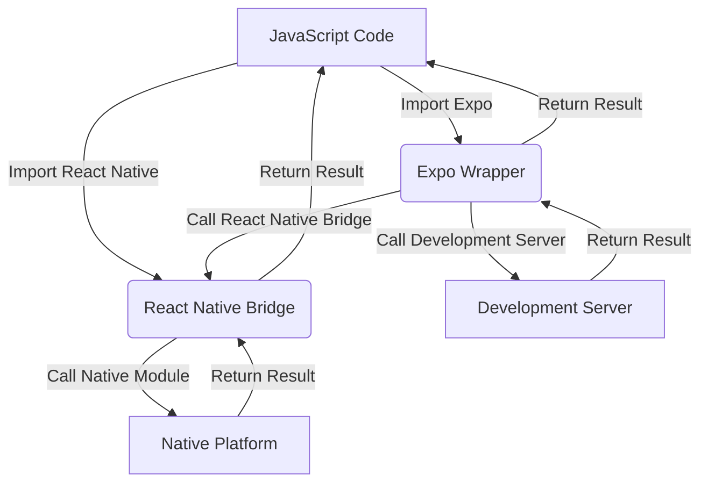

## Introduction
React Native is a popular framework for building cross-platform mobile applications using React. However, setting up a React Native project can be complex and time-consuming. This is where Expo comes in – a set of tools and services that make it easier to build, test, and deploy React Native applications. In this article, we will explore the differences between React Native and Expo, and help you decide which setup is best for your project.

> **Note:** React Native and Expo are not mutually exclusive. Expo is built on top of React Native, and provides additional features and tools to simplify the development process.

React Native allows you to build mobile applications using JavaScript and React, which can be shared across multiple platforms, including iOS and Android. This approach has several benefits, including faster development, reduced costs, and improved maintainability. However, setting up a React Native project can be challenging, especially for beginners.

Expo, on the other hand, provides a simpler and more streamlined way to build React Native applications. Expo includes a set of tools and services that make it easier to set up and manage your project, including a project template, a development server, and a set of pre-built components.

## Core Concepts
To understand the differences between React Native and Expo, it's essential to grasp the core concepts of each framework.

* **React Native:** A framework for building cross-platform mobile applications using React.
* **Expo:** A set of tools and services that simplify the development process of React Native applications.
* **Project Template:** A pre-configured project structure that includes the necessary files and dependencies to get started with React Native or Expo.
* **Development Server:** A server that allows you to run and test your application on a simulator or physical device.

> **Warning:** While Expo simplifies the development process, it can also introduce additional dependencies and overhead. Make sure to carefully evaluate the trade-offs before choosing Expo.

## How It Works Internally
To understand how React Native and Expo work internally, let's take a closer look at the architecture of each framework.

React Native uses a **bridge** to communicate between the JavaScript code and the native platform. This bridge allows you to call native modules from your JavaScript code, and vice versa.

Expo, on the other hand, uses a **wrapper** around the React Native bridge. This wrapper provides additional features and services, such as a development server, a project template, and a set of pre-built components.

Here's a high-level overview of the architecture:
```
+---------------+
|  JavaScript  |
+---------------+
        |
        |
        v
+---------------+
|  React Native  |
|  (Bridge)      |
+---------------+
        |
        |
        v
+---------------+
|  Native Platform|
|  (iOS or Android)|
+---------------+
```
In the case of Expo, the wrapper is added on top of the React Native bridge:
```
+---------------+
|  JavaScript  |
+---------------+
        |
        |
        v
+---------------+
|  Expo (Wrapper)|
|  (Development   |
|   Server, etc.)  |
+---------------+
        |
        |
        v
+---------------+
|  React Native  |
|  (Bridge)      |
+---------------+
        |
        |
        v
+---------------+
|  Native Platform|
|  (iOS or Android)|
+---------------+
```
## Code Examples
Here are three complete and runnable code examples to demonstrate the differences between React Native and Expo:

### Example 1: Basic React Native Project
```javascript
// App.js
import React from 'react';
import { View, Text } from 'react-native';

const App = () => {
  return (
    <View>
      <Text>Hello, World!</Text>
    </View>
  );
};

export default App;
```
This example creates a basic React Native project with a single component that displays a "Hello, World!" message.

### Example 2: Expo Project with Development Server
```javascript
// App.js
import React from 'react';
import { View, Text } from 'react-native';
import { AppRegistry } from 'expo';

const App = () => {
  return (
    <View>
      <Text>Hello, World!</Text>
    </View>
  );
};

AppRegistry.registerComponent('App', () => App);
```
This example creates an Expo project with a development server. The `AppRegistry` is used to register the component with the Expo development server.

### Example 3: Advanced Expo Project with Pre-built Components
```javascript
// App.js
import React from 'react';
import { View, Text } from 'react-native';
import { AppRegistry } from 'expo';
import { Button } from 'expo-ui-kit';

const App = () => {
  return (
    <View>
      <Text>Hello, World!</Text>
      <Button title="Click me!" onPress={() => console.log('Button clicked!')} />
    </View>
  );
};

AppRegistry.registerComponent('App', () => App);
```
This example creates an advanced Expo project with pre-built components. The `Button` component is imported from the `expo-ui-kit` library and used in the app.

## Visual Diagram

This diagram illustrates the architecture of React Native and Expo, including the bridge, wrapper, and development server.

## Comparison
Here's a comparison of React Native and Expo:

| Approach | Time Complexity | Space Complexity | Pros | Cons | Best For |
| --- | --- | --- | --- | --- | --- |
| React Native | O(n) | O(n) | Flexible, customizable | Steep learning curve, complex setup | Complex, customized applications |
| Expo | O(n) | O(n) | Simplified setup, streamlined development | Limited flexibility, additional dependencies | Simple, rapid development applications |
| React Native with Expo | O(n) | O(n) | Balanced flexibility and simplicity | Additional dependencies, potential overhead | Most applications, balanced development |

> **Tip:** When choosing between React Native and Expo, consider the complexity of your application and the trade-offs between flexibility and simplicity.

## Real-world Use Cases
Here are three real-world use cases for React Native and Expo:

1. **Facebook**: Facebook uses React Native to build its mobile applications, including the main Facebook app and Instagram.
2. **Uber**: Uber uses React Native to build its mobile applications, including the rider and driver apps.
3. **Pinterest**: Pinterest uses Expo to build its mobile applications, including the main Pinterest app and Lens.

> **Interview:** When asked about the differences between React Native and Expo, be prepared to discuss the trade-offs between flexibility and simplicity, and provide examples of real-world use cases.

## Common Pitfalls
Here are four common pitfalls to watch out for when using React Native and Expo:

1. **Overusing Expo**: While Expo simplifies the development process, it can also introduce additional dependencies and overhead. Make sure to carefully evaluate the trade-offs before choosing Expo.
2. **Underestimating complexity**: React Native and Expo can be complex and challenging to learn. Make sure to allocate sufficient time and resources to learn and master the frameworks.
3. **Ignoring performance**: React Native and Expo applications can be performance-intensive. Make sure to optimize your code and use caching and other techniques to improve performance.
4. **Not testing thoroughly**: React Native and Expo applications require thorough testing to ensure quality and reliability. Make sure to write comprehensive tests and use testing frameworks like Jest and Enzyme.

> **Warning:** When using React Native and Expo, be aware of the potential pitfalls and take steps to mitigate them.

## Interview Tips
Here are three common interview questions and tips for answering them:

1. **What are the differences between React Native and Expo?**: Be prepared to discuss the trade-offs between flexibility and simplicity, and provide examples of real-world use cases.
2. **How do you optimize the performance of a React Native application?**: Be prepared to discuss techniques like caching, memoization, and code splitting, and provide examples of how to implement them.
3. **What are some common pitfalls to watch out for when using React Native and Expo?**: Be prepared to discuss the potential pitfalls, such as overusing Expo, underestimating complexity, ignoring performance, and not testing thoroughly.

> **Tip:** When answering interview questions, be prepared to provide specific examples and demonstrate your knowledge and expertise.

## Key Takeaways
Here are ten key takeaways to remember:

* React Native is a framework for building cross-platform mobile applications using React.
* Expo is a set of tools and services that simplify the development process of React Native applications.
* React Native uses a bridge to communicate between the JavaScript code and the native platform.
* Expo uses a wrapper around the React Native bridge to provide additional features and services.
* React Native and Expo have different architectures and trade-offs between flexibility and simplicity.
* Expo simplifies the development process but can introduce additional dependencies and overhead.
* React Native and Expo applications require thorough testing to ensure quality and reliability.
* Performance optimization is crucial for React Native and Expo applications.
* Caching, memoization, and code splitting are techniques for optimizing performance.
* Expo provides pre-built components and a development server to simplify the development process.