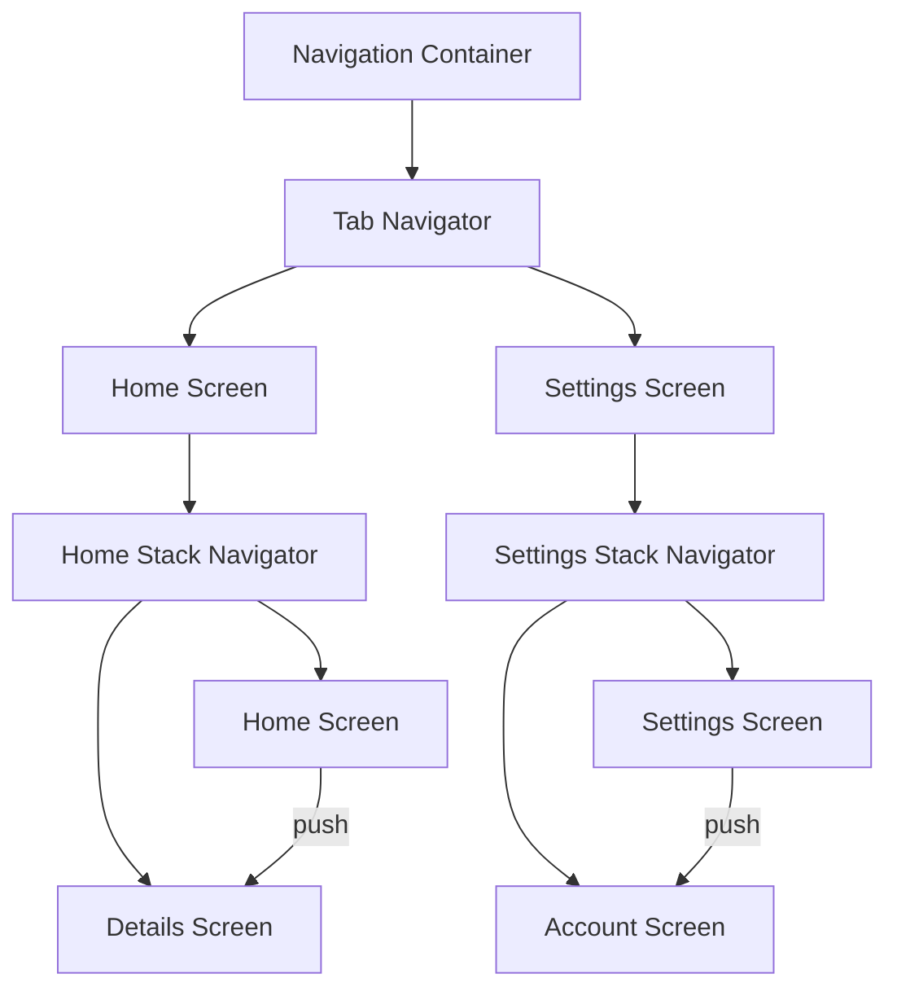

## Introduction
**Nested Navigators** are a key concept in React Native navigation, allowing developers to create complex navigation flows with ease. In this section, we will explore what nested navigators are, why they matter, and their real-world relevance. **Nested Navigators** enable developers to nest multiple navigators within each other, creating a hierarchical navigation structure. This is particularly useful in complex applications with multiple features and screens. For instance, a social media app might have a **Tab Navigator** for the main tabs, and within each tab, a **Stack Navigator** for navigating between screens.

> **Note:** Nested Navigators are essential for creating robust and scalable navigation systems in React Native applications.

## Core Concepts
To understand **Nested Navigators**, we need to grasp some core concepts:
* **Navigator**: A navigator is a component that manages a stack of screens. It provides methods for navigating between screens, such as `push` and `pop`.
* **Screen**: A screen is a component that represents a single view in the application. Screens can be nested within each other using navigators.
* **Navigation Container**: A navigation container is a component that wraps the entire navigation system. It provides a context for the navigators and screens to interact with each other.
* **Navigation State**: The navigation state represents the current state of the navigation system, including the current screen and the navigation history.

> **Warning:** Failing to properly manage the navigation state can lead to unexpected behavior and bugs in the application.

## How It Works Internally
When a navigator is nested within another navigator, the inner navigator becomes a child of the outer navigator. The outer navigator manages the navigation state of the inner navigator, and the inner navigator manages its own navigation state. When the user navigates between screens, the navigation state is updated accordingly.

Here's a step-by-step breakdown of how nested navigators work:
1. The user navigates to a screen within the outer navigator.
2. The outer navigator updates its navigation state to reflect the current screen.
3. If the current screen has an inner navigator, the inner navigator is rendered.
4. The inner navigator manages its own navigation state, independent of the outer navigator.
5. When the user navigates between screens within the inner navigator, the inner navigator updates its navigation state.
6. The outer navigator is notified of the navigation state change and updates its own navigation state accordingly.

## Code Examples
Here are three complete and runnable code examples demonstrating the use of nested navigators:
### Example 1: Basic Nested Navigators
```javascript
import React from 'react';
import { NavigationContainer } from '@react-navigation/native';
import { createStackNavigator } from '@react-navigation/stack';
import { createBottomTabNavigator } from '@react-navigation/bottom-tabs';

const Stack = createStackNavigator();
const Tab = createBottomTabNavigator();

const HomeScreen = () => {
  return <Stack.Navigator>
    <Stack.Screen name="Home" component={() => <Text>Home Screen</Text>} />
    <Stack.Screen name="Details" component={() => <Text>Details Screen</Text>} />
  </Stack.Navigator>;
};

const SettingsScreen = () => {
  return <Stack.Navigator>
    <Stack.Screen name="Settings" component={() => <Text>Settings Screen</Text>} />
    <Stack.Screen name="Account" component={() => <Text>Account Screen</Text>} />
  </Stack.Navigator>;
};

const App = () => {
  return <NavigationContainer>
    <Tab.Navigator>
      <Tab.Screen name="Home" component={HomeScreen} />
      <Tab.Screen name="Settings" component={SettingsScreen} />
    </Tab.Navigator>
  </NavigationContainer>;
};

export default App;
```
### Example 2: Nested Navigators with Custom Headers
```javascript
import React from 'react';
import { NavigationContainer } from '@react-navigation/native';
import { createStackNavigator } from '@react-navigation/stack';
import { createBottomTabNavigator } from '@react-navigation/bottom-tabs';

const Stack = createStackNavigator();
const Tab = createBottomTabNavigator();

const HomeScreen = () => {
  return <Stack.Navigator>
    <Stack.Screen name="Home" component={() => <Text>Home Screen</Text>} options={{
      headerTitle: 'Home',
      headerTintColor: 'white',
      headerStyle: {
        backgroundColor: 'blue',
      },
    }} />
    <Stack.Screen name="Details" component={() => <Text>Details Screen</Text>} options={{
      headerTitle: 'Details',
      headerTintColor: 'white',
      headerStyle: {
        backgroundColor: 'blue',
      },
    }} />
  </Stack.Navigator>;
};

const SettingsScreen = () => {
  return <Stack.Navigator>
    <Stack.Screen name="Settings" component={() => <Text>Settings Screen</Text>} options={{
      headerTitle: 'Settings',
      headerTintColor: 'white',
      headerStyle: {
        backgroundColor: 'blue',
      },
    }} />
    <Stack.Screen name="Account" component={() => <Text>Account Screen</Text>} options={{
      headerTitle: 'Account',
      headerTintColor: 'white',
      headerStyle: {
        backgroundColor: 'blue',
      },
    }} />
  </Stack.Navigator>;
};

const App = () => {
  return <NavigationContainer>
    <Tab.Navigator>
      <Tab.Screen name="Home" component={HomeScreen} options={{
        tabBarLabel: 'Home',
        tabBarIcon: () => <Icon name="home" />,
      }} />
      <Tab.Screen name="Settings" component={SettingsScreen} options={{
        tabBarLabel: 'Settings',
        tabBarIcon: () => <Icon name="settings" />,
      }} />
    </Tab.Navigator>
  </NavigationContainer>;
};

export default App;
```
### Example 3: Advanced Nested Navigators with Dynamic Screens
```javascript
import React, { useState } from 'react';
import { NavigationContainer } from '@react-navigation/native';
import { createStackNavigator } from '@react-navigation/stack';
import { createBottomTabNavigator } from '@react-navigation/bottom-tabs';

const Stack = createStackNavigator();
const Tab = createBottomTabNavigator();

const HomeScreen = () => {
  const [screens, setScreens] = useState([
    { name: 'Home', component: () => <Text>Home Screen</Text> },
    { name: 'Details', component: () => <Text>Details Screen</Text> },
  ]);

  return <Stack.Navigator>
    {screens.map((screen, index) => (
      <Stack.Screen key={index} name={screen.name} component={screen.component} />
    ))}
  </Stack.Navigator>;
};

const SettingsScreen = () => {
  const [screens, setScreens] = useState([
    { name: 'Settings', component: () => <Text>Settings Screen</Text> },
    { name: 'Account', component: () => <Text>Account Screen</Text> },
  ]);

  return <Stack.Navigator>
    {screens.map((screen, index) => (
      <Stack.Screen key={index} name={screen.name} component={screen.component} />
    ))}
  </Stack.Navigator>;
};

const App = () => {
  return <NavigationContainer>
    <Tab.Navigator>
      <Tab.Screen name="Home" component={HomeScreen} />
      <Tab.Screen name="Settings" component={SettingsScreen} />
    </Tab.Navigator>
  </NavigationContainer>;
};

export default App;
```
> **Tip:** Use the `useState` hook to dynamically manage the screens within a navigator.

## Visual Diagram

The diagram shows the navigation flow between screens and navigators.

## Comparison
Here's a comparison of different navigation approaches:
| Approach | Time Complexity | Space Complexity | Pros | Cons | Best For |
| --- | --- | --- | --- | --- | --- |
| **Tab Navigator** | O(1) | O(1) | Easy to use, fast | Limited flexibility | Simple apps with few screens |
| **Stack Navigator** | O(n) | O(n) | Flexible, customizable | Can be slow for large apps | Complex apps with many screens |
| **Nested Navigators** | O(n^2) | O(n^2) | Highly customizable, flexible | Can be slow and complex | Large-scale apps with complex navigation flows |
| **Custom Navigation** | O(n) | O(n) | Highly customizable, flexible | Can be slow and complex | Apps with unique navigation requirements |

> **Interview:** What is the time complexity of using nested navigators? Answer: O(n^2), where n is the number of screens.

## Real-world Use Cases
Here are some real-world examples of nested navigators in use:
* **Instagram**: Instagram uses a **Tab Navigator** for the main tabs and a **Stack Navigator** for navigating between screens within each tab.
* **Facebook**: Facebook uses a **Nested Navigator** approach, with a **Tab Navigator** for the main tabs and a **Stack Navigator** for navigating between screens within each tab.
* **Twitter**: Twitter uses a **Custom Navigation** approach, with a custom-built navigation system that uses a combination of **Tab Navigator** and **Stack Navigator**.

## Common Pitfalls
Here are some common pitfalls to avoid when using nested navigators:
* **Deep Navigation**: Avoid nesting navigators too deeply, as this can lead to performance issues and make the navigation flow difficult to manage.
* **Complex Navigation**: Avoid using complex navigation flows, as this can lead to bugs and performance issues.
* **Incorrect Navigation State**: Make sure to properly manage the navigation state, as incorrect navigation state can lead to bugs and performance issues.

> **Warning:** Failing to properly manage the navigation state can lead to unexpected behavior and bugs in the application.

## Interview Tips
Here are some common interview questions related to nested navigators:
* **What is the difference between a Tab Navigator and a Stack Navigator?** Answer: A **Tab Navigator** is used for navigating between tabs, while a **Stack Navigator** is used for navigating between screens within a tab.
* **How do you manage the navigation state in a nested navigator?** Answer: You can manage the navigation state by using the `navigation` prop and the `useNavigation` hook.
* **What are some common pitfalls to avoid when using nested navigators?** Answer: Some common pitfalls to avoid include deep navigation, complex navigation, and incorrect navigation state.

## Key Takeaways
Here are some key takeaways to remember:
* **Nested Navigators** are a powerful tool for creating complex navigation flows in React Native applications.
* **Tab Navigator** and **Stack Navigator** are two common types of navigators used in React Native applications.
* **Custom Navigation** approaches can be used to create unique navigation flows in React Native applications.
* **Navigation State** must be properly managed to avoid bugs and performance issues.
* **Deep Navigation** and **Complex Navigation** should be avoided to prevent performance issues and bugs.
* **Incorrect Navigation State** can lead to unexpected behavior and bugs in the application.