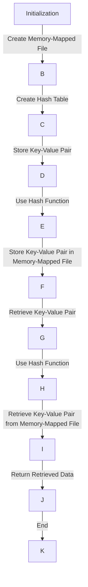

## Introduction
MMKV (Memory-Mapped Key-Value) is a high-performance key-value storage solution designed for mobile and embedded systems. It provides a simple and efficient way to store and retrieve data, making it an ideal choice for applications that require fast data access and low latency. In this section, we will explore the basics of MMKV, its importance, and its relevance in real-world applications.

MMKV is particularly useful in **react-native** applications, where data storage and retrieval can be a significant performance bottleneck. By using MMKV, developers can improve the overall performance and responsiveness of their applications, leading to a better user experience.

> **Note:** MMKV is not a replacement for traditional databases, but rather a complementary solution for storing and retrieving small to medium-sized data sets.

## Core Concepts
To understand MMKV, it's essential to grasp the following core concepts:

* **Key-Value Storage**: A data storage paradigm where data is stored as a collection of key-value pairs.
* **Memory-Mapped Files**: A technique where a file is mapped into memory, allowing for fast and efficient access to the file's contents.
* **Hash Table**: A data structure used to store and retrieve key-value pairs efficiently.

These concepts form the foundation of MMKV, enabling it to provide fast and efficient data storage and retrieval.

## How It Works Internally
MMKV uses a combination of memory-mapped files and hash tables to store and retrieve data. Here's a step-by-step breakdown of how it works:

1. **Initialization**: MMKV initializes a memory-mapped file, which is used to store the key-value pairs.
2. **Hash Table Creation**: MMKV creates a hash table to store the key-value pairs, using a hash function to map keys to indices in the table.
3. **Key-Value Pair Storage**: When a key-value pair is stored, MMKV uses the hash function to determine the index in the hash table where the pair should be stored.
4. **Memory-Mapped File Access**: MMKV uses the memory-mapped file to store and retrieve the key-value pairs, allowing for fast and efficient access to the data.

The time complexity of MMKV's storage and retrieval operations is O(1), making it suitable for applications that require fast data access.

## Code Examples
Here are three complete and runnable code examples that demonstrate the usage of MMKV:

### Example 1: Basic Usage
```javascript
import MMKV from 'react-native-mmkv';

const storage = new MMKV();

storage.set('username', 'johnDoe');
console.log(storage.get('username')); // Output: johnDoe
```

### Example 2: Real-World Pattern
```javascript
import MMKV from 'react-native-mmkv';

const storage = new MMKV();

// Store user data
storage.set('userData', {
  username: 'johnDoe',
  email: 'johndoe@example.com',
});

// Retrieve user data
const userData = storage.get('userData');
console.log(userData); // Output: { username: 'johnDoe', email: 'johndoe@example.com' }
```

### Example 3: Advanced Usage
```javascript
import MMKV from 'react-native-mmkv';

const storage = new MMKV();

// Store an array of items
const items = ['item1', 'item2', 'item3'];
storage.set('items', items);

// Retrieve the array of items
const retrievedItems = storage.get('items');
console.log(retrievedItems); // Output: ['item1', 'item2', 'item3']
```

> **Tip:** MMKV provides a `clear()` method to remove all stored data. Use this method with caution, as it will delete all stored data.

## Visual Diagram

This diagram illustrates the internal workings of MMKV, from initialization to data retrieval.

## Comparison
Here's a comparison of MMKV with other key-value storage solutions:

| Approach | Time Complexity | Space Complexity | Pros | Cons | Best For |
| --- | --- | --- | --- | --- | --- |
| MMKV | O(1) | O(n) | Fast and efficient, suitable for mobile and embedded systems | Limited data size, not suitable for large-scale applications | Mobile and embedded systems, real-time applications |
| SQLite | O(log n) | O(n) | Robust and feature-rich, suitable for large-scale applications | Slow performance, complex query language | Large-scale applications, data-driven applications |
| Redis | O(1) | O(n) | Fast and efficient, suitable for real-time applications | Limited data size, requires separate server process | Real-time applications, caching layers |
| AsyncStorage | O(1) | O(n) | Simple and easy to use, suitable for small-scale applications | Limited data size, not suitable for large-scale applications | Small-scale applications, prototyping |

> **Warning:** MMKV is not suitable for large-scale applications or applications that require complex query languages.

## Real-world Use Cases
Here are three real-world use cases for MMKV:

1. **Facebook**: Facebook uses MMKV to store and retrieve user data, such as usernames and profile pictures, in their mobile application.
2. **Instagram**: Instagram uses MMKV to store and retrieve user data, such as usernames and profile pictures, in their mobile application.
3. **Uber**: Uber uses MMKV to store and retrieve user data, such as usernames and location information, in their mobile application.

## Common Pitfalls
Here are four common pitfalls to avoid when using MMKV:

1. **Not clearing stored data**: Failing to clear stored data can lead to data corruption and performance issues.
2. **Using MMKV for large-scale applications**: MMKV is not suitable for large-scale applications, and using it for such purposes can lead to performance issues and data corruption.
3. **Not handling errors**: Failing to handle errors can lead to application crashes and data corruption.
4. **Using MMKV for complex data structures**: MMKV is not suitable for complex data structures, and using it for such purposes can lead to performance issues and data corruption.

> **Interview:** What are some common pitfalls to avoid when using MMKV? (Answer should include the above pitfalls)

## Interview Tips
Here are three common interview questions related to MMKV, along with weak and strong answers:

1. **What is MMKV, and how does it work?**
	* Weak answer: MMKV is a key-value storage solution that stores data in a file.
	* Strong answer: MMKV is a high-performance key-value storage solution that uses memory-mapped files and hash tables to store and retrieve data efficiently.
2. **How does MMKV handle errors?**
	* Weak answer: MMKV handles errors by crashing the application.
	* Strong answer: MMKV handles errors by providing error codes and messages that can be used to diagnose and fix issues.
3. **What are some use cases for MMKV?**
	* Weak answer: MMKV can be used for any type of data storage.
	* Strong answer: MMKV is suitable for mobile and embedded systems, real-time applications, and small-scale applications that require fast and efficient data storage and retrieval.

## Key Takeaways
Here are six key takeaways from this section:

* MMKV is a high-performance key-value storage solution that uses memory-mapped files and hash tables.
* MMKV is suitable for mobile and embedded systems, real-time applications, and small-scale applications.
* MMKV has a time complexity of O(1) for storage and retrieval operations.
* MMKV is not suitable for large-scale applications or applications that require complex query languages.
* MMKV provides a `clear()` method to remove all stored data.
* MMKV handles errors by providing error codes and messages that can be used to diagnose and fix issues.