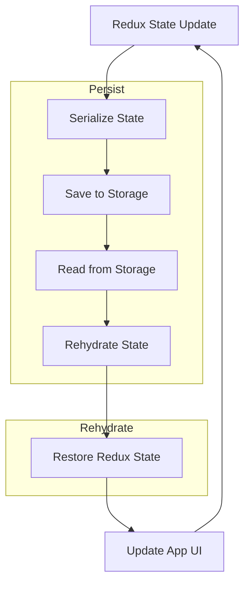

## Introduction
Redux Persist is a library that provides a simple way to persist and rehydrate your Redux state, even after the user closes the app. It's an essential tool for any React Native application that uses Redux for state management. By persisting the state, you can ensure that the user's progress is saved, and they can pick up where they left off when they reopen the app. In this section, we'll explore why Redux Persist matters, its real-world relevance, and why every engineer needs to know about it.

> **Note:** Redux Persist is not a replacement for a full-fledged backend database. It's designed to store small amounts of data, such as user preferences or application state.

## Core Concepts
Redux Persist uses a few key concepts to achieve state persistence:

* **Storage**: This refers to the underlying storage mechanism used to save the state. Redux Persist supports a variety of storage options, including AsyncStorage, LocalStorage, and FileSystem.
* **Rehydrate**: This is the process of restoring the state from storage when the app starts up.
* **Persist**: This is the process of saving the state to storage when the app updates.

> **Warning:** Make sure to choose the right storage option for your app. For example, AsyncStorage is not suitable for large amounts of data.

## How It Works Internally
Redux Persist works by intercepting the Redux state updates and saving them to storage. Here's a step-by-step breakdown of how it works:

1. The Redux state is updated.
2. Redux Persist intercepts the state update and serializes the state to a JSON string.
3. The JSON string is saved to storage using the chosen storage mechanism.
4. When the app starts up, Redux Persist reads the saved state from storage and rehydrates the Redux state.

> **Tip:** Use the `persistReducer` function to create a persisted reducer that will automatically save and restore the state.

## Code Examples
### Example 1: Basic Usage
```javascript
import { createStore, combineReducers } from 'redux';
import { persistStore, persistReducer } from 'redux-persist';
import AsyncStorage from '@react-native-community/async-storage';

const rootReducer = combineReducers({
  // your reducers here
});

const persistedReducer = persistReducer(
  {
    key: 'root',
    storage: AsyncStorage,
  },
  rootReducer
);

const store = createStore(persistedReducer);

persistStore(store);
```
### Example 2: Real-World Pattern
```javascript
import { createStore, combineReducers } from 'redux';
import { persistStore, persistReducer } from 'redux-persist';
import AsyncStorage from '@react-native-community/async-storage';
import { authReducer } from './authReducer';
import { userReducer } from './userReducer';

const rootReducer = combineReducers({
  auth: authReducer,
  user: userReducer,
});

const persistedReducer = persistReducer(
  {
    key: 'root',
    storage: AsyncStorage,
    whitelist: ['auth', 'user'],
  },
  rootReducer
);

const store = createStore(persistedReducer);

persistStore(store);
```
### Example 3: Advanced Usage
```javascript
import { createStore, combineReducers } from 'redux';
import { persistStore, persistReducer } from 'redux-persist';
import AsyncStorage from '@react-native-community/async-storage';
import { authReducer } from './authReducer';
import { userReducer } from './userReducer';

const rootReducer = combineReducers({
  auth: authReducer,
  user: userReducer,
});

const persistedReducer = persistReducer(
  {
    key: 'root',
    storage: AsyncStorage,
    whitelist: ['auth', 'user'],
    blacklist: ['someOtherReducer'],
  },
  rootReducer
);

const store = createStore(persistedReducer);

persistStore(store, {
  timeout: 1000, // timeout in milliseconds
});
```
## Visual Diagram

The diagram illustrates the process of persisting and rehydrating the Redux state. The `Serialize State` step serializes the state to a JSON string, which is then saved to storage. When the app starts up, the state is read from storage and rehydrated.

## Comparison
| Approach | Time Complexity | Space Complexity | Pros | Cons | Best For |
| --- | --- | --- | --- | --- | --- |
| Redux Persist | O(1) | O(n) | Easy to use, supports multiple storage options | Limited to small amounts of data | Small to medium-sized apps |
| AsyncStorage | O(1) | O(n) | Fast and efficient, supports large amounts of data | Limited to React Native apps | Large apps with complex storage needs |
| LocalStorage | O(1) | O(n) | Easy to use, supports large amounts of data | Limited to web apps | Web apps with simple storage needs |
| FileSystem | O(n) | O(n) | Supports large amounts of data, flexible storage options | Complex to use, platform-dependent | Large apps with complex storage needs |

## Real-world Use Cases
* **Facebook**: Uses Redux Persist to store user preferences and app state in their React Native app.
* **Instagram**: Uses AsyncStorage to store user data and app state in their React Native app.
* **Twitter**: Uses LocalStorage to store user preferences and app state in their web app.

## Common Pitfalls
* **Not choosing the right storage option**: Make sure to choose a storage option that fits your app's needs. For example, AsyncStorage is not suitable for large amounts of data.
* **Not handling errors**: Make sure to handle errors when saving and reading from storage. For example, use try-catch blocks to handle errors when using AsyncStorage.
* **Not using the whitelist/blacklist**: Make sure to use the whitelist and blacklist to control which reducers are persisted. For example, use the whitelist to persist only the auth and user reducers.
* **Not handling timeout**: Make sure to handle the timeout when persisting and rehydrating the state. For example, use the `timeout` option when creating the persisted reducer.

## Interview Tips
* **What is Redux Persist?**: A library that provides a simple way to persist and rehydrate your Redux state.
* **How does Redux Persist work?**: Redux Persist works by intercepting the Redux state updates and saving them to storage.
* **What are the benefits of using Redux Persist?**: Easy to use, supports multiple storage options, and provides a simple way to persist and rehydrate the Redux state.

> **Interview:** Can you explain how Redux Persist works and why it's useful in a React Native app?

## Key Takeaways
* **Redux Persist is a library that provides a simple way to persist and rehydrate your Redux state**.
* **Redux Persist supports multiple storage options, including AsyncStorage, LocalStorage, and FileSystem**.
* **Use the `persistReducer` function to create a persisted reducer that will automatically save and restore the state**.
* **Use the whitelist and blacklist to control which reducers are persisted**.
* **Handle errors when saving and reading from storage**.
* **Use the `timeout` option when creating the persisted reducer to handle timeout**.
* **Redux Persist is not a replacement for a full-fledged backend database**.
* **Choose the right storage option for your app's needs**.
* **Redux Persist has a time complexity of O(1) and a space complexity of O(n)**.