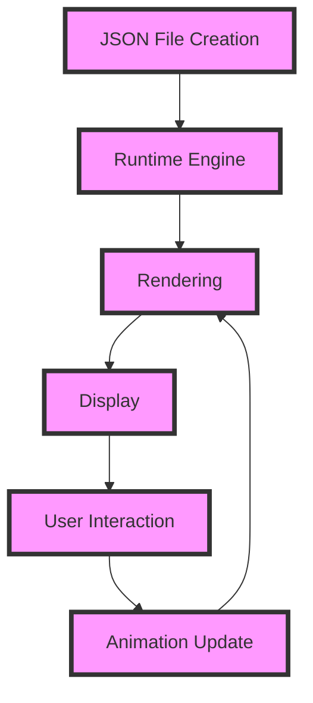

## Introduction
Lottie animations are a popular way to add interactive and engaging animations to mobile and web applications. They are designed to be highly customizable, scalable, and performant. Lottie animations are built on top of the Bodymovin library, which was originally developed by Airbnb. The main goal of Lottie is to provide a simple and easy-to-use API for creating complex animations. In this section, we will explore what Lottie animations are, why they matter, and their real-world relevance.

Lottie animations are widely used in various industries, including gaming, entertainment, and education. They are particularly useful for creating interactive tutorials, product demos, and engaging user interfaces. Many popular companies, such as Instagram, Facebook, and Twitter, use Lottie animations to enhance their user experience.

> **Note:** Lottie animations are not limited to mobile applications; they can also be used in web applications, desktop applications, and even augmented reality (AR) and virtual reality (VR) experiences.

## Core Concepts
To understand Lottie animations, it's essential to grasp some core concepts. Here are a few key terms:

* **Animation**: A sequence of frames that are displayed in rapid succession to create the illusion of movement.
* **Keyframe**: A specific point in an animation where a particular property or value is set.
* **Layer**: A container that holds one or more animation elements, such as shapes, text, or images.
* **Composition**: The top-level container that holds all the layers and animations in a Lottie file.

> **Warning:** Lottie animations can be complex and resource-intensive. It's essential to optimize your animations to ensure they run smoothly on various devices.

## How It Works Internally
Lottie animations work by using a combination of JSON files, which define the animation, and a runtime engine, which renders the animation. Here's a step-by-step breakdown of how it works:

1. **JSON File Creation**: The animation is defined in a JSON file, which contains information about the layers, keyframes, and animation properties.
2. **Runtime Engine**: The JSON file is loaded into the runtime engine, which parses the data and creates the animation.
3. **Rendering**: The runtime engine renders the animation frame by frame, using the information from the JSON file.
4. **Display**: The rendered frames are displayed on the screen, creating the illusion of movement.

> **Tip:** To optimize Lottie animations, it's essential to minimize the number of layers and keyframes, and to use caching and caching strategies.

## Code Examples
Here are three complete and runnable code examples that demonstrate how to use Lottie animations in a React Native application:

### Example 1: Basic Lottie Animation
```javascript
import React from 'react';
import { View, StyleSheet } from 'react-native';
import LottieView from 'lottie-react-native';

const App = () => {
  return (
    <View style={styles.container}>
      <LottieView
        source={require('./animation.json')}
        autoPlay
        loop
      />
    </View>
  );
};

const styles = StyleSheet.create({
  container: {
    flex: 1,
    justifyContent: 'center',
    alignItems: 'center',
  },
});

export default App;
```

### Example 2: Custom Lottie Animation
```javascript
import React, { useState } from 'react';
import { View, StyleSheet, Button } from 'react-native';
import LottieView from 'lottie-react-native';

const App = () => {
  const [animation, setAnimation] = useState(null);

  const handlePress = () => {
    setAnimation(require('./animation.json'));
  };

  return (
    <View style={styles.container}>
      <Button title="Play Animation" onPress={handlePress} />
      {animation && (
        <LottieView
          source={animation}
          autoPlay
          loop
        />
      )}
    </View>
  );
};

const styles = StyleSheet.create({
  container: {
    flex: 1,
    justifyContent: 'center',
    alignItems: 'center',
  },
});

export default App;
```

### Example 3: Advanced Lottie Animation
```javascript
import React, { useState, useEffect } from 'react';
import { View, StyleSheet, Button } from 'react-native';
import LottieView from 'lottie-react-native';

const App = () => {
  const [animation, setAnimation] = useState(null);
  const [speed, setSpeed] = useState(1);

  useEffect(() => {
    setAnimation(require('./animation.json'));
  }, []);

  const handlePress = () => {
    setSpeed(speed * 2);
  };

  return (
    <View style={styles.container}>
      <Button title="Play Animation" onPress={handlePress} />
      {animation && (
        <LottieView
          source={animation}
          autoPlay
          loop
          speed={speed}
        />
      )}
    </View>
  );
};

const styles = StyleSheet.create({
  container: {
    flex: 1,
    justifyContent: 'center',
    alignItems: 'center',
  },
});

export default App;
```

## Visual Diagram

This diagram illustrates the workflow of a Lottie animation, from JSON file creation to user interaction and animation update.

## Comparison
Here's a comparison table that highlights the key differences between Lottie animations and other animation libraries:

| Library | Time Complexity | Space Complexity | Pros | Cons | Best For |
| --- | --- | --- | --- | --- | --- |
| Lottie | O(n) | O(n) | High-performance, customizable, scalable | Steep learning curve, resource-intensive | Complex animations, gaming, entertainment |
| React Native Animations | O(1) | O(1) | Easy to use, lightweight, flexible | Limited customization options, not suitable for complex animations | Simple animations, UI interactions |
| Animated.js | O(n) | O(n) | High-performance, customizable, scalable | Steep learning curve, resource-intensive | Complex animations, gaming, entertainment |
| D3.js | O(n) | O(n) | High-performance, customizable, scalable | Steep learning curve, resource-intensive | Complex animations, data visualization |

> **Interview:** Can you explain the differences between Lottie animations and other animation libraries? What are the pros and cons of using Lottie animations?

## Real-world Use Cases
Here are three real-world use cases that demonstrate the effectiveness of Lottie animations:

1. **Instagram**: Instagram uses Lottie animations to create interactive and engaging stories. Users can create their own stories using a variety of animations, stickers, and effects.
2. **Facebook**: Facebook uses Lottie animations to create interactive and engaging ads. Advertisers can use Lottie animations to create custom animations that showcase their products or services.
3. **Twitter**: Twitter uses Lottie animations to create interactive and engaging tweets. Users can create their own tweets using a variety of animations, stickers, and effects.

> **Tip:** To get the most out of Lottie animations, it's essential to keep your animations simple, yet engaging. Avoid using too many layers or keyframes, as this can impact performance.

## Common Pitfalls
Here are four common pitfalls to avoid when using Lottie animations:

1. **Overusing Layers and Keyframes**: Using too many layers and keyframes can impact performance and make your animations look cluttered.
2. **Not Optimizing Animations**: Failing to optimize your animations can result in poor performance and a negative user experience.
3. **Not Testing Animations**: Not testing your animations on different devices and platforms can result in compatibility issues and a negative user experience.
4. **Not Keeping Animations Simple**: Using too many complex animations can impact performance and make your app look cluttered.

> **Warning:** Avoid using Lottie animations that are too complex or resource-intensive, as this can impact performance and result in a negative user experience.

## Interview Tips
Here are three common interview questions related to Lottie animations, along with sample answers:

1. **What is Lottie, and how does it work?**
Sample answer: Lottie is a library that allows you to create interactive and engaging animations. It works by using a combination of JSON files and a runtime engine to render the animation.
2. **How do you optimize Lottie animations for performance?**
Sample answer: To optimize Lottie animations for performance, you can minimize the number of layers and keyframes, use caching and caching strategies, and avoid using too many complex animations.
3. **What are some common pitfalls to avoid when using Lottie animations?**
Sample answer: Some common pitfalls to avoid when using Lottie animations include overusing layers and keyframes, not optimizing animations, not testing animations, and not keeping animations simple.

> **Interview:** Can you explain how to use Lottie animations in a React Native application? What are some common pitfalls to avoid?

## Key Takeaways
Here are ten key takeaways to remember when using Lottie animations:

* Lottie animations are a popular way to add interactive and engaging animations to mobile and web applications.
* Lottie animations work by using a combination of JSON files and a runtime engine to render the animation.
* To optimize Lottie animations for performance, you can minimize the number of layers and keyframes, use caching and caching strategies, and avoid using too many complex animations.
* Lottie animations can be used in a variety of industries, including gaming, entertainment, and education.
* Lottie animations are highly customizable and scalable.
* Lottie animations can be used in React Native applications using the LottieView component.
* Lottie animations can be used to create interactive and engaging stories, ads, and tweets.
* To get the most out of Lottie animations, it's essential to keep your animations simple, yet engaging.
* Avoid using too many layers or keyframes, as this can impact performance.
* Always test your animations on different devices and platforms to ensure compatibility and a positive user experience.