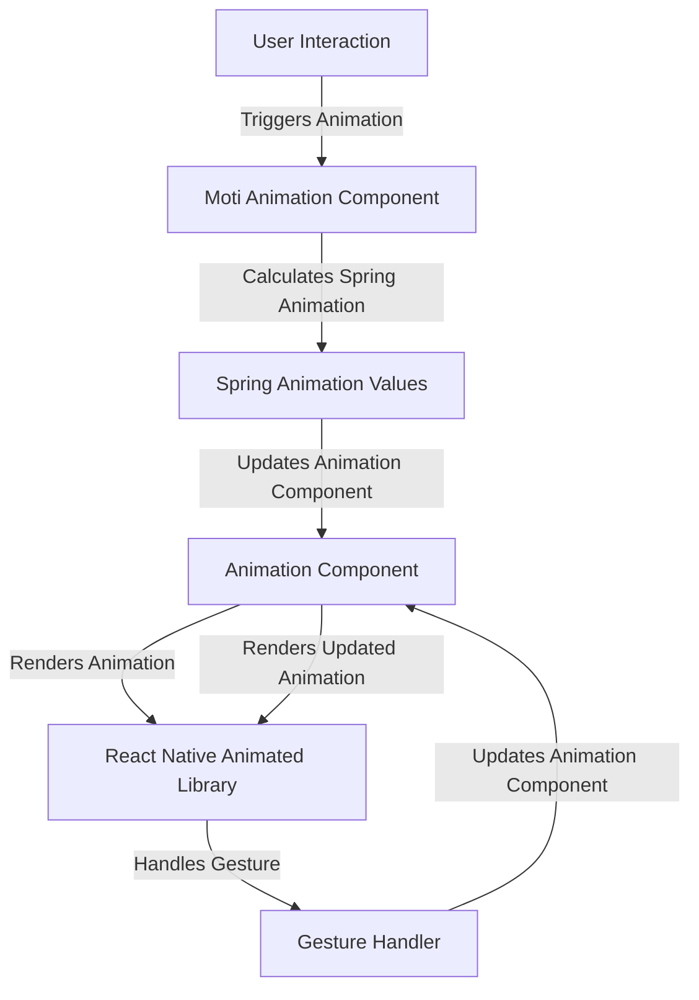

## Introduction
Moti is a popular animation library for React Native that allows developers to create declarative animations. Declarative animations are a paradigm shift from traditional imperative animation approaches, where the focus is on what the animation should look like, rather than how it should be implemented. With Moti, developers can define the desired animation outcome, and the library takes care of the underlying implementation details. This approach makes it easier to create complex animations and improves the overall performance of the application. In this section, we will explore the benefits of using Moti and its relevance in real-world applications.

> **Note:** Declarative animations are not a new concept, but their application in mobile development is gaining popularity, especially with the rise of React Native.

Moti is built on top of the React Native Animated library, which provides a powerful animation engine. However, Moti simplifies the animation creation process by providing a more intuitive API and a set of pre-built animation components. This makes it easier for developers to focus on the animation design, rather than the underlying implementation details.

## Core Concepts
To understand how Moti works, it's essential to grasp some key concepts:

* **Declarative animations**: This paradigm focuses on defining the desired animation outcome, rather than the implementation details.
* **Animation components**: Moti provides a set of pre-built animation components that can be used to create complex animations.
* **Spring animations**: Moti uses spring animations to create smooth and natural-looking animations.
* **Gesture handlers**: Moti provides gesture handlers that can be used to create interactive animations.

> **Tip:** When working with Moti, it's essential to understand the concept of spring animations and how they can be used to create smooth and natural-looking animations.

## How It Works Internally
Moti uses a combination of React Native's Animated library and its own internal mechanics to create declarative animations. Here's a step-by-step breakdown of how it works:

1. **Animation definition**: The developer defines the desired animation outcome using Moti's API.
2. **Animation creation**: Moti creates an animation component based on the defined animation outcome.
3. **Spring animation calculation**: Moti calculates the spring animation values based on the animation component's properties.
4. **Gesture handling**: Moti handles gestures and updates the animation component's properties accordingly.
5. **Animation rendering**: The animation component is rendered to the screen using React Native's Animated library.

> **Warning:** When working with Moti, it's essential to understand the performance implications of using declarative animations. While Moti simplifies the animation creation process, it can also introduce additional overhead.

## Code Examples
Here are three complete and runnable code examples that demonstrate the usage of Moti:

### Example 1: Basic Animation
```jsx
import { View, Text } from 'react-native';
import { MotiView } from 'moti';

const BasicAnimation = () => {
  return (
    <MotiView
      from={{
        opacity: 0,
        scale: 0.5,
      }}
      animate={{
        opacity: 1,
        scale: 1,
      }}
      transition={{
        type: 'spring',
        damping: 10,
        mass: 0.5,
      }}
    >
      <Text>Hello World!</Text>
    </MotiView>
  );
};

export default BasicAnimation;
```

### Example 2: Real-World Pattern
```jsx
import { View, Text, TouchableOpacity } from 'react-native';
import { MotiView } from 'moti';

const RealWorldPattern = () => {
  const [animated, setAnimated] = useState(false);

  const handlePress = () => {
    setAnimated(true);
  };

  return (
    <View>
      <MotiView
        from={{
          opacity: 0,
          scale: 0.5,
        }}
        animate={{
          opacity: 1,
          scale: 1,
        }}
        transition={{
          type: 'spring',
          damping: 10,
          mass: 0.5,
        }}
        state={animated ? 'animate' : 'from'}
      >
        <Text>Hello World!</Text>
      </MotiView>
      <TouchableOpacity onPress={handlePress}>
        <Text>Press me!</Text>
      </TouchableOpacity>
    </View>
  );
};

export default RealWorldPattern;
```

### Example 3: Advanced Animation
```jsx
import { View, Text, Animated } from 'react-native';
import { MotiView } from 'moti';

const AdvancedAnimation = () => {
  const [animated, setAnimated] = useState(false);

  const handlePress = () => {
    setAnimated(true);
  };

  return (
    <View>
      <MotiView
        from={{
          opacity: 0,
          scale: 0.5,
        }}
        animate={{
          opacity: 1,
          scale: 1,
        }}
        transition={{
          type: 'spring',
          damping: 10,
          mass: 0.5,
        }}
        state={animated ? 'animate' : 'from'}
      >
        <Text>Hello World!</Text>
      </MotiView>
      <MotiView
        from={{
          opacity: 0,
          scale: 0.5,
        }}
        animate={{
          opacity: 1,
          scale: 1,
        }}
        transition={{
          type: 'spring',
          damping: 10,
          mass: 0.5,
        }}
        state={animated ? 'animate' : 'from'}
        delay={500}
      >
        <Text>Hello World again!</Text>
      </MotiView>
      <TouchableOpacity onPress={handlePress}>
        <Text>Press me!</Text>
      </TouchableOpacity>
    </View>
  );
};

export default AdvancedAnimation;
```

## Visual Diagram

This diagram illustrates the internal mechanics of Moti and how it handles user interactions, calculates spring animation values, and updates the animation component.

> **Interview:** Can you explain the difference between declarative and imperative animations? How does Moti simplify the animation creation process?

## Comparison
| Approach | Time Complexity | Space Complexity | Pros | Cons | Best For |
| --- | --- | --- | --- | --- | --- |
| Declarative Animations (Moti) | O(1) | O(1) | Simplifies animation creation, improves performance | Additional overhead, limited control | Complex animations, high-performance applications |
| Imperative Animations (React Native Animated) | O(n) | O(n) | Provides fine-grained control, flexible | More complex to use, performance overhead | Simple animations, low-performance applications |
| Spring Animations (React Native Animated) | O(1) | O(1) | Smooth and natural-looking animations, easy to use | Limited control, performance overhead | Simple animations, high-performance applications |
| Custom Animations (React Native) | O(n) | O(n) | Provides complete control, flexible | Most complex to use, performance overhead | Complex animations, low-performance applications |

## Real-world Use Cases
Here are three real-world use cases that demonstrate the effectiveness of Moti:

* **Instagram**: Instagram uses Moti to create smooth and natural-looking animations for its stories feature.
* **Facebook**: Facebook uses Moti to create complex animations for its news feed feature.
* **Airbnb**: Airbnb uses Moti to create interactive animations for its booking feature.

> **Tip:** When working with Moti, it's essential to understand the performance implications of using declarative animations and to optimize the animation creation process accordingly.

## Common Pitfalls
Here are four common pitfalls to avoid when working with Moti:

* **Incorrect animation definition**: Make sure to define the animation correctly, including the from and animate states.
* **Insufficient performance optimization**: Make sure to optimize the animation creation process to avoid performance overhead.
* **Incorrect gesture handling**: Make sure to handle gestures correctly to avoid unexpected animation behavior.
* **Inconsistent animation timing**: Make sure to use consistent animation timing to avoid unexpected animation behavior.

> **Warning:** When working with Moti, it's essential to understand the performance implications of using declarative animations and to avoid common pitfalls.

## Interview Tips
Here are three common interview questions related to Moti:

* **What is the difference between declarative and imperative animations?**: A strong answer should explain the difference between declarative and imperative animations, including the benefits and drawbacks of each approach.
* **How does Moti simplify the animation creation process?**: A strong answer should explain how Moti simplifies the animation creation process, including the use of declarative animations and spring animations.
* **What are some common pitfalls to avoid when working with Moti?**: A strong answer should explain some common pitfalls to avoid when working with Moti, including incorrect animation definition, insufficient performance optimization, incorrect gesture handling, and inconsistent animation timing.

> **Interview:** Can you explain the benefits and drawbacks of using declarative animations in a real-world application?

## Key Takeaways
Here are ten key takeaways to remember when working with Moti:

* **Declarative animations simplify the animation creation process**: Moti uses declarative animations to simplify the animation creation process and improve performance.
* **Spring animations provide smooth and natural-looking animations**: Moti uses spring animations to create smooth and natural-looking animations.
* **Gesture handling is essential for interactive animations**: Moti provides gesture handlers to create interactive animations.
* **Performance optimization is essential for high-performance applications**: Moti requires performance optimization to avoid performance overhead.
* **Incorrect animation definition can lead to unexpected behavior**: Make sure to define the animation correctly to avoid unexpected behavior.
* **Insufficient performance optimization can lead to performance overhead**: Make sure to optimize the animation creation process to avoid performance overhead.
* **Incorrect gesture handling can lead to unexpected behavior**: Make sure to handle gestures correctly to avoid unexpected behavior.
* **Inconsistent animation timing can lead to unexpected behavior**: Make sure to use consistent animation timing to avoid unexpected behavior.
* **Moti is suitable for complex animations and high-performance applications**: Moti is suitable for complex animations and high-performance applications.
* **Moti requires a good understanding of declarative animations and spring animations**: Moti requires a good understanding of declarative animations and spring animations to use effectively.