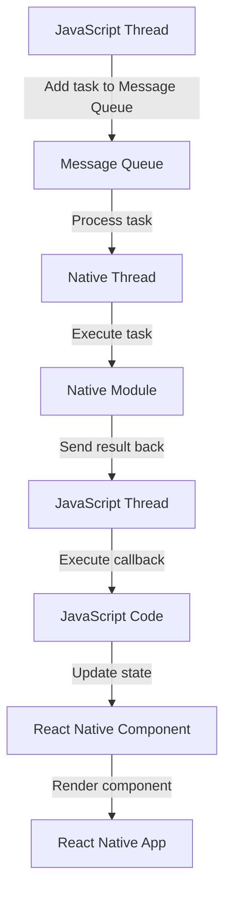

## Introduction
**Bridge Bottlenecks** are a common issue in React Native development, where the communication between the native and JavaScript threads can become a performance bottleneck. This occurs when the JavaScript thread is busy executing code, and the native thread is waiting for the JavaScript thread to respond, causing a delay in the application's responsiveness. In this section, we will explore the concept of Bridge Bottlenecks, why they matter, and how to avoid them.

> **Note:** Bridge Bottlenecks can significantly impact the user experience, causing delays and freezes in the application. It is essential to understand how to identify and avoid these bottlenecks to ensure a smooth and responsive user interface.

In real-world applications, Bridge Bottlenecks can occur in various scenarios, such as when handling large amounts of data, performing complex computations, or executing multiple tasks concurrently. Every engineer working with React Native should be aware of this issue and know how to mitigate it to ensure optimal application performance.

## Core Concepts
To understand Bridge Bottlenecks, we need to grasp the basics of the React Native architecture. The **JavaScript Thread** is responsible for executing JavaScript code, while the **Native Thread** handles native operations, such as rendering and interacting with the operating system. The **Bridge** is the communication layer between these two threads, allowing them to exchange data and execute tasks.

> **Warning:** A common misconception is that the Bridge is a simple, synchronous interface. However, it is an asynchronous, message-based system, which can lead to bottlenecks if not managed properly.

Key terminology includes:

* **JavaScript Thread**: The thread responsible for executing JavaScript code.
* **Native Thread**: The thread responsible for handling native operations.
* **Bridge**: The communication layer between the JavaScript and Native threads.
* **Message Queue**: The data structure used to store messages between the threads.

## How It Works Internally
When a task is executed on the JavaScript thread, it is added to the **Message Queue**, which is then processed by the Native thread. The Native thread executes the task and sends the result back to the JavaScript thread through the Bridge. This process can be broken down into the following steps:

1. The JavaScript thread adds a task to the Message Queue.
2. The Native thread processes the task and sends the result back to the JavaScript thread.
3. The JavaScript thread receives the result and executes any necessary callbacks.

> **Tip:** To avoid Bridge Bottlenecks, it is essential to minimize the number of messages sent between the threads and optimize the execution of tasks on both threads.

## Code Examples
### Example 1: Basic Usage
```javascript
// Import the necessary modules
import React, { useState, useEffect } from 'react';
import { View, Text } from 'react-native';

// Define a simple component
const MyComponent = () => {
  const [count, setCount] = useState(0);

  // Use the useState hook to update the state
  useEffect(() => {
    const intervalId = setInterval(() => {
      setCount(count + 1);
    }, 1000);
    return () => clearInterval(intervalId);
  }, [count]);

  // Render the component
  return (
    <View>
      <Text>Count: {count}</Text>
    </View>
  );
};

export default MyComponent;
```
This example demonstrates a basic React Native component that updates the state every second. However, this example does not showcase a Bridge Bottleneck, as the state update is handled on the JavaScript thread.

### Example 2: Real-World Pattern
```javascript
// Import the necessary modules
import React, { useState, useEffect } from 'react';
import { View, Text } from 'react-native';
import { NativeModules } from 'react-native';

// Define a native module
const MyNativeModule = NativeModules.MyNativeModule;

// Define a component that uses the native module
const MyComponent = () => {
  const [data, setData] = useState([]);

  // Use the useEffect hook to fetch data from the native module
  useEffect(() => {
    MyNativeModule.fetchData((data) => {
      setData(data);
    });
  }, []);

  // Render the component
  return (
    <View>
      {data.map((item) => (
        <Text key={item.id}>{item.name}</Text>
      ))}
    </View>
  );
};

export default MyComponent;
```
This example demonstrates a component that uses a native module to fetch data. The native module is called on the Native thread, and the result is sent back to the JavaScript thread through the Bridge. This can potentially cause a Bridge Bottleneck if the native module takes a long time to execute.

### Example 3: Advanced Usage
```javascript
// Import the necessary modules
import React, { useState, useEffect } from 'react';
import { View, Text } from 'react-native';
import { NativeModules } from 'react-native';

// Define a native module
const MyNativeModule = NativeModules.MyNativeModule;

// Define a component that uses the native module and optimizes the execution
const MyComponent = () => {
  const [data, setData] = useState([]);

  // Use the useEffect hook to fetch data from the native module
  useEffect(() => {
    const startTime = Date.now();
    MyNativeModule.fetchData((data) => {
      const endTime = Date.now();
      console.log(`Fetch time: ${endTime - startTime}ms`);
      setData(data);
    });
  }, []);

  // Render the component
  return (
    <View>
      {data.map((item) => (
        <Text key={item.id}>{item.name}</Text>
      ))}
    </View>
  );
};

export default MyComponent;
```
This example demonstrates a component that uses a native module and measures the execution time of the native module. By optimizing the execution of the native module, we can reduce the likelihood of a Bridge Bottleneck.

## Visual Diagram

This diagram illustrates the communication between the JavaScript and Native threads, including the Message Queue and the native module. By understanding this flow, we can identify potential bottlenecks and optimize the execution of tasks.

## Comparison
| Approach | Time Complexity | Space Complexity | Pros | Cons | Best For |
| --- | --- | --- | --- | --- | --- |
| Synchronous Bridge | O(1) | O(1) | Simple to implement | Can cause Bridge Bottlenecks | Simple, low-latency applications |
| Asynchronous Bridge | O(n) | O(n) | Reduces Bridge Bottlenecks | More complex to implement | High-performance, concurrent applications |
| Native Modules | O(1) | O(1) | Optimizes native execution | Can be difficult to implement | Applications with complex native logic |
| JavaScript Threads | O(1) | O(1) | Optimizes JavaScript execution | Can be difficult to implement | Applications with complex JavaScript logic |

## Real-world Use Cases
1. **Facebook**: Facebook's React Native application uses a combination of synchronous and asynchronous Bridge communication to optimize performance.
2. **Instagram**: Instagram's React Native application uses native modules to optimize the execution of complex native logic.
3. **WhatsApp**: WhatsApp's React Native application uses JavaScript threads to optimize the execution of complex JavaScript logic.

## Common Pitfalls
1. **Synchronous Bridge**: Using a synchronous Bridge can cause Bridge Bottlenecks, especially in high-latency applications.
2. **Native Module Complexity**: Implementing native modules can be complex and time-consuming, especially for large applications.
3. **JavaScript Thread Complexity**: Implementing JavaScript threads can be complex and time-consuming, especially for large applications.
4. **Message Queue Overflow**: Failing to process messages in the Message Queue can cause the queue to overflow, leading to performance issues.

> **Interview:** What are some common pitfalls when working with the Bridge in React Native, and how can you avoid them?

## Interview Tips
1. **Bridge Bottlenecks**: Be prepared to discuss Bridge Bottlenecks, including what they are, why they occur, and how to avoid them.
2. **Native Modules**: Be prepared to discuss native modules, including how to implement them, their benefits, and their drawbacks.
3. **JavaScript Threads**: Be prepared to discuss JavaScript threads, including how to implement them, their benefits, and their drawbacks.

> **Tip:** When discussing Bridge Bottlenecks, be sure to emphasize the importance of optimizing the execution of tasks on both threads and minimizing the number of messages sent between the threads.

## Key Takeaways
* **Bridge Bottlenecks** can occur when the communication between the JavaScript and Native threads becomes a performance bottleneck.
* **Synchronous Bridge** communication can cause Bridge Bottlenecks, especially in high-latency applications.
* **Asynchronous Bridge** communication can reduce Bridge Bottlenecks, but can be more complex to implement.
* **Native Modules** can optimize the execution of complex native logic, but can be difficult to implement.
* **JavaScript Threads** can optimize the execution of complex JavaScript logic, but can be difficult to implement.
* **Message Queue** overflow can cause performance issues, and should be avoided by processing messages in a timely manner.
* **Optimizing task execution** on both threads can reduce the likelihood of Bridge Bottlenecks.
* **Minimizing message sending** between threads can reduce the likelihood of Bridge Bottlenecks.