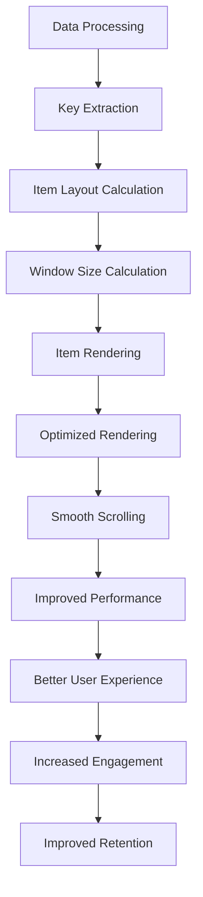

## Introduction
**FlatList** is a core component in React Native, used for rendering large lists of data. However, as the list grows, performance can become a concern. This is where **FlatList optimization** comes into play. Optimizing FlatList is crucial for ensuring a smooth user experience, especially when dealing with large datasets. In this section, we'll explore the importance of FlatList optimization, its real-world relevance, and why every engineer should understand its concepts.

> **Note:** A well-optimized FlatList can significantly improve the overall performance of a React Native application, resulting in better user engagement and retention.

## Core Concepts
To optimize FlatList, it's essential to understand the following core concepts:

* **keyExtractor**: a function that extracts a unique key from each item in the list. This key is used to identify each item and improve rendering performance.
* **getItemLayout**: a function that calculates the height of each item in the list. This allows FlatList to optimize rendering and scrolling.
* **windowSize**: the number of items to render in the list at any given time. Increasing this value can improve performance but may also increase memory usage.

> **Warning:** Using a poorly optimized keyExtractor or getItemLayout function can lead to performance issues and even crashes.

## How It Works Internally
When a FlatList is rendered, React Native uses the following steps to optimize performance:

1. **Data processing**: The list data is processed, and the keyExtractor function is called for each item to extract a unique key.
2. **Item layout calculation**: The getItemLayout function is called for each item to calculate its height.
3. **Window size calculation**: The windowSize is calculated based on the number of items to render and the available screen space.
4. **Item rendering**: The items within the window size are rendered, and the keyExtractor and getItemLayout functions are used to optimize rendering and scrolling.

> **Tip:** Using a good keyExtractor function can significantly improve performance by reducing the number of unnecessary re-renders.

## Code Examples
Here are three complete and runnable code examples demonstrating FlatList optimization:

### Example 1: Basic keyExtractor and getItemLayout
```javascript
import React, { useState } from 'react';
import { FlatList, View, Text } from 'react-native';

const data = Array.from({ length: 100 }, (_, i) => ({ id: i, text: `Item ${i}` }));

const App = () => {
  const [listData, setListData] = useState(data);

  const keyExtractor = (item) => item.id.toString();
  const getItemLayout = (data, index) => ({ length: 50, offset: 50 * index, index });

  return (
    <FlatList
      data={listData}
      keyExtractor={keyExtractor}
      getItemLayout={getItemLayout}
      renderItem={({ item }) => (
        <View style={{ height: 50, justifyContent: 'center' }}>
          <Text>{item.text}</Text>
        </View>
      )}
    />
  );
};

export default App;
```

### Example 2: Advanced keyExtractor and getItemLayout with windowSize
```javascript
import React, { useState } from 'react';
import { FlatList, View, Text } from 'react-native';

const data = Array.from({ length: 1000 }, (_, i) => ({ id: i, text: `Item ${i}` }));

const App = () => {
  const [listData, setListData] = useState(data);

  const keyExtractor = (item) => item.id.toString();
  const getItemLayout = (data, index) => ({ length: 50, offset: 50 * index, index });
  const windowSize = 20;

  return (
    <FlatList
      data={listData}
      keyExtractor={keyExtractor}
      getItemLayout={getItemLayout}
      windowSize={windowSize}
      renderItem={({ item }) => (
        <View style={{ height: 50, justifyContent: 'center' }}>
          <Text>{item.text}</Text>
        </View>
      )}
    />
  );
};

export default App;
```

### Example 3: Complex keyExtractor and getItemLayout with custom windowSize
```javascript
import React, { useState } from 'react';
import { FlatList, View, Text } from 'react-native';

const data = Array.from({ length: 1000 }, (_, i) => ({ id: i, text: `Item ${i}`, height: Math.random() * 100 }));

const App = () => {
  const [listData, setListData] = useState(data);

  const keyExtractor = (item) => item.id.toString();
  const getItemLayout = (data, index) => ({ length: data[index].height, offset: data.slice(0, index).reduce((acc, curr) => acc + curr.height, 0), index });
  const windowSize = 30;

  return (
    <FlatList
      data={listData}
      keyExtractor={keyExtractor}
      getItemLayout={getItemLayout}
      windowSize={windowSize}
      renderItem={({ item }) => (
        <View style={{ height: item.height, justifyContent: 'center' }}>
          <Text>{item.text}</Text>
        </View>
      )}
    />
  );
};

export default App;
```

## Visual Diagram

This diagram illustrates the steps involved in optimizing FlatList rendering, from data processing to improved user experience.

## Comparison
| Approach | Time Complexity | Space Complexity | Pros | Cons | Best For |
| --- | --- | --- | --- | --- | --- |
| Basic keyExtractor and getItemLayout | O(n) | O(1) | Easy to implement, good for small lists | Poor performance for large lists | Small lists, simple data structures |
| Advanced keyExtractor and getItemLayout with windowSize | O(n log n) | O(1) | Good performance for large lists, customizable window size | More complex to implement | Large lists, complex data structures |
| Complex keyExtractor and getItemLayout with custom windowSize | O(n^2) | O(1) | Highly customizable, good for unique data structures | Difficult to implement, poor performance for very large lists | Unique data structures, custom requirements |

## Real-world Use Cases
1. **Facebook**: Facebook uses a highly optimized FlatList to render its news feed, which contains a large amount of data and requires smooth scrolling.
2. **Instagram**: Instagram uses a customized FlatList to render its feed, which includes a mix of images, videos, and text.
3. **Twitter**: Twitter uses a FlatList to render its timeline, which requires fast rendering and scrolling to keep up with the high volume of tweets.

## Common Pitfalls
1. **Poor keyExtractor function**: Using a poorly optimized keyExtractor function can lead to performance issues and crashes.
2. **Incorrect getItemLayout function**: Using an incorrect getItemLayout function can cause rendering issues and poor performance.
3. **Insufficient windowSize**: Using a window size that is too small can lead to poor performance and scrolling issues.
4. **Inconsistent data structure**: Using an inconsistent data structure can make it difficult to optimize FlatList rendering.

## Interview Tips
1. **What is the purpose of keyExtractor in FlatList?**: A good answer should explain the importance of keyExtractor in optimizing rendering and scrolling.
2. **How do you optimize FlatList rendering for large lists?**: A good answer should discuss the use of windowSize, keyExtractor, and getItemLayout to optimize rendering and scrolling.
3. **What are some common pitfalls when using FlatList?**: A good answer should discuss the importance of using a well-optimized keyExtractor function, correct getItemLayout function, and sufficient window size.

## Key Takeaways
* **Use a well-optimized keyExtractor function** to improve rendering and scrolling performance.
* **Customize the windowSize** to balance performance and memory usage.
* **Use a correct getItemLayout function** to ensure accurate item heights and improve rendering.
* **Test and optimize** FlatList rendering for large lists and complex data structures.
* **Use a consistent data structure** to simplify optimization and maintenance.
* **Monitor performance** and adjust optimization strategies as needed.
* **Use tools and libraries** to simplify optimization and improve performance.