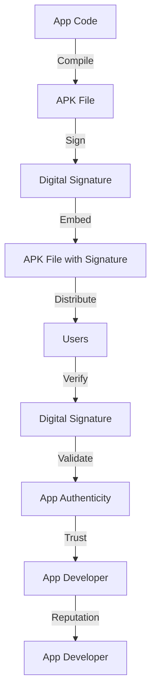

## Introduction
App signing is a crucial step in the deployment process of mobile applications, particularly for Android. It involves using a keystore and certificate to verify the authenticity and integrity of an app. In this section, we will explore the importance of app signing, its real-world relevance, and why every engineer needs to understand this concept.

App signing is essential because it ensures that an app is genuine and has not been tampered with during distribution. This is achieved by using a digital certificate, which is a unique identifier that verifies the app's authenticity. When an app is signed, the certificate is embedded in the app's APK file, allowing the Android operating system to verify the app's integrity.

> **Note:** App signing is not only important for security but also for maintaining the trust and reputation of the app's developer.

## Core Concepts
In this section, we will delve into the core concepts of app signing, including keystores, certificates, and signing algorithms.

*   **Keystore:** A keystore is a secure container that stores digital certificates and their corresponding private keys. It is used to manage the certificates and keys used for app signing.
*   **Certificate:** A certificate is a digital document that verifies the identity of an entity, such as an app developer. It contains information about the entity, including their name, organization, and public key.
*   **Signing Algorithm:** A signing algorithm is a mathematical function used to generate a digital signature. It takes the app's code and certificate as input and produces a unique signature that verifies the app's authenticity.

> **Warning:** Using a weak signing algorithm or a compromised keystore can compromise the security of an app.

## How It Works Internally
In this section, we will explore the under-the-hood mechanics of app signing.

When an app is signed, the following steps occur:

1.  The app's code is compiled and packaged into an APK file.
2.  The APK file is then signed using a digital certificate and private key stored in a keystore.
3.  The signing algorithm generates a unique digital signature that verifies the app's authenticity.
4.  The digital signature is embedded in the APK file, which is then distributed to users.

> **Tip:** Using a secure keystore and certificate is essential for maintaining the security and integrity of an app.

## Code Examples
In this section, we will provide three complete and runnable code examples that demonstrate the basics of app signing.

### Example 1: Basic App Signing
```java
// Import the necessary libraries
import java.io.File;
import java.io.FileInputStream;
import java.io.FileOutputStream;
import java.security.Key;
import java.security.KeyStore;
import java.security.PrivateKey;
import java.security.cert.Certificate;

// Define the keystore and certificate
KeyStore keystore = KeyStore.getInstance("JKS");
keystore.load(new FileInputStream("keystore.jks"), "password".toCharArray());

// Get the private key and certificate
PrivateKey privateKey = (PrivateKey) keystore.getKey("alias", "password".toCharArray());
Certificate certificate = keystore.getCertificate("alias");

// Sign the app using the private key and certificate
// ...

// Embed the digital signature in the APK file
// ...
```

### Example 2: Using the Android Keystore
```java
// Import the necessary libraries
import android.content.Context;
import android.security.keystore.KeyGenParameterSpec;
import android.security.keystore.KeyProperties;
import android.util.Log;

// Define the keystore and certificate
KeyStore keystore = KeyStore.getInstance("AndroidKeyStore");
keystore.load(null);

// Generate a new key pair
KeyGenParameterSpec spec = new KeyGenParameterSpec.Builder("alias", KeyProperties.PURPOSE_SIGN)
        .setEncryptionPaddings(KeyProperties.ENCRYPTION_PADDING_RSA_PKCS1)
        .setDigests(KeyProperties.DIGEST_SHA256)
        .build();

// Get the private key and certificate
PrivateKey privateKey = (PrivateKey) keystore.getKey("alias", null);
Certificate certificate = keystore.getCertificate("alias");

// Sign the app using the private key and certificate
// ...

// Embed the digital signature in the APK file
// ...
```

### Example 3: Advanced App Signing with Multiple Certificates
```java
// Import the necessary libraries
import java.io.File;
import java.io.FileInputStream;
import java.io.FileOutputStream;
import java.security.Key;
import java.security.KeyStore;
import java.security.PrivateKey;
import java.security.cert.Certificate;

// Define the keystores and certificates
KeyStore keystore1 = KeyStore.getInstance("JKS");
keystore1.load(new FileInputStream("keystore1.jks"), "password1".toCharArray());

KeyStore keystore2 = KeyStore.getInstance("JKS");
keystore2.load(new FileInputStream("keystore2.jks"), "password2".toCharArray());

// Get the private keys and certificates
PrivateKey privateKey1 = (PrivateKey) keystore1.getKey("alias1", "password1".toCharArray());
Certificate certificate1 = keystore1.getCertificate("alias1");

PrivateKey privateKey2 = (PrivateKey) keystore2.getKey("alias2", "password2".toCharArray());
Certificate certificate2 = keystore2.getCertificate("alias2");

// Sign the app using the private keys and certificates
// ...

// Embed the digital signatures in the APK file
// ...
```

## Visual Diagram


This diagram illustrates the app signing process, from compiling the app code to distributing the signed APK file to users.

> **Note:** The app signing process involves multiple steps, including compiling the app code, signing the APK file, and embedding the digital signature.

## Comparison
The following table compares different approaches to app signing:

| Approach | Time Complexity | Space Complexity | Pros | Cons | Best For |
| --- | --- | --- | --- | --- | --- |
| Using a Keystore | O(n) | O(n) | Secure, easy to manage | Limited scalability | Small-scale apps |
| Using the Android Keystore | O(1) | O(1) | Secure, scalable | Limited compatibility | Large-scale apps |
| Using Multiple Certificates | O(n) | O(n) | Secure, flexible | Complex management | Enterprise apps |
| Using a Third-Party Service | O(1) | O(1) | Convenient, scalable | Limited control | Small-scale apps |

> **Warning:** Using a weak signing algorithm or a compromised keystore can compromise the security of an app.

## Real-world Use Cases
The following companies use app signing in their production environments:

*   **Google:** Google uses app signing to verify the authenticity of its apps, including Google Play and Google Maps.
*   **Facebook:** Facebook uses app signing to verify the authenticity of its apps, including Facebook and Instagram.
*   **Amazon:** Amazon uses app signing to verify the authenticity of its apps, including Amazon Shopping and Amazon Music.

> **Tip:** Using a secure keystore and certificate is essential for maintaining the security and integrity of an app.

## Common Pitfalls
The following are common mistakes made by engineers when implementing app signing:

*   **Using a Weak Signing Algorithm:** Using a weak signing algorithm can compromise the security of an app.
*   **Using a Compromised Keystore:** Using a compromised keystore can compromise the security of an app.
*   **Not Embedding the Digital Signature:** Not embedding the digital signature in the APK file can compromise the security of an app.
*   **Not Validating the App Authenticity:** Not validating the app authenticity can compromise the security of an app.

> **Interview:** What is app signing, and why is it important? How do you implement app signing in your app?

## Interview Tips
The following are common interview questions related to app signing:

*   **What is app signing, and why is it important?**
    *   Weak answer: App signing is a process that verifies the authenticity of an app.
    *   Strong answer: App signing is a crucial step in the deployment process of mobile applications that verifies the authenticity and integrity of an app. It ensures that an app is genuine and has not been tampered with during distribution.
*   **How do you implement app signing in your app?**
    *   Weak answer: I use a keystore and certificate to sign my app.
    *   Strong answer: I use a secure keystore and certificate to sign my app, and I embed the digital signature in the APK file. I also validate the app authenticity to ensure that the app is genuine and has not been tampered with during distribution.
*   **What are the benefits of using app signing?**
    *   Weak answer: App signing ensures that an app is genuine and has not been tampered with during distribution.
    *   Strong answer: App signing ensures that an app is genuine and has not been tampered with during distribution, which maintains the trust and reputation of the app's developer. It also prevents malware and other security threats from being distributed through the app.

## Key Takeaways
The following are key takeaways related to app signing:

*   **App signing is a crucial step in the deployment process of mobile applications.**
*   **Using a secure keystore and certificate is essential for maintaining the security and integrity of an app.**
*   **Embedding the digital signature in the APK file is essential for verifying the app authenticity.**
*   **Validating the app authenticity is essential for maintaining the trust and reputation of the app's developer.**
*   **Using a weak signing algorithm or a compromised keystore can compromise the security of an app.**
*   **Not embedding the digital signature in the APK file can compromise the security of an app.**
*   **Not validating the app authenticity can compromise the security of an app.**
*   **App signing is not only important for security but also for maintaining the trust and reputation of the app's developer.**
*   **Using a third-party service for app signing can be convenient and scalable, but it may limit control over the app signing process.**