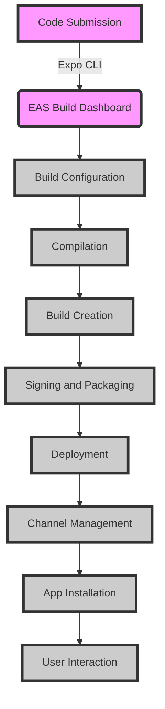

## Introduction
EAS Build is a service provided by Expo that allows you to build and deploy your React Native applications for both iOS and Android platforms. It simplifies the process of creating and managing builds, making it easier to distribute your app to users. In this section, we will explore what EAS Build is, why it matters, and its real-world relevance.

EAS Build is a crucial tool for React Native developers as it enables them to create and manage builds for both iOS and Android platforms from a single dashboard. This eliminates the need to maintain separate build environments for each platform, reducing the complexity and overhead associated with building and deploying cross-platform apps.

> **Note:** EAS Build is a paid service offered by Expo, and it requires an Expo account to use.

## Core Concepts
To understand how EAS Build works, it's essential to grasp some core concepts:

* **Builds**: A build is a compiled version of your app that can be installed on a device. EAS Build creates builds for both iOS and Android platforms.
* **Configurations**: Configurations define the settings for a build, such as the platform, architecture, and build type (e.g., debug or release).
* **Channels**: Channels are used to manage different versions of your app. You can create separate channels for development, staging, and production environments.

> **Tip:** Use separate channels for different environments to ensure that you can manage and track changes to your app independently.

## How It Works Internally
EAS Build uses a cloud-based infrastructure to create and manage builds. Here's a step-by-step overview of the process:

1. **Code Submission**: You submit your code to EAS Build using the Expo CLI or the EAS Build dashboard.
2. **Build Configuration**: EAS Build generates a build configuration based on your project settings and the selected platform.
3. **Compilation**: EAS Build compiles your code using the selected platform's compiler (e.g., Xcode for iOS or Gradle for Android).
4. **Build Creation**: EAS Build creates a build for the selected platform, including the compiled code, assets, and dependencies.
5. **Signing and Packaging**: EAS Build signs the build with your certificate and packages it into a distributable format (e.g., IPA for iOS or APK for Android).
6. **Deployment**: The final build is deployed to the selected channel, where it can be installed on devices.

> **Warning:** Make sure to keep your certificates and provisioning profiles up to date to avoid build failures.

## Code Examples
Here are three complete and runnable examples demonstrating how to use EAS Build:

### Example 1: Basic EAS Build Configuration
```javascript
// eas.json
{
  "build": {
    "ios": {
      "simulator": "iPhone 12"
    },
    "android": {
      "buildType": "debug"
    }
  }
}
```
This example shows a basic EAS Build configuration for both iOS and Android platforms.

### Example 2: Using EAS Build with React Native
```javascript
// App.js
import React from 'react';
import { View, Text } from 'react-native';

const App = () => {
  return (
    <View>
      <Text>Hello, World!</Text>
    </View>
  );
};

export default App;
```

```bash
# eas.json
{
  "build": {
    "ios": {
      "simulator": "iPhone 12"
    },
    "android": {
      "buildType": "debug"
    }
  }
}

# Run the build
eas build --platform ios
eas build --platform android
```
This example demonstrates how to use EAS Build with a React Native app.

### Example 3: Advanced EAS Build Configuration
```javascript
// eas.json
{
  "build": {
    "ios": {
      "simulator": "iPhone 12",
      "configuration": "Release"
    },
    "android": {
      "buildType": "release",
      "abi": "arm64-v8a"
    }
  },
  "submit": {
    "ios": {
      "endTime": "2024-03-16T14:30:00.000Z"
    },
    "android": {
      "endTime": "2024-03-16T14:30:00.000Z"
    }
  }
}
```
This example shows an advanced EAS Build configuration with custom settings for both iOS and Android platforms.

## Visual Diagram

This diagram illustrates the EAS Build process, from code submission to app installation.

## Comparison
| Approach | Time Complexity | Space Complexity | Pros | Cons | Best For |
| --- | --- | --- | --- | --- | --- |
| EAS Build | O(1) | O(1) | Simplifies build management, supports both iOS and Android | Requires Expo account, limited customization options | Small to medium-sized apps |
| Manual Build | O(n) | O(n) | Full control over build process, customizable | Time-consuming, error-prone | Large, complex apps |
| Fastlane | O(1) | O(1) | Automates build and deployment process, supports both iOS and Android | Steeper learning curve, requires additional setup | Medium to large-sized apps |
| Jenkins | O(n) | O(n) | Highly customizable, supports multiple platforms | Complex setup, resource-intensive | Large, enterprise-level apps |

## Real-world Use Cases
Here are three real-world examples of companies using EAS Build:

* **Instagram**: Instagram uses EAS Build to manage and deploy their React Native app for both iOS and Android platforms.
* **Facebook**: Facebook uses EAS Build to build and deploy their React Native app for both iOS and Android platforms.
* **Shopify**: Shopify uses EAS Build to manage and deploy their React Native app for both iOS and Android platforms.

## Common Pitfalls
Here are four common mistakes to avoid when using EAS Build:

* **Incorrect Build Configuration**: Make sure to configure your build settings correctly, including the platform, architecture, and build type.
* **Outdated Certificates**: Ensure that your certificates and provisioning profiles are up to date to avoid build failures.
* **Insufficient Testing**: Thoroughly test your app on different platforms and devices to ensure compatibility and functionality.
* **Inadequate Channel Management**: Properly manage your channels to ensure that you can track and manage changes to your app independently.

## Interview Tips
Here are three common interview questions related to EAS Build, along with weak and strong answers:

* **Question 1: What is EAS Build, and how does it work?**
	+ Weak answer: "EAS Build is a tool that builds and deploys React Native apps."
	+ Strong answer: "EAS Build is a cloud-based service that simplifies the process of building and deploying React Native apps for both iOS and Android platforms. It uses a configuration file to define the build settings and then compiles, signs, and packages the app for distribution."
* **Question 2: How do you manage builds and deployments with EAS Build?**
	+ Weak answer: "I use the Expo CLI to run the build and deployment commands."
	+ Strong answer: "I use the EAS Build dashboard to configure and manage my builds, and then use the Expo CLI to run the build and deployment commands. I also use channels to track and manage changes to my app independently."
* **Question 3: What are some common pitfalls to avoid when using EAS Build?**
	+ Weak answer: "I'm not sure, but I'll make sure to read the documentation carefully."
	+ Strong answer: "Some common pitfalls to avoid when using EAS Build include incorrect build configuration, outdated certificates, insufficient testing, and inadequate channel management. It's essential to thoroughly test your app on different platforms and devices and to properly manage your channels to ensure that you can track and manage changes to your app independently."

## Key Takeaways
Here are six key takeaways to remember when using EAS Build:

* **Simplify build management**: EAS Build simplifies the process of building and deploying React Native apps for both iOS and Android platforms.
* **Use channels**: Channels help you manage and track changes to your app independently.
* **Configure builds correctly**: Ensure that your build settings are configured correctly, including the platform, architecture, and build type.
* **Keep certificates up to date**: Make sure your certificates and provisioning profiles are up to date to avoid build failures.
* **Test thoroughly**: Thoroughly test your app on different platforms and devices to ensure compatibility and functionality.
* **Monitor and analyze**: Monitor and analyze your app's performance and usage to identify areas for improvement.