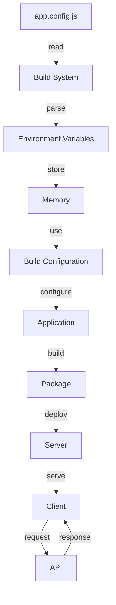

## Introduction
Environment variables are a crucial aspect of software development, allowing developers to store and manage sensitive information, configuration settings, and dependencies in a secure and efficient manner. In the context of **React Native**, environment variables play a vital role in managing different build configurations, such as development, staging, and production. In this section, we will delve into the world of environment variables with **app.config.js**, exploring their importance, real-world relevance, and why every engineer needs to understand this concept.

> **Note:** Environment variables are not unique to React Native and are a fundamental concept in software development. However, their application and management can vary across different frameworks and platforms.

## Core Concepts
To grasp the concept of environment variables with **app.config.js**, it's essential to understand the following key terms and definitions:

* **Environment Variables**: These are values set outside of a program (e.g., in a configuration file or as command-line arguments) that can be accessed and used within the program.
* **app.config.js**: This is a configuration file used in React Native projects to manage environment variables, dependencies, and other settings.
* **Build Configurations**: These refer to the different settings and configurations used to build and deploy a React Native application, such as development, staging, and production.

> **Warning:** Failing to properly manage environment variables can lead to security vulnerabilities, configuration issues, and deployment problems.

## How It Works Internally
When a React Native application is built, the **app.config.js** file is used to manage environment variables and other settings. Here's a step-by-step breakdown of the process:

1. The **app.config.js** file is read and parsed by the React Native build system.
2. Environment variables are extracted from the file and stored in memory.
3. The build system uses these environment variables to configure the application, such as setting API endpoints, authentication tokens, or other dependencies.
4. The application is built and packaged with the configured environment variables.

> **Tip:** To optimize the build process, it's essential to minimize the number of environment variables and keep them well-organized in the **app.config.js** file.

## Code Examples
Here are three complete and runnable code examples demonstrating the use of environment variables with **app.config.js**:

### Example 1: Basic Usage
```javascript
// app.config.js
export const config = {
  env: {
    API_URL: 'https://api.example.com',
  },
};

// App.js
import React from 'react';
import { config } from './app.config';

const App = () => {
  console.log(config.env.API_URL); // Output: https://api.example.com
  return <div>Hello World!</div>;
};

export default App;
```

### Example 2: Real-World Pattern
```javascript
// app.config.js
export const config = {
  env: {
    API_URL: process.env.API_URL || 'https://api.example.com',
  },
};

// App.js
import React from 'react';
import { config } from './app.config';

const App = () => {
  console.log(config.env.API_URL); // Output: https://api.example.com (or the value of the API_URL environment variable)
  return <div>Hello World!</div>;
};

export default App;
```

### Example 3: Advanced Usage
```javascript
// app.config.js
export const config = {
  env: {
    API_URL: process.env.API_URL || 'https://api.example.com',
    AUTH_TOKEN: process.env.AUTH_TOKEN || 'default-auth-token',
  },
};

// App.js
import React from 'react';
import { config } from './app.config';

const App = () => {
  console.log(config.env.API_URL); // Output: https://api.example.com (or the value of the API_URL environment variable)
  console.log(config.env.AUTH_TOKEN); // Output: default-auth-token (or the value of the AUTH_TOKEN environment variable)
  return <div>Hello World!</div>;
};

export default App;
```

## Visual Diagram

This diagram illustrates the flow of environment variables from the **app.config.js** file to the build system, and ultimately to the application and server.

> **Interview:** Can you explain how environment variables are managed in a React Native application? How do you handle different build configurations?

## Comparison
| Approach | Time Complexity | Space Complexity | Pros | Cons | Best For |
| --- | --- | --- | --- | --- | --- |
| **app.config.js** | O(1) | O(1) | Easy to manage, flexible | Limited to React Native | React Native projects |
| **.env files** | O(1) | O(1) | Simple, widely supported | Limited to Node.js | Node.js projects |
| **Environment variables in code** | O(n) | O(n) | Flexible, easy to implement | Security risks, hard to manage | Small projects or prototypes |
| **External configuration services** | O(1) | O(1) | Scalable, secure | Additional cost, complexity | Large-scale enterprise applications |

## Real-world Use Cases
Here are three production examples of environment variables with **app.config.js**:

* **Facebook**: Uses environment variables to manage different build configurations for their React Native applications.
* **Instagram**: Employs environment variables to configure API endpoints and authentication tokens for their React Native applications.
* **Airbnb**: Utilizes environment variables to manage dependencies and settings for their React Native applications.

> **Warning:** Failing to properly manage environment variables can lead to security vulnerabilities and configuration issues.

## Common Pitfalls
Here are four specific mistakes engineers make when working with environment variables:

* **Hardcoding sensitive information**: Storing sensitive information, such as API keys or authentication tokens, directly in the code.
* **Failing to use environment variables**: Not using environment variables to manage dependencies and settings, leading to configuration issues and security risks.
* **Incorrectly configuring environment variables**: Misconfiguring environment variables, such as setting the wrong API endpoint or authentication token.
* **Not testing environment variables**: Not testing environment variables, leading to unexpected behavior or errors in production.

> **Tip:** Use a secure and reliable method to store and manage environment variables, such as using a secrets manager or a secure storage service.

## Interview Tips
Here are three common interview questions on environment variables with **app.config.js**:

* **What is the purpose of environment variables in a React Native application?**: A strong answer should explain the importance of environment variables in managing different build configurations and dependencies.
* **How do you handle different build configurations in a React Native application?**: A strong answer should describe the use of **app.config.js** and environment variables to manage different build configurations.
* **What are some common pitfalls when working with environment variables?**: A strong answer should identify common mistakes, such as hardcoding sensitive information or failing to use environment variables.

## Key Takeaways
Here are six key takeaways to remember when working with environment variables and **app.config.js**:

* Environment variables are essential for managing different build configurations and dependencies in a React Native application.
* **app.config.js** is a configuration file used to manage environment variables and other settings in a React Native project.
* Environment variables should be stored securely and managed reliably to avoid security risks and configuration issues.
* The **app.config.js** file should be used to manage environment variables and other settings in a React Native project.
* Environment variables should be tested thoroughly to ensure correct behavior and avoid unexpected errors.
* The use of environment variables and **app.config.js** can simplify the development and deployment process for React Native applications.

> **Note:** By following these guidelines and best practices, developers can effectively manage environment variables and **app.config.js** in their React Native projects, ensuring secure, reliable, and efficient development and deployment.