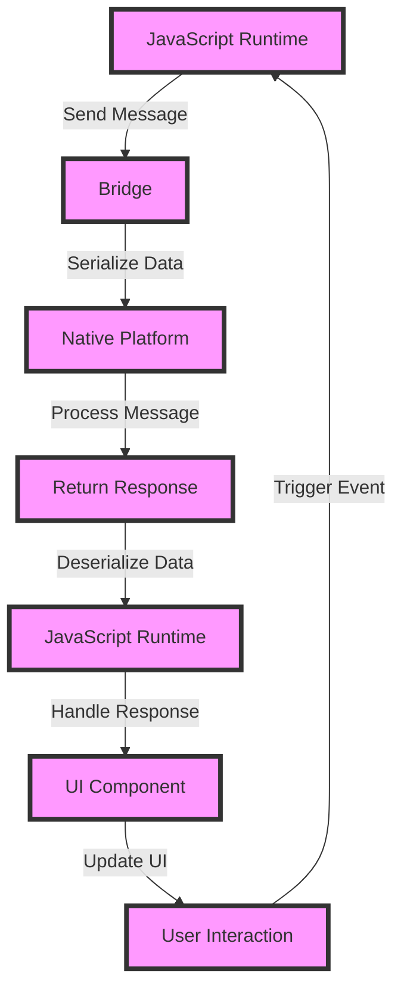

## Introduction
Securing Bridge vs JSI (JavaScript Interface) architecture is a crucial aspect of React Native development. As mobile applications become increasingly popular, the importance of ensuring the security of sensitive data and protecting against potential threats cannot be overstated. In this section, we will delve into the world of securing Bridge vs JSI architecture, exploring the core concepts, internal mechanics, and implementation details that every React Native developer needs to know. 
> **Note:** Understanding the differences between Bridge and JSI architecture is essential for building secure and efficient React Native applications.

## Core Concepts
To grasp the concept of securing Bridge vs JSI architecture, it's essential to understand the following key terms:
- **Bridge Architecture:** A bridge is a communication layer between the JavaScript runtime and the native platform. It enables the exchange of data and method calls between JavaScript and native code.
- **JSI (JavaScript Interface) Architecture:** JSI is a newer architecture introduced in React Native 0.68, which allows for direct communication between JavaScript and native code without the need for a bridge.
- **Security:** In the context of Bridge vs JSI architecture, security refers to the measures taken to protect sensitive data and prevent unauthorized access to the application's internal workings.
> **Tip:** When working with Bridge architecture, it's essential to use secure communication protocols, such as HTTPS, to protect data transmitted between the JavaScript runtime and the native platform.

## How It Works Internally
Let's take a closer look at the internal mechanics of Bridge and JSI architecture:
1. **Bridge Architecture:**
	* The JavaScript runtime sends a message to the native platform through the bridge.
	* The native platform processes the message and returns a response to the JavaScript runtime.
	* The bridge is responsible for serializing and deserializing data between the JavaScript runtime and the native platform.
2. **JSI Architecture:**
	* The JavaScript runtime directly calls native code using the JSI API.
	* The native code executes and returns a result to the JavaScript runtime.
	* The JSI API handles memory management and data conversion between JavaScript and native code.
> **Warning:** When using JSI architecture, it's crucial to ensure that native code is properly validated and sanitized to prevent potential security vulnerabilities.

## Code Examples
Here are three complete and runnable code examples demonstrating the use of Bridge and JSI architecture:
### Example 1: Basic Bridge Architecture
```javascript
// NativeModule.js
import { NativeModules } from 'react-native';
const { MyNativeModule } = NativeModules;

const MyNativeModuleExample = () => {
  const handleClick = () => {
    MyNativeModule.myNativeMethod('Hello, World!');
  };

  return (
    <button onClick={handleClick}>Call Native Method</button>
  );
};

export default MyNativeModuleExample;
```

```java
// MyNativeModule.java
import android.util.Log;

import com.facebook.react.bridge.NativeModule;
import com.facebook.react.bridge.ReactApplicationContext;
import com.facebook.react.bridge.ReactMethod;

public class MyNativeModule extends NativeModule {
  public MyNativeModule(ReactApplicationContext reactContext) {
    super(reactContext);
  }

  @ReactMethod
  public void myNativeMethod(String message) {
    Log.d("MyNativeModule", message);
  }
}
```
### Example 2: Real-World JSI Architecture
```javascript
// MyJSIModule.js
import { JSI } from 'react-native';

const MyJSIModule = () => {
  const handleClick = () => {
    const myNativeModule = JSI.myNativeModule;
    myNativeModule.myNativeMethod('Hello, World!');
  };

  return (
    <button onClick={handleClick}>Call Native Method</button>
  );
};

export default MyJSIModule;
```

```cpp
// MyNativeModule.cpp
#include <jsi/jsi.h>

using namespace facebook::jsi;

facebook::jsi::Value myNativeMethod(
  facebook::jsi::Runtime &runtime,
  facebook::jsi::Value const &thisValue,
  facebook::jsi::Value const *args,
  size_t count
) {
  std::string message = args[0].asString(runtime).utf8(runtime);
  // Process the message
  return Value::null();
}
```
### Example 3: Advanced JSI Architecture with Error Handling
```javascript
// MyJSIModule.js
import { JSI } from 'react-native';

const MyJSIModule = () => {
  const handleClick = () => {
    try {
      const myNativeModule = JSI.myNativeModule;
      myNativeModule.myNativeMethod('Hello, World!');
    } catch (error) {
      console.error(error);
    }
  };

  return (
    <button onClick={handleClick}>Call Native Method</button>
  );
};

export default MyJSIModule;
```

```cpp
// MyNativeModule.cpp
#include <jsi/jsi.h>

using namespace facebook::jsi;

facebook::jsi::Value myNativeMethod(
  facebook::jsi::Runtime &runtime,
  facebook::jsi::Value const &thisValue,
  facebook::jsi::Value const *args,
  size_t count
) {
  if (count < 1) {
    throw std::runtime_error("Invalid number of arguments");
  }

  std::string message = args[0].asString(runtime).utf8(runtime);
  // Process the message
  return Value::null();
}
```
> **Interview:** When asked about securing Bridge vs JSI architecture, be sure to highlight the importance of using secure communication protocols, validating and sanitizing native code, and implementing proper error handling mechanisms.

## Visual Diagram

The diagram above illustrates the communication flow between the JavaScript runtime, bridge, native platform, and UI component in a React Native application using Bridge architecture.

## Comparison
| Approach | Time Complexity | Space Complexity | Pros | Cons | Best For |
| --- | --- | --- | --- | --- | --- |
| Bridge Architecture | O(n) | O(n) | Easy to implement, widely supported | Performance overhead, security concerns | Simple applications, prototyping |
| JSI Architecture | O(1) | O(1) | High-performance, secure | Steeper learning curve, limited support | Complex applications, production environments |
| Hybrid Approach | O(n) | O(n) | Balances performance and security | Increased complexity, compatibility issues | Large-scale applications, enterprise environments |

## Real-world Use Cases
1. **Facebook:** Facebook uses a hybrid approach, combining Bridge and JSI architecture to achieve high-performance and security in their mobile applications.
2. **Instagram:** Instagram utilizes JSI architecture to optimize the performance of their mobile application, while ensuring the security of sensitive user data.
3. **Tesla:** Tesla employs Bridge architecture in their mobile application to provide a seamless user experience, while also ensuring the security of sensitive vehicle data.

## Common Pitfalls
1. **Insecure Communication:** Failing to use secure communication protocols, such as HTTPS, can expose sensitive data to unauthorized access.
2. **Invalidated Native Code:** Failing to validate and sanitize native code can lead to security vulnerabilities and performance issues.
3. **Insufficient Error Handling:** Failing to implement proper error handling mechanisms can result in application crashes and security vulnerabilities.
4. **Incompatible Libraries:** Using incompatible libraries or modules can lead to compatibility issues and security vulnerabilities.

## Interview Tips
1. **What is the difference between Bridge and JSI architecture?**
	* Weak answer: "Bridge architecture is older, while JSI is newer."
	* Strong answer: "Bridge architecture uses a communication layer between JavaScript and native code, while JSI architecture allows for direct communication between JavaScript and native code, providing higher performance and security."
2. **How do you secure Bridge architecture?**
	* Weak answer: "I use HTTPS."
	* Strong answer: "I use secure communication protocols, such as HTTPS, and validate and sanitize native code to prevent security vulnerabilities."
3. **What are the benefits of using JSI architecture?**
	* Weak answer: "It's faster."
	* Strong answer: "JSI architecture provides high-performance, security, and direct communication between JavaScript and native code, making it ideal for complex applications and production environments."

## Key Takeaways
* **Bridge architecture** uses a communication layer between JavaScript and native code, providing ease of implementation and wide support.
* **JSI architecture** allows for direct communication between JavaScript and native code, providing high-performance and security.
* **Hybrid approach** combines Bridge and JSI architecture to balance performance and security.
* **Secure communication protocols**, such as HTTPS, are essential for protecting sensitive data.
* **Validating and sanitizing native code** is crucial for preventing security vulnerabilities.
* **Error handling mechanisms** are necessary for preventing application crashes and security vulnerabilities.
* **Compatible libraries and modules** are essential for ensuring compatibility and security.
* **JSI architecture** is ideal for complex applications and production environments, while Bridge architecture is suitable for simple applications and prototyping.