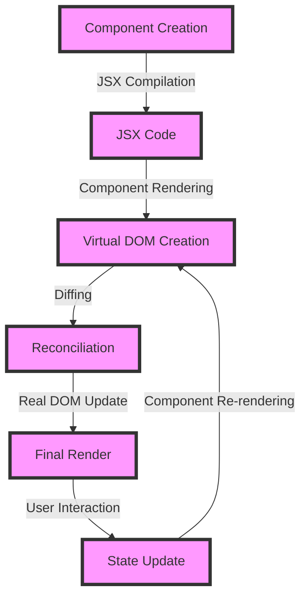

## Introduction
React components are the building blocks of React applications, allowing developers to break down complex user interfaces into smaller, reusable pieces. They are the foundation of the React library, and understanding how to use them effectively is crucial for building scalable and maintainable applications. In this section, we will explore the concept of React components, their importance, and real-world relevance. 
> **Tip:** When working with React components, it's essential to keep in mind that they should be designed to be reusable and modular, making it easier to maintain and update the application.

React components can be thought of as LEGO blocks, where each block represents a small piece of the application's UI. These blocks can be combined in various ways to create complex and dynamic user interfaces. The use of React components has become a standard practice in the industry, with companies like Facebook, Instagram, and Netflix relying heavily on them to build their applications.

## Core Concepts
To work with React components, it's essential to understand the core concepts that make them tick. Here are some key definitions and mental models to keep in mind:
- **Components:** A component is a small piece of code that represents a part of the user interface. It can contain other components, making it a hierarchical structure.
- **JSX:** JSX is a syntax extension for JavaScript that allows developers to write HTML-like code in their JavaScript files. It's used to define the structure of a component.
- **Props:** Props, short for properties, are how components communicate with each other. They are immutable values that are passed from a parent component to a child component.
- **State:** State refers to the data that a component uses to render itself. It's an object that stores the component's dynamic data.
> **Note:** When working with React components, it's essential to understand the difference between props and state. Props are immutable, while state is mutable.

## How It Works Internally
To understand how React components work internally, let's take a look at the step-by-step process:
1. **Component Creation:** A component is created by defining a JavaScript class that extends the `React.Component` class or a function that returns JSX.
2. **JSX Compilation:** The JSX code is compiled into JavaScript code by the Babel compiler or other transpilers.
3. **Component Rendering:** The component is rendered by calling the `render()` method, which returns the JSX code.
4. **Virtual DOM Creation:** React creates a virtual DOM, which is a lightweight representation of the real DOM.
5. **Diffing:** React compares the virtual DOM with the real DOM to determine what changes need to be made.
6. **Reconciliation:** React updates the real DOM by applying the changes determined during the diffing process.
> **Warning:** When working with React components, it's essential to avoid mutating the state directly, as this can cause unexpected behavior. Instead, use the `setState()` method to update the state.

## Code Examples
Here are three complete and runnable code examples that demonstrate the use of React components:
### Example 1: Basic Usage
```javascript
import React from 'react';
import ReactDOM from 'react-dom';

// Define a simple component
function Hello() {
  return <h1>Hello World!</h1>;
}

// Render the component
ReactDOM.render(<Hello />, document.getElementById('root'));
```
### Example 2: Real-World Pattern
```javascript
import React, { useState } from 'react';
import ReactDOM from 'react-dom';

// Define a component that uses state
function Counter() {
  const [count, setCount] = useState(0);

  return (
    <div>
      <p>Count: {count}</p>
      <button onClick={() => setCount(count + 1)}>Increment</button>
    </div>
  );
}

// Render the component
ReactDOM.render(<Counter />, document.getElementById('root'));
```
### Example 3: Advanced Usage
```javascript
import React, { useState, useEffect } from 'react';
import ReactDOM from 'react-dom';

// Define a component that uses state and effects
function Clock() {
  const [date, setDate] = useState(new Date());

  useEffect(() => {
    const timerId = setInterval(() => {
      setDate(new Date());
    }, 1000);

    return () => {
      clearInterval(timerId);
    };
  }, []);

  return (
    <div>
      <p>{date.toLocaleTimeString()}</p>
    </div>
  );
}

// Render the component
ReactDOM.render(<Clock />, document.getElementById('root'));
```
> **Interview:** When asked about React components in an interview, be prepared to explain the difference between functional and class components, as well as the role of props and state in component communication.

## Visual Diagram

This diagram illustrates the step-by-step process of how React components work internally, from creation to rendering and reconciliation.

## Comparison
Here is a comparison table that highlights the differences between various approaches to building React components:
| Approach | Time Complexity | Space Complexity | Pros | Cons | Best For |
| --- | --- | --- | --- | --- | --- |
| Functional Components | O(1) | O(1) | Easy to write and test, no this keyword | Limited to simple use cases | Small, reusable components |
| Class Components | O(n) | O(n) | Supports complex logic and lifecycle methods | More verbose, harder to test | Complex, stateful components |
| Higher-Order Components | O(1) | O(1) | Enables code reuse and abstraction | Can be confusing, harder to debug | Wrapping existing components with new functionality |
| Render Props | O(1) | O(1) | Simple and flexible, easy to use | Can be verbose, harder to read | Sharing functionality between components |

## Real-world Use Cases
Here are three real-world use cases that demonstrate the power of React components:
1. **Facebook's News Feed:** Facebook's news feed is built using React components, which allows for a highly customizable and dynamic user experience.
2. **Instagram's Photo Feed:** Instagram's photo feed is built using React components, which enables fast and seamless scrolling and loading of photos.
3. **Netflix's Video Player:** Netflix's video player is built using React components, which provides a highly customizable and responsive user interface for playing videos.

## Common Pitfalls
Here are four common pitfalls to watch out for when working with React components:
1. **Mutating State Directly:** Mutating state directly can cause unexpected behavior and bugs. Instead, use the `setState()` method to update the state.
2. **Not Using Keys:** Not using keys when rendering arrays of components can cause React to re-render the entire array, leading to performance issues.
3. **Not Handling Errors:** Not handling errors properly can cause the application to crash or behave unexpectedly.
4. **Not Optimizing Performance:** Not optimizing performance can lead to slow and sluggish applications.

## Interview Tips
Here are three common interview questions related to React components, along with tips on how to answer them:
1. **What is the difference between a functional component and a class component?**
	* Weak answer: "A functional component is a function that returns JSX, while a class component is a class that extends React.Component."
	* Strong answer: "A functional component is a function that returns JSX and has no state or lifecycle methods, while a class component is a class that extends React.Component and has state and lifecycle methods. Functional components are easier to write and test, while class components are more suitable for complex logic and state management."
2. **How do you optimize the performance of a React application?**
	* Weak answer: "I use the `shouldComponentUpdate()` method to prevent unnecessary re-renders."
	* Strong answer: "I use a combination of techniques, including using the `shouldComponentUpdate()` method, memoizing components, and optimizing the rendering of arrays and lists. I also use the React DevTools to identify performance bottlenecks and optimize the application accordingly."
3. **What is the purpose of the `key` prop in React?**
	* Weak answer: "The `key` prop is used to identify a component in a list."
	* Strong answer: "The `key` prop is used to help React identify which items have changed, are added, or are removed in a list. It's essential to use a unique and stable key for each item in a list to prevent React from re-rendering the entire list unnecessarily."

## Key Takeaways
Here are ten key takeaways to remember when working with React components:
* React components are the building blocks of React applications.
* Functional components are easier to write and test, while class components are more suitable for complex logic and state management.
* Props are immutable, while state is mutable.
* The `setState()` method is used to update the state of a component.
* The `shouldComponentUpdate()` method is used to prevent unnecessary re-renders.
* Memoizing components can improve performance.
* Optimizing the rendering of arrays and lists can improve performance.
* The `key` prop is essential for identifying items in a list.
* React components can be reused and composed to create complex user interfaces.
* Understanding the difference between props and state is crucial for building scalable and maintainable applications.