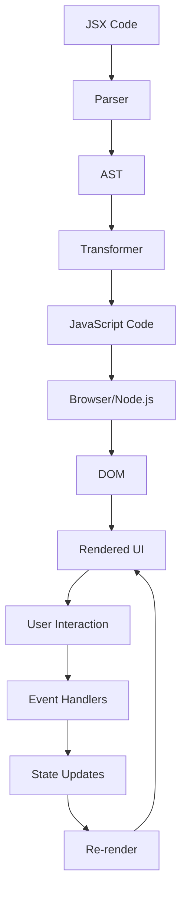

## Introduction
JSX (JavaScript + XML) is a syntax sugar for JavaScript that allows you to write HTML-like code in your JavaScript files. It is a key feature of the React library, which is used for building user interfaces. JSX makes it easier to write React components by providing a more declarative way of describing the structure of your UI. In this section, we'll explore why JSX matters, its real-world relevance, and why every engineer needs to know about it.

JSX is not a replacement for JavaScript, but rather a way to make your JavaScript code more readable and maintainable. It is especially useful when working with React, as it allows you to write components in a more declarative way. Declarative programming is a paradigm where you describe what you want to see in your UI, rather than how to achieve it. This makes your code easier to understand and maintain, as you don't have to worry about the underlying implementation details.

> **Note:** JSX is not a new language, but rather a syntax extension for JavaScript. It is compiled to JavaScript at build time, so you don't have to worry about browser support.

## Core Concepts
To understand JSX, you need to know about its core concepts. These include:

* **Elements**: JSX elements are the building blocks of your UI. They can be either self-closing (e.g., ``) or have a closing tag (e.g., `<div></div>`).
* **Components**: JSX components are reusable pieces of code that represent a part of your UI. They can be either functional (stateless) or class-based (stateful).
* **Props**: Props (short for properties) are a way to pass data from a parent component to a child component.
* **Children**: Children are the elements or components that are nested inside a parent component.

> **Tip:** When working with JSX, it's a good idea to use a linter to catch any syntax errors or best practice violations.

## How It Works Internally
When you write JSX code, it is compiled to JavaScript at build time. This compilation process involves several steps:

1. **Parsing**: The JSX code is parsed into an abstract syntax tree (AST).
2. **Transformation**: The AST is transformed into a JavaScript AST.
3. **Generation**: The JavaScript AST is used to generate the final JavaScript code.

The resulting JavaScript code is then executed by the browser or Node.js. This process is usually handled by a build tool like Webpack or Rollup.

> **Warning:** When using JSX, make sure to use a compatible version of React, as older versions may not support all JSX features.

## Code Examples
Here are three complete and runnable examples of JSX code:

### Example 1: Basic Usage
```javascript
// Import React and ReactDOM
import React from 'react';
import ReactDOM from 'react-dom';

// Define a simple component
const Hello = () => {
  return <h1>Hello, World!</h1>;
};

// Render the component to the DOM
ReactDOM.render(<Hello />, document.getElementById('root'));
```

### Example 2: Real-World Pattern
```javascript
// Import React and ReactDOM
import React, { useState } from 'react';
import ReactDOM from 'react-dom';

// Define a counter component
const Counter = () => {
  const [count, setCount] = useState(0);

  return (
    <div>
      <p>Count: {count}</p>
      <button onClick={() => setCount(count + 1)}>Increment</button>
    </div>
  );
};

// Render the component to the DOM
ReactDOM.render(<Counter />, document.getElementById('root'));
```

### Example 3: Advanced Usage
```javascript
// Import React and ReactDOM
import React, { useState, useEffect } from 'react';
import ReactDOM from 'react-dom';

// Define a component that fetches data from an API
const DataComponent = () => {
  const [data, setData] = useState([]);

  useEffect(() => {
    fetch('https://api.example.com/data')
      .then(response => response.json())
      .then(data => setData(data));
  }, []);

  return (
    <ul>
      {data.map(item => (
        <li key={item.id}>{item.name}</li>
      ))}
    </ul>
  );
};

// Render the component to the DOM
ReactDOM.render(<DataComponent />, document.getElementById('root'));
```

## Visual Diagram

This diagram illustrates the process of how JSX code is compiled and executed. It starts with the JSX code, which is parsed into an abstract syntax tree (AST). The AST is then transformed into JavaScript code, which is executed by the browser or Node.js. The resulting UI is then rendered to the DOM, and user interactions trigger event handlers, which update the state and cause the component to re-render.

> **Note:** This diagram is a simplified representation of the process and omits some details for clarity.

## Comparison
| Approach | Time Complexity | Space Complexity | Pros | Cons | Best For |
| --- | --- | --- | --- | --- | --- |
| JSX | O(n) | O(n) | Declarative, easy to read and maintain | Steeper learning curve, requires compilation | React applications, complex UI components |
| Vanilla JavaScript | O(n) | O(n) | Imperative, direct access to DOM | Verbose, harder to maintain | Simple UI components, legacy codebases |
| Template Literals | O(n) | O(n) | Declarative, easy to read | Limited functionality, not suitable for complex components | Simple UI components, prototyping |
| HTML Templates | O(n) | O(n) | Declarative, easy to read | Limited functionality, not suitable for complex components | Simple UI components, static websites |

## Real-world Use Cases
Here are three real-world examples of JSX in production:

1. **Facebook**: Facebook uses JSX extensively in its React-based frontend. The company has even developed its own flavor of JSX, called **JSX for React**, which provides additional features and optimizations.
2. **Instagram**: Instagram's web application is built using React and JSX. The company has developed a custom set of components and utilities to handle the unique requirements of its application.
3. **Dropbox**: Dropbox's web application is built using React and JSX. The company has developed a custom set of components and utilities to handle the unique requirements of its application, including file uploads and drag-and-drop functionality.

## Common Pitfalls
Here are four common mistakes to watch out for when working with JSX:

1. **Missing or mismatched closing tags**: JSX is sensitive to missing or mismatched closing tags. Make sure to always close your tags properly to avoid errors.
2. **Incorrect prop types**: JSX expects props to be of a specific type. Make sure to use the correct prop types to avoid errors.
3. **Unnecessary re-renders**: JSX can cause unnecessary re-renders if not used carefully. Make sure to use the `shouldComponentUpdate` method to optimize re-renders.
4. **Incorrect use of `this`**: JSX can be confusing when it comes to the `this` keyword. Make sure to use the correct context for `this` to avoid errors.

> **Warning:** When using JSX, make sure to use a compatible version of React, as older versions may not support all JSX features.

## Interview Tips
Here are three common interview questions related to JSX, along with sample answers:

1. **What is JSX, and how does it work?**
	* Weak answer: "JSX is a templating engine that allows you to write HTML-like code in your JavaScript files."
	* Strong answer: "JSX is a syntax sugar for JavaScript that allows you to write HTML-like code in your JavaScript files. It is compiled to JavaScript at build time, and it provides a declarative way of describing the structure of your UI. It is especially useful when working with React, as it allows you to write components in a more declarative way."
2. **How do you optimize re-renders in JSX?**
	* Weak answer: "I use the `shouldComponentUpdate` method to optimize re-renders."
	* Strong answer: "I use the `shouldComponentUpdate` method to optimize re-renders by checking if the props or state have changed. I also use the `React.memo` function to memoize components and prevent unnecessary re-renders. Additionally, I use the `useCallback` and `useMemo` hooks to memoize functions and values, respectively."
3. **What are some common pitfalls to watch out for when working with JSX?**
	* Weak answer: "I try to avoid missing or mismatched closing tags."
	* Strong answer: "I watch out for missing or mismatched closing tags, incorrect prop types, unnecessary re-renders, and incorrect use of `this`. I also make sure to use a compatible version of React, as older versions may not support all JSX features. Additionally, I use a linter to catch any syntax errors or best practice violations."

> **Interview:** When interviewing for a React position, be prepared to answer questions about JSX, including its syntax, use cases, and common pitfalls.

## Key Takeaways
Here are ten key takeaways to remember when working with JSX:

* JSX is a syntax sugar for JavaScript that allows you to write HTML-like code in your JavaScript files.
* JSX is compiled to JavaScript at build time, so you don't have to worry about browser support.
* JSX provides a declarative way of describing the structure of your UI, making it easier to read and maintain.
* JSX is especially useful when working with React, as it allows you to write components in a more declarative way.
* Use the `shouldComponentUpdate` method to optimize re-renders.
* Use the `React.memo` function to memoize components and prevent unnecessary re-renders.
* Use the `useCallback` and `useMemo` hooks to memoize functions and values, respectively.
* Watch out for missing or mismatched closing tags, incorrect prop types, unnecessary re-renders, and incorrect use of `this`.
* Use a compatible version of React, as older versions may not support all JSX features.
* Use a linter to catch any syntax errors or best practice violations.

> **Tip:** When working with JSX, make sure to use a compatible version of React, as older versions may not support all JSX features.