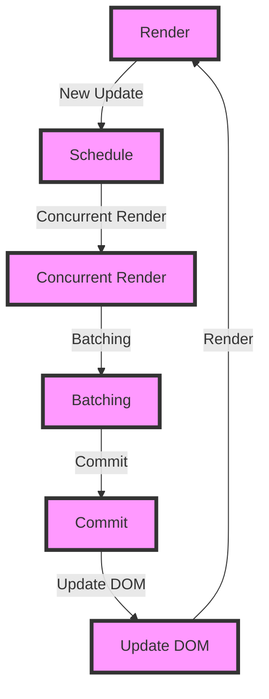

## Introduction
React 18 is a major release of the popular front-end library, introducing several groundbreaking features that enhance performance, simplify state management, and improve the overall user experience. At its core, React 18 focuses on **Concurrent Mode**, which allows for the simultaneous rendering of multiple versions of a component tree, enabling features like **Automatic Batching** and **Transitions**. Additionally, **Suspense** has been revamped to provide a more intuitive way of handling loading states. In this article, we will delve into the world of React 18, exploring its features, benefits, and best practices.

> **Note:** React 18 is designed to be backwards compatible with existing React applications, making it easy to upgrade and take advantage of the new features.

## Core Concepts
To understand React 18, it's essential to grasp the following core concepts:
* **Concurrent Mode**: A rendering mode that allows React to work on multiple versions of a component tree simultaneously.
* **Automatic Batching**: A feature that automatically batches multiple state updates together, reducing the number of re-renders and improving performance.
* **Transitions**: A way to handle state changes that require a specific sequence of updates, such as loading data or handling user input.
* **Suspense**: A mechanism for handling loading states in a more intuitive and declarative way.

> **Warning:** When using Concurrent Mode, it's crucial to ensure that your components are properly optimized for concurrent rendering, as this can impact performance.

## How It Works Internally
To understand how React 18 works internally, let's break down the rendering process:
1. **Render**: React receives a new update, such as a state change or a props update.
2. **Schedule**: React schedules the update to be processed by the renderer.
3. **Concurrent Render**: React renders the updated component tree in a concurrent manner, using a separate thread or process.
4. **Batching**: React automatically batches multiple state updates together, reducing the number of re-renders.
5. **Commit**: React commits the updated component tree to the DOM.

> **Tip:** To optimize performance, use the `useTransition` hook to handle state changes that require a specific sequence of updates.

## Code Examples
### Example 1: Basic Usage of Concurrent Mode
```javascript
import { useState, useEffect } from 'react';

function Counter() {
  const [count, setCount] = useState(0);

  useEffect(() => {
    const id = setInterval(() => {
      setCount(count + 1);
    }, 1000);
    return () => clearInterval(id);
  }, [count]);

  return (
    <div>
      <p>Count: {count}</p>
      <button onClick={() => setCount(count + 1)}>Increment</button>
    </div>
  );
}
```
### Example 2: Using Automatic Batching
```javascript
import { useState } from 'react';

function Counter() {
  const [count, setCount] = useState(0);

  const handleIncrement = () => {
    setCount(count + 1);
    setCount(count + 2); // This will be batched with the previous update
  };

  return (
    <div>
      <p>Count: {count}</p>
      <button onClick={handleIncrement}>Increment</button>
    </div>
  );
}
```
### Example 3: Handling Transitions with useTransition
```javascript
import { useState, useTransition } from 'react';

function Counter() {
  const [count, setCount] = useState(0);
  const [isPending, startTransition] = useTransition();

  const handleIncrement = () => {
    startTransition(() => {
      setCount(count + 1);
    });
  };

  return (
    <div>
      <p>Count: {count}</p>
      <button onClick={handleIncrement}>Increment</button>
      {isPending && <p>Pending...</p>}
    </div>
  );
}
```
## Visual Diagram

The diagram illustrates the rendering process in React 18, showcasing the concurrent rendering, batching, and commit phases.

## Comparison
| Feature | React 17 | React 18 | Description |
| --- | --- | --- | --- |
| Concurrent Mode | No | Yes | Allows for simultaneous rendering of multiple component trees |
| Automatic Batching | No | Yes | Automatically batches multiple state updates together |
| Transitions | No | Yes | Handles state changes that require a specific sequence of updates |
| Suspense | Limited | Improved | Provides a more intuitive way of handling loading states |
| Performance | Good | Excellent | React 18 introduces several performance optimizations |

## Real-world Use Cases
* **Facebook**: Uses React 18 to power its web applications, taking advantage of Concurrent Mode and Automatic Batching to improve performance.
* **Instagram**: Utilizes React 18 to handle complex state changes and transitions, ensuring a seamless user experience.
* **Dropbox**: Employs React 18 to build high-performance web applications, leveraging the power of Concurrent Mode and Suspense.

## Common Pitfalls
* **Not optimizing components for concurrent rendering**: Failing to optimize components can lead to performance issues.
* **Not using useTransition for state changes**: Not using `useTransition` can result in unnecessary re-renders.
* **Not handling loading states properly**: Not handling loading states correctly can lead to a poor user experience.
* **Not using Suspense for loading states**: Not using Suspense can result in a less intuitive way of handling loading states.

## Interview Tips
* **What is Concurrent Mode in React 18?**: A rendering mode that allows React to work on multiple versions of a component tree simultaneously.
* **How does Automatic Batching work in React 18?**: Automatically batches multiple state updates together, reducing the number of re-renders.
* **What is the purpose of useTransition in React 18?**: Handles state changes that require a specific sequence of updates.

> **Interview:** When answering questions about React 18, be sure to emphasize the benefits of Concurrent Mode, Automatic Batching, and Suspense, and provide examples of how they can be used in real-world applications.

## Key Takeaways
* **Concurrent Mode**: Allows for simultaneous rendering of multiple component trees.
* **Automatic Batching**: Automatically batches multiple state updates together.
* **Transitions**: Handles state changes that require a specific sequence of updates.
* **Suspense**: Provides a more intuitive way of handling loading states.
* **Performance**: React 18 introduces several performance optimizations.
* **Optimizing components for concurrent rendering**: Crucial for ensuring good performance.
* **Using useTransition for state changes**: Recommended for handling state changes that require a specific sequence of updates.
* **Handling loading states properly**: Essential for providing a good user experience.