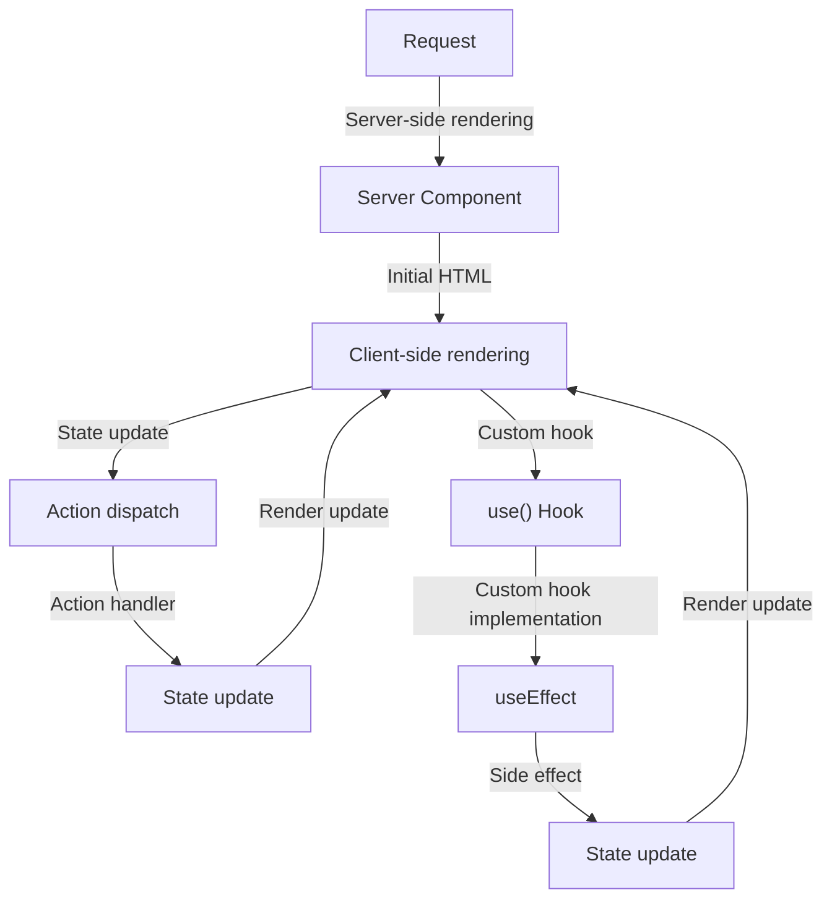

## Introduction
**React 19** is a significant update to the popular JavaScript library for building user interfaces. It introduces several new features, including **Server Components**, **Actions**, and the `use()` hook. These features aim to improve the performance, scalability, and maintainability of React applications. In this article, we will delve into the details of these features, exploring their benefits, usage, and best practices. As a senior software engineer, understanding these concepts is crucial for building efficient and scalable React applications.

> **Note:** React 19 is a major update, and its features are still evolving. This article provides an overview of the current state of these features and their potential impact on React development.

## Core Concepts
To understand the new features in React 19, it's essential to grasp the core concepts:

* **Server Components**: These are React components that run on the server-side, allowing for better performance and SEO. Server components can be used to pre-render pages, reducing the amount of work the client-side needs to do.
* **Actions**: Actions are a new way to handle side effects in React components. They provide a more explicit and predictable way to manage state changes and asynchronous operations.
* **use() Hook**: The `use()` hook is a new way to use React hooks in a more explicit and type-safe manner. It allows developers to define custom hooks and reuse them across the application.

> **Tip:** When working with Server Components, it's essential to consider the trade-offs between server-side rendering and client-side rendering. Server-side rendering can improve performance, but it may also increase the load on the server.

## How It Works Internally
To understand how these features work internally, let's take a closer look at the under-the-hood mechanics:

1. **Server Components**: When a request is made to a React application, the server-side rendering process kicks in. The server generates the initial HTML for the page, which is then sent to the client. The client can then take over and render the page, using the server-generated HTML as a starting point.
2. **Actions**: Actions are handled by the React runtime, which provides a way to dispatch and handle actions. When an action is dispatched, the React runtime will execute the corresponding handler function, which can update the state of the component.
3. **use() Hook**: The `use()` hook is implemented as a wrapper around the existing React hooks. It provides a more explicit and type-safe way to define custom hooks, which can be reused across the application.

> **Warning:** When using Server Components, it's essential to consider the potential security implications. Server-side rendering can expose sensitive data, so it's crucial to implement proper security measures.

## Code Examples
Here are three complete and runnable code examples that demonstrate the usage of Server Components, Actions, and the `use()` hook:

### Example 1: Basic Server Component
```javascript
import React from 'react';

// Define a simple server component
const HelloServerComponent = () => {
  return <h1>Hello from the server!</h1>;
};

// Render the server component
export default HelloServerComponent;
```
This example demonstrates a basic server component that renders a simple HTML heading.

### Example 2: Using Actions
```javascript
import React, { useState, useReducer } from 'react';

// Define an action type
const ACTION_TYPE = 'UPDATE_COUNT';

// Define an action creator
const updateCount = (count) => {
  return { type: ACTION_TYPE, payload: count };
};

// Define a reducer function
const countReducer = (state, action) => {
  switch (action.type) {
    case ACTION_TYPE:
      return action.payload;
    default:
      return state;
  }
};

// Define a component that uses the action creator and reducer
const CounterComponent = () => {
  const [count, dispatch] = useReducer(countReducer, 0);

  const handleIncrement = () => {
    dispatch(updateCount(count + 1));
  };

  return (
    <div>
      <p>Count: {count}</p>
      <button onClick={handleIncrement}>Increment</button>
    </div>
  );
};

export default CounterComponent;
```
This example demonstrates how to use actions and reducers to manage state changes in a React component.

### Example 3: Using the use() Hook
```javascript
import React, { useState, useEffect } from 'react';

// Define a custom hook using the use() hook
const useFetchData = (url) => {
  const [data, setData] = useState(null);
  const [error, setError] = useState(null);

  useEffect(() => {
    fetch(url)
      .then((response) => response.json())
      .then((data) => setData(data))
      .catch((error) => setError(error));
  }, [url]);

  return { data, error };
};

// Define a component that uses the custom hook
const FetchDataComponent = () => {
  const { data, error } = useFetchData('https://api.example.com/data');

  if (error) {
    return <p>Error: {error.message}</p>;
  }

  if (!data) {
    return <p>Loading...</p>;
  }

  return <p>Data: {data}</p>;
};

export default FetchDataComponent;
```
This example demonstrates how to define a custom hook using the `use()` hook and use it in a React component.

## Visual Diagram

This diagram illustrates the flow of server-side rendering, client-side rendering, action dispatch, and custom hook usage.

## Comparison
| Approach | Time Complexity | Space Complexity | Pros | Cons | Best For |
| --- | --- | --- | --- | --- | --- |
| Server Components | O(1) | O(1) | Improves performance, SEO | Increases server load | Public-facing applications |
| Actions | O(n) | O(n) | Explicit, predictable state management | Steeper learning curve | Complex, data-driven applications |
| use() Hook | O(1) | O(1) | Explicit, type-safe custom hooks | Limited reuse | Small to medium-sized applications |

> **Interview:** Can you explain the trade-offs between server-side rendering and client-side rendering? How would you decide which approach to use for a given application?

## Real-world Use Cases
Here are three real-world use cases for Server Components, Actions, and the `use()` hook:

1. **Netflix**: Netflix uses server-side rendering to improve the performance and SEO of their application. They also use actions and reducers to manage state changes and side effects.
2. **Dropbox**: Dropbox uses the `use()` hook to define custom hooks for handling file uploads and downloads. They also use actions and reducers to manage state changes and side effects.
3. **Airbnb**: Airbnb uses server-side rendering to improve the performance and SEO of their application. They also use actions and reducers to manage state changes and side effects, and define custom hooks using the `use()` hook.

## Common Pitfalls
Here are four common pitfalls to watch out for when using Server Components, Actions, and the `use()` hook:

1. **Overusing server-side rendering**: Server-side rendering can increase the load on the server, so it's essential to use it judiciously.
2. **Not handling errors properly**: Actions and reducers can throw errors if not handled properly, so it's essential to implement proper error handling.
3. **Not using type-safe custom hooks**: The `use()` hook provides a way to define type-safe custom hooks, but it's essential to use it correctly to avoid type errors.
4. **Not testing custom hooks thoroughly**: Custom hooks can be complex and difficult to test, so it's essential to write comprehensive tests to ensure they work correctly.

> **Warning:** When using Server Components, it's essential to consider the potential security implications. Server-side rendering can expose sensitive data, so it's crucial to implement proper security measures.

## Interview Tips
Here are three common interview questions related to Server Components, Actions, and the `use()` hook, along with weak and strong answers:

1. **What are the benefits of using Server Components?**
	* Weak answer: "Server Components improve performance and SEO."
	* Strong answer: "Server Components improve performance and SEO by reducing the amount of work the client-side needs to do. However, they also increase the load on the server, so it's essential to use them judiciously."
2. **How do you handle errors in actions and reducers?**
	* Weak answer: "I use try-catch blocks to handle errors."
	* Strong answer: "I use a combination of try-catch blocks and error handling mechanisms provided by the action and reducer libraries. I also make sure to test my error handling code thoroughly to ensure it works correctly."
3. **How do you define custom hooks using the use() hook?**
	* Weak answer: "I use the use() hook to define custom hooks, but I'm not sure how it works internally."
	* Strong answer: "I use the use() hook to define custom hooks, and I understand how it works internally. I make sure to use type-safe custom hooks and test them thoroughly to ensure they work correctly."

## Key Takeaways
Here are ten key takeaways to remember when working with Server Components, Actions, and the `use()` hook:

* **Server Components improve performance and SEO**, but increase the load on the server.
* **Actions and reducers provide explicit, predictable state management**, but require proper error handling.
* **The use() hook provides a way to define type-safe custom hooks**, but requires careful implementation and testing.
* **Server-side rendering can expose sensitive data**, so it's essential to implement proper security measures.
* **Custom hooks can be complex and difficult to test**, so it's essential to write comprehensive tests.
* **Actions and reducers can throw errors if not handled properly**, so it's essential to implement proper error handling.
* **Type-safe custom hooks can prevent type errors**, but require careful implementation and testing.
* **Server Components can improve the user experience**, but require careful consideration of the trade-offs.
* **Actions and reducers can improve the maintainability of the codebase**, but require careful implementation and testing.
* **The use() hook can improve the reusability of custom hooks**, but requires careful implementation and testing.