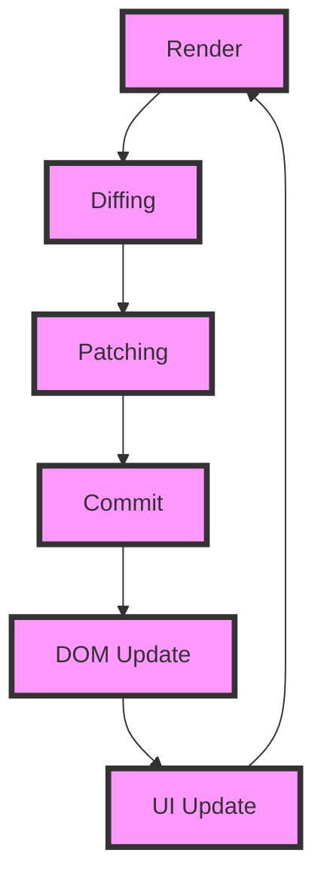

## Introduction
Reconciliation is the process of updating the **DOM** (Document Object Model) to reflect changes in the application's state. It is a critical component of the **React** library, allowing for efficient and optimized rendering of components. The diffing algorithm is at the heart of reconciliation, responsible for determining the minimum number of changes required to update the DOM. In this section, we will explore the importance of reconciliation and the diffing algorithm in React, as well as their real-world relevance.

Reconciliation is essential in React because it enables the library to optimize the rendering process. By minimizing the number of DOM mutations, React can improve performance and reduce the risk of errors. The diffing algorithm is a key part of this process, as it allows React to determine the most efficient way to update the DOM.

> **Note:** Reconciliation is not unique to React; other libraries and frameworks also use similar techniques to optimize rendering. However, React's implementation is particularly efficient and well-suited for complex, data-driven applications.

## Core Concepts
To understand reconciliation and the diffing algorithm, it's essential to grasp some key concepts:

* **Virtual DOM**: A lightweight, in-memory representation of the DOM. React uses the virtual DOM to determine the minimum number of changes required to update the actual DOM.
* **Diffing**: The process of comparing two versions of the virtual DOM to determine the differences between them.
* **Patches**: The minimum number of changes required to update the DOM, as determined by the diffing algorithm.
* **Reconciliation**: The process of applying the patches to the DOM to update the application's UI.

> **Warning:** A common misconception is that the virtual DOM is a complete replica of the actual DOM. This is not the case; the virtual DOM is a simplified representation of the DOM, optimized for performance.

## How It Works Internally
The reconciliation process in React involves the following steps:

1. **Render**: The component tree is rendered, generating a new virtual DOM representation.
2. **Diffing**: The new virtual DOM is compared to the previous virtual DOM to determine the differences between them.
3. **Patching**: The diffing algorithm generates a set of patches that describe the minimum number of changes required to update the DOM.
4. **Commit**: The patches are applied to the DOM, updating the application's UI.

The diffing algorithm used by React is based on a combination of techniques, including:

* **Tree diffing**: Comparing the structure of the two virtual DOM trees to determine the differences between them.
* **Component diffing**: Comparing the properties and state of individual components to determine if they need to be updated.

> **Tip:** To optimize the performance of your React application, it's essential to minimize the number of DOM mutations. This can be achieved by using techniques such as **memoization** and **shouldComponentUpdate**.

## Code Examples
Here are three complete, runnable examples that demonstrate the use of reconciliation and the diffing algorithm in React:

### Example 1: Basic Reconciliation
```javascript
import React from 'react';
import ReactDOM from 'react-dom';

class Counter extends React.Component {
  constructor(props) {
    super(props);
    this.state = { count: 0 };
  }

  handleClick = () => {
    this.setState({ count: this.state.count + 1 });
  };

  render() {
    return (
      <div>
        <p>Count: {this.state.count}</p>
        <button onClick={this.handleClick}>Increment</button>
      </div>
    );
  }
}

ReactDOM.render(<Counter />, document.getElementById('root'));
```
This example demonstrates a simple counter component that updates the DOM when the user clicks the increment button.

### Example 2: Optimizing Reconciliation with shouldComponentUpdate
```javascript
import React from 'react';
import ReactDOM from 'react-dom';

class Counter extends React.Component {
  constructor(props) {
    super(props);
    this.state = { count: 0 };
  }

  handleClick = () => {
    this.setState({ count: this.state.count + 1 });
  };

  shouldComponentUpdate(nextProps, nextState) {
    return nextState.count !== this.state.count;
  }

  render() {
    return (
      <div>
        <p>Count: {this.state.count}</p>
        <button onClick={this.handleClick}>Increment</button>
      </div>
    );
  }
}

ReactDOM.render(<Counter />, document.getElementById('root'));
```
This example demonstrates how to use the **shouldComponentUpdate** method to optimize reconciliation by only updating the DOM when the component's state changes.

### Example 3: Using React Hooks for Reconciliation
```javascript
import React, { useState } from 'react';
import ReactDOM from 'react-dom';

const Counter = () => {
  const [count, setCount] = useState(0);

  const handleClick = () => {
    setCount(count + 1);
  };

  return (
    <div>
      <p>Count: {count}</p>
      <button onClick={handleClick}>Increment</button>
    </div>
  );
};

ReactDOM.render(<Counter />, document.getElementById('root'));
```
This example demonstrates how to use React Hooks to manage state and reconcile the DOM.

## Visual Diagram

This diagram illustrates the reconciliation process in React, including rendering, diffing, patching, committing, and updating the DOM and UI.

> **Interview:** Can you explain the difference between the virtual DOM and the actual DOM? How does React use the virtual DOM to optimize rendering?

## Comparison
| Approach | Time Complexity | Space Complexity | Pros | Cons | Best For |
| --- | --- | --- | --- | --- | --- |
| Tree Diffing | O(n) | O(n) | Efficient, easy to implement | May not handle all edge cases | Small to medium-sized applications |
| Component Diffing | O(n) | O(n) | More accurate than tree diffing, handles edge cases | More complex to implement | Large, complex applications |
| Virtual DOM | O(n) | O(n) | Efficient, easy to implement, handles edge cases | May not be suitable for all use cases | Most React applications |
| Manual DOM Updates | O(1) | O(1) | Fast, easy to implement | Error-prone, may not be efficient | Small, simple applications |

> **Warning:** While manual DOM updates may seem like a simple and efficient solution, they can be error-prone and may not be suitable for complex applications.

## Real-world Use Cases
1. **Facebook**: Facebook uses React to power its news feed, which requires efficient and optimized rendering to handle a large number of updates.
2. **Instagram**: Instagram uses React to power its web application, which requires fast and efficient rendering to handle a large number of users.
3. **WhatsApp**: WhatsApp uses React to power its web application, which requires efficient and optimized rendering to handle a large number of messages and updates.

## Common Pitfalls
1. **Not using shouldComponentUpdate**: Failing to use **shouldComponentUpdate** can lead to unnecessary DOM updates and decreased performance.
2. **Not using memoization**: Failing to use memoization can lead to unnecessary computations and decreased performance.
3. **Not handling edge cases**: Failing to handle edge cases can lead to errors and decreased performance.
4. **Not using React Hooks**: Failing to use React Hooks can lead to more complex and error-prone code.

> **Tip:** To avoid common pitfalls, make sure to use **shouldComponentUpdate**, memoization, and React Hooks, and handle edge cases carefully.

## Interview Tips
1. **What is the difference between the virtual DOM and the actual DOM?**: The virtual DOM is a lightweight, in-memory representation of the DOM, while the actual DOM is the real DOM.
2. **How does React use the virtual DOM to optimize rendering?**: React uses the virtual DOM to determine the minimum number of changes required to update the DOM, and then applies those changes to the actual DOM.
3. **What is the purpose of shouldComponentUpdate?**: The purpose of **shouldComponentUpdate** is to determine whether a component should be updated or not, and to optimize rendering by only updating the DOM when necessary.

> **Interview:** Can you explain the concept of reconciliation in React, and how it is used to optimize rendering?

## Key Takeaways
* Reconciliation is the process of updating the DOM to reflect changes in the application's state.
* The diffing algorithm is used to determine the minimum number of changes required to update the DOM.
* The virtual DOM is a lightweight, in-memory representation of the DOM.
* **shouldComponentUpdate** is used to optimize rendering by only updating the DOM when necessary.
* Memoization is used to optimize computations by storing the results of expensive function calls.
* React Hooks are used to manage state and reconcile the DOM.
* Time complexity: O(n) for tree diffing and component diffing, O(1) for manual DOM updates.
* Space complexity: O(n) for tree diffing and component diffing, O(1) for manual DOM updates.