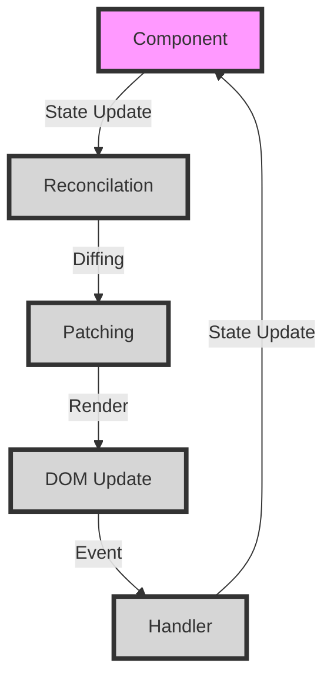

## Introduction
**State** refers to the data that changes over time in a software application. It is a crucial concept in software development, particularly in the context of **React**, where state management is a key aspect of building dynamic and interactive user interfaces. In this overview, we will delve into the world of state, exploring its definition, core concepts, and internal mechanics. We will also examine code examples, visual diagrams, and comparison tables to gain a deeper understanding of state and its role in software development.

State is essential in software development because it allows applications to respond to user input, update the user interface, and maintain a consistent and predictable behavior. Without state, applications would be static and unresponsive, making them unusable for most practical purposes. In real-world scenarios, state is used in various forms, such as user authentication, shopping cart management, and real-time data updates.

> **Note:** State is not unique to React, but it is a fundamental concept in software development that applies to various programming languages and frameworks.

## Core Concepts
To understand state, it is essential to grasp some core concepts:

* **State**: The data that changes over time in an application.
* **Props**: Short for "properties," props are immutable values passed from a parent component to a child component.
* **Immutability**: The idea that state should not be modified directly, but rather updated by creating a new copy of the state.
* **Reactivity**: The ability of an application to respond to changes in state.

Mental models that can help illustrate these concepts include:

* A bank account, where the balance (state) changes over time, and transactions (props) are used to update the balance.
* A spreadsheet, where cells (state) are updated based on formulas (props) and changes to other cells.

Key terminology includes:

* **Stateful**: A component that has its own state.
* **Stateless**: A component that does not have its own state.
* **Higher-Order Component (HOC)**: A component that wraps another component to provide additional functionality, such as state management.

## How It Works Internally
When a component's state changes, React triggers a re-render of the component tree. This process involves the following steps:

1. **State Update**: The component's state is updated by creating a new copy of the state.
2. **Reconcilation**: React compares the new state with the previous state to determine what changes need to be made to the component tree.
3. **Diffing**: React uses a diffing algorithm to identify the minimum number of changes required to update the component tree.
4. **Patch**: React applies the changes to the component tree by patching the DOM.

> **Warning:** Directly modifying state can lead to unpredictable behavior and bugs. Always use the `setState` method or a state management library to update state.

## Code Examples
### Example 1: Basic State Usage
```javascript
import React, { useState } from 'react';

function Counter() {
  const [count, setCount] = useState(0);

  return (
    <div>
      <p>Count: {count}</p>
      <button onClick={() => setCount(count + 1)}>Increment</button>
    </div>
  );
}
```
This example demonstrates the basic usage of state in a React component. The `useState` hook is used to create a state variable `count` and an `setCount` function to update the state.

### Example 2: Real-World Pattern
```javascript
import React, { useState, useEffect } from 'react';

function TodoList() {
  const [todos, setTodos] = useState([]);
  const [newTodo, setNewTodo] = useState('');

  useEffect(() => {
    fetchTodos();
  }, []);

  const fetchTodos = async () => {
    const response = await fetch('https://example.com/todos');
    const data = await response.json();
    setTodos(data);
  };

  const handleAddTodo = () => {
    setTodos([...todos, { text: newTodo, completed: false }]);
    setNewTodo('');
  };

  return (
    <div>
      <input
        type="text"
        value={newTodo}
        onChange={(e) => setNewTodo(e.target.value)}
        placeholder="New Todo"
      />
      <button onClick={handleAddTodo}>Add Todo</button>
      <ul>
        {todos.map((todo, index) => (
          <li key={index}>{todo.text}</li>
        ))}
      </ul>
    </div>
  );
}
```
This example demonstrates a real-world pattern of using state to manage a todo list. The `useState` hook is used to create state variables for the todo list and the new todo input.

### Example 3: Advanced State Management
```javascript
import React, { useReducer } from 'react';

const initialState = {
  count: 0,
  history: [],
};

const reducer = (state, action) => {
  switch (action.type) {
    case 'INCREMENT':
      return { count: state.count + 1, history: [...state.history, state.count] };
    case 'DECREMENT':
      return { count: state.count - 1, history: [...state.history, state.count] };
    default:
      return state;
  }
};

function Counter() {
  const [state, dispatch] = useReducer(reducer, initialState);

  return (
    <div>
      <p>Count: {state.count}</p>
      <button onClick={() => dispatch({ type: 'INCREMENT' })}>Increment</button>
      <button onClick={() => dispatch({ type: 'DECREMENT' })}>Decrement</button>
      <ul>
        {state.history.map((count, index) => (
          <li key={index}>{count}</li>
        ))}
      </ul>
    </div>
  );
}
```
This example demonstrates advanced state management using the `useReducer` hook. The `reducer` function is used to manage the state and dispatch actions to update the state.

## Visual Diagram

This diagram illustrates the process of state update, reconcilation, diffing, patching, and rendering in a React component.

> **Tip:** Use the `useReducer` hook to manage complex state logic and avoid using `useState` for large state objects.

## Comparison
| Approach | Time Complexity | Space Complexity | Pros | Cons | Best For |
| --- | --- | --- | --- | --- | --- |
| `useState` | O(1) | O(1) | Simple and easy to use | Limited to small state objects | Small state objects |
| `useReducer` | O(n) | O(n) | Flexible and scalable | More complex to use | Large state objects |
| Redux | O(n) | O(n) | Predictable and debuggable | Steeper learning curve | Large-scale applications |
| MobX | O(n) | O(n) | Reactive and efficient | Complex to use | Real-time data updates |

## Real-world Use Cases
1. **Facebook**: Facebook uses a combination of React and Redux to manage state in their applications.
2. **Instagram**: Instagram uses a combination of React and MobX to manage state in their applications.
3. **Airbnb**: Airbnb uses a combination of React and Redux to manage state in their applications.

> **Interview:** What is the difference between `useState` and `useReducer`? Answer: `useState` is a simple hook for managing small state objects, while `useReducer` is a more flexible and scalable hook for managing large state objects.

## Common Pitfalls
1. **Directly modifying state**: Directly modifying state can lead to unpredictable behavior and bugs.
```javascript
// Wrong
this.state.count = 1;

// Right
this.setState({ count: 1 });
```
2. **Not using `setState`**: Not using `setState` can lead to unpredictable behavior and bugs.
```javascript
// Wrong
this.state.count = 1;

// Right
this.setState({ count: 1 });
```
3. **Not using `useReducer`**: Not using `useReducer` can lead to complex and unmanageable state logic.
```javascript
// Wrong
const [count, setCount] = useState(0);
const [history, setHistory] = useState([]);

// Right
const [state, dispatch] = useReducer(reducer, initialState);
```
4. **Not handling errors**: Not handling errors can lead to unpredictable behavior and bugs.
```javascript
// Wrong
try {
  // code
} catch (error) {
  // ignore error
}

// Right
try {
  // code
} catch (error) {
  console.error(error);
}
```

## Interview Tips
1. **What is state in React?**: State is the data that changes over time in a React component.
2. **What is the difference between `useState` and `useReducer`?**: `useState` is a simple hook for managing small state objects, while `useReducer` is a more flexible and scalable hook for managing large state objects.
3. **How do you manage state in a React application?**: You can manage state in a React application using `useState`, `useReducer`, Redux, or MobX.

> **Warning:** Not handling errors can lead to unpredictable behavior and bugs.

## Key Takeaways
* State is the data that changes over time in a React component.
* `useState` is a simple hook for managing small state objects.
* `useReducer` is a more flexible and scalable hook for managing large state objects.
* Redux and MobX are state management libraries that can be used with React.
* Directly modifying state can lead to unpredictable behavior and bugs.
* Not using `setState` can lead to unpredictable behavior and bugs.
* Not handling errors can lead to unpredictable behavior and bugs.
* State management is a critical aspect of building scalable and maintainable React applications.
* Understanding the trade-offs between different state management approaches is essential for building efficient and effective React applications.