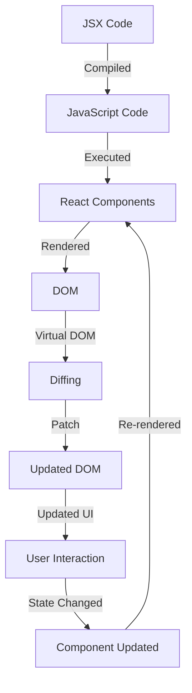

## Introduction
React is a **JavaScript library** for building user interfaces, particularly for single-page applications. It was developed by **Facebook** (now **Meta**) and is widely used in the industry for its simplicity, flexibility, and performance. React allows developers to create reusable UI components, making it easier to maintain and update large applications. With its **virtual DOM**, React reduces the number of DOM mutations, resulting in faster rendering and a better user experience.

> **Note:** React is not a framework, but a library, which means it's more lightweight and flexible than a full-fledged framework like Angular or Vue.js.

React's popularity can be attributed to its **component-based architecture**, which makes it easy to break down complex UIs into smaller, reusable components. This approach also enables developers to work on separate components independently, reducing the complexity of large-scale applications.

## Core Concepts
To understand React, you need to grasp the following core concepts:

* **Components**: The building blocks of React applications, which can be either **functional** or **class-based**.
* **JSX**: A syntax extension for JavaScript that allows you to write HTML-like code in your JavaScript files.
* **State**: The data that changes over time in your application, which can be either **local** or **global**.
* **Props**: Short for "properties," which are read-only values passed from a parent component to a child component.
* **Lifecycle methods**: A set of methods that are called at different stages of a component's life cycle, such as **render**, **componentDidMount**, and **componentWillUnmount**.

> **Warning:** One common mistake is to mutate the state directly, which can lead to unexpected behavior and bugs. Always use the **setState** method to update the state.

## How It Works Internally
When you create a React application, the following steps occur:

1. **Compilation**: The JSX code is compiled into JavaScript code using a compiler like **Babel**.
2. **Rendering**: The compiled JavaScript code is executed, and the React components are rendered to the DOM.
3. **Virtual DOM**: React creates a virtual representation of the DOM, which is a lightweight in-memory representation of the real DOM.
4. **Diffing**: When the state or props of a component change, React calculates the difference between the previous virtual DOM and the new one.
5. **Patch**: The differences are applied to the real DOM, which results in the updated UI.

> **Tip:** To improve performance, React uses a **shouldComponentUpdate** method to determine whether a component should be re-rendered or not.

## Code Examples
### Example 1: Basic Usage
```javascript
import React from 'react';
import ReactDOM from 'react-dom';

// Create a simple component
function Hello() {
  return <h1>Hello, World!</h1>;
}

// Render the component to the DOM
ReactDOM.render(<Hello />, document.getElementById('root'));
```
This example demonstrates the basic usage of React, where we create a simple component and render it to the DOM.

### Example 2: Real-world Pattern
```javascript
import React, { useState, useEffect } from 'react';

// Create a component that fetches data from an API
function FetchData() {
  const [data, setData] = useState([]);
  const [loading, setLoading] = useState(true);

  useEffect(() => {
    fetch('https://api.example.com/data')
      .then(response => response.json())
      .then(data => {
        setData(data);
        setLoading(false);
      });
  }, []);

  if (loading) {
    return <p>Loading...</p>;
  }

  return (
    <ul>
      {data.map(item => (
        <li key={item.id}>{item.name}</li>
      ))}
    </ul>
  );
}
```
This example demonstrates a real-world pattern, where we create a component that fetches data from an API and displays it in a list.

### Example 3: Advanced Usage
```javascript
import React, { useState, useEffect, useContext } from 'react';

// Create a context to share data between components
const DataContext = React.createContext();

// Create a component that uses the context
function ComponentA() {
  const data = useContext(DataContext);

  return (
    <div>
      <h1>Component A</h1>
      <p>Data: {data}</p>
    </div>
  );
}

// Create a component that provides the context
function App() {
  const [data, setData] = useState('Hello, World!');

  return (
    <DataContext.Provider value={data}>
      <ComponentA />
    </DataContext.Provider>
  );
}
```
This example demonstrates an advanced usage of React, where we create a context to share data between components.

## Visual Diagram

This diagram illustrates the internal workings of React, from compilation to rendering and updating.

## Comparison
| Library/Framework | Time Complexity | Space Complexity | Pros | Cons | Best For |
| --- | --- | --- | --- | --- | --- |
| React | O(1) | O(n) | Fast, flexible, and scalable | Steep learning curve | Complex, data-driven applications |
| Angular | O(n) | O(n) | Powerful, feature-rich, and well-documented | Large and complex | Enterprise-level applications |
| Vue.js | O(1) | O(n) | Simple, intuitive, and easy to learn | Limited resources and community support | Small to medium-sized applications |

> **Interview:** When asked about the differences between React, Angular, and Vue.js, be prepared to discuss their strengths, weaknesses, and use cases.

## Real-world Use Cases
* **Facebook**: Uses React to build its complex and data-driven UI.
* **Instagram**: Uses React to build its mobile and web applications.
* **Netflix**: Uses React to build its user interface and improve performance.

## Common Pitfalls
* **Mutating state directly**: Always use the **setState** method to update the state.
* **Not using the **shouldComponentUpdate** method**: This can lead to unnecessary re-renders and performance issues.
* **Not using the **useEffect** hook**: This can lead to memory leaks and unexpected behavior.
* **Not using the **useContext** hook**: This can lead to complex and hard-to-maintain code.

> **Warning:** When using the **useEffect** hook, make sure to clean up any resources or subscriptions to avoid memory leaks.

## Interview Tips
* **What is React and how does it work?**: Be prepared to explain the basics of React, including its component-based architecture, JSX, and virtual DOM.
* **How do you handle state in React?**: Discuss the different ways to handle state in React, including local state, global state, and context.
* **What is the difference between React and other libraries/frameworks?**: Be prepared to discuss the strengths, weaknesses, and use cases of different libraries and frameworks.

## Key Takeaways
* **React is a JavaScript library for building user interfaces**: It's not a framework, but a library that provides a flexible and scalable way to build complex UIs.
* **Components are the building blocks of React applications**: They can be either functional or class-based, and are used to break down complex UIs into smaller, reusable components.
* **JSX is a syntax extension for JavaScript**: It allows you to write HTML-like code in your JavaScript files, making it easier to create and manage UI components.
* **State is the data that changes over time in your application**: It can be either local or global, and is used to update the UI and handle user interactions.
* **Props are read-only values passed from a parent component to a child component**: They are used to share data between components and create a flexible and reusable architecture.