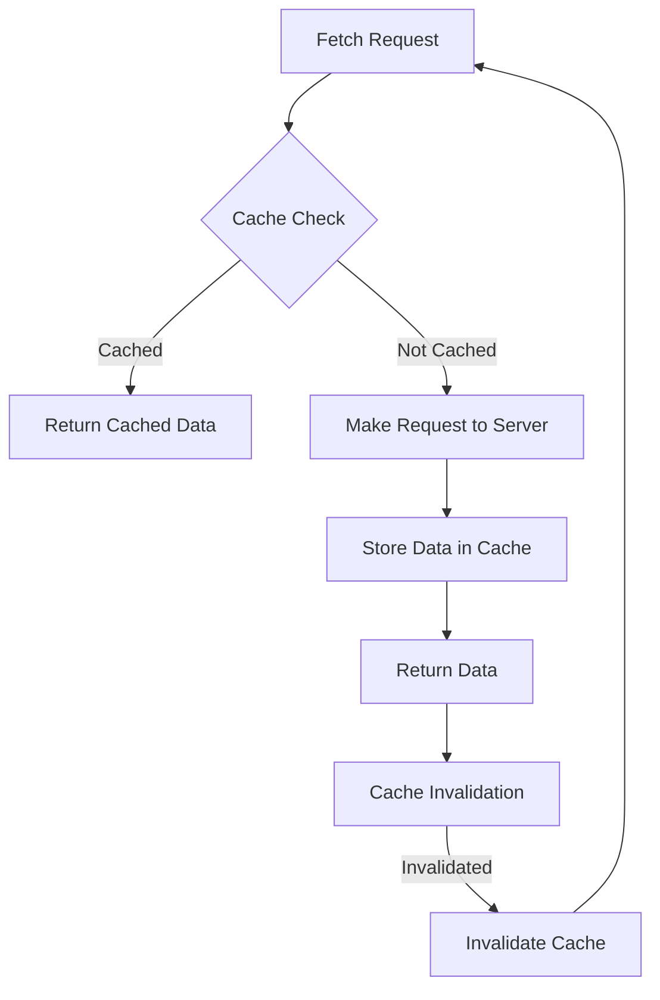

## Introduction
Data fetching is a crucial aspect of web development, and **caching** is a technique used to improve the performance of data fetching by storing frequently accessed data in a temporary storage area. In this section, we will explore the concept of data fetching with cache options, its importance, and real-world relevance. Every engineer needs to know this because it can significantly impact the user experience and the overall performance of a web application.

> **Note:** Caching can be implemented at various levels, including the browser, server, or even the database. However, in this section, we will focus on caching at the browser level using the `fetch` API.

## Core Concepts
To understand data fetching with cache options, it's essential to grasp the following core concepts:

* **Cache**: A temporary storage area that stores frequently accessed data to reduce the number of requests made to the server.
* **Cache policy**: A set of rules that defines how the cache should be used, such as when to store data in the cache, when to retrieve data from the cache, and when to invalidate the cache.
* **Fetch API**: A modern web API that provides an easy-to-use interface for fetching resources across the network.

> **Tip:** The `fetch` API provides a `cache` option that allows you to specify the cache policy for a particular request.

## How It Works Internally
When you use the `fetch` API with cache options, the following steps occur:

1. The browser checks if the requested resource is already stored in the cache.
2. If the resource is cached, the browser checks the cache policy to determine if the cached data is fresh or stale.
3. If the cached data is fresh, the browser returns the cached data instead of making a request to the server.
4. If the cached data is stale or not cached, the browser makes a request to the server to fetch the resource.
5. Once the resource is fetched, the browser stores the data in the cache according to the cache policy.

> **Warning:** If not implemented correctly, caching can lead to stale data or even security vulnerabilities.

## Code Examples
Here are three complete and runnable code examples that demonstrate data fetching with cache options:

### Example 1: Basic Usage
```javascript
// Define the cache policy
const cache = {
  type: 'default',
  maxAge: 30000, // 30 seconds
};

// Fetch data with cache options
fetch('https://api.example.com/data', {
  cache: cache,
})
.then(response => response.json())
.then(data => console.log(data))
.catch(error => console.error(error));
```

### Example 2: Custom Cache Policy
```javascript
// Define a custom cache policy
const customCache = {
  type: 'custom',
  maxAge: 60000, // 1 minute
  staleWhileRevalidate: 30000, // 30 seconds
};

// Fetch data with custom cache policy
fetch('https://api.example.com/data', {
  cache: customCache,
})
.then(response => response.json())
.then(data => console.log(data))
.catch(error => console.error(error));
```

### Example 3: Advanced Usage with Cache Invalidation
```javascript
// Define a cache policy with invalidation
const cacheWithInvalidation = {
  type: 'default',
  maxAge: 30000, // 30 seconds
  invalidation: {
    maxAge: 60000, // 1 minute
  },
};

// Fetch data with cache policy and invalidation
fetch('https://api.example.com/data', {
  cache: cacheWithInvalidation,
})
.then(response => response.json())
.then(data => console.log(data))
.catch(error => console.error(error));
```

> **Interview:** What is the difference between `maxAge` and `staleWhileRevalidate` in the cache policy?

## Visual Diagram

This diagram illustrates the flow of data fetching with cache options. The cache check is performed first, and if the data is cached, it is returned directly. Otherwise, a request is made to the server, and the data is stored in the cache. The cache invalidation mechanism ensures that the cache is updated periodically.

## Comparison
Here is a comparison table of different cache policies:

| Cache Policy | Time Complexity | Space Complexity | Pros | Cons |
| --- | --- | --- | --- | --- |
| Default Cache | O(1) | O(n) | Easy to implement, works well for most use cases | May not be optimal for large datasets |
| Custom Cache | O(1) | O(n) | Allows for fine-grained control over caching | Can be complex to implement |
| Cache with Invalidation | O(1) | O(n) | Ensures cache is updated periodically | May require additional infrastructure |
| No Cache | O(n) | O(1) | No additional infrastructure required | May result in slower performance |

> **Note:** The time and space complexity of the cache policies depend on the specific implementation and the size of the dataset.

## Real-world Use Cases
Here are three real-world use cases for data fetching with cache options:

1. **Instagram**: Instagram uses caching to improve the performance of its feed. When a user scrolls through their feed, Instagram fetches the data from the server and stores it in the cache. If the user scrolls back up, Instagram returns the cached data instead of making a new request to the server.
2. **Facebook**: Facebook uses a custom cache policy to cache user data. When a user logs in, Facebook fetches the user's data from the server and stores it in the cache. The cache is updated periodically to ensure that the data is fresh.
3. **Twitter**: Twitter uses caching to improve the performance of its timeline. When a user loads their timeline, Twitter fetches the data from the server and stores it in the cache. If the user reloads their timeline, Twitter returns the cached data instead of making a new request to the server.

## Common Pitfalls
Here are four common pitfalls to watch out for when implementing data fetching with cache options:

1. **Stale data**: If the cache is not updated periodically, the data may become stale, leading to incorrect results.
2. **Cache invalidation**: If the cache is not invalidated correctly, it may lead to security vulnerabilities or incorrect results.
3. **Over-caching**: If too much data is cached, it may lead to performance issues or increased memory usage.
4. **Under-caching**: If too little data is cached, it may lead to slower performance or increased requests to the server.

> **Warning:** Implementing caching incorrectly can lead to security vulnerabilities or performance issues.

## Interview Tips
Here are three common interview questions related to data fetching with cache options:

1. **What is the difference between `maxAge` and `staleWhileRevalidate` in the cache policy?**
	* Weak answer: "I'm not sure."
	* Strong answer: "`maxAge` specifies the maximum age of the cache, while `staleWhileRevalidate` specifies the time period during which the cache is considered stale but can still be used while the new data is being fetched."
2. **How do you implement caching in a web application?**
	* Weak answer: "I would use a library or framework to handle caching."
	* Strong answer: "I would use the `fetch` API with cache options to implement caching. I would define a cache policy that specifies the maximum age of the cache, the time period during which the cache is considered stale, and the invalidation mechanism."
3. **What are the benefits and drawbacks of using caching in a web application?**
	* Weak answer: "Caching improves performance but may lead to stale data."
	* Strong answer: "Caching improves performance by reducing the number of requests made to the server. However, it may lead to stale data if not implemented correctly. Additionally, caching may require additional infrastructure and may lead to security vulnerabilities if not implemented correctly."

## Key Takeaways
Here are ten key takeaways to remember:

* Caching can improve the performance of a web application by reducing the number of requests made to the server.
* The `fetch` API provides a `cache` option that allows you to specify the cache policy for a particular request.
* The cache policy specifies the maximum age of the cache, the time period during which the cache is considered stale, and the invalidation mechanism.
* Implementing caching incorrectly can lead to security vulnerabilities or performance issues.
* Caching can be implemented at various levels, including the browser, server, or database.
* The `maxAge` and `staleWhileRevalidate` options are used to specify the cache policy.
* Cache invalidation is crucial to ensure that the cache is updated periodically.
* Over-caching can lead to performance issues or increased memory usage.
* Under-caching can lead to slower performance or increased requests to the server.
* Caching should be implemented carefully to ensure that it does not lead to security vulnerabilities or performance issues.