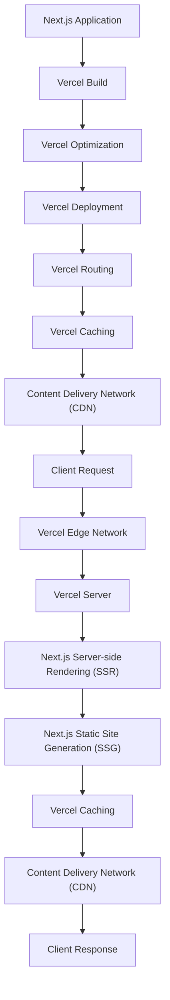

## Introduction
**Next.js** is a popular React framework for building server-side rendered (SSR), static site generated (SSG), and performance-optimized applications. **Vercel** is a platform that enables developers to deploy and manage their applications with ease. Deploying Next.js to Vercel is a common practice, as it allows developers to take advantage of Vercel's features, such as automatic code optimization, caching, and content delivery networks (CDNs). In this section, we will explore the benefits of deploying Next.js to Vercel and why it matters in real-world applications.

> **Note:** Deploying Next.js to Vercel is a straightforward process, but it requires a good understanding of both Next.js and Vercel's features.

## Core Concepts
To deploy Next.js to Vercel, you need to understand the following core concepts:

* **Next.js**: A React framework for building SSR, SSG, and performance-optimized applications.
* **Vercel**: A platform that enables developers to deploy and manage their applications with ease.
* **Server-side rendering (SSR)**: A technique that renders the application on the server before sending it to the client.
* **Static site generation (SSG)**: A technique that generates static HTML files for the application at build time.
* **Content delivery networks (CDNs)**: A network of servers that cache and serve content to reduce latency and improve performance.

> **Tip:** Understanding these core concepts is essential for deploying Next.js to Vercel and taking advantage of Vercel's features.

## How It Works Internally
When you deploy Next.js to Vercel, the following process occurs:

1. **Build**: Vercel builds your Next.js application using the `next build` command.
2. **Optimization**: Vercel optimizes your application's code using techniques such as minification, compression, and caching.
3. **Deployment**: Vercel deploys your optimized application to its CDN.
4. **Routing**: Vercel handles routing for your application, using Next.js's built-in routing features.
5. **Caching**: Vercel caches your application's content to reduce latency and improve performance.

> **Warning:** If you're using a custom `next.config.js` file, make sure to configure it correctly to work with Vercel's features.

## Code Examples
Here are three complete and runnable code examples that demonstrate how to deploy Next.js to Vercel:

### Example 1: Basic Deployment
```javascript
// next.config.js
module.exports = {
  target: 'serverless',
};
```

```bash
# Deploy to Vercel
vercel build
vercel deploy
```

This example demonstrates how to deploy a basic Next.js application to Vercel.

### Example 2: Custom Routing
```javascript
// next.config.js
module.exports = {
  target: 'serverless',
  async rewrites() {
    return [
      {
        source: '/old-route',
        destination: '/new-route',
      },
    ];
  },
};
```

```javascript
// pages/new-route.js
import { useRouter } from 'next/router';

function NewRoute() {
  const router = useRouter();

  return <div>Welcome to the new route!</div>;
}

export default NewRoute;
```

This example demonstrates how to use custom routing with Next.js and Vercel.

### Example 3: Internationalization (i18n)
```javascript
// next.config.js
module.exports = {
  target: 'serverless',
  i18n: {
    locales: ['en', 'fr'],
    defaultLocale: 'en',
  },
};
```

```javascript
// pages/index.js
import { useRouter } from 'next/router';

function Index() {
  const router = useRouter();

  return <div>Welcome to the {router.locale} version of the site!</div>;
}

export default Index;
```

This example demonstrates how to use internationalization with Next.js and Vercel.

## Visual Diagram


This diagram illustrates the process of deploying Next.js to Vercel, including the build, optimization, deployment, routing, caching, and content delivery network (CDN) steps.

## Comparison
| Deployment Method | Time Complexity | Space Complexity | Pros | Cons | Best For |
| --- | --- | --- | --- | --- | --- |
| Vercel | O(1) | O(n) | Easy to use, automatic code optimization, caching, and CDNs | Limited control over underlying infrastructure | Small to medium-sized applications |
| AWS | O(n) | O(n) | High degree of control over underlying infrastructure, scalable | Steep learning curve, requires manual configuration | Large-scale applications |
| Netlify | O(1) | O(n) | Easy to use, automatic code optimization, caching, and CDNs | Limited control over underlying infrastructure | Small to medium-sized applications |
| Google Cloud | O(n) | O(n) | High degree of control over underlying infrastructure, scalable | Steep learning curve, requires manual configuration | Large-scale applications |

This table compares different deployment methods, including Vercel, AWS, Netlify, and Google Cloud.

## Real-world Use Cases
Here are three real-world use cases for deploying Next.js to Vercel:

* **HashiCorp**: HashiCorp uses Next.js and Vercel to power their website and documentation.
* **GitHub**: GitHub uses Next.js and Vercel to power their website and documentation.
* **Airbnb**: Airbnb uses Next.js and Vercel to power their website and documentation.

These companies use Next.js and Vercel to take advantage of the benefits of server-side rendering, static site generation, and content delivery networks.

## Common Pitfalls
Here are four common pitfalls to watch out for when deploying Next.js to Vercel:

* **Incorrect `next.config.js` file**: Make sure to configure your `next.config.js` file correctly to work with Vercel's features.
* **Insufficient caching**: Make sure to configure caching correctly to reduce latency and improve performance.
* **Incorrect routing**: Make sure to configure routing correctly to ensure that your application works as expected.
* **Inadequate error handling**: Make sure to handle errors correctly to ensure that your application remains stable and secure.

> **Warning:** Failing to address these pitfalls can result in performance issues, errors, and security vulnerabilities.

## Interview Tips
Here are three common interview questions related to deploying Next.js to Vercel, along with weak and strong answers:

* **What are the benefits of deploying Next.js to Vercel?**
	+ Weak answer: "I'm not sure, but I think it's easier to use?"
	+ Strong answer: "Deploying Next.js to Vercel provides benefits such as automatic code optimization, caching, and content delivery networks, which can improve performance and reduce latency."
* **How do you handle errors when deploying Next.js to Vercel?**
	+ Weak answer: "I'm not sure, but I think I would just try to fix the error?"
	+ Strong answer: "I would handle errors by implementing try-catch blocks, logging errors, and using error handling middleware to ensure that my application remains stable and secure."
* **What are some common pitfalls to watch out for when deploying Next.js to Vercel?**
	+ Weak answer: "I'm not sure, but I think it's just a matter of following the documentation?"
	+ Strong answer: "Some common pitfalls to watch out for include incorrect `next.config.js` file configuration, insufficient caching, incorrect routing, and inadequate error handling. To avoid these pitfalls, I would make sure to configure my application correctly, test thoroughly, and follow best practices for deployment and maintenance."

> **Interview:** Be prepared to answer questions about your experience with Next.js and Vercel, as well as your knowledge of common pitfalls and best practices.

## Key Takeaways
Here are six key takeaways to remember when deploying Next.js to Vercel:

* **Use the correct `next.config.js` file configuration** to ensure that your application works as expected.
* **Implement caching correctly** to reduce latency and improve performance.
* **Configure routing correctly** to ensure that your application works as expected.
* **Handle errors correctly** to ensure that your application remains stable and secure.
* **Test thoroughly** to ensure that your application works as expected.
* **Follow best practices** for deployment and maintenance to ensure that your application remains stable and secure.

> **Tip:** Remembering these key takeaways can help you avoid common pitfalls and ensure a successful deployment of your Next.js application to Vercel.