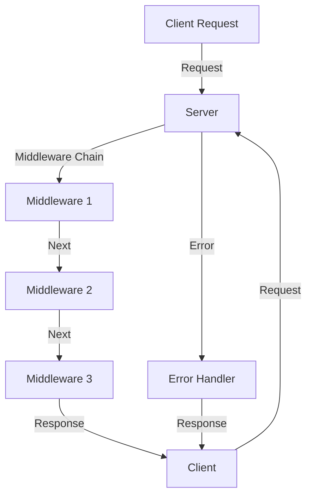

## Introduction
**Middleware** is a crucial concept in Next.js, a popular React-based framework for building server-side rendered (SSR) and statically generated websites. In essence, middleware functions are executed between the client's request and the server's response, enabling developers to modify, validate, or extend the request and response objects. Middleware is essential for tasks such as authentication, caching, compression, and more. Every engineer working with Next.js needs to understand middleware to build scalable, efficient, and secure applications.

## Core Concepts
To grasp middleware in Next.js, it's essential to understand the following key concepts:
- **Request Object**: The object containing information about the incoming request, such as the URL, method, headers, and body.
- **Response Object**: The object containing information about the outgoing response, such as the status code, headers, and body.
- **Middleware Function**: A function that takes the request and response objects as arguments and returns a response or a promise that resolves to a response.
- **Next Function**: A function that calls the next middleware function in the chain.

> **Note:** Middleware functions can be asynchronous, allowing for more flexibility in handling requests and responses.

## How It Works Internally
When a request is made to a Next.js application, the following steps occur:
1. The request is received by the server.
2. The middleware chain is executed, with each middleware function calling the next function in the chain using the `next` function.
3. If a middleware function returns a response, the chain is terminated, and the response is sent to the client.
4. If a middleware function calls the `next` function, the chain continues until a response is returned or an error occurs.

```javascript
// Example of a simple middleware function
export default function middleware(req, res, next) {
  // Modify the request object
  req.customProperty = 'customValue';
  
  // Call the next middleware function in the chain
  next();
}
```

## Code Examples
### Example 1: Basic Middleware
The following example demonstrates a basic middleware function that logs the request URL and method:
```javascript
// middleware.js
export default function loggerMiddleware(req, res, next) {
  console.log(`Request: ${req.method} ${req.url}`);
  next();
}

// pages/_middleware.js
import loggerMiddleware from '../middleware';

export default function middleware(req) {
  return loggerMiddleware(req, null, () => {
    // Handle the request
  });
}
```

### Example 2: Authentication Middleware
This example shows an authentication middleware function that checks for a valid token in the request headers:
```javascript
// authMiddleware.js
import jwt from 'jsonwebtoken';

export default function authMiddleware(req, res, next) {
  const token = req.headers['authorization'];
  
  if (!token) {
    return res.status(401).json({ error: 'Unauthorized' });
  }
  
  jwt.verify(token, 'secretKey', (err, decoded) => {
    if (err) {
      return res.status(401).json({ error: 'Invalid token' });
    }
    
    req.user = decoded;
    next();
  });
}

// pages/_middleware.js
import authMiddleware from '../authMiddleware';

export default function middleware(req) {
  return authMiddleware(req, null, () => {
    // Handle the request
  });
}
```

### Example 3: Caching Middleware
The following example demonstrates a caching middleware function that stores responses in memory:
```javascript
// cacheMiddleware.js
const cache = {};

export default function cacheMiddleware(req, res, next) {
  const cacheKey = `${req.method} ${req.url}`;
  
  if (cache[cacheKey]) {
    return res.json(cache[cacheKey]);
  }
  
  res.originalEnd = res.end;
  res.end = (data) => {
    cache[cacheKey] = data;
    res.originalEnd(data);
  };
  
  next();
}

// pages/_middleware.js
import cacheMiddleware from '../cacheMiddleware';

export default function middleware(req) {
  return cacheMiddleware(req, null, () => {
    // Handle the request
  });
}
```

## Visual Diagram

This diagram illustrates the flow of a request through the middleware chain, demonstrating how each middleware function calls the next function in the chain until a response is returned or an error occurs.

> **Warning:** Failing to call the `next` function in a middleware function can cause the chain to terminate prematurely, leading to unexpected behavior.

## Comparison
| Middleware | Time Complexity | Space Complexity | Pros | Cons | Best For |
| --- | --- | --- | --- | --- | --- |
| Logger Middleware | O(1) | O(1) | Simple, easy to implement | Limited functionality | Debugging, logging |
| Authentication Middleware | O(1) | O(1) | Secure, flexible | Requires token management | Authentication, authorization |
| Caching Middleware | O(1) | O(n) | Improves performance, reduces latency | Can lead to stale data | Caching, content delivery |

## Real-world Use Cases
1. **Authentication**: Companies like GitHub and Twitter use authentication middleware to protect their APIs and ensure only authorized users can access sensitive data.
2. **Caching**: Websites like Netflix and Amazon use caching middleware to improve performance and reduce latency by storing frequently accessed data in memory.
3. **Logging**: Companies like Google and Facebook use logging middleware to monitor and analyze traffic, identifying trends and patterns in user behavior.

> **Tip:** When implementing middleware, consider using a combination of different middleware functions to achieve optimal results.

## Common Pitfalls
1. **Failing to Call Next**: Forgetting to call the `next` function in a middleware function can cause the chain to terminate prematurely, leading to unexpected behavior.
2. **Incorrect Middleware Order**: Placing middleware functions in the wrong order can lead to errors or unexpected behavior, as some middleware functions may rely on others to function correctly.
3. **Insufficient Error Handling**: Failing to implement proper error handling in middleware functions can result in unhandled errors propagating through the chain, causing the application to crash.
4. **Inadequate Security**: Neglecting to implement security measures, such as authentication and authorization, can leave the application vulnerable to attacks and unauthorized access.

## Interview Tips
1. **What is middleware, and how does it work?**: A strong answer should explain the concept of middleware, its purpose, and how it is used in Next.js applications.
2. **Can you provide an example of a middleware function?**: A good answer should include a complete, runnable example of a middleware function, such as a logging or authentication middleware.
3. **How do you handle errors in middleware functions?**: A strong answer should describe a strategy for handling errors in middleware functions, including the use of try-catch blocks and error handlers.

> **Interview:** Be prepared to explain the trade-offs between different middleware approaches and provide examples of when to use each.

## Key Takeaways
* Middleware functions are executed between the client's request and the server's response, enabling developers to modify, validate, or extend the request and response objects.
* Next.js provides a built-in middleware system, allowing developers to create custom middleware functions using the `middleware` function in the `pages/_middleware.js` file.
* Middleware functions can be asynchronous, allowing for more flexibility in handling requests and responses.
* The `next` function is used to call the next middleware function in the chain.
* Failing to call the `next` function can cause the chain to terminate prematurely, leading to unexpected behavior.
* Error handling is crucial in middleware functions to prevent unhandled errors from propagating through the chain.
* Caching middleware can improve performance and reduce latency by storing frequently accessed data in memory.
* Authentication middleware is essential for protecting APIs and ensuring only authorized users can access sensitive data.