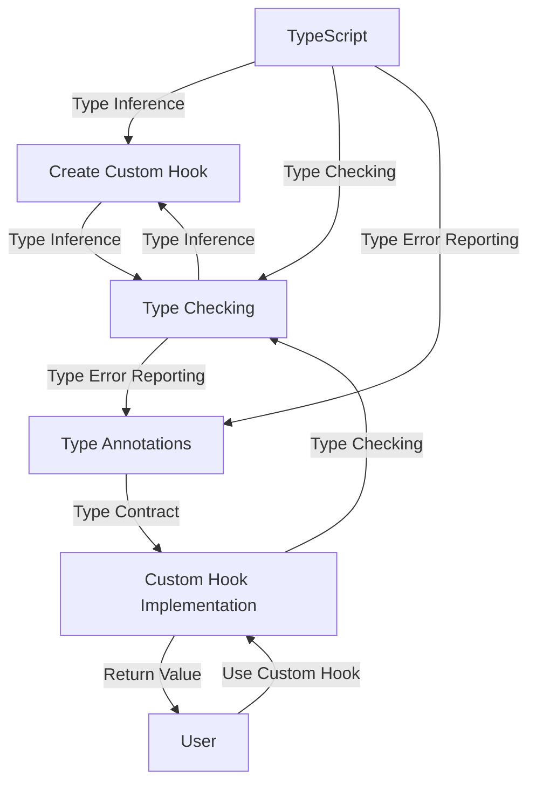

## Introduction
**Typing custom hooks** in React is a crucial aspect of building robust, maintainable, and scalable applications. As the React ecosystem continues to grow, the importance of proper typing cannot be overstated. In this section, we will delve into the world of typing custom hooks, exploring the benefits, challenges, and best practices associated with this topic. 
> **Note:** Understanding the basics of React and TypeScript is essential before diving into typing custom hooks.

Every engineer working with React and TypeScript should be familiar with typing custom hooks, as it enables them to create reusable, composable, and type-safe code. Real-world relevance can be seen in applications built by companies like **Microsoft**, **Airbnb**, and **Facebook**, which all utilize custom hooks to manage complex state and side effects.

## Core Concepts
To grasp the concept of typing custom hooks, it's essential to understand the following key terms:
* **Custom hooks**: Reusable functions that manage state and side effects in React applications.
* **Type inference**: The process of automatically determining the types of variables, function return types, and other expressions in TypeScript.
* **Type annotations**: Explicit type definitions added to code to help TypeScript understand the expected types.

A mental model for typing custom hooks can be thought of as a contract between the hook's implementation and its users. This contract defines the expected input and output types, ensuring that the hook behaves as intended and preventing potential errors.

## How It Works Internally
When you create a custom hook, TypeScript uses type inference to determine the types of the hook's parameters and return value. This process involves analyzing the hook's implementation, including the types of variables, function calls, and return statements.

Here's a step-by-step breakdown of how typing custom hooks works internally:
1. **Type inference**: TypeScript analyzes the hook's implementation to determine the types of its parameters and return value.
2. **Type checking**: TypeScript checks the hook's types against the expected types defined by the hook's contract (type annotations).
3. **Type error reporting**: If TypeScript encounters any type errors, it reports them to the developer, providing information about the expected and actual types.

## Code Examples
### Example 1: Basic Custom Hook
```typescript
// useFetchData.ts
import { useState, useEffect } from 'react';

interface FetchDataResult {
  data: any;
  error: any;
  isLoading: boolean;
}

const useFetchData = (url: string): FetchDataResult => {
  const [data, setData] = useState(null);
  const [error, setError] = useState(null);
  const [isLoading, setIsLoading] = useState(true);

  useEffect(() => {
    const fetchData = async () => {
      try {
        const response = await fetch(url);
        const json = await response.json();
        setData(json);
      } catch (error) {
        setError(error);
      } finally {
        setIsLoading(false);
      }
    };
    fetchData();
  }, [url]);

  return { data, error, isLoading };
};

export default useFetchData;
```
This example demonstrates a basic custom hook that fetches data from a URL and returns an object with the fetched data, error, and loading state.

### Example 2: Real-World Custom Hook
```typescript
// useDebounce.ts
import { useState, useEffect } from 'react';

interface DebounceOptions {
  delay: number;
}

const useDebounce = (value: string, options: DebounceOptions): string => {
  const [debouncedValue, setDebouncedValue] = useState(value);

  useEffect(() => {
    const timeoutId = setTimeout(() => {
      setDebouncedValue(value);
    }, options.delay);
    return () => clearTimeout(timeoutId);
  }, [value, options.delay]);

  return debouncedValue;
};

export default useDebounce;
```
This example shows a custom hook that debounces a value by a specified delay, useful for handling user input and preventing excessive API calls.

### Example 3: Advanced Custom Hook
```typescript
// usePagination.ts
import { useState, useEffect } from 'react';

interface PaginationOptions {
  pageSize: number;
  currentPage: number;
}

interface PaginatedData {
  data: any[];
  totalPages: number;
  currentPage: number;
}

const usePagination = (data: any[], options: PaginationOptions): PaginatedData => {
  const [paginatedData, setPaginatedData] = useState<PaginatedData>({
    data: [],
    totalPages: 0,
    currentPage: 0,
  });

  useEffect(() => {
    const totalPages = Math.ceil(data.length / options.pageSize);
    const currentPageData = data.slice(
      (options.currentPage - 1) * options.pageSize,
      options.currentPage * options.pageSize
    );
    setPaginatedData({
      data: currentPageData,
      totalPages,
      currentPage: options.currentPage,
    });
  }, [data, options.pageSize, options.currentPage]);

  return paginatedData;
};

export default usePagination;
```
This example demonstrates a custom hook that paginates an array of data based on the provided options, returning an object with the paginated data, total pages, and current page.

## Visual Diagram

This diagram illustrates the flow of typing custom hooks, from creating the hook to using it in an application.

## Comparison
| Approach | Time Complexity | Space Complexity | Pros | Cons | Best For |
| --- | --- | --- | --- | --- | --- |
| Manual Type Annotations | O(1) | O(1) | Explicit type control, better code readability | Verbose, error-prone | Small to medium-sized applications |
| Type Inference | O(n) | O(n) | Automatic type detection, reduced verbosity | May not always infer correct types, limited control | Large-scale applications with complex type hierarchies |
| Hybrid Approach | O(n) | O(n) | Balances type control and automation, flexible | May require additional configuration, potential for type errors | Medium to large-sized applications with complex type requirements |
| TypeScript 4.1+ | O(1) | O(1) | Improved type inference, better support for custom hooks | May require additional configuration, potential for type errors | Applications using TypeScript 4.1 or later |

## Real-world Use Cases
1. **Microsoft**: Uses custom hooks to manage state and side effects in their **Azure** platform, ensuring a scalable and maintainable architecture.
2. **Airbnb**: Employs custom hooks to handle user input and API calls in their **React**-based frontend, providing a seamless user experience.
3. **Facebook**: Utilizes custom hooks to manage complex state and side effects in their **React**-based applications, such as **Facebook Messenger** and **Instagram**.

## Common Pitfalls
1. **Insufficient type annotations**: Failing to provide explicit type annotations can lead to type errors and make the code harder to maintain.
```typescript
// WRONG
const useFetchData = (url) => {
  // ...
};

// RIGHT
const useFetchData = (url: string) => {
  // ...
};
```
2. **Incorrect type inference**: TypeScript's type inference may not always detect the correct types, requiring manual type annotations to ensure accuracy.
```typescript
// WRONG
const useDebounce = (value) => {
  // ...
};

// RIGHT
const useDebounce = (value: string) => {
  // ...
};
```
3. **Overly complex type hierarchies**: Creating complex type hierarchies can lead to type errors and make the code harder to maintain.
```typescript
// WRONG
interface ComplexType {
  prop1: string;
  prop2: {
    prop3: string;
    prop4: {
      prop5: string;
    };
  };
}

// RIGHT
interface SimpleType {
  prop1: string;
  prop2: string;
}
```
4. **Ignoring type errors**: Failing to address type errors can lead to runtime errors and make the code harder to maintain.
```typescript
// WRONG
const usePagination = (data) => {
  // ...
};

// RIGHT
const usePagination = (data: any[]) => {
  // ...
};
```

## Interview Tips
1. **What is the purpose of typing custom hooks?**
	* Weak answer: "To make the code look nicer."
	* Strong answer: "To ensure type safety, prevent runtime errors, and improve code maintainability."
2. **How do you handle type errors in custom hooks?**
	* Weak answer: "I ignore them."
	* Strong answer: "I address them by providing explicit type annotations, using type inference, and testing the code thoroughly."
3. **What is the difference between type inference and type annotations?**
	* Weak answer: "They are the same thing."
	* Strong answer: "Type inference is the process of automatically detecting types, while type annotations are explicit type definitions added to the code."

## Key Takeaways
* Typing custom hooks is essential for ensuring type safety and preventing runtime errors.
* TypeScript's type inference can automatically detect types, but manual type annotations may be necessary for complex type hierarchies.
* Custom hooks can be used to manage state and side effects in React applications.
* Type errors should be addressed promptly to prevent runtime errors and improve code maintainability.
* A hybrid approach, combining type inference and type annotations, can provide a balance between type control and automation.
* TypeScript 4.1 and later versions offer improved type inference and support for custom hooks.
* Common pitfalls include insufficient type annotations, incorrect type inference, overly complex type hierarchies, and ignoring type errors.