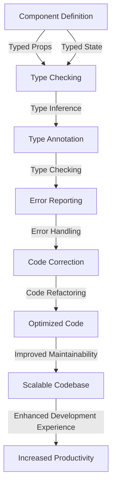

## Introduction
**Typing Props and State** is a crucial concept in React development, particularly when working with TypeScript. It refers to the process of defining the types of props and state in a React component, ensuring that the data passed to the component is valid and consistent. This concept is essential in maintaining the integrity and reliability of the application. In real-world scenarios, typing props and state helps prevent type-related errors, improves code maintainability, and enhances the overall development experience. Every engineer working with React and TypeScript needs to understand this concept to write robust, maintainable, and scalable code.

## Core Concepts
To grasp typing props and state, it's essential to understand the following core concepts:
- **Props**: Short for "properties," props are read-only values passed from a parent component to a child component.
- **State**: The state refers to the data that changes within a component over time.
- **Type**: A type is a way to define the structure of a value, including the type of a variable, function, or object.
- **Type Inference**: TypeScript can automatically infer the types of variables based on their usage.
- **Type Annotation**: Developers can explicitly specify the types of variables, function parameters, and return types using type annotations.

## How It Works Internally
When you define the types of props and state in a React component, TypeScript uses this information to perform type checking. Here's a step-by-step breakdown of how it works:
1. **Type Definition**: You define the types of props and state using type annotations.
2. **Type Inference**: TypeScript infers the types of variables and function parameters based on their usage.
3. **Type Checking**: TypeScript checks the types of props and state against their definitions, ensuring that the data passed to the component is valid and consistent.
4. **Error Reporting**: If TypeScript detects any type-related errors, it reports them to the developer, providing detailed information about the error.

## Code Examples
### Example 1: Basic Usage
```typescript
// Define a simple React component with typed props
interface Props {
  name: string;
  age: number;
}

const Person: React.FC<Props> = ({ name, age }) => {
  return (
    <div>
      <h1>{name}</h1>
      <p>Age: {age}</p>
    </div>
  );
};

// Usage
const App: React.FC = () => {
  return <Person name="John Doe" age={30} />;
};
```
### Example 2: Real-World Pattern
```typescript
// Define a React component with typed props and state
interface Props {
  initialCount: number;
}

interface State {
  count: number;
}

class Counter extends React.Component<Props, State> {
  constructor(props: Props) {
    super(props);
    this.state = {
      count: props.initialCount,
    };
  }

  handleIncrement = () => {
    this.setState({ count: this.state.count + 1 });
  };

  render() {
    return (
      <div>
        <h1>Count: {this.state.count}</h1>
        <button onClick={this.handleIncrement}>Increment</button>
      </div>
    );
  }
}

// Usage
const App: React.FC = () => {
  return <Counter initialCount={10} />;
};
```
### Example 3: Advanced Usage
```typescript
// Define a React component with typed props, state, and hooks
interface Props {
  initialCount: number;
}

interface State {
  count: number;
}

const Counter: React.FC<Props> = ({ initialCount }) => {
  const [count, setCount] = React.useState(initialCount);

  const handleIncrement = () => {
    setCount(count + 1);
  };

  return (
    <div>
      <h1>Count: {count}</h1>
      <button onClick={handleIncrement}>Increment</button>
    </div>
  );
};

// Usage
const App: React.FC = () => {
  return <Counter initialCount={20} />;
};
```
> **Note:** In the above examples, we've used the `React.FC` type to define functional components, which is a shorthand for `React.FunctionComponent`.

## Visual Diagram

The above diagram illustrates the process of typing props and state in a React component, from component definition to improved maintainability and enhanced development experience.

## Comparison
| Approach | Time Complexity | Space Complexity | Pros | Cons | Best For |
| --- | --- | --- | --- | --- | --- |
| Manual Type Annotation | O(1) | O(1) | Explicit type definitions, improved code readability | Time-consuming, prone to errors | Small-scale applications, prototyping |
| Automatic Type Inference | O(n) | O(n) | Fast, efficient, and accurate | Limited control, potential type errors | Large-scale applications, complex data structures |
| Hybrid Approach | O(n) | O(n) | Balances explicit type definitions and automatic type inference | Steeper learning curve, potential inconsistencies | Medium-scale applications, teams with mixed experience levels |
| TypeScript with React | O(n) | O(n) | Seamless integration, robust type checking, improved code maintainability | Learning curve, potential performance overhead | React applications, large-scale development teams |

## Real-world Use Cases
1. **Facebook**: Facebook uses TypeScript with React to develop their web applications, ensuring robust type checking and improved code maintainability.
2. **Microsoft**: Microsoft uses TypeScript with React to build their Office web applications, leveraging the benefits of typed props and state.
3. **Airbnb**: Airbnb uses TypeScript with React to develop their web applications, taking advantage of the improved code readability and maintainability provided by typed props and state.

## Common Pitfalls
1. **Insufficient Type Definitions**: Failing to define types for props and state can lead to type-related errors and inconsistencies.
2. **Inconsistent Type Annotations**: Using inconsistent type annotations can cause confusion and errors, particularly in large-scale applications.
3. **Overreliance on Type Inference**: Relying too heavily on automatic type inference can lead to potential type errors and inconsistencies.
4. **Ignoring Type Errors**: Ignoring type errors can result in runtime errors and decreased code maintainability.

> **Warning:** Ignoring type errors can lead to serious consequences, including data corruption and security vulnerabilities.

## Interview Tips
1. **What is the purpose of typing props and state in React?**: A strong answer should explain the benefits of typing props and state, including improved code maintainability and reduced type-related errors.
2. **How do you define types for props and state in a React component?**: A strong answer should demonstrate knowledge of type annotations, type inference, and the use of `React.FC` and `React.Component`.
3. **What are the differences between manual type annotation and automatic type inference?**: A strong answer should explain the trade-offs between manual type annotation and automatic type inference, including time complexity, space complexity, and potential type errors.

> **Tip:** When answering interview questions, be sure to provide specific examples and code snippets to demonstrate your knowledge and experience.

## Key Takeaways
* **Typed props and state improve code maintainability and reduce type-related errors**.
* **Type annotations and type inference are essential tools for defining types in React components**.
* **The `React.FC` type is a shorthand for `React.FunctionComponent`**.
* **Automatic type inference can be faster and more efficient, but may require more expertise**.
* **Manual type annotation provides explicit control, but can be time-consuming and prone to errors**.
* **The hybrid approach balances explicit type definitions and automatic type inference, but may have a steeper learning curve**.
* **TypeScript with React provides seamless integration and robust type checking, but may have a learning curve and potential performance overhead**.
* **Ignoring type errors can lead to serious consequences, including data corruption and security vulnerabilities**.