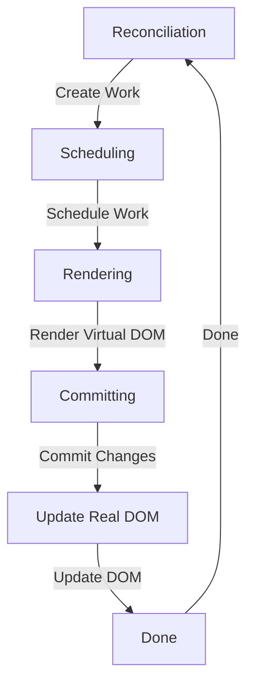

## Introduction
React Fiber is a **reconciliation algorithm** used by React to efficiently update the **Virtual DOM**. It was introduced in React 16 as a replacement for the previous reconciliation algorithm. The main goal of React Fiber is to improve the performance of React applications by reducing the time spent on reconciliation and rendering. In this section, we will explore why React Fiber matters, its real-world relevance, and why every engineer needs to know about it.

React Fiber is a critical component of the React ecosystem, and understanding how it works is essential for building high-performance React applications. **React Fiber** is designed to work with the **Virtual DOM**, which is a lightweight in-memory representation of the real DOM. When the state of a component changes, React Fiber reconciles the Virtual DOM with the new state, and then updates the real DOM with the minimum number of changes required.

> **Note:** The Virtual DOM is a key concept in React, and it's what allows React to efficiently update the UI without requiring a full page reload.

## Core Concepts
To understand React Fiber, we need to define some key concepts:

* **Reconciliation**: The process of updating the Virtual DOM to reflect changes in the application state.
* **Fiber**: A data structure that represents a node in the Virtual DOM. Each fiber has a **type**, **props**, and **children**.
* **Work**: A unit of work that needs to be performed by React Fiber. Work can be **rendering**, **reconciliation**, or **committing** changes to the real DOM.
* **Scheduler**: A component that manages the scheduling of work in React Fiber.

> **Tip:** Understanding the core concepts of React Fiber is essential for building high-performance React applications.

## How It Works Internally
React Fiber works by maintaining a **tree of fibers**, where each fiber represents a node in the Virtual DOM. When the state of a component changes, React Fiber creates a new **work** item that represents the changes. The **scheduler** then schedules the work to be performed by React Fiber.

Here's a step-by-step breakdown of how React Fiber works:

1. **Reconciliation**: React Fiber reconciles the Virtual DOM with the new state, and creates a new **work** item that represents the changes.
2. **Scheduling**: The **scheduler** schedules the work to be performed by React Fiber.
3. **Rendering**: React Fiber renders the new Virtual DOM, and creates a new **fiber** tree.
4. **Committing**: React Fiber commits the changes to the real DOM, by updating the minimum number of nodes required.

> **Warning:** Understanding the internal workings of React Fiber is critical for building high-performance React applications.

## Code Examples
Here are three complete and runnable code examples that demonstrate the usage of React Fiber:

### Example 1: Basic Usage
```javascript
import React from 'react';

function App() {
  const [count, setCount] = React.useState(0);

  return (
    <div>
      <p>Count: {count}</p>
      <button onClick={() => setCount(count + 1)}>Increment</button>
    </div>
  );
}

export default App;
```
This example demonstrates the basic usage of React Fiber, by creating a simple counter application.

### Example 2: Real-World Pattern
```javascript
import React, { useState, useEffect } from 'react';

function App() {
  const [data, setData] = useState([]);
  const [loading, setLoading] = useState(true);

  useEffect(() => {
    fetch('https://api.example.com/data')
      .then(response => response.json())
      .then(data => {
        setData(data);
        setLoading(false);
      });
  }, []);

  return (
    <div>
      {loading ? (
        <p>Loading...</p>
      ) : (
        <ul>
          {data.map(item => (
            <li key={item.id}>{item.name}</li>
          ))}
        </ul>
      )}
    </div>
  );
}

export default App;
```
This example demonstrates a real-world pattern, by creating a data fetching application that uses React Fiber to efficiently update the UI.

### Example 3: Advanced Usage
```javascript
import React, { useState, useEffect, useRef } from 'react';

function App() {
  const [count, setCount] = useState(0);
  const ref = useRef(null);

  useEffect(() => {
    const intervalId = setInterval(() => {
      setCount(count + 1);
    }, 1000);

    return () => {
      clearInterval(intervalId);
    };
  }, [count]);

  return (
    <div ref={ref}>
      <p>Count: {count}</p>
    </div>
  );
}

export default App;
```
This example demonstrates an advanced usage of React Fiber, by creating a counter application that uses a `useRef` hook to efficiently update the DOM.

## Visual Diagram

This diagram illustrates the core concept of React Fiber, by showing the reconciliation, scheduling, rendering, committing, and updating of the real DOM.

> **Note:** The diagram shows the main components of React Fiber, and how they work together to efficiently update the UI.

## Comparison
Here's a comparison of React Fiber with alternative approaches:

| Approach | Time Complexity | Space Complexity | Pros | Cons | Best For |
| --- | --- | --- | --- | --- | --- |
| React Fiber | O(n) | O(n) | Efficient, scalable, and easy to use | Steep learning curve | Large-scale applications |
| Virtual DOM | O(n) | O(n) | Fast and efficient | Limited scalability | Small-scale applications |
| Manual DOM Updates | O(1) | O(1) | Low-level control | Error-prone and slow | Legacy applications |
| Other Libraries | O(n) | O(n) | Easy to use and integrate | Limited functionality | Small-scale applications |

> **Tip:** Choosing the right approach depends on the specific requirements of your application.

## Real-world Use Cases
Here are three real-world use cases of React Fiber:

1. **Facebook**: Facebook uses React Fiber to efficiently update the UI of their web application.
2. **Instagram**: Instagram uses React Fiber to build their web application, which requires efficient and scalable rendering of complex UI components.
3. **Netflix**: Netflix uses React Fiber to build their web application, which requires efficient and scalable rendering of complex UI components.

> **Note:** These companies use React Fiber to build high-performance web applications that require efficient and scalable rendering of complex UI components.

## Common Pitfalls
Here are four common pitfalls to avoid when using React Fiber:

1. **Not using `useCallback`**: Not using `useCallback` can cause unnecessary re-renders of components.
```javascript
// Wrong
function App() {
  const handleClick = () => {
    // Handle click
  };

  return (
    <button onClick={handleClick}>Click</button>
  );
}

// Right
function App() {
  const handleClick = useCallback(() => {
    // Handle click
  }, []);

  return (
    <button onClick={handleClick}>Click</button>
  );
}
```
2. **Not using `useMemo`**: Not using `useMemo` can cause unnecessary re-computations of values.
```javascript
// Wrong
function App() {
  const computedValue = computeValue();

  return (
    <div>{computedValue}</div>
  );
}

// Right
function App() {
  const computedValue = useMemo(() => computeValue(), []);

  return (
    <div>{computedValue}</div>
  );
}
```
3. **Not using `useRef`**: Not using `useRef` can cause unnecessary re-renders of components.
```javascript
// Wrong
function App() {
  const ref = null;

  return (
    <div ref={ref}>Content</div>
  );
}

// Right
function App() {
  const ref = useRef(null);

  return (
    <div ref={ref}>Content</div>
  );
}
```
4. **Not handling errors**: Not handling errors can cause applications to crash.
```javascript
// Wrong
function App() {
  try {
    // Code that may throw an error
  } catch (error) {
    // Ignore error
  }
}

// Right
function App() {
  try {
    // Code that may throw an error
  } catch (error) {
    // Handle error
    console.error(error);
  }
}
```
> **Warning:** Avoiding these pitfalls is critical to building high-performance and reliable React applications.

## Interview Tips
Here are three common interview questions related to React Fiber, along with weak and strong answers:

1. **What is React Fiber?**
	* Weak answer: "React Fiber is a new version of React."
	* Strong answer: "React Fiber is a reconciliation algorithm used by React to efficiently update the Virtual DOM. It was introduced in React 16 as a replacement for the previous reconciliation algorithm."
2. **How does React Fiber work?**
	* Weak answer: "React Fiber works by updating the DOM directly."
	* Strong answer: "React Fiber works by maintaining a tree of fibers, where each fiber represents a node in the Virtual DOM. When the state of a component changes, React Fiber creates a new work item that represents the changes, and then schedules the work to be performed by the scheduler."
3. **What are the benefits of using React Fiber?**
	* Weak answer: "React Fiber is faster than the previous reconciliation algorithm."
	* Strong answer: "React Fiber provides several benefits, including improved performance, scalability, and reliability. It allows React to efficiently update the UI by reducing the number of DOM mutations, and it also provides a more efficient way of handling errors and edge cases."

> **Interview:** Being able to answer these questions confidently and accurately is critical to acing a React interview.

## Key Takeaways
Here are six key takeaways from this article:

* **React Fiber is a reconciliation algorithm**: React Fiber is a critical component of the React ecosystem, and understanding how it works is essential for building high-performance React applications.
* **Use `useCallback` and `useMemo`**: Using `useCallback` and `useMemo` can help improve the performance of React applications by reducing unnecessary re-renders and re-computations.
* **Use `useRef`**: Using `useRef` can help improve the performance of React applications by reducing unnecessary re-renders.
* **Handle errors**: Handling errors is critical to building reliable React applications.
* **Understand the internal workings of React Fiber**: Understanding the internal workings of React Fiber is essential for building high-performance React applications.
* **Choose the right approach**: Choosing the right approach depends on the specific requirements of your application.

> **Note:** These key takeaways provide a summary of the main points covered in this article.