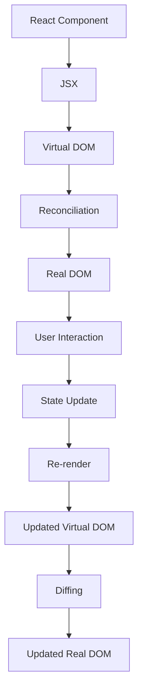

## Introduction
React is a **JavaScript library** for building user interfaces. It was developed by Facebook (now Meta) and is widely used for creating complex, interactive web applications. React allows developers to create reusable **components**, which can be composed together to form more complex interfaces. This modular approach makes it easier to manage and maintain large codebases.

React's primary goal is to simplify the process of building dynamic, data-driven user interfaces. It achieves this by providing a **declarative programming model**, where the developer specifies what the UI should look like, and React takes care of the details of how to update the DOM.

> **Note:** React is often referred to as a **framework**, but it's technically a **library** because it doesn't impose a specific project structure or dictate how you should organize your code.

## Core Concepts
Here are the key concepts that underpin React:

* **Components**: Reusable pieces of code that represent a UI element, such as a button or a form.
* **JSX**: A syntax extension for JavaScript that allows you to write HTML-like code in your JavaScript files.
* **State**: An object that stores the current state of a component.
* **Props**: Short for "properties," these are read-only values that are passed from a parent component to a child component.
* **Lifecycle Methods**: Special methods that are called at different points in a component's life cycle, such as when it's mounted or unmounted.

> **Tip:** When learning React, it's essential to understand the concept of **state** and how it's used to manage the application's state.

## How It Works Internally
When you create a React component, it's rendered to the DOM using a process called **reconciliation**. Here's a high-level overview of how it works:

1. The component is rendered to a virtual DOM, which is a lightweight representation of the real DOM.
2. When the state of the component changes, React updates the virtual DOM.
3. React then compares the updated virtual DOM with the previous virtual DOM to determine what changes need to be made to the real DOM.
4. Finally, React applies the necessary changes to the real DOM.

This process is often referred to as **diffing**, and it's what allows React to efficiently update the DOM without having to re-render the entire application.

## Code Examples
Here are three complete, runnable examples that demonstrate the basics of React:

### Example 1: Basic Counter
```javascript
import React, { useState } from 'react';

function Counter() {
  const [count, setCount] = useState(0);

  return (
    <div>
      <p>Count: {count}</p>
      <button onClick={() => setCount(count + 1)}>Increment</button>
    </div>
  );
}

export default Counter;
```
This example demonstrates the use of **state** and **lifecycle methods**.

### Example 2: Todo List
```javascript
import React, { useState } from 'react';

function TodoList() {
  const [todos, setTodos] = useState([
    { id: 1, text: 'Buy milk' },
    { id: 2, text: 'Walk the dog' },
  ]);

  const handleAddTodo = (text) => {
    setTodos([...todos, { id: todos.length + 1, text }]);
  };

  return (
    <div>
      <h1>Todo List</h1>
      <ul>
        {todos.map((todo) => (
          <li key={todo.id}>{todo.text}</li>
        ))}
      </ul>
      <input
        type="text"
        placeholder="Add new todo"
        onKeyDown={(e) => {
          if (e.key === 'Enter') {
            handleAddTodo(e.target.value);
            e.target.value = '';
          }
        }}
      />
    </div>
  );
}

export default TodoList;
```
This example demonstrates the use of **state** and **event handling**.

### Example 3: Advanced Usage
```javascript
import React, { useState, useEffect } from 'react';

function AdvancedUsage() {
  const [data, setData] = useState([]);
  const [loading, setLoading] = useState(true);

  useEffect(() => {
    fetch('https://api.example.com/data')
      .then((response) => response.json())
      .then((data) => {
        setData(data);
        setLoading(false);
      });
  }, []);

  if (loading) {
    return <p>Loading...</p>;
  }

  return (
    <div>
      <h1>Advanced Usage</h1>
      <ul>
        {data.map((item) => (
          <li key={item.id}>{item.name}</li>
        ))}
      </ul>
    </div>
  );
}

export default AdvancedUsage;
```
This example demonstrates the use of **effect hooks** and **async data fetching**.

## Visual Diagram

This diagram illustrates the process of rendering a React component and how it interacts with the virtual DOM and real DOM.

## Comparison
| Approach | Time Complexity | Space Complexity | Pros | Cons | Best For |
| --- | --- | --- | --- | --- | --- |
| React | O(n) | O(n) | Declarative, component-based, efficient | Steep learning curve, not suitable for small projects | Large-scale web applications |
| Angular | O(n^2) | O(n^2) | Opinionated, full-featured, robust | Complex, slow, not suitable for small projects | Enterprise-level applications |
| Vue.js | O(n) | O(n) | Progressive, flexible, easy to learn | Not as mature as React or Angular, limited resources | Small to medium-sized web applications |
| Vanilla JavaScript | O(1) | O(1) | Lightweight, fast, easy to learn | Not suitable for complex applications, no built-in features | Small, simple web applications |

## Real-world Use Cases
Here are three real-world examples of companies that use React:

* Facebook: Facebook's web application is built using React, and it's one of the largest and most complex React applications in the world.
* Instagram: Instagram's web application is also built using React, and it's a great example of how React can be used to build complex, data-driven interfaces.
* Netflix: Netflix's web application is built using a combination of React and other technologies, and it's a great example of how React can be used to build large-scale, complex applications.

## Common Pitfalls
Here are four common pitfalls that developers encounter when using React:

* **Not using the `key` prop**: When rendering a list of components, it's essential to use the `key` prop to help React identify which components have changed.
* **Not using `shouldComponentUpdate`**: When a component's state changes, React will re-render the entire component tree. Using `shouldComponentUpdate` can help optimize this process.
* **Not using `useCallback` and `useMemo`**: These hooks can help optimize performance by memoizing functions and values.
* **Not handling errors properly**: React provides a built-in error handling mechanism, but it's essential to use it correctly to avoid crashes and unexpected behavior.

## Interview Tips
Here are three common interview questions that are related to React:

* **What is the difference between `useState` and `useReducer`?**: A good answer should explain the difference between these two hooks and when to use each.
* **How do you optimize the performance of a React application?**: A good answer should discuss the use of `shouldComponentUpdate`, `useCallback`, and `useMemo`.
* **What is the purpose of the `key` prop in React?**: A good answer should explain the importance of using the `key` prop when rendering a list of components.

## Key Takeaways
Here are ten key takeaways from this introduction to React:

* **React is a JavaScript library for building user interfaces**.
* **Components are the building blocks of a React application**.
* **State is an object that stores the current state of a component**.
* **Props are read-only values that are passed from a parent component to a child component**.
* **The `key` prop is essential when rendering a list of components**.
* **React uses a virtual DOM to optimize performance**.
* **The `shouldComponentUpdate` method can be used to optimize performance**.
* **The `useCallback` and `useMemo` hooks can be used to memoize functions and values**.
* **Error handling is essential in a React application**.
* **React is a popular and widely-used library for building complex web applications**.