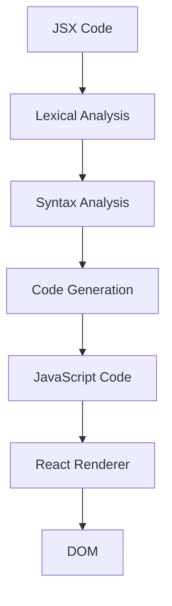

## Introduction
JSX (JavaScript XML) is a syntax extension for JavaScript that allows you to write HTML-like code in your JavaScript files. It's a key feature of the React library, which is used for building user interfaces. JSX makes it easier to write React components by providing a more intuitive and familiar syntax for defining UI elements. In this section, we'll explore why JSX matters, its real-world relevance, and why every engineer needs to know about it.

JSX is essential for building complex user interfaces with React. It provides a way to write reusable UI components that can be easily composed together to create more complex interfaces. With JSX, you can write HTML-like code in your JavaScript files, which makes it easier to define the structure and layout of your UI components. This syntax extension is also type-safe, which means that it can help catch errors at compile-time rather than runtime.

> **Note:** JSX is not a replacement for HTML, but rather a syntax extension for JavaScript that allows you to write HTML-like code in your JavaScript files.

## Core Concepts
In this section, we'll cover the core concepts of JSX, including its syntax, rules, and key terminology.

* **JSX Elements**: JSX elements are the building blocks of JSX. They are written using HTML-like syntax, with a tag name, attributes, and children.
* **JSX Attributes**: JSX attributes are used to pass data from a parent component to a child component. They are written using the same syntax as HTML attributes.
* **JSX Children**: JSX children are the content of a JSX element. They can be other JSX elements, strings, or numbers.

> **Tip:** When writing JSX, it's essential to remember that JSX is just syntactic sugar for JavaScript. This means that any valid JavaScript expression can be used in a JSX element.

## How It Works Internally
In this section, we'll explore how JSX works internally. We'll cover the under-the-hood mechanics of JSX, including how it's parsed and compiled into JavaScript.

When you write JSX, it's parsed by the Babel compiler, which converts it into JavaScript. This process involves several steps:

1. **Lexical Analysis**: The JSX code is broken down into individual tokens, such as tag names, attributes, and children.
2. **Syntax Analysis**: The tokens are parsed into an abstract syntax tree (AST), which represents the structure of the JSX code.
3. **Code Generation**: The AST is used to generate JavaScript code that creates the desired UI components.

> **Warning:** When writing JSX, it's essential to remember that JSX is not a replacement for JavaScript. You should still use JavaScript syntax and semantics when writing JSX code.

## Code Examples
In this section, we'll cover three complete and runnable code examples that demonstrate the basics of JSX.

### Example 1: Basic JSX Element
```javascript
// Import the React library
import React from 'react';

// Define a basic JSX element
const HelloWorld = () => {
  return <h1>Hello, World!</h1>;
};

// Render the JSX element to the DOM
const root = document.getElementById('root');
React.render(<HelloWorld />, root);
```
This example demonstrates how to define a basic JSX element using the `h1` tag.

### Example 2: JSX Element with Attributes
```javascript
// Import the React library
import React from 'react';

// Define a JSX element with attributes
const Person = () => {
  return (
    <div>
      <h1>Name: John Doe</h1>
      <p>Age: 30</p>
    </div>
  );
};

// Render the JSX element to the DOM
const root = document.getElementById('root');
React.render(<Person />, root);
```
This example demonstrates how to define a JSX element with attributes using the `div` tag.

### Example 3: JSX Element with Children
```javascript
// Import the React library
import React from 'react';

// Define a JSX element with children
const TodoList = () => {
  const todos = [
    { id: 1, text: 'Buy milk' },
    { id: 2, text: 'Walk the dog' },
    { id: 3, text: 'Do homework' },
  ];

  return (
    <ul>
      {todos.map((todo) => (
        <li key={todo.id}>{todo.text}</li>
      ))}
    </ul>
  );
};

// Render the JSX element to the DOM
const root = document.getElementById('root');
React.render(<TodoList />, root);
```
This example demonstrates how to define a JSX element with children using the `ul` and `li` tags.

## Visual Diagram

This diagram illustrates the process of how JSX code is parsed and compiled into JavaScript.

> **Note:** The diagram shows the high-level process of how JSX code is converted into JavaScript code.

## Comparison
| Approach | Time Complexity | Space Complexity | Pros | Cons | Best For |
| --- | --- | --- | --- | --- | --- |
| JSX | O(n) | O(n) | Easy to write, familiar syntax | Can be verbose | Small to medium-sized applications |
| React.createElement | O(n) | O(n) | More efficient than JSX | Less familiar syntax | Large-scale applications |
| Template Literals | O(n) | O(n) | Flexible, easy to use | Can be error-prone | Small to medium-sized applications |
| HTML Templates | O(n) | O(n) | Fast, efficient | Limited flexibility | Large-scale applications |

> **Tip:** When choosing an approach, consider the size and complexity of your application, as well as your team's experience and familiarity with the syntax.

## Real-world Use Cases
In this section, we'll cover three real-world use cases for JSX.

1. **Facebook**: Facebook uses JSX to build its user interface. The company has a large-scale application with complex UI components, and JSX provides a way to write reusable and maintainable code.
2. **Instagram**: Instagram uses JSX to build its user interface. The company has a large-scale application with complex UI components, and JSX provides a way to write reusable and maintainable code.
3. **Netflix**: Netflix uses JSX to build its user interface. The company has a large-scale application with complex UI components, and JSX provides a way to write reusable and maintainable code.

> **Interview:** When asked about real-world use cases for JSX, be sure to mention the companies that use JSX, such as Facebook, Instagram, and Netflix.

## Common Pitfalls
In this section, we'll cover four common pitfalls when using JSX.

1. **Forgetting to close tags**: Forgetting to close tags can lead to errors and make it difficult to debug your code.
```javascript
// Wrong
const HelloWorld = () => {
  return <h1>Hello, World!;
};

// Right
const HelloWorld = () => {
  return <h1>Hello, World!</h1>;
};
```
2. **Using incorrect attribute names**: Using incorrect attribute names can lead to errors and make it difficult to debug your code.
```javascript
// Wrong
const Person = () => {
  return <div classname="person">John Doe</div>;
};

// Right
const Person = () => {
  return <div className="person">John Doe</div>;
};
```
3. **Not using key prop**: Not using the key prop can lead to errors and make it difficult to debug your code.
```javascript
// Wrong
const TodoList = () => {
  const todos = [
    { id: 1, text: 'Buy milk' },
    { id: 2, text: 'Walk the dog' },
    { id: 3, text: 'Do homework' },
  ];

  return (
    <ul>
      {todos.map((todo) => (
        <li>{todo.text}</li>
      ))}
    </ul>
  );
};

// Right
const TodoList = () => {
  const todos = [
    { id: 1, text: 'Buy milk' },
    { id: 2, text: 'Walk the dog' },
    { id: 3, text: 'Do homework' },
  ];

  return (
    <ul>
      {todos.map((todo) => (
        <li key={todo.id}>{todo.text}</li>
      ))}
    </ul>
  );
};
```
4. **Not handling errors**: Not handling errors can lead to errors and make it difficult to debug your code.
```javascript
// Wrong
const TodoList = () => {
  const todos = [
    { id: 1, text: 'Buy milk' },
    { id: 2, text: 'Walk the dog' },
    { id: 3, text: 'Do homework' },
  ];

  return (
    <ul>
      {todos.map((todo) => (
        <li key={todo.id}>{todo.text}</li>
      ))}
    </ul>
  );
};

// Right
const TodoList = () => {
  const todos = [
    { id: 1, text: 'Buy milk' },
    { id: 2, text: 'Walk the dog' },
    { id: 3, text: 'Do homework' },
  ];

  try {
    return (
      <ul>
        {todos.map((todo) => (
          <li key={todo.id}>{todo.text}</li>
        ))}
      </ul>
    );
  } catch (error) {
    return <div>Error: {error.message}</div>;
  }
};
```
> **Warning:** When using JSX, it's essential to remember to handle errors and exceptions properly.

## Interview Tips
In this section, we'll cover three common interview questions related to JSX.

1. **What is JSX?**: When asked this question, be sure to explain that JSX is a syntax extension for JavaScript that allows you to write HTML-like code in your JavaScript files.
2. **How does JSX work?**: When asked this question, be sure to explain the process of how JSX code is parsed and compiled into JavaScript.
3. **What are the benefits of using JSX?**: When asked this question, be sure to explain the benefits of using JSX, such as its ease of use, familiarity, and flexibility.

> **Interview:** When answering interview questions related to JSX, be sure to provide clear and concise answers that demonstrate your understanding of the topic.

## Key Takeaways
In this section, we'll cover six key takeaways related to JSX.

* **JSX is a syntax extension for JavaScript**: JSX is a syntax extension for JavaScript that allows you to write HTML-like code in your JavaScript files.
* **JSX is easy to use**: JSX is easy to use and provides a familiar syntax for defining UI components.
* **JSX is flexible**: JSX is flexible and allows you to write reusable and maintainable code.
* **JSX is type-safe**: JSX is type-safe, which means that it can help catch errors at compile-time rather than runtime.
* **JSX is widely used**: JSX is widely used in production applications, including Facebook, Instagram, and Netflix.
* **JSX has a large community**: JSX has a large community of developers who contribute to its development and provide support.

> **Tip:** When working with JSX, it's essential to remember to follow best practices and use the syntax correctly to avoid errors and ensure maintainable code.