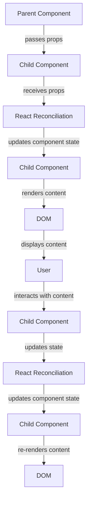

## Introduction
**Props** (short for "properties") are a crucial concept in React, allowing components to pass and receive data. In React, props are immutable by design, ensuring that a component's state is predictable and easy to reason about. This concept is essential in building robust, maintainable, and scalable React applications. Every engineer working with React needs to understand props, as they are the primary means of passing data between components. In real-world applications, props are used extensively in various scenarios, such as rendering dynamic data, handling user interactions, and managing state changes.

## Core Concepts
To work effectively with props, it's essential to understand the following key concepts:
- **Props**: Immutable data passed from a parent component to a child component.
- **PropTypes**: A way to validate the types of props passed to a component.
- **Default Props**: Default values assigned to props when they are not provided by the parent component.
- **Children Props**: A special prop that represents the child elements passed to a component.

> **Note:** Props are immutable, meaning their values cannot be changed once they are set. This ensures that a component's state is predictable and easy to reason about.

## How It Works Internally
When a component is rendered, React creates a new instance of the component and passes the props to it. The component then uses these props to render its content. Here's a step-by-step breakdown of how props work internally:
1. **Parent Component**: The parent component passes props to the child component using the JSX syntax.
2. **React Reconciliation**: React's reconciliation algorithm checks the props of the child component and updates the component's state accordingly.
3. **Child Component**: The child component receives the props and uses them to render its content.
4. **PropTypes Validation**: If PropTypes are defined for the child component, React validates the types of the props passed to the component.

## Code Examples
### Example 1: Basic Props Usage
```javascript
// ParentComponent.js
import React from 'react';
import ChildComponent from './ChildComponent';

function ParentComponent() {
  return (
    <div>
      <ChildComponent name="John" age={30} />
    </div>
  );
}

export default ParentComponent;
```

```javascript
// ChildComponent.js
import React from 'react';

function ChildComponent(props) {
  return (
    <div>
      <h1>Hello, {props.name}!</h1>
      <p>You are {props.age} years old.</p>
    </div>
  );
}

export default ChildComponent;
```
This example demonstrates the basic usage of props, where the `ParentComponent` passes `name` and `age` props to the `ChildComponent`.

### Example 2: Real-World Pattern
```javascript
// UserComponent.js
import React from 'react';

function UserComponent(props) {
  return (
    <div>
      <h1>{props.user.name}</h1>
      <p>Email: {props.user.email}</p>
    </div>
  );
}

export default UserComponent;
```

```javascript
// App.js
import React from 'react';
import UserComponent from './UserComponent';

function App() {
  const users = [
    { id: 1, name: 'John Doe', email: 'john@example.com' },
    { id: 2, name: 'Jane Doe', email: 'jane@example.com' },
  ];

  return (
    <div>
      {users.map((user) => (
        <UserComponent key={user.id} user={user} />
      ))}
    </div>
  );
}

export default App;
```
This example demonstrates a real-world pattern, where the `App` component passes an array of user objects as props to the `UserComponent`.

### Example 3: Advanced Props Usage
```javascript
// TodoComponent.js
import React from 'react';

function TodoComponent(props) {
  return (
    <div>
      <h1>{props.todo.title}</h1>
      <p>Completed: {props.todo.completed ? 'Yes' : 'No'}</p>
    </div>
  );
}

export default TodoComponent;
```

```javascript
// TodoListComponent.js
import React from 'react';
import TodoComponent from './TodoComponent';

function TodoListComponent(props) {
  return (
    <div>
      {props.todos.map((todo) => (
        <TodoComponent key={todo.id} todo={todo} />
      ))}
    </div>
  );
}

export default TodoListComponent;
```

```javascript
// App.js
import React from 'react';
import TodoListComponent from './TodoListComponent';

function App() {
  const todos = [
    { id: 1, title: 'Buy milk', completed: false },
    { id: 2, title: 'Walk the dog', completed: true },
  ];

  return (
    <div>
      <TodoListComponent todos={todos} />
    </div>
  );
}

export default App;
```
This example demonstrates an advanced usage of props, where the `App` component passes an array of todo objects as props to the `TodoListComponent`, which in turn passes each todo object as props to the `TodoComponent`.

## Visual Diagram

This diagram illustrates the flow of props between components and how React's reconciliation algorithm updates the component's state.

## Comparison
| Approach | Time Complexity | Space Complexity | Pros | Cons | Best For |
| --- | --- | --- | --- | --- | --- |
| Using Props | O(1) | O(1) | Easy to implement, predictable state | Limited flexibility | Simple, stateless components |
| Using State | O(n) | O(n) | More flexible, can handle complex logic | More complex, harder to debug | Complex, stateful components |
| Using Context API | O(n) | O(n) | Easy to implement, provides a global state | Can lead to tight coupling, harder to debug | Large-scale applications with many interconnected components |
| Using Redux | O(n) | O(n) | Provides a predictable, centralized state | Can be overkill for small applications, requires additional setup | Large-scale applications with many interconnected components |

## Real-world Use Cases
1. **Facebook's News Feed**: Facebook's news feed is a great example of using props to pass data between components. Each post is a separate component that receives props from the parent component, which contains the post's content, comments, and likes.
2. **Twitter's Tweet Component**: Twitter's tweet component is another example of using props to pass data between components. Each tweet is a separate component that receives props from the parent component, which contains the tweet's content, username, and timestamp.
3. **Instagram's Photo Component**: Instagram's photo component is an example of using props to pass data between components. Each photo is a separate component that receives props from the parent component, which contains the photo's URL, caption, and likes.

## Common Pitfalls
1. **Mutating Props**: One common mistake is trying to mutate props in a child component. This can lead to unpredictable behavior and errors.
```javascript
// Wrong
function ChildComponent(props) {
  props.name = 'John'; // mutating props
  return <div>Hello, {props.name}!</div>;
}

// Right
function ChildComponent(props) {
  const name = props.name; // creating a local copy of the prop
  return <div>Hello, {name}!</div>;
}
```
2. **Not Using PropTypes**: Another mistake is not using PropTypes to validate the types of props passed to a component. This can lead to errors and unexpected behavior.
```javascript
// Wrong
function ChildComponent(props) {
  return <div>Hello, {props.name}!</div>;
}

// Right
import PropTypes from 'prop-types';

function ChildComponent(props) {
  return <div>Hello, {props.name}!</div>;
}

ChildComponent.propTypes = {
  name: PropTypes.string.isRequired,
};
```
3. **Not Handling Default Props**: Not handling default props can lead to errors and unexpected behavior when a prop is not provided.
```javascript
// Wrong
function ChildComponent(props) {
  return <div>Hello, {props.name}!</div>;
}

// Right
function ChildComponent(props) {
  const name = props.name || 'Unknown'; // handling default prop
  return <div>Hello, {name}!</div>;
}
```
4. **Not Using the `key` Prop**: Not using the `key` prop when rendering an array of components can lead to performance issues and unexpected behavior.
```javascript
// Wrong
function ParentComponent() {
  const items = [1, 2, 3];
  return (
    <div>
      {items.map((item) => (
        <ChildComponent item={item} />
      ))}
    </div>
  );
}

// Right
function ParentComponent() {
  const items = [1, 2, 3];
  return (
    <div>
      {items.map((item) => (
        <ChildComponent key={item} item={item} />
      ))}
    </div>
  );
}
```
> **Warning:** Not following best practices when working with props can lead to errors, unexpected behavior, and performance issues.

## Interview Tips
1. **What is the difference between props and state?**: A common interview question is to ask about the difference between props and state. A good answer would be: "Props are immutable data passed from a parent component to a child component, while state is mutable data that is local to a component."
2. **How do you handle default props?**: Another common interview question is to ask about handling default props. A good answer would be: "You can handle default props by using the `||` operator to provide a default value when a prop is not provided."
3. **What is the purpose of the `key` prop?**: A common interview question is to ask about the purpose of the `key` prop. A good answer would be: "The `key` prop is used to identify a component in an array of components, and is used by React to optimize rendering and improve performance."

## Key Takeaways
* Props are immutable data passed from a parent component to a child component.
* Props are used to pass data between components, and are essential for building robust and scalable React applications.
* The `key` prop is used to identify a component in an array of components, and is used by React to optimize rendering and improve performance.
* Default props can be handled using the `||` operator to provide a default value when a prop is not provided.
* PropTypes can be used to validate the types of props passed to a component, and can help catch errors and improve code quality.
* Mutating props can lead to unpredictable behavior and errors, and should be avoided.
* Not using the `key` prop when rendering an array of components can lead to performance issues and unexpected behavior.
* Handling default props and using PropTypes are essential for building robust and maintainable React applications.
* Understanding the difference between props and state is crucial for building scalable and efficient React applications.