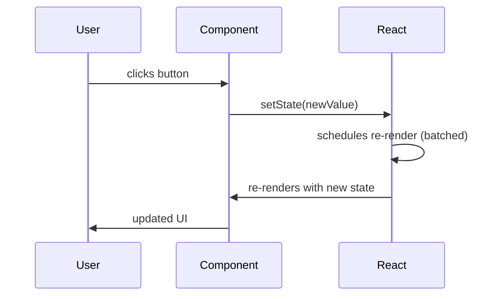

## Introduction

`useState` is the most fundamental React Hook. It lets functional components hold and update local state — something previously only possible in class components. Every time state changes, React re-renders the component with the new value, keeping the UI in sync with your data.

> **Note:** `useState` is synchronous in terms of scheduling but the state update itself is batched. You won't see the new value immediately after calling the setter — you'll see it on the next render.

## Core Concepts

### Basic Syntax

```typescript
const [state, setState] = useState<T>(initialValue)
```

- `state` — the current value
- `setState` — function to update the value and trigger a re-render
- `initialValue` — the value on the first render (can be a value or a lazy initializer function)

### State is Immutable — Always Replace, Never Mutate

```typescript
// ❌ WRONG — mutating state directly
const [user, setUser] = useState({ name: 'Alice', age: 30 })
user.age = 31 // React won't detect this change

// ✅ CORRECT — create a new object
setUser(prev => ({ ...prev, age: 31 }))
```

## Code Examples

### Example 1: Counter with Functional Update

```typescript
import { useState } from 'react'

export function Counter() {
  const [count, setCount] = useState(0)

  // Use functional update when new state depends on previous state
  const increment = () => setCount(prev => prev + 1)
  const decrement = () => setCount(prev => prev - 1)
  const reset = () => setCount(0)

  return (
    <div className="flex items-center gap-4">
      <button onClick={decrement}>−</button>
      <span className="text-2xl font-bold">{count}</span>
      <button onClick={increment}>+</button>
      <button onClick={reset}>Reset</button>
    </div>
  )
}
```

### Example 2: Form State with Object

```typescript
interface FormData {
  name: string
  email: string
  role: 'admin' | 'user'
}

export function UserForm() {
  const [form, setForm] = useState<FormData>({
    name: '',
    email: '',
    role: 'user',
  })

  const handleChange = (field: keyof FormData) =>
    (e: React.ChangeEvent<HTMLInputElement | HTMLSelectElement>) => {
      setForm(prev => ({ ...prev, [field]: e.target.value }))
    }

  const handleSubmit = (e: React.FormEvent) => {
    e.preventDefault()
    console.log('Submitted:', form)
  }

  return (
    <form onSubmit={handleSubmit}>
      <input value={form.name} onChange={handleChange('name')} placeholder="Name" />
      <input value={form.email} onChange={handleChange('email')} placeholder="Email" />
      <select value={form.role} onChange={handleChange('role')}>
        <option value="user">User</option>
        <option value="admin">Admin</option>
      </select>
      <button type="submit">Submit</button>
    </form>
  )
}
```

### Example 3: Lazy Initializer for Expensive Computation

```typescript
// ❌ This runs on EVERY render (expensive!)
const [data, setData] = useState(parseHeavyJSON(rawData))

// ✅ Lazy initializer — runs ONCE on mount
const [data, setData] = useState(() => parseHeavyJSON(rawData))

// Also useful for reading from localStorage
const [theme, setTheme] = useState<'light' | 'dark'>(() => {
  try {
    return (localStorage.getItem('theme') as 'light' | 'dark') ?? 'light'
  } catch {
    return 'light'
  }
})
```

## Re-render Flow



## Comparison: useState vs useReducer

| Scenario | useState | useReducer |
|----------|----------|------------|
| Simple value (bool, string, number) | ✅ Ideal | Overkill |
| Object with few fields | ✅ Fine | Optional |
| Complex state with many transitions | Gets messy | ✅ Ideal |
| State depends on previous state | Use functional update | ✅ Natural |
| Multiple related state values | Multiple `useState` | ✅ Single reducer |

## Real-world Use Cases

- Toggle UI elements (modals, dropdowns, dark mode)
- Form field values and validation errors
- Pagination (current page number)
- Loading/error states for async operations
- Shopping cart item counts

```typescript
// Loading + error + data pattern
const [status, setStatus] = useState<'idle' | 'loading' | 'success' | 'error'>('idle')
const [data, setData] = useState<User | null>(null)
const [error, setError] = useState<string | null>(null)

const fetchUser = async (id: number) => {
  setStatus('loading')
  try {
    const user = await api.getUser(id)
    setData(user)
    setStatus('success')
  } catch (e) {
    setError(e instanceof Error ? e.message : 'Unknown error')
    setStatus('error')
  }
}
```

## Common Pitfalls & How to Avoid Them

- **Stale closures** — if your setter uses the old value, always use the functional form: `setState(prev => prev + 1)`
- **Object mutation** — never mutate state directly; always spread or use `structuredClone`
- **Too many useState calls** — if you have 5+ related fields, consider `useReducer` or a single object state
- **State in the wrong component** — if two siblings need the same state, lift it to their common parent

## Summary / Key Takeaways

- `useState` gives functional components local, reactive state
- Always use the functional updater `setState(prev => ...)` when new state depends on old state
- Never mutate state objects — always return new references
- Use lazy initializers `useState(() => ...)` for expensive initial computations
- For complex state logic, prefer `useReducer`

> **Tip:** In React 18+, state updates inside event handlers are automatically batched — even across multiple `setState` calls. This means fewer re-renders and better performance out of the box.
