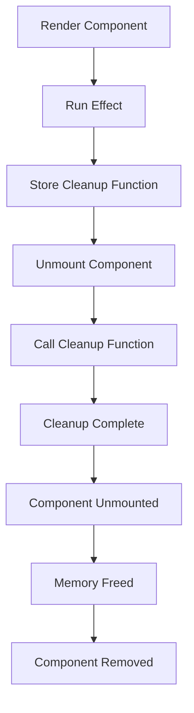

## Introduction
The `useEffect` hook in React is a powerful tool for handling side effects, such as setting timers, making API calls, or updating the DOM. However, when using `useEffect`, it's essential to consider the cleanup process to prevent memory leaks and ensure optimal performance. In this article, we'll delve into the world of `useEffect` cleanup functions, exploring what they are, why they matter, and how to use them effectively in real-world applications.

> **Note:** Cleanup functions are essential in React to prevent memory leaks and ensure that your application remains performant. By understanding how to use cleanup functions with `useEffect`, you'll be able to write more efficient and reliable code.

## Core Concepts
To grasp the concept of cleanup functions, let's first define what a side effect is. A side effect is an operation that can affect other components and cannot be done during rendering. Examples of side effects include:

* Setting timers
* Making API calls
* Updating the DOM
* Subscribing to events

When using `useEffect`, you can specify a cleanup function as the return value of the effect function. This cleanup function is called when the component is unmounted or when the effect is re-run.

> **Tip:** Think of cleanup functions as a way to "undo" the side effects introduced by your `useEffect` hook. By properly cleaning up after your effects, you can prevent memory leaks and ensure that your application remains stable.

## How It Works Internally
When you use `useEffect`, React will run the effect function after rendering the component. If you specify a cleanup function, React will call it when the component is unmounted or when the effect is re-run. This process is internal to React and is handled by the `useEffect` hook.

Here's a step-by-step breakdown of how `useEffect` works internally:

1. React renders the component.
2. After rendering, React runs the effect function.
3. If a cleanup function is specified, React stores it for later use.
4. When the component is unmounted or the effect is re-run, React calls the cleanup function.

> **Warning:** If you don't specify a cleanup function, React will not clean up after your effect, which can lead to memory leaks and performance issues.

## Code Examples
Let's explore some examples of using cleanup functions with `useEffect`.

### Example 1: Basic Usage
```javascript
import { useState, useEffect } from 'react';

function Counter() {
  const [count, setCount] = useState(0);

  useEffect(() => {
    const intervalId = setInterval(() => {
      setCount(count + 1);
    }, 1000);

    return () => {
      clearInterval(intervalId);
    };
  }, []);

  return (
    <div>
      <p>Count: {count}</p>
    </div>
  );
}
```
In this example, we use `useEffect` to set up an interval that increments the count every second. The cleanup function is used to clear the interval when the component is unmounted.

### Example 2: Real-World Pattern
```javascript
import { useState, useEffect } from 'react';

function FetchData() {
  const [data, setData] = useState(null);
  const [error, setError] = useState(null);

  useEffect(() => {
    const abortController = new AbortController();

    fetch('https://api.example.com/data', {
      signal: abortController.signal,
    })
      .then(response => response.json())
      .then(data => setData(data))
      .catch(error => setError(error));

    return () => {
      abortController.abort();
    };
  }, []);

  if (error) {
    return <div>Error: {error.message}</div>;
  }

  if (!data) {
    return <div>Loading...</div>;
  }

  return (
    <div>
      <p>Data: {data}</p>
    </div>
  );
}
```
In this example, we use `useEffect` to fetch data from an API. The cleanup function is used to abort the request when the component is unmounted.

### Example 3: Advanced Usage
```javascript
import { useState, useEffect } from 'react';

function WebSocketConnection() {
  const [connection, setConnection] = useState(null);

  useEffect(() => {
    const ws = new WebSocket('ws://example.com');

    ws.onmessage = event => {
      console.log(`Received message: ${event.data}`);
    };

    ws.onclose = () => {
      console.log('Connection closed');
    };

    ws.onerror = error => {
      console.log(`Error occurred: ${error}`);
    };

    setConnection(ws);

    return () => {
      ws.close();
    };
  }, []);

  return (
    <div>
      <p>Connection status: {connection ? 'Connected' : 'Disconnected'}</p>
    </div>
  );
}
```
In this example, we use `useEffect` to establish a WebSocket connection. The cleanup function is used to close the connection when the component is unmounted.

## Visual Diagram

This diagram illustrates the process of using `useEffect` with a cleanup function. The effect function is run after rendering the component, and the cleanup function is stored for later use. When the component is unmounted, the cleanup function is called, and the memory is freed.

> **Interview:** When asked about cleanup functions in React, be sure to explain the importance of cleaning up after effects to prevent memory leaks and ensure optimal performance. Provide examples of how to use cleanup functions with `useEffect`, such as clearing intervals or aborting API requests.

## Comparison
| Approach | Time Complexity | Space Complexity | Pros | Cons | Best For |
| --- | --- | --- | --- | --- | --- |
| No Cleanup | O(1) | O(1) | Simple to implement | Memory leaks, performance issues | Not recommended |
| Manual Cleanup | O(n) | O(1) | Prevents memory leaks | Requires manual effort | Small-scale applications |
| useEffect Cleanup | O(1) | O(1) | Automatic cleanup, easy to use | Limited control over cleanup | Large-scale applications |
| AbortController | O(1) | O(1) | Automatic cleanup, flexible | Requires modern browser support | API requests, WebSocket connections |

## Real-world Use Cases
1. **Facebook**: Facebook uses React to build its user interface. By using `useEffect` with cleanup functions, Facebook can ensure that its application remains performant and free of memory leaks.
2. **Instagram**: Instagram uses React to build its mobile application. By using `useEffect` with cleanup functions, Instagram can ensure that its application remains stable and efficient.
3. **Netflix**: Netflix uses React to build its web application. By using `useEffect` with cleanup functions, Netflix can ensure that its application remains performant and free of memory leaks.

## Common Pitfalls
1. **Not specifying a cleanup function**: Failing to specify a cleanup function can lead to memory leaks and performance issues.
```javascript
// Wrong
useEffect(() => {
  const intervalId = setInterval(() => {
    console.log('Interval running');
  }, 1000);
});
```
```javascript
// Right
useEffect(() => {
  const intervalId = setInterval(() => {
    console.log('Interval running');
  }, 1000);

  return () => {
    clearInterval(intervalId);
  };
});
```
2. **Not handling errors**: Failing to handle errors can lead to unexpected behavior and crashes.
```javascript
// Wrong
useEffect(() => {
  fetch('https://api.example.com/data')
    .then(response => response.json())
    .then(data => console.log(data));
});
```
```javascript
// Right
useEffect(() => {
  fetch('https://api.example.com/data')
    .then(response => response.json())
    .then(data => console.log(data))
    .catch(error => console.error(error));
});
```
3. **Not using AbortController**: Failing to use `AbortController` can lead to memory leaks and performance issues.
```javascript
// Wrong
useEffect(() => {
  fetch('https://api.example.com/data');
});
```
```javascript
// Right
useEffect(() => {
  const abortController = new AbortController();

  fetch('https://api.example.com/data', {
    signal: abortController.signal,
  });

  return () => {
    abortController.abort();
  };
});
```
4. **Not cleaning up after WebSocket connections**: Failing to clean up after WebSocket connections can lead to memory leaks and performance issues.
```javascript
// Wrong
useEffect(() => {
  const ws = new WebSocket('ws://example.com');
});
```
```javascript
// Right
useEffect(() => {
  const ws = new WebSocket('ws://example.com');

  return () => {
    ws.close();
  };
});
```

## Interview Tips
1. **Explain the importance of cleanup functions**: Be sure to explain the importance of cleaning up after effects to prevent memory leaks and ensure optimal performance.
2. **Provide examples of using cleanup functions**: Provide examples of how to use cleanup functions with `useEffect`, such as clearing intervals or aborting API requests.
3. **Discuss common pitfalls**: Discuss common pitfalls, such as not specifying a cleanup function or not handling errors.

## Key Takeaways
* Cleanup functions are essential in React to prevent memory leaks and ensure optimal performance.
* `useEffect` provides a way to specify a cleanup function as the return value of the effect function.
* Cleanup functions are called when the component is unmounted or when the effect is re-run.
* Failing to specify a cleanup function can lead to memory leaks and performance issues.
* Using `AbortController` can help prevent memory leaks and performance issues.
* Cleaning up after WebSocket connections is essential to prevent memory leaks and performance issues.
* Providing examples of using cleanup functions and discussing common pitfalls can help demonstrate a deep understanding of the topic.