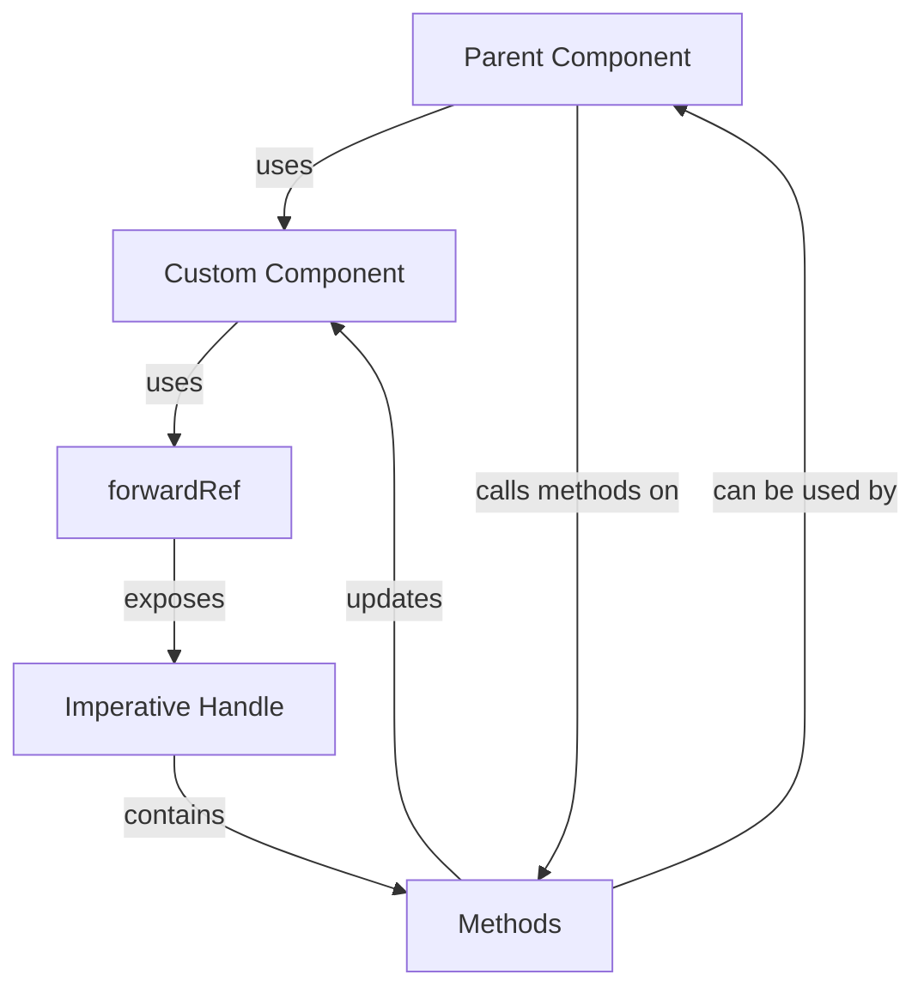

## Introduction
**useImperativeHandle** is a React hook that allows you to customize the instance value that is exposed to parent components when using **forwardRef**. This hook is essential when you want to create a custom component that needs to be controlled by a parent component. In this section, we will explore what **useImperativeHandle** is, why it matters, and its real-world relevance.

> **Note:** **useImperativeHandle** is a part of the React Hooks API, which provides a way to use state and other React features without writing a class component.

In real-world scenarios, you may encounter situations where you need to create a custom component that needs to be controlled by a parent component. For example, you may want to create a custom input field that needs to be focused or blurred by a parent component. This is where **useImperativeHandle** comes in handy.

## Core Concepts
Before diving into the details of **useImperativeHandle**, let's define some key terms:

* **forwardRef**: A React hook that allows you to forward a reference to a child component.
* **useImperativeHandle**: A React hook that allows you to customize the instance value that is exposed to parent components when using **forwardRef**.
* **Imperative handle**: The instance value that is exposed to parent components when using **useImperativeHandle**.

> **Tip:** When using **useImperativeHandle**, make sure to define the imperative handle as a function that returns an object with the desired methods.

## How It Works Internally
When you use **useImperativeHandle**, React creates an imperative handle that is exposed to parent components. The imperative handle is an object that contains the methods that you define using **useImperativeHandle**.

Here's a step-by-step breakdown of how **useImperativeHandle** works internally:

1. You define a custom component that uses **forwardRef**.
2. You define an imperative handle using **useImperativeHandle**.
3. React creates an instance of the custom component and passes the imperative handle to the parent component.
4. The parent component can then use the imperative handle to control the custom component.

> **Warning:** When using **useImperativeHandle**, make sure to handle the case where the imperative handle is null or undefined.

## Code Examples
Here are three complete and runnable examples of using **useImperativeHandle** with **forwardRef**:

### Example 1: Basic Usage
```javascript
import React, { forwardRef, useImperativeHandle } from 'react';

const CustomInput = forwardRef((props, ref) => {
  const inputRef = React.createRef();

  useImperativeHandle(ref, () => ({
    focus: () => {
      inputRef.current.focus();
    },
    blur: () => {
      inputRef.current.blur();
    },
  }));

  return <input ref={inputRef} />;
});

const ParentComponent = () => {
  const inputRef = React.createRef();

  const handleFocus = () => {
    inputRef.current.focus();
  };

  const handleBlur = () => {
    inputRef.current.blur();
  };

  return (
    <div>
      <CustomInput ref={inputRef} />
      <button onClick={handleFocus}>Focus</button>
      <button onClick={handleBlur}>Blur</button>
    </div>
  );
};
```

### Example 2: Real-world Pattern
```javascript
import React, { forwardRef, useImperativeHandle } from 'react';

const CustomTextarea = forwardRef((props, ref) => {
  const textareaRef = React.createRef();

  useImperativeHandle(ref, () => ({
    setValue: (value) => {
      textareaRef.current.value = value;
    },
    getValue: () => {
      return textareaRef.current.value;
    },
  }));

  return <textarea ref={textareaRef} />;
});

const Editor = () => {
  const textareaRef = React.createRef();

  const handleSetValue = () => {
    textareaRef.current.setValue('Hello World!');
  };

  const handleGetValue = () => {
    console.log(textareaRef.current.getValue());
  };

  return (
    <div>
      <CustomTextarea ref={textareaRef} />
      <button onClick={handleSetValue}>Set Value</button>
      <button onClick={handleGetValue}>Get Value</button>
    </div>
  );
};
```

### Example 3: Advanced Usage
```javascript
import React, { forwardRef, useImperativeHandle, useState } from 'react';

const CustomSelect = forwardRef((props, ref) => {
  const [selectedValue, setSelectedValue] = useState('');

  const selectRef = React.createRef();

  useImperativeHandle(ref, () => ({
    setSelectedValue: (value) => {
      setSelectedValue(value);
      selectRef.current.value = value;
    },
    getSelectedValue: () => {
      return selectedValue;
    },
  }));

  return (
    <select ref={selectRef} value={selectedValue} onChange={(e) => setSelectedValue(e.target.value)}>
      <option value="option1">Option 1</option>
      <option value="option2">Option 2</option>
      <option value="option3">Option 3</option>
    </select>
  );
});

const Form = () => {
  const selectRef = React.createRef();

  const handleSetSelectedValue = () => {
    selectRef.current.setSelectedValue('option2');
  };

  const handleGetSelectedValue = () => {
    console.log(selectRef.current.getSelectedValue());
  };

  return (
    <div>
      <CustomSelect ref={selectRef} />
      <button onClick={handleSetSelectedValue}>Set Selected Value</button>
      <button onClick={handleGetSelectedValue}>Get Selected Value</button>
    </div>
  );
};
```

## Visual Diagram

This diagram illustrates the relationship between the parent component, custom component, **forwardRef**, imperative handle, and methods.

## Comparison
| Approach | Time Complexity | Space Complexity | Pros | Cons | Best For |
| --- | --- | --- | --- | --- | --- |
| **useImperativeHandle** | O(1) | O(1) | Allows for customizing the instance value, provides a way to expose methods to parent components | Can be complex to use, requires careful handling of the imperative handle | Custom components that need to be controlled by parent components |
| **forwardRef** | O(1) | O(1) | Allows for forwarding a reference to a child component, provides a way to expose the child component's instance | Can be limited in its functionality, requires careful handling of the reference | Custom components that need to be controlled by parent components |
| **useCallback** | O(1) | O(1) | Memoizes a function, provides a way to optimize performance | Can be complex to use, requires careful handling of the memoized function | Optimizing performance in functional components |
| **useRef** | O(1) | O(1) | Creates a reference, provides a way to store a value that persists between renders | Can be limited in its functionality, requires careful handling of the reference | Creating references to DOM nodes or other values |

## Real-world Use Cases
Here are three real-world use cases for **useImperativeHandle**:

1. **Custom input fields**: You can use **useImperativeHandle** to create custom input fields that can be controlled by parent components. For example, you can create a custom input field that can be focused or blurred by a parent component.
2. **Custom select menus**: You can use **useImperativeHandle** to create custom select menus that can be controlled by parent components. For example, you can create a custom select menu that can be opened or closed by a parent component.
3. **Custom editors**: You can use **useImperativeHandle** to create custom editors that can be controlled by parent components. For example, you can create a custom text editor that can be used to edit text in a parent component.

Companies like Facebook, Google, and Microsoft use **useImperativeHandle** to create custom components that can be controlled by parent components.

## Common Pitfalls
Here are four common pitfalls to watch out for when using **useImperativeHandle**:

1. **Not handling the case where the imperative handle is null or undefined**: Make sure to handle the case where the imperative handle is null or undefined to avoid errors.
2. **Not using the imperative handle correctly**: Make sure to use the imperative handle correctly to avoid errors. For example, make sure to call the methods on the imperative handle correctly.
3. **Not updating the imperative handle correctly**: Make sure to update the imperative handle correctly to avoid errors. For example, make sure to update the methods on the imperative handle correctly.
4. **Not using **useImperativeHandle** with **forwardRef** correctly**: Make sure to use **useImperativeHandle** with **forwardRef** correctly to avoid errors. For example, make sure to pass the correct arguments to **forwardRef**.

> **Warning:** Not handling the case where the imperative handle is null or undefined can cause errors.

## Interview Tips
Here are three common interview questions related to **useImperativeHandle**:

1. **What is **useImperativeHandle** and how does it work?**: Make sure to explain what **useImperativeHandle** is and how it works, including its relationship with **forwardRef**.
2. **How do you use **useImperativeHandle** to create a custom component that can be controlled by a parent component?**: Make sure to explain how to use **useImperativeHandle** to create a custom component that can be controlled by a parent component, including how to define the imperative handle and how to use it.
3. **What are some common pitfalls to watch out for when using **useImperativeHandle**?**: Make sure to explain some common pitfalls to watch out for when using **useImperativeHandle**, including not handling the case where the imperative handle is null or undefined and not using the imperative handle correctly.

> **Interview:** Be prepared to answer questions about **useImperativeHandle** and how to use it to create custom components that can be controlled by parent components.

## Key Takeaways
Here are ten key takeaways to remember when using **useImperativeHandle**:

* **useImperativeHandle** is a React hook that allows you to customize the instance value that is exposed to parent components when using **forwardRef**.
* **forwardRef** is a React hook that allows you to forward a reference to a child component.
* The imperative handle is an object that contains the methods that you define using **useImperativeHandle**.
* Make sure to handle the case where the imperative handle is null or undefined to avoid errors.
* Make sure to use the imperative handle correctly to avoid errors.
* Make sure to update the imperative handle correctly to avoid errors.
* **useImperativeHandle** is commonly used to create custom components that can be controlled by parent components.
* Companies like Facebook, Google, and Microsoft use **useImperativeHandle** to create custom components that can be controlled by parent components.
* **useImperativeHandle** has a time complexity of O(1) and a space complexity of O(1).
* **useImperativeHandle** is a powerful tool for creating custom components that can be controlled by parent components, but it requires careful handling to avoid errors.