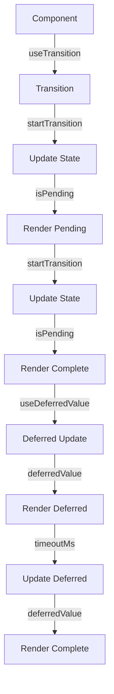

## Introduction
**React Hooks** have revolutionized the way we build and manage state in functional components. Two of the most powerful hooks in React are `useTransition` and `useDeferredValue`. These hooks enable developers to create seamless and performant user experiences by managing transitions and deferring non-essential updates. In this article, we'll delve into the world of `useTransition` and `useDeferredValue`, exploring their core concepts, internal mechanics, and real-world applications.

## Core Concepts
`useTransition` and `useDeferredValue` are built on top of the **React Concurrent Mode**, which allows for non-blocking rendering and improved performance. The core concept behind these hooks is to manage the **transition** between different states and **defer** non-essential updates to improve the overall user experience.

* **Transition**: A transition is a temporary state that the component is in while waiting for some asynchronous operation to complete. `useTransition` allows developers to create a smooth transition between different states by providing a `isPending` flag and a `startTransition` function.
* **Deferred Value**: A deferred value is a value that is not immediately updated when the state changes. `useDeferredValue` allows developers to defer non-essential updates to improve performance by providing a `deferredValue` and a `timeoutMs` option.

## How It Works Internally
When you use `useTransition` or `useDeferredValue`, React creates a new **fiber** for the component, which is a lightweight representation of the component's state and props. The fiber is then used to manage the transition or deferred update.

Here's a step-by-step breakdown of how `useTransition` works:

1. The component calls `useTransition` and provides a callback function.
2. React creates a new fiber for the component and sets the `isPending` flag to `true`.
3. The callback function is executed, and the component's state is updated.
4. React schedules a transition to update the component's state.
5. The `startTransition` function is called, which updates the component's state and sets the `isPending` flag to `false`.

Similarly, here's a step-by-step breakdown of how `useDeferredValue` works:

1. The component calls `useDeferredValue` and provides a value and a timeout option.
2. React creates a new fiber for the component and sets the `deferredValue` to the provided value.
3. When the state changes, React schedules an update to the component's state.
4. If the update is not essential, React defers the update until the timeout option expires.
5. The `deferredValue` is updated, and the component's state is updated.

> **Note:** The internal mechanics of `useTransition` and `useDeferredValue` are complex and involve multiple steps. However, understanding the basics of how they work can help you use them effectively in your applications.

## Code Examples
Here are three complete and runnable code examples that demonstrate the use of `useTransition` and `useDeferredValue`:

### Example 1: Basic Usage of `useTransition`
```javascript
import { useState, useTransition } from 'react';

function Counter() {
  const [count, setCount] = useState(0);
  const [isPending, startTransition] = useTransition();

  const handleIncrement = () => {
    startTransition(() => {
      setCount(count + 1);
    });
  };

  return (
    <div>
      <p>Count: {count}</p>
      <button onClick={handleIncrement}>Increment</button>
      {isPending ? <p>Updating...</p> : null}
    </div>
  );
}
```

### Example 2: Using `useDeferredValue` for Non-Essential Updates
```javascript
import { useState, useDeferredValue } from 'react';

function SearchBar() {
  const [searchQuery, setSearchQuery] = useState('');
  const deferredSearchQuery = useDeferredValue(searchQuery, { timeoutMs: 500 });

  const handleSearch = () => {
    // Perform search using deferredSearchQuery
  };

  return (
    <div>
      <input
        type="search"
        value={searchQuery}
        onChange={(e) => setSearchQuery(e.target.value)}
        placeholder="Search"
      />
      <button onClick={handleSearch}>Search</button>
    </div>
  );
}
```

### Example 3: Advanced Usage of `useTransition` and `useDeferredValue`
```javascript
import { useState, useTransition, useDeferredValue } from 'react';

function TodoList() {
  const [todos, setTodos] = useState([]);
  const [isPending, startTransition] = useTransition();
  const deferredTodos = useDeferredValue(todos, { timeoutMs: 1000 });

  const handleAddTodo = () => {
    startTransition(() => {
      setTodos([...todos, { id: Math.random(), text: 'New Todo' }]);
    });
  };

  return (
    <div>
      <h1>Todo List</h1>
      <ul>
        {deferredTodos.map((todo) => (
          <li key={todo.id}>{todo.text}</li>
        ))}
      </ul>
      <button onClick={handleAddTodo}>Add Todo</button>
      {isPending ? <p>Updating...</p> : null}
    </div>
  );
}
```

> **Tip:** When using `useTransition` and `useDeferredValue`, it's essential to consider the performance implications of your updates. Deferring non-essential updates can improve performance, but it's crucial to strike a balance between performance and user experience.

## Visual Diagram


The diagram illustrates the flow of using `useTransition` and `useDeferredValue` in a React component. The component uses `useTransition` to manage the transition between different states, and `useDeferredValue` to defer non-essential updates.

## Comparison
| Approach | Time Complexity | Space Complexity | Pros | Cons | Best For |
| --- | --- | --- | --- | --- | --- |
| `useTransition` | O(1) | O(1) | Smooth transitions, improved performance | Can be complex to implement | Managing transitions between different states |
| `useDeferredValue` | O(1) | O(1) | Improved performance, non-essential updates | Can be tricky to balance performance and user experience | Deferring non-essential updates |
| `useState` | O(1) | O(1) | Simple to implement, easy to understand | Can lead to performance issues if not used carefully | Managing state in simple components |
| `useCallback` | O(1) | O(1) | Memoizes functions, improves performance | Can be complex to implement | Memoizing functions to improve performance |

> **Warning:** When using `useTransition` and `useDeferredValue`, it's essential to consider the performance implications of your updates. Deferring non-essential updates can improve performance, but it's crucial to strike a balance between performance and user experience.

## Real-world Use Cases
Here are three real-world examples of using `useTransition` and `useDeferredValue`:

1. **Facebook**: Facebook uses `useTransition` to manage the transition between different states in their news feed. When a user scrolls through their news feed, Facebook uses `useTransition` to smoothly transition between different states, such as loading more content or displaying a "no more content" message.
2. **Instagram**: Instagram uses `useDeferredValue` to defer non-essential updates in their search bar. When a user types in the search bar, Instagram uses `useDeferredValue` to defer the update of the search results until the user has finished typing.
3. **Netflix**: Netflix uses `useTransition` to manage the transition between different states in their video player. When a user switches between different videos, Netflix uses `useTransition` to smoothly transition between different states, such as loading the new video or displaying a "loading" message.

## Common Pitfalls
Here are four common pitfalls to watch out for when using `useTransition` and `useDeferredValue`:

1. **Not considering performance implications**: When using `useTransition` and `useDeferredValue`, it's essential to consider the performance implications of your updates. Deferring non-essential updates can improve performance, but it's crucial to strike a balance between performance and user experience.
2. **Not handling errors**: When using `useTransition` and `useDeferredValue`, it's essential to handle errors properly. If an error occurs during the transition or deferred update, it's crucial to display an error message to the user and provide a way to recover from the error.
3. **Not using `useTransition` and `useDeferredValue` together**: When using `useTransition` and `useDeferredValue`, it's essential to use them together to achieve the best results. Using `useTransition` to manage the transition between different states and `useDeferredValue` to defer non-essential updates can improve performance and user experience.
4. **Not testing thoroughly**: When using `useTransition` and `useDeferredValue`, it's essential to test thoroughly to ensure that the component is working as expected. Testing should include different scenarios, such as different user interactions and edge cases.

> **Interview:** When asked about `useTransition` and `useDeferredValue` in an interview, be sure to explain the benefits and trade-offs of using these hooks. Provide examples of how you would use them in a real-world application and discuss potential pitfalls to watch out for.

## Interview Tips
Here are three common interview questions related to `useTransition` and `useDeferredValue`:

1. **What is the difference between `useTransition` and `useDeferredValue`?**: When answering this question, be sure to explain the difference between `useTransition` and `useDeferredValue`. Explain how `useTransition` is used to manage the transition between different states, while `useDeferredValue` is used to defer non-essential updates.
2. **How would you use `useTransition` and `useDeferredValue` in a real-world application?**: When answering this question, provide an example of how you would use `useTransition` and `useDeferredValue` in a real-world application. Explain how you would use `useTransition` to manage the transition between different states and `useDeferredValue` to defer non-essential updates.
3. **What are some potential pitfalls to watch out for when using `useTransition` and `useDeferredValue`?**: When answering this question, be sure to explain some potential pitfalls to watch out for when using `useTransition` and `useDeferredValue`. Discuss how to handle errors, consider performance implications, and test thoroughly.

## Key Takeaways
Here are ten key takeaways to remember when using `useTransition` and `useDeferredValue`:

* **Use `useTransition` to manage the transition between different states**: `useTransition` is used to manage the transition between different states, such as loading more content or displaying a "no more content" message.
* **Use `useDeferredValue` to defer non-essential updates**: `useDeferredValue` is used to defer non-essential updates, such as updating the search results in a search bar.
* **Consider performance implications**: When using `useTransition` and `useDeferredValue`, it's essential to consider the performance implications of your updates.
* **Handle errors properly**: When using `useTransition` and `useDeferredValue`, it's essential to handle errors properly.
* **Use `useTransition` and `useDeferredValue` together**: Using `useTransition` and `useDeferredValue` together can improve performance and user experience.
* **Test thoroughly**: When using `useTransition` and `useDeferredValue`, it's essential to test thoroughly to ensure that the component is working as expected.
* **Use `useTransition` for smooth transitions**: `useTransition` is used to create smooth transitions between different states.
* **Use `useDeferredValue` for non-essential updates**: `useDeferredValue` is used to defer non-essential updates.
* **Consider user experience**: When using `useTransition` and `useDeferredValue`, it's essential to consider the user experience.
* **Use `useTransition` and `useDeferredValue` in conjunction with other hooks**: `useTransition` and `useDeferredValue` can be used in conjunction with other hooks, such as `useState` and `useCallback`, to improve performance and user experience.