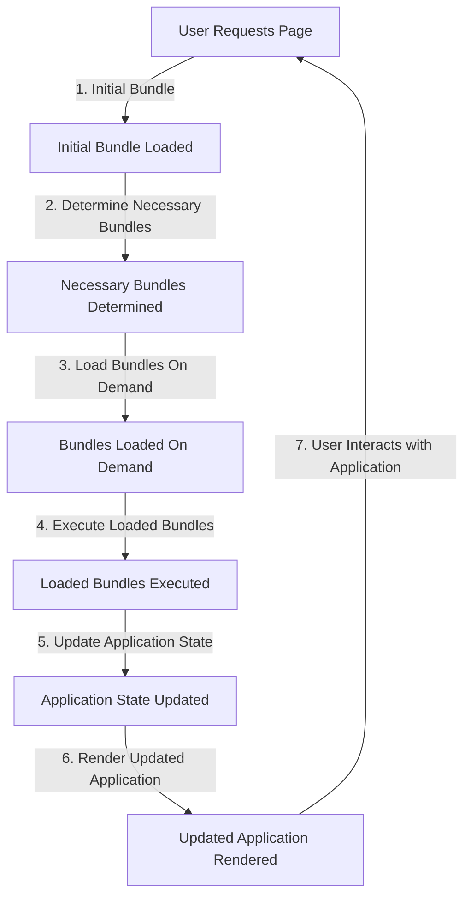

## Introduction
**Code Splitting Strategies** are techniques used to divide a large application into smaller, independent chunks, allowing for more efficient loading and execution. This approach is crucial in modern web development, particularly with the rise of single-page applications (SPAs) and complex front-end architectures. By splitting code into smaller modules, developers can improve page load times, reduce memory usage, and enhance overall user experience. In this section, we will delve into the world of code splitting, exploring its concepts, benefits, and real-world applications.

> **Note:** Code splitting is not limited to React; it can be applied to various front-end frameworks and libraries. However, React provides a robust set of tools and APIs for implementing code splitting strategies.

## Core Concepts
To understand code splitting, it's essential to grasp the following key concepts:

* **Code Splitting:** The process of dividing a large application into smaller, independent chunks, called **bundles** or **chunks**.
* **Bundle:** A self-contained module that contains a set of related code, such as a React component and its dependencies.
* **Chunk:** A smaller unit of code that can be loaded on demand, often used to describe a subset of a bundle.
* **Lazy Loading:** The technique of loading code only when it's needed, rather than loading everything upfront.

> **Tip:** When implementing code splitting, it's crucial to consider the trade-off between the number of bundles and the overhead of loading each bundle. Too many small bundles can lead to increased overhead, while too few large bundles can result in slower page loads.

## How It Works Internally
When a user navigates to a React application, the following process occurs:

1. The initial bundle is loaded, containing the application's entry point and necessary dependencies.
2. As the user interacts with the application, the React router (or other navigation mechanism) determines which bundles are required for the next page or feature.
3. The necessary bundles are loaded on demand, using techniques like **lazy loading** or **preloading**.
4. The loaded bundles are then executed, and the application's state is updated accordingly.

> **Warning:** Code splitting can introduce complexity, particularly when dealing with circular dependencies or shared state between bundles. It's essential to carefully design and implement code splitting strategies to avoid issues like bundle duplication or incorrect loading order.

## Code Examples
### Example 1: Basic Code Splitting with React
```javascript
// Import React and ReactDOM
import React from 'react';
import ReactDOM from 'react-dom';

// Define a simple component
const Hello = () => {
  return <div>Hello World!</div>;
};

// Create a bundle for the Hello component
const helloBundle = () => {
  return import('./hello.js').then((module) => {
    return module.default;
  });
};

// Load the helloBundle on demand
const App = () => {
  const [hello, setHello] = React.useState(null);

  React.useEffect(() => {
    helloBundle().then((HelloComponent) => {
      setHello(<HelloComponent />);
    });
  }, []);

  return (
    <div>
      {hello}
    </div>
  );
};

// Render the App component
ReactDOM.render(<App />, document.getElementById('root'));
```
### Example 2: Using React.lazy and Suspense
```javascript
// Import React and ReactDOM
import React, { lazy, Suspense } from 'react';
import ReactDOM from 'react-dom';

// Define a lazy-loaded component
const Hello = lazy(() => import('./hello.js'));

// Create a Suspense boundary
const App = () => {
  return (
    <Suspense fallback={<div>Loading...</div>}>
      <Hello />
    </Suspense>
  );
};

// Render the App component
ReactDOM.render(<App />, document.getElementById('root'));
```
### Example 3: Advanced Code Splitting with React Router
```javascript
// Import React, React Router, and React.lazy
import React from 'react';
import { BrowserRouter, Route, Switch } from 'react-router-dom';
import { lazy } from 'react';

// Define lazy-loaded routes
const Home = lazy(() => import('./home.js'));
const About = lazy(() => import('./about.js'));

// Create a React Router configuration
const App = () => {
  return (
    <BrowserRouter>
      <Switch>
        <Route path="/" exact component={Home} />
        <Route path="/about" component={About} />
      </Switch>
    </BrowserRouter>
  );
};

// Render the App component
ReactDOM.render(<App />, document.getElementById('root'));
```
## Visual Diagram

The diagram illustrates the code splitting process, from the initial bundle load to the execution of loaded bundles and the update of the application state.

## Comparison
| Approach | Time Complexity | Space Complexity | Pros | Cons | Best For |
| --- | --- | --- | --- | --- | --- |
| **Lazy Loading** | O(1) | O(n) | Fast page loads, reduced memory usage | Increased overhead, complex implementation | Applications with many features or pages |
| **Preloading** | O(n) | O(1) | Fast page loads, simple implementation | Increased memory usage, slower initial load | Applications with few features or pages |
| **Code Splitting with React.lazy** | O(1) | O(n) | Easy implementation, fast page loads | Increased overhead, limited control | React applications with many components |
| **Code Splitting with Webpack** | O(n) | O(1) | High degree of control, flexible configuration | Steep learning curve, complex setup | Large-scale applications with complex dependencies |

## Real-world Use Cases
1. **Facebook**: Facebook uses code splitting to load features on demand, reducing the initial payload and improving page load times.
2. **Instagram**: Instagram employs code splitting to load individual features, such as the camera or messaging, only when the user interacts with them.
3. **Pinterest**: Pinterest uses code splitting to load boards and pins on demand, improving the overall user experience and reducing memory usage.

## Common Pitfalls
1. **Incorrect Bundle Loading Order**: Failing to load bundles in the correct order can lead to errors or unexpected behavior.
2. **Duplicate Bundles**: Loading duplicate bundles can increase memory usage and slow down the application.
3. **Circular Dependencies**: Circular dependencies between bundles can cause issues with loading and execution.
4. **Insufficient Error Handling**: Failing to handle errors properly can lead to crashes or unexpected behavior.

> **Interview:** Can you explain the difference between lazy loading and preloading in code splitting? How would you implement code splitting in a React application?

## Interview Tips
1. **Be prepared to explain code splitting concepts**: Understand the basics of code splitting, including lazy loading, preloading, and bundle management.
2. **Know how to implement code splitting in React**: Be familiar with React.lazy, Suspense, and other relevant APIs.
3. **Discuss common pitfalls and solutions**: Be prepared to address common issues, such as incorrect bundle loading order or circular dependencies.

## Key Takeaways
* Code splitting is a technique for dividing a large application into smaller, independent chunks.
* React provides a range of tools and APIs for implementing code splitting strategies.
* Lazy loading and preloading are two common approaches to code splitting.
* Code splitting can improve page load times, reduce memory usage, and enhance overall user experience.
* Common pitfalls include incorrect bundle loading order, duplicate bundles, and circular dependencies.
* Error handling is crucial when implementing code splitting.
* Code splitting is not limited to React; it can be applied to various front-end frameworks and libraries.