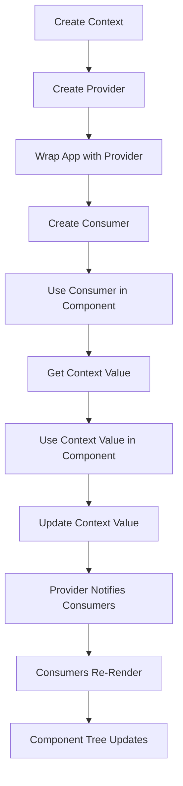

## Introduction
The **Context API** is a powerful tool in **React** that allows you to share state between components without passing props down manually. It was introduced in React 16.3 as a solution to the "prop drilling" problem, where you had to pass props through multiple levels of components just to get them to a child component. The Context API provides a way to share data between components without having to pass props down through every level. This makes it easier to manage state and reduces the complexity of your component tree. Every engineer working with React needs to understand the Context API, as it is a fundamental concept in building scalable and maintainable applications.

## Core Concepts
To understand the Context API, you need to grasp a few key concepts:
- **Context**: A context is an object that holds a value that can be shared between components. You can think of it as a container that holds some data.
- **Provider**: A provider is a component that wraps your app and provides the context to all its child components. It is responsible for managing the state of the context.
- **Consumer**: A consumer is a component that uses the context provided by a provider. It can be a child component of the provider or a descendant of the provider.
- **React.createContext**: This is a function that creates a new context. It takes an optional default value as an argument.

> **Note:** The Context API is not a replacement for state management libraries like Redux or MobX. It is designed to handle local state that is specific to a particular part of your application.

## How It Works Internally
When you create a context using `React.createContext`, React creates a new context object that can be used to share state between components. The context object has a `Provider` component that you can use to wrap your app. The provider component takes a `value` prop that is the value you want to share between components.

Here's a step-by-step breakdown of how it works:
1. You create a context using `React.createContext`.
2. You wrap your app with the `Provider` component, passing the value you want to share as a prop.
3. The provider component creates a new context object and passes it down to its child components.
4. Child components can use the `Consumer` component to access the context value.
5. When the provider's value changes, all child components that use the consumer will re-render with the new value.

> **Warning:** Be careful when using the Context API, as it can lead to performance issues if not used correctly. Make sure to memoize values and use `useCallback` to prevent unnecessary re-renders.

## Code Examples
### Example 1: Basic Usage
```javascript
// Create a context
const ThemeContext = React.createContext();

// Create a provider component
const ThemeProvider = ({ children }) => {
  const [theme, setTheme] = React.useState('light');

  return (
    <ThemeContext.Provider value={{ theme, setTheme }}>
      {children}
    </ThemeContext.Provider>
  );
};

// Create a consumer component
const ThemeConsumer = () => {
  const { theme } = React.useContext(ThemeContext);

  return <div>Current theme: {theme}</div>;
};

// Use the provider and consumer components
const App = () => {
  return (
    <ThemeProvider>
      <ThemeConsumer />
    </ThemeProvider>
  );
};
```

### Example 2: Real-World Pattern
```javascript
// Create a context for user authentication
const AuthContext = React.createContext();

// Create a provider component for authentication
const AuthProvider = ({ children }) => {
  const [user, setUser] = React.useState(null);
  const [isLoading, setIsLoading] = React.useState(true);

  React.useEffect(() => {
    const fetchUser = async () => {
      const response = await fetch('/api/user');
      const data = await response.json();
      setUser(data);
      setIsLoading(false);
    };

    fetchUser();
  }, []);

  return (
    <AuthContext.Provider value={{ user, isLoading }}>
      {children}
    </AuthContext.Provider>
  );
};

// Create a consumer component for authentication
const AuthConsumer = () => {
  const { user, isLoading } = React.useContext(AuthContext);

  if (isLoading) {
    return <div>Loading...</div>;
  }

  if (!user) {
    return <div>You are not logged in.</div>;
  }

  return <div>Welcome, {user.name}!</div>;
};

// Use the provider and consumer components
const App = () => {
  return (
    <AuthProvider>
      <AuthConsumer />
    </AuthProvider>
  );
};
```

### Example 3: Advanced Usage
```javascript
// Create a context for managing a todo list
const TodoContext = React.createContext();

// Create a provider component for the todo list
const TodoProvider = ({ children }) => {
  const [todos, setTodos] = React.useState([]);
  const [newTodo, setNewTodo] = React.useState('');

  const addTodo = () => {
    setTodos([...todos, newTodo]);
    setNewTodo('');
  };

  return (
    <TodoContext.Provider value={{ todos, newTodo, addTodo, setNewTodo }}>
      {children}
    </TodoContext.Provider>
  );
};

// Create a consumer component for the todo list
const TodoConsumer = () => {
  const { todos, newTodo, addTodo, setNewTodo } = React.useContext(TodoContext);

  return (
    <div>
      <input
        type="text"
        value={newTodo}
        onChange={(e) => setNewTodo(e.target.value)}
      />
      <button onClick={addTodo}>Add Todo</button>
      <ul>
        {todos.map((todo, index) => (
          <li key={index}>{todo}</li>
        ))}
      </ul>
    </div>
  );
};

// Use the provider and consumer components
const App = () => {
  return (
    <TodoProvider>
      <TodoConsumer />
    </TodoProvider>
  );
};
```

## Visual Diagram

The Context API works by creating a context object that is shared between components. The provider component wraps the app and provides the context to its child components. The consumer component uses the context value in its component. When the provider's value changes, all child components that use the consumer will re-render with the new value.

## Comparison
| Approach | Time Complexity | Space Complexity | Pros | Cons | Best For |
| --- | --- | --- | --- | --- | --- |
| Context API | O(1) | O(1) | Easy to use, simple to implement | Limited to small-scale apps, can lead to performance issues | Small-scale apps, prototyping |
| Redux | O(n) | O(n) | Scalable, maintainable, predictable | Steep learning curve, boilerplate code | Large-scale apps, complex state management |
| MobX | O(n) | O(n) | Reactive, easy to use, scalable | Can be overkill for small apps, performance issues | Large-scale apps, complex state management |
| Local State | O(1) | O(1) | Simple, easy to use | Limited to single component, not scalable | Small-scale apps, simple state management |

> **Tip:** When choosing a state management approach, consider the size and complexity of your app. The Context API is suitable for small-scale apps, while Redux and MobX are better suited for large-scale apps with complex state management.

## Real-world Use Cases
- **Facebook**: Facebook uses the Context API to manage its authentication state across the entire app.
- **Instagram**: Instagram uses a combination of the Context API and Redux to manage its state.
- **Airbnb**: Airbnb uses a custom state management solution that is similar to the Context API.

## Common Pitfalls
1. **Not memoizing values**: Failing to memoize values can lead to unnecessary re-renders and performance issues.
```javascript
// Wrong
const MyComponent = () => {
  const [count, setCount] = React.useState(0);
  const handleIncrement = () => {
    setCount(count + 1);
  };

  return (
    <div>
      <button onClick={handleIncrement}>Increment</button>
      <p>Count: {count}</p>
    </div>
  );
};

// Right
const MyComponent = () => {
  const [count, setCount] = React.useState(0);
  const handleIncrement = React.useCallback(() => {
    setCount((prevCount) => prevCount + 1);
  }, []);

  return (
    <div>
      <button onClick={handleIncrement}>Increment</button>
      <p>Count: {count}</p>
    </div>
  );
};
```

2. **Not using `useCallback`**: Failing to use `useCallback` can lead to unnecessary re-renders and performance issues.
```javascript
// Wrong
const MyComponent = () => {
  const [count, setCount] = React.useState(0);
  const handleIncrement = () => {
    setCount(count + 1);
  };

  return (
    <div>
      <button onClick={handleIncrement}>Increment</button>
      <p>Count: {count}</p>
    </div>
  );
};

// Right
const MyComponent = () => {
  const [count, setCount] = React.useState(0);
  const handleIncrement = React.useCallback(() => {
    setCount((prevCount) => prevCount + 1);
  }, []);

  return (
    <div>
      <button onClick={handleIncrement}>Increment</button>
      <p>Count: {count}</p>
    </div>
  );
};
```

3. **Not handling errors**: Failing to handle errors can lead to unexpected behavior and crashes.
```javascript
// Wrong
const MyComponent = () => {
  const [data, setData] = React.useState(null);
  React.useEffect(() => {
    const fetchData = async () => {
      const response = await fetch('/api/data');
      const data = await response.json();
      setData(data);
    };

    fetchData();
  }, []);

  return (
    <div>
      {data ? <p>Data: {data}</p> : <p>Loading...</p>}
    </div>
  );
};

// Right
const MyComponent = () => {
  const [data, setData] = React.useState(null);
  const [error, setError] = React.useState(null);
  React.useEffect(() => {
    const fetchData = async () => {
      try {
        const response = await fetch('/api/data');
        const data = await response.json();
        setData(data);
      } catch (error) {
        setError(error);
      }
    };

    fetchData();
  }, []);

  return (
    <div>
      {data ? (
        <p>Data: {data}</p>
      ) : error ? (
        <p>Error: {error.message}</p>
      ) : (
        <p>Loading...</p>
      )}
    </div>
  );
};
```

4. **Not optimizing performance**: Failing to optimize performance can lead to slow and unresponsive apps.
```javascript
// Wrong
const MyComponent = () => {
  const [data, setData] = React.useState(null);
  React.useEffect(() => {
    const fetchData = async () => {
      const response = await fetch('/api/data');
      const data = await response.json();
      setData(data);
    };

    fetchData();
  }, []);

  return (
    <div>
      {data ? (
        <ul>
          {data.map((item) => (
            <li key={item.id}>{item.name}</li>
          ))}
        </ul>
      ) : (
        <p>Loading...</p>
      )}
    </div>
  );
};

// Right
const MyComponent = () => {
  const [data, setData] = React.useState(null);
  React.useEffect(() => {
    const fetchData = async () => {
      const response = await fetch('/api/data');
      const data = await response.json();
      setData(data);
    };

    fetchData();
  }, []);

  return (
    <div>
      {data ? (
        <ul>
          {data.map((item) => (
            <React.memo(() => (
              <li key={item.id}>{item.name}</li>
            ))
          ))}
        </ul>
      ) : (
        <p>Loading...</p>
      )}
    </div>
  );
};
```

## Interview Tips
1. **What is the Context API?**: The Context API is a way to share state between components without passing props down manually.
```javascript
// Example answer
The Context API is a way to share state between components without passing props down manually. It provides a way to manage state that is shared between multiple components, making it easier to manage complex state and reduce the complexity of your component tree.
```

2. **How does the Context API work?**: The Context API works by creating a context object that is shared between components. The provider component wraps the app and provides the context to its child components. The consumer component uses the context value in its component.
```javascript
// Example answer
The Context API works by creating a context object that is shared between components. The provider component wraps the app and provides the context to its child components. The consumer component uses the context value in its component. When the provider's value changes, all child components that use the consumer will re-render with the new value.
```

3. **What are some common use cases for the Context API?**: Some common use cases for the Context API include managing authentication state, managing theme state, and managing data that is shared between multiple components.
```javascript
// Example answer
Some common use cases for the Context API include managing authentication state, managing theme state, and managing data that is shared between multiple components. For example, you can use the Context API to manage the authentication state of a user, so that you can easily access the user's data and authentication status throughout your app.
```

## Key Takeaways
* The Context API is a way to share state between components without passing props down manually.
* The Context API works by creating a context object that is shared between components.
* The provider component wraps the app and provides the context to its child components.
* The consumer component uses the context value in its component.
* The Context API is suitable for small-scale apps and prototyping.
* The Context API can lead to performance issues if not used correctly.
* Memoizing values and using `useCallback` can help optimize performance.
* Handling errors and optimizing performance are important when using the Context API.
* The Context API is not a replacement for state management libraries like Redux or MobX.