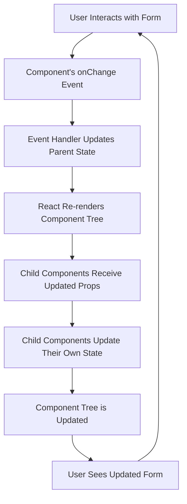

## Introduction
In React, forms are a crucial part of many applications, allowing users to interact with the system by providing input. When dealing with forms in React, it's essential to understand the difference between **controlled** and **uncontrolled components**. This distinction is vital because it affects how your application handles user input, updates the state, and manages the form's behavior. In this section, we will delve into the world of controlled and uncontrolled components, exploring their definitions, use cases, and implications for your React applications.

> **Note:** Controlled components are a fundamental concept in React, and understanding them is crucial for building robust and maintainable applications.

## Core Concepts
A **controlled component** is an element whose value is controlled by its parent component. In other words, the parent component is responsible for updating the element's value, and the element's value is always in sync with the parent's state. On the other hand, an **uncontrolled component** is an element whose value is not controlled by its parent component. The element's value is managed by the DOM itself, and the parent component does not have direct access to the element's value.

> **Warning:** Uncontrolled components can lead to issues with state management and debugging, as the component's state is not explicitly managed by the parent component.

Key terminology to keep in mind:

* **State**: The data that changes over time and affects the component's behavior.
* **Props**: Short for "properties," these are immutable values passed from a parent component to a child component.
* **Refs**: A way to access the DOM node or a React element in a component.

## How It Works Internally
When using controlled components, React updates the component's state and re-renders the component tree whenever the state changes. This process involves the following steps:

1. The user interacts with the form element (e.g., types something in a text input).
2. The element's `onChange` event is triggered, and the event handler is called.
3. The event handler updates the parent component's state using the `setState` method.
4. React re-renders the component tree, passing the updated state as props to the child components.
5. The child components receive the updated props and update their own state accordingly.

In contrast, uncontrolled components rely on the DOM to manage their state. When the user interacts with an uncontrolled component, the component's value is updated directly in the DOM, without involving the parent component's state.

## Code Examples
### Example 1: Basic Controlled Component
```javascript
import React, { useState } from 'react';

function ControlledInput() {
  const [value, setValue] = useState('');

  const handleChange = (event) => {
    // Update the state with the new value
    setValue(event.target.value);
  };

  return (
    <input
      type="text"
      value={value}
      onChange={handleChange}
      placeholder="Enter your name"
    />
  );
}
```
This example demonstrates a basic controlled component, where the parent component manages the input field's value using the `useState` hook.

### Example 2: Real-World Controlled Component
```javascript
import React, { useState } from 'react';

function LoginForm() {
  const [username, setUsername] = useState('');
  const [password, setPassword] = useState('');

  const handleUsernameChange = (event) => {
    setUsername(event.target.value);
  };

  const handlePasswordChange = (event) => {
    setPassword(event.target.value);
  };

  const handleSubmit = (event) => {
    event.preventDefault();
    // Submit the form data to the server
    console.log(`Username: ${username}, Password: ${password}`);
  };

  return (
    <form onSubmit={handleSubmit}>
      <label>
        Username:
        <input
          type="text"
          value={username}
          onChange={handleUsernameChange}
          placeholder="Enter your username"
        />
      </label>
      <br />
      <label>
        Password:
        <input
          type="password"
          value={password}
          onChange={handlePasswordChange}
          placeholder="Enter your password"
        />
      </label>
      <br />
      <button type="submit">Login</button>
    </form>
  );
}
```
This example demonstrates a more complex controlled component, where the parent component manages multiple input fields and handles form submission.

### Example 3: Uncontrolled Component
```javascript
import React, { useRef } from 'react';

function UncontrolledInput() {
  const inputRef = useRef(null);

  const handleSubmit = (event) => {
    event.preventDefault();
    // Get the input value from the ref
    const inputValue = inputRef.current.value;
    console.log(`Input value: ${inputValue}`);
  };

  return (
    <form onSubmit={handleSubmit}>
      <input
        type="text"
        ref={inputRef}
        placeholder="Enter your name"
      />
      <button type="submit">Submit</button>
    </form>
  );
}
```
This example demonstrates an uncontrolled component, where the parent component uses a ref to access the input field's value.

## Visual Diagram

This diagram illustrates the process of updating a controlled component's state and re-rendering the component tree.

## Comparison
| Approach | Time Complexity | Space Complexity | Pros | Cons | Best For |
| --- | --- | --- | --- | --- | --- |
| Controlled Components | O(1) | O(n) | Easy to manage state, predictable behavior | Can be verbose, requires more code | Complex forms, large-scale applications |
| Uncontrolled Components | O(1) | O(1) | Less code, easier to implement | Difficult to manage state, unpredictable behavior | Simple forms, small-scale applications |
| Refs | O(1) | O(1) | Provides direct access to DOM nodes | Can be error-prone, requires careful handling | Accessing DOM nodes, integrating with third-party libraries |
| Higher-Order Components (HOCs) | O(n) | O(n) | Provides a way to reuse code, manage state | Can be complex, requires careful implementation | Reusing code, managing state in complex applications |

> **Tip:** Choose controlled components for complex forms and large-scale applications, and uncontrolled components for simple forms and small-scale applications.

## Real-world Use Cases
1. **Facebook's Login Form**: Facebook's login form is a classic example of a controlled component. The form's input fields are managed by the parent component, and the state is updated accordingly.
2. **Google's Search Bar**: Google's search bar is an example of an uncontrolled component. The search bar's value is managed by the DOM, and the parent component uses a ref to access the value.
3. **Dropbox's File Upload Form**: Dropbox's file upload form is an example of a controlled component. The form's input fields are managed by the parent component, and the state is updated accordingly.

## Common Pitfalls
1. **Not updating the state correctly**: When using controlled components, it's essential to update the state correctly. Failing to do so can lead to unpredictable behavior and errors.
2. **Not using refs correctly**: When using uncontrolled components, it's essential to use refs correctly. Failing to do so can lead to errors and unexpected behavior.
3. **Not handling form submission correctly**: When using forms, it's essential to handle form submission correctly. Failing to do so can lead to errors and unexpected behavior.
4. **Not validating user input**: When using forms, it's essential to validate user input. Failing to do so can lead to security vulnerabilities and errors.

> **Warning:** Failing to update the state correctly can lead to unpredictable behavior and errors.

## Interview Tips
1. **What is the difference between controlled and uncontrolled components?**: A controlled component is an element whose value is controlled by its parent component, while an uncontrolled component is an element whose value is not controlled by its parent component.
2. **How do you handle form submission in React?**: To handle form submission in React, you need to use the `onSubmit` event handler and prevent the default form submission behavior.
3. **What is the purpose of refs in React?**: Refs provide a way to access DOM nodes or React elements in a component.

> **Interview:** When asked about controlled and uncontrolled components, be sure to explain the difference between the two and provide examples of when to use each.

## Key Takeaways
* Controlled components are elements whose value is controlled by their parent component.
* Uncontrolled components are elements whose value is not controlled by their parent component.
* Use controlled components for complex forms and large-scale applications.
* Use uncontrolled components for simple forms and small-scale applications.
* Refs provide a way to access DOM nodes or React elements in a component.
* Always update the state correctly when using controlled components.
* Always use refs correctly when using uncontrolled components.
* Always handle form submission correctly when using forms.
* Always validate user input when using forms.

> **Note:** By following these key takeaways, you can ensure that your React applications are robust, maintainable, and efficient.