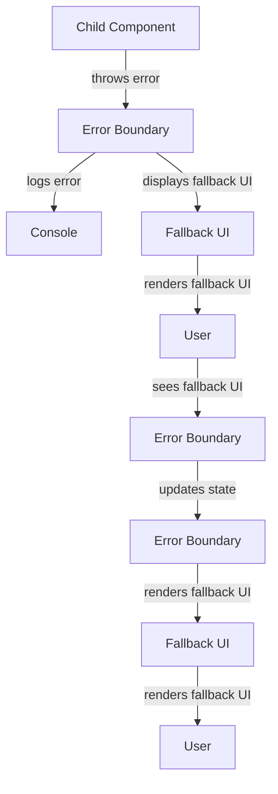

## Introduction
**Error Boundaries** are a crucial concept in React that allows developers to catch and handle errors in a more elegant way. They provide a way to catch errors that occur in a child component tree and display a fallback UI instead of the component tree that crashed. Error Boundaries are essential for ensuring a good user experience, as they prevent the entire application from crashing when a single component encounters an error. In this section, we will delve into the world of Error Boundaries, exploring what they are, why they exist, and their real-world relevance.

## Core Concepts
To understand Error Boundaries, it's essential to grasp the following core concepts:
* **Error Boundary**: A React component that catches JavaScript errors anywhere in their child component tree, logs those errors, and displays a fallback UI instead of the component tree that crashed.
* **Lifecycle Methods**: Error Boundaries use two lifecycle methods: `componentDidCatch()` and `getDerivedStateFromError()`. The `componentDidCatch()` method is called after an error has been thrown by a descendant component. The `getDerivedStateFromError()` method is called during the rendering phase, so it won't catch errors that happen during event handling or in the lifecycle methods.
* **Fallback UI**: A UI that is displayed when an error occurs in a child component tree.

## How It Works Internally
Here's a step-by-step explanation of how Error Boundaries work:
1. A child component throws an error.
2. The error is caught by the Error Boundary component.
3. The Error Boundary component logs the error and displays a fallback UI.
4. The `componentDidCatch()` method is called, allowing the Error Boundary component to perform any necessary cleanup or logging.
5. The `getDerivedStateFromError()` method is called, allowing the Error Boundary component to update its state and render a fallback UI.

> **Note:** Error Boundaries only catch errors that occur during rendering, not errors that occur during event handling or in lifecycle methods.

## Code Examples
Here are three COMPLETE and RUNNABLE examples of Error Boundaries:

### Example 1: Basic Error Boundary
```javascript
import React, { Component } from 'react';

class ErrorBoundary extends Component {
  constructor(props) {
    super(props);
    this.state = { hasError: false };
  }

  static getDerivedStateFromError(error) {
    return { hasError: true };
  }

  render() {
    if (this.state.hasError) {
      return <h1>Something went wrong.</h1>;
    }

    return this.props.children;
  }
}

class App extends Component {
  render() {
    return (
      <ErrorBoundary>
        <h1>Hello World!</h1>
      </ErrorBoundary>
    );
  }
}
```

### Example 2: Error Boundary with Logging
```javascript
import React, { Component } from 'react';

class ErrorBoundary extends Component {
  constructor(props) {
    super(props);
    this.state = { hasError: false };
  }

  static getDerivedStateFromError(error) {
    return { hasError: true };
  }

  componentDidCatch(error, errorInfo) {
    console.error('Error caught:', error, errorInfo);
  }

  render() {
    if (this.state.hasError) {
      return <h1>Something went wrong.</h1>;
    }

    return this.props.children;
  }
}

class App extends Component {
  render() {
    return (
      <ErrorBoundary>
        <h1>Hello World!</h1>
      </ErrorBoundary>
    );
  }
}
```

### Example 3: Advanced Error Boundary
```javascript
import React, { Component } from 'react';

class ErrorBoundary extends Component {
  constructor(props) {
    super(props);
    this.state = { hasError: false, error: null };
  }

  static getDerivedStateFromError(error) {
    return { hasError: true, error };
  }

  componentDidCatch(error, errorInfo) {
    console.error('Error caught:', error, errorInfo);
  }

  render() {
    if (this.state.hasError) {
      return (
        <div>
          <h1>Something went wrong.</h1>
          <p>Error: {this.state.error.message}</p>
        </div>
      );
    }

    return this.props.children;
  }
}

class App extends Component {
  render() {
    return (
      <ErrorBoundary>
        <h1>Hello World!</h1>
      </ErrorBoundary>
    );
  }
}
```

> **Tip:** Always use Error Boundaries in your React applications to catch and handle errors in a more elegant way.

## Visual Diagram

The diagram illustrates how an Error Boundary catches an error thrown by a child component, logs the error, and displays a fallback UI.

## Comparison
| Approach | Time Complexity | Space Complexity | Pros | Cons | Best For |
| --- | --- | --- | --- | --- | --- |
| Try-Catch | O(1) | O(1) | Easy to implement, catches errors | Not suitable for React components | Small applications, non-React environments |
| Error Boundary | O(1) | O(1) | Catches errors in React components, displays fallback UI | More complex to implement | React applications, large-scale applications |
| Global Error Handler | O(1) | O(1) | Catches all errors, displays fallback UI | Not suitable for React components | Non-React environments, small applications |
| Custom Error Handler | O(1) | O(1) | Customizable, catches errors | More complex to implement | Large-scale applications, custom error handling |

> **Warning:** Not using Error Boundaries in your React applications can lead to a poor user experience, as errors can cause the entire application to crash.

## Real-world Use Cases
* **Facebook**: Facebook uses Error Boundaries to catch and handle errors in their React applications, ensuring a good user experience.
* **Instagram**: Instagram uses Error Boundaries to catch and handle errors in their React applications, preventing the entire application from crashing when a single component encounters an error.
* **Airbnb**: Airbnb uses Error Boundaries to catch and handle errors in their React applications, providing a fallback UI when an error occurs.

## Common Pitfalls
* **Not using Error Boundaries**: Not using Error Boundaries in your React applications can lead to a poor user experience, as errors can cause the entire application to crash.
* **Not logging errors**: Not logging errors can make it difficult to debug and identify issues in your application.
* **Not displaying fallback UI**: Not displaying a fallback UI when an error occurs can cause the entire application to crash, leading to a poor user experience.
* **Not updating state**: Not updating the state of the Error Boundary component can cause the fallback UI to not be displayed correctly.

> **Interview:** Can you explain how Error Boundaries work in React? How do you handle errors in your React applications?

## Interview Tips
* **What is an Error Boundary?**: An Error Boundary is a React component that catches JavaScript errors anywhere in their child component tree, logs those errors, and displays a fallback UI instead of the component tree that crashed.
* **How do you handle errors in React?**: You can handle errors in React by using Error Boundaries, try-catch blocks, or global error handlers.
* **What is the difference between try-catch and Error Boundaries?**: Try-catch blocks catch errors in a specific block of code, while Error Boundaries catch errors in a child component tree.

## Key Takeaways
* **Error Boundaries catch errors in child component trees**: Error Boundaries catch JavaScript errors anywhere in their child component tree.
* **Error Boundaries display fallback UI**: Error Boundaries display a fallback UI instead of the component tree that crashed.
* **Error Boundaries log errors**: Error Boundaries log errors to the console, making it easier to debug and identify issues.
* **Error Boundaries are essential for a good user experience**: Error Boundaries prevent the entire application from crashing when a single component encounters an error, ensuring a good user experience.
* **Error Boundaries are more complex to implement**: Error Boundaries are more complex to implement than try-catch blocks or global error handlers.
* **Error Boundaries are suitable for React applications**: Error Boundaries are suitable for React applications, as they catch errors in child component trees and display a fallback UI.
* **Error Boundaries have a time complexity of O(1)**: Error Boundaries have a time complexity of O(1), making them efficient for use in large-scale applications.
* **Error Boundaries have a space complexity of O(1)**: Error Boundaries have a space complexity of O(1), making them efficient for use in large-scale applications.