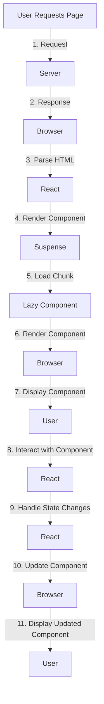

## Introduction
**Lazy loading** is a technique used to improve the performance of web applications by loading components or modules only when they are needed. In React, this can be achieved using `React.lazy` and `Suspense`. **React.lazy** allows you to define a component that will be loaded lazily, while **Suspense** provides a way to handle the loading state of a lazy-loaded component. In this section, we will explore the importance of lazy loading, its real-world relevance, and why every engineer needs to know about it.

Lazy loading is essential in modern web development because it helps to reduce the initial payload of an application, resulting in faster load times and improved user experience. By loading components only when they are needed, you can avoid loading unnecessary code and reduce the amount of data transferred over the network. This technique is particularly useful for large applications with many features, where loading all components upfront can lead to slow load times and high memory usage.

> **Note:** Lazy loading is not limited to React and can be applied to other frameworks and libraries as well. However, React provides a built-in solution with `React.lazy` and `Suspense`, making it easy to implement lazy loading in your applications.

## Core Concepts
To understand lazy loading with `React.lazy` and `Suspense`, you need to know the following core concepts:

* **Code splitting**: The process of dividing an application's code into smaller chunks that can be loaded on demand.
* **Lazy loading**: The technique of loading components or modules only when they are needed.
* **Suspense**: A React component that provides a way to handle the loading state of a lazy-loaded component.
* **React.lazy**: A function that allows you to define a component that will be loaded lazily.

A mental model that can help you understand lazy loading is to think of it as a just-in-time (JIT) compiler. Just like a JIT compiler loads and compiles code only when it is needed, lazy loading loads components only when they are needed, reducing the initial payload of an application.

> **Tip:** When using lazy loading, it's essential to consider the trade-off between load time and the number of requests made to the server. While lazy loading can reduce the initial payload, it may increase the number of requests made to the server, which can lead to slower load times if not optimized properly.

## How It Works Internally
When you use `React.lazy` to define a lazy-loaded component, React creates a new chunk of code that contains the component's code. This chunk is loaded only when the component is needed, reducing the initial payload of the application.

Here's a step-by-step breakdown of how lazy loading works with `React.lazy` and `Suspense`:

1. You define a lazy-loaded component using `React.lazy`.
2. When the component is needed, React loads the chunk of code that contains the component's code.
3. While the chunk is being loaded, React uses `Suspense` to handle the loading state of the component.
4. Once the chunk is loaded, React renders the component.

> **Warning:** When using lazy loading, it's essential to handle errors properly. If a lazy-loaded component fails to load, React will throw an error, which can be caught and handled using `ErrorBoundary`.

## Code Examples
Here are three complete and runnable code examples that demonstrate the use of `React.lazy` and `Suspense`:

### Example 1: Basic Lazy Loading
```javascript
import React, { Suspense } from 'react';

const LazyComponent = React.lazy(() => import('./LazyComponent'));

function App() {
  return (
    <div>
      <Suspense fallback={<div>Loading...</div>}>
        <LazyComponent />
      </Suspense>
    </div>
  );
}
```
This example demonstrates basic lazy loading using `React.lazy` and `Suspense`. The `LazyComponent` is loaded only when it is needed, and `Suspense` handles the loading state of the component.

### Example 2: Real-World Pattern
```javascript
import React, { Suspense, useState } from 'react';

const LazyComponent = React.lazy(() => import('./LazyComponent'));

function App() {
  const [showComponent, setShowComponent] = useState(false);

  return (
    <div>
      <button onClick={() => setShowComponent(true)}>Show Component</button>
      {showComponent && (
        <Suspense fallback={<div>Loading...</div>}>
          <LazyComponent />
        </Suspense>
      )}
    </div>
  );
}
```
This example demonstrates a real-world pattern where the lazy-loaded component is loaded only when a button is clicked.

### Example 3: Advanced Lazy Loading
```javascript
import React, { Suspense, useState, useEffect } from 'react';

const LazyComponent = React.lazy(() => import('./LazyComponent'));

function App() {
  const [showComponent, setShowComponent] = useState(false);
  const [loading, setLoading] = useState(false);

  useEffect(() => {
    if (showComponent) {
      setLoading(true);
      const timer = setTimeout(() => {
        setLoading(false);
      }, 2000);
      return () => clearTimeout(timer);
    }
  }, [showComponent]);

  return (
    <div>
      <button onClick={() => setShowComponent(true)}>Show Component</button>
      {showComponent && (
        <Suspense fallback={<div>Loading...</div>}>
          {loading ? <div>Loading...</div> : <LazyComponent />}
        </Suspense>
      )}
    </div>
  );
}
```
This example demonstrates advanced lazy loading where the loading state of the component is handled using `useState` and `useEffect`.

## Visual Diagram

This diagram illustrates the flow of lazy loading with `React.lazy` and `Suspense`. The user requests a page, which triggers the server to respond with the initial HTML. The browser parses the HTML and renders the component, which triggers the loading of the lazy-loaded chunk. Once the chunk is loaded, the component is rendered, and the user can interact with it.

> **Tip:** When using lazy loading, it's essential to consider the impact on SEO. Since the lazy-loaded component is not loaded initially, search engines may not crawl the component's content. To mitigate this, you can use techniques like server-side rendering or static site generation to pre-render the component's content.

## Comparison
Here is a comparison of different approaches to lazy loading:

| Approach | Time Complexity | Space Complexity | Pros | Cons | Best For |
| --- | --- | --- | --- | --- | --- |
| React.lazy | O(1) | O(1) | Easy to use, built-in support | Limited control over loading process | Small to medium-sized applications |
| Code splitting | O(n) | O(n) | Fine-grained control over loading process | Complex to implement | Large-scale applications with complex loading requirements |
| Dynamic imports | O(1) | O(1) | Easy to use, flexible | Limited support for older browsers | Small to medium-sized applications with simple loading requirements |
| Server-side rendering | O(n) | O(n) | Improved SEO, faster load times | Complex to implement, requires server-side infrastructure | Large-scale applications with complex loading requirements |

> **Interview:** When asked about lazy loading in an interview, be prepared to discuss the different approaches to lazy loading, their pros and cons, and how to implement them in a React application.

## Real-world Use Cases
Here are three real-world use cases for lazy loading:

1. **Facebook**: Facebook uses lazy loading to load components only when they are needed, reducing the initial payload of the application and improving load times.
2. **Instagram**: Instagram uses lazy loading to load images and videos only when they are needed, reducing the amount of data transferred over the network and improving user experience.
3. **Netflix**: Netflix uses lazy loading to load content only when it is needed, reducing the initial payload of the application and improving load times.

> **Note:** Lazy loading is not limited to web applications and can be used in mobile and desktop applications as well.

## Common Pitfalls
Here are four common pitfalls to avoid when using lazy loading:

1. **Not handling errors properly**: When using lazy loading, it's essential to handle errors properly to avoid crashing the application.
```javascript
// Wrong way
const LazyComponent = React.lazy(() => import('./LazyComponent'));

// Right way
const LazyComponent = React.lazy(() => import('./LazyComponent'));
const ErrorBoundary = () => {
  return <div>Error loading component</div>;
};
```
2. **Not considering the impact on SEO**: When using lazy loading, it's essential to consider the impact on SEO and use techniques like server-side rendering or static site generation to pre-render the component's content.
```javascript
// Wrong way
const LazyComponent = React.lazy(() => import('./LazyComponent'));

// Right way
const LazyComponent = React.lazy(() => import('./LazyComponent'));
const ServerSideRendering = () => {
  return <div>Pre-rendered content</div>;
};
```
3. **Not optimizing the loading process**: When using lazy loading, it's essential to optimize the loading process to reduce the number of requests made to the server and improve load times.
```javascript
// Wrong way
const LazyComponent = React.lazy(() => import('./LazyComponent'));

// Right way
const LazyComponent = React.lazy(() => import('./LazyComponent'));
const OptimizedLoading = () => {
  return <div>Optimized loading process</div>;
};
```
4. **Not considering the impact on user experience**: When using lazy loading, it's essential to consider the impact on user experience and use techniques like skeleton screens or loading indicators to improve the user experience.
```javascript
// Wrong way
const LazyComponent = React.lazy(() => import('./LazyComponent'));

// Right way
const LazyComponent = React.lazy(() => import('./LazyComponent'));
const SkeletonScreen = () => {
  return <div>Skeleton screen</div>;
};
```
> **Warning:** When using lazy loading, it's essential to test the application thoroughly to ensure that the lazy-loaded components are loaded correctly and that the application does not crash.

## Interview Tips
Here are three common interview questions related to lazy loading:

1. **What is lazy loading, and how does it work?**: Be prepared to explain the concept of lazy loading, how it works, and its benefits.
2. **How do you implement lazy loading in a React application?**: Be prepared to explain how to implement lazy loading using `React.lazy` and `Suspense`, and provide examples of how to use it in a React application.
3. **What are the pros and cons of using lazy loading?**: Be prepared to discuss the pros and cons of using lazy loading, including its impact on SEO, user experience, and application performance.

> **Tip:** When answering interview questions related to lazy loading, be sure to provide specific examples and use cases to demonstrate your understanding of the concept.

## Key Takeaways
Here are ten key takeaways to remember when using lazy loading:

* **Lazy loading reduces the initial payload of an application**: By loading components only when they are needed, lazy loading reduces the initial payload of an application and improves load times.
* **React.lazy is a built-in solution for lazy loading**: `React.lazy` is a built-in solution for lazy loading in React, making it easy to implement lazy loading in a React application.
* **Suspense provides a way to handle the loading state of a lazy-loaded component**: `Suspense` provides a way to handle the loading state of a lazy-loaded component, allowing you to display a loading indicator or skeleton screen while the component is loading.
* **Lazy loading can improve user experience**: By reducing the initial payload of an application and improving load times, lazy loading can improve user experience and reduce bounce rates.
* **Lazy loading can improve SEO**: By using techniques like server-side rendering or static site generation, lazy loading can improve SEO and increase the visibility of an application in search engine results.
* **Lazy loading can reduce the number of requests made to the server**: By loading components only when they are needed, lazy loading can reduce the number of requests made to the server and improve application performance.
* **Lazy loading can improve application performance**: By reducing the initial payload of an application and improving load times, lazy loading can improve application performance and reduce the risk of application crashes.
* **Lazy loading requires careful consideration of the impact on SEO and user experience**: When using lazy loading, it's essential to consider the impact on SEO and user experience and use techniques like server-side rendering or static site generation to pre-render the component's content.
* **Lazy loading requires careful consideration of the loading process**: When using lazy loading, it's essential to optimize the loading process to reduce the number of requests made to the server and improve load times.
* **Lazy loading requires thorough testing**: When using lazy loading, it's essential to test the application thoroughly to ensure that the lazy-loaded components are loaded correctly and that the application does not crash.