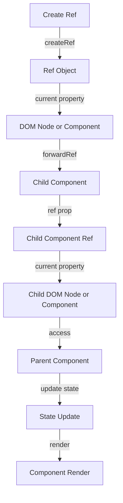

## Introduction
Refs and forwardRef are advanced concepts in React that enable developers to access DOM nodes or React components directly. This is particularly useful when working with third-party libraries or when you need to perform actions that are not possible with the standard React event system. In this section, we will explore why refs and forwardRef matter, their real-world relevance, and why every engineer needs to know about them.

Refs and forwardRef are crucial in React because they provide a way to break the one-way data flow and access the underlying DOM nodes or components. This is essential when working with libraries that require direct access to the DOM or when you need to perform actions that are not possible with the standard React event system.

> **Note:** One common use case for refs is when you need to focus on an input field or scroll to a specific element on the page. In these cases, you need to access the DOM node directly, which is not possible with the standard React event system.

## Core Concepts
In this section, we will explore the precise definitions, mental models, and key terminology related to refs and forwardRef.

* **Refs**: A ref is a reference to a DOM node or a React component. It provides a way to access the underlying DOM node or component directly.
* **forwardRef**: forwardRef is a function that creates a ref and passes it to a component as a prop. It provides a way to forward a ref to a child component.
* **createRef**: createRef is a function that creates a new ref. It is used to create a ref that can be passed to a component as a prop.

> **Tip:** When working with refs, it's essential to understand the difference between a ref and a prop. A prop is a way to pass data from a parent component to a child component, while a ref is a way to access the underlying DOM node or component directly.

## How It Works Internally
In this section, we will explore the under-the-hood mechanics of refs and forwardRef.

When you create a ref using createRef, React creates a new object that contains a current property. The current property is initialized to null and is updated when the component is mounted or updated.

When you pass a ref to a component as a prop, React sets the current property of the ref to the DOM node or component. This allows you to access the DOM node or component directly using the ref.

forwardRef works by creating a new ref and passing it to a component as a prop. When the component is mounted or updated, React sets the current property of the ref to the DOM node or component.

> **Warning:** When working with refs, it's essential to avoid using them to update the state of a component. This can cause unexpected behavior and can lead to bugs that are difficult to debug.

## Code Examples
In this section, we will explore three complete and runnable examples of using refs and forwardRef.

### Example 1: Basic Usage
```javascript
import React, { useRef } from 'react';

function FocusInput() {
  const inputRef = useRef(null);

  const focusInput = () => {
    inputRef.current.focus();
  };

  return (
    <div>
      <input ref={inputRef} type="text" />
      <button onClick={focusInput}>Focus Input</button>
    </div>
  );
}
```
This example demonstrates how to use a ref to focus on an input field.

### Example 2: Real-world Pattern
```javascript
import React, { forwardRef, useRef } from 'react';

const Input = forwardRef((props, ref) => {
  return <input ref={ref} type="text" />;
});

function FocusInput() {
  const inputRef = useRef(null);

  const focusInput = () => {
    inputRef.current.focus();
  };

  return (
    <div>
      <Input ref={inputRef} />
      <button onClick={focusInput}>Focus Input</button>
    </div>
  );
}
```
This example demonstrates how to use forwardRef to forward a ref to a child component.

### Example 3: Advanced Usage
```javascript
import React, { forwardRef, useRef, useState } from 'react';

const Input = forwardRef((props, ref) => {
  return <input ref={ref} type="text" />;
});

function FocusInput() {
  const inputRef = useRef(null);
  const [focused, setFocused] = useState(false);

  const focusInput = () => {
    inputRef.current.focus();
    setFocused(true);
  };

  const blurInput = () => {
    inputRef.current.blur();
    setFocused(false);
  };

  return (
    <div>
      <Input ref={inputRef} />
      <button onClick={focusInput}>Focus Input</button>
      <button onClick={blurInput}>Blur Input</button>
      {focused ? <p>Input is focused</p> : <p>Input is not focused</p>}
    </div>
  );
}
```
This example demonstrates how to use a ref to focus on an input field and update the state of a component.

## Visual Diagram

This diagram illustrates the flow of creating a ref, passing it to a child component, and accessing the DOM node or component.

> **Interview:** When asked about refs and forwardRef, be sure to explain the difference between a ref and a prop and how to use them to access the underlying DOM node or component directly.

## Comparison
| Approach | Time Complexity | Space Complexity | Pros | Cons | Best For |
| --- | --- | --- | --- | --- | --- |
| createRef | O(1) | O(1) | Easy to use, provides direct access to DOM node or component | Can cause memory leaks if not cleaned up | Simple use cases |
| forwardRef | O(1) | O(1) | Provides a way to forward a ref to a child component, allows for more complex use cases | Can be confusing to use, requires understanding of refs and props | Complex use cases, third-party libraries |
| useRef | O(1) | O(1) | Provides a way to create a ref that can be used in functional components | Can cause memory leaks if not cleaned up | Functional components |
| callback ref | O(1) | O(1) | Provides a way to create a ref that can be used in class components | Can be confusing to use, requires understanding of refs and callbacks | Class components |

## Real-world Use Cases
* **Google Maps**: Google Maps uses refs and forwardRef to access the underlying DOM nodes and provide a way to interact with the map.
* **Facebook**: Facebook uses refs and forwardRef to access the underlying DOM nodes and provide a way to interact with the UI components.
* **Airbnb**: Airbnb uses refs and forwardRef to access the underlying DOM nodes and provide a way to interact with the UI components.

## Common Pitfalls
* **Not cleaning up refs**: Failing to clean up refs can cause memory leaks and unexpected behavior.
* **Using refs to update state**: Using refs to update the state of a component can cause unexpected behavior and bugs that are difficult to debug.
* **Not understanding the difference between a ref and a prop**: Not understanding the difference between a ref and a prop can lead to confusion and bugs that are difficult to debug.
* **Not using forwardRef correctly**: Not using forwardRef correctly can lead to confusion and bugs that are difficult to debug.

> **Tip:** When working with refs, make sure to clean up the refs when the component is unmounted to avoid memory leaks.

## Interview Tips
* **What is the difference between a ref and a prop?**: Be sure to explain the difference between a ref and a prop and how to use them to access the underlying DOM node or component directly.
* **How do you use forwardRef?**: Be sure to explain how to use forwardRef to forward a ref to a child component.
* **What are some common use cases for refs and forwardRef?**: Be sure to explain some common use cases for refs and forwardRef, such as focusing on an input field or scrolling to a specific element on the page.

## Key Takeaways
* **Refs provide a way to access the underlying DOM node or component directly**: Refs provide a way to access the underlying DOM node or component directly, which is essential for certain use cases.
* **forwardRef provides a way to forward a ref to a child component**: forwardRef provides a way to forward a ref to a child component, which is essential for certain use cases.
* **Cleaning up refs is essential to avoid memory leaks**: Cleaning up refs is essential to avoid memory leaks and unexpected behavior.
* **Using refs to update state can cause unexpected behavior**: Using refs to update the state of a component can cause unexpected behavior and bugs that are difficult to debug.
* **Understanding the difference between a ref and a prop is essential**: Understanding the difference between a ref and a prop is essential to use them correctly and avoid bugs that are difficult to debug.
* **forwardRef can be confusing to use**: forwardRef can be confusing to use, especially for beginners, so it's essential to understand how to use it correctly.