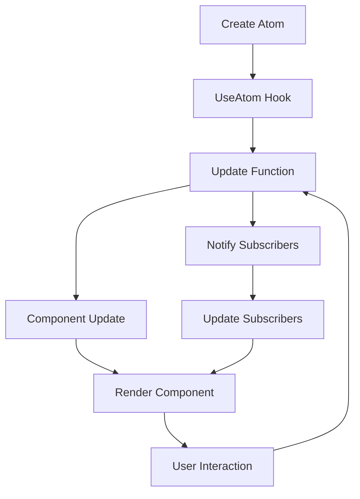

## Introduction
**Jotai** is a state management library for React applications. It provides a simple and efficient way to manage global state by breaking it down into smaller, atomic pieces. This approach makes it easier to manage complex state logic and reduces the overhead of traditional state management solutions. Jotai is designed to be highly scalable and performant, making it suitable for large-scale applications.

In real-world scenarios, Jotai is used in production environments where complex state management is required. For example, it can be used to manage user authentication, shopping cart state, or real-time data updates. Jotai's atomic state management approach makes it an attractive solution for applications that require fine-grained control over state updates.

> **Note:** Jotai is not a replacement for React's built-in state management features, but rather a complementary solution that can be used in conjunction with React's state management APIs.

## Core Concepts
Jotai is built around several key concepts:

* **Atoms**: Atoms are the basic building blocks of Jotai's state management system. They represent a single piece of state that can be updated independently.
* **UseAtom**: The `useAtom` hook is used to connect an atom to a React component. It provides a way to read and update the atom's value.
* **Update**: The `update` function is used to update an atom's value. It takes a callback function that receives the current value of the atom and returns a new value.

Mental models for understanding Jotai include:

* **Immutable State**: Jotai's state is immutable by design. This means that once an atom's value is updated, the previous value is discarded and replaced with a new one.
* **Functional Programming**: Jotai's API is designed with functional programming principles in mind. This means that functions are pure and have no side effects, making it easier to reason about the code.

Key terminology includes:

* **Atom**: A single piece of state that can be updated independently.
* **UseAtom**: A hook that connects an atom to a React component.
* **Update**: A function that updates an atom's value.

## How It Works Internally
Jotai's internal mechanics can be broken down into several steps:

1. **Atom Creation**: When an atom is created, Jotai generates a unique identifier for it.
2. **UseAtom Hook**: When the `useAtom` hook is used, Jotai creates a subscription to the atom's value. This subscription is used to update the component's state when the atom's value changes.
3. **Update Function**: When the `update` function is called, Jotai updates the atom's value and notifies all subscribed components.
4. **Component Update**: When a component's state is updated, React re-renders the component with the new state.

> **Warning:** Jotai's internal mechanics can be complex, and it's easy to introduce performance issues if not used correctly. Make sure to follow best practices and use the `useAtom` hook and `update` function judiciously.

## Code Examples
Here are three complete and runnable code examples that demonstrate Jotai's features:

### Example 1: Basic Usage
```javascript
import { atom, useAtom } from 'jotai';

const countAtom = atom(0);

function Counter() {
  const [count, updateCount] = useAtom(countAtom);

  return (
    <div>
      <p>Count: {count}</p>
      <button onClick={() => updateCount(count + 1)}>Increment</button>
    </div>
  );
}
```

### Example 2: Real-World Pattern
```javascript
import { atom, useAtom } from 'jotai';

const userAtom = atom({
  id: 1,
  name: 'John Doe',
});

function UserProfile() {
  const [user, updateUser] = useAtom(userAtom);

  return (
    <div>
      <p>ID: {user.id}</p>
      <p>Name: {user.name}</p>
      <button onClick={() => updateUser({ ...user, name: 'Jane Doe' })}>
        Update Profile
      </button>
    </div>
  );
}
```

### Example 3: Advanced Usage
```javascript
import { atom, useAtom } from 'jotai';

const cartAtom = atom([]);

function Cart() {
  const [cart, updateCart] = useAtom(cartAtom);

  return (
    <div>
      <h2>Cart</h2>
      <ul>
        {cart.map((item, index) => (
          <li key={index}>
            {item.name} x {item.quantity}
          </li>
        ))}
      </ul>
      <button onClick={() => updateCart([...cart, { name: 'New Item', quantity: 1 }])}>
        Add Item
      </button>
    </div>
  );
}
```

## Visual Diagram


The diagram illustrates the internal mechanics of Jotai, from creating an atom to rendering the component and handling user interactions.

## Comparison
| Approach | Time Complexity | Space Complexity | Pros | Cons | Best For |
| --- | --- | --- | --- | --- | --- |
| Jotai | O(1) | O(n) | Simple, efficient, scalable | Limited functionality | Small to medium-sized applications |
| Redux | O(n) | O(n) | Feature-rich, widely adopted | Complex, verbose | Large-scale applications |
| MobX | O(1) | O(n) | Reactive, efficient | Steep learning curve | Complex, data-driven applications |
| React Context | O(n) | O(n) | Built-in, easy to use | Limited functionality | Small applications |

> **Tip:** When choosing a state management solution, consider the size and complexity of your application, as well as your team's experience and expertise.

## Real-world Use Cases
Here are three real-world use cases for Jotai:

* **Shopping Cart**: Jotai can be used to manage the state of a shopping cart, including the items, quantities, and total cost.
* **User Authentication**: Jotai can be used to manage the state of user authentication, including login, logout, and session management.
* **Real-time Data Updates**: Jotai can be used to manage real-time data updates, such as live scores, stock prices, or weather updates.

## Common Pitfalls
Here are four common pitfalls to avoid when using Jotai:

* **Overusing Atoms**: Creating too many atoms can lead to performance issues and make it difficult to manage state.
* **Not Using Immutable State**: Failing to use immutable state can lead to unexpected behavior and bugs.
* **Not Optimizing Updates**: Failing to optimize updates can lead to performance issues and slow down the application.
* **Not Handling Errors**: Failing to handle errors can lead to crashes and unexpected behavior.

> **Warning:** Jotai's internal mechanics can be complex, and it's easy to introduce performance issues if not used correctly. Make sure to follow best practices and use the `useAtom` hook and `update` function judiciously.

## Interview Tips
Here are three common interview questions for Jotai:

* **What is Jotai and how does it work?**: A strong answer should explain the basics of Jotai, including atoms, the `useAtom` hook, and the `update` function.
* **How do you optimize updates in Jotai?**: A strong answer should explain how to optimize updates using techniques such as memoization and batching.
* **How do you handle errors in Jotai?**: A strong answer should explain how to handle errors using try-catch blocks and error boundaries.

> **Interview:** Be prepared to explain the internal mechanics of Jotai and how to use it effectively in a real-world scenario.

## Key Takeaways
Here are ten key takeaways to remember when using Jotai:

* **Jotai is a state management library for React applications**.
* **Atoms are the basic building blocks of Jotai's state management system**.
* **The `useAtom` hook is used to connect an atom to a React component**.
* **The `update` function is used to update an atom's value**.
* **Jotai's internal mechanics can be complex, and it's easy to introduce performance issues if not used correctly**.
* **Immutable state is essential for using Jotai effectively**.
* **Optimizing updates is crucial for performance**.
* **Error handling is essential for robustness**.
* **Jotai is suitable for small to medium-sized applications**.
* **Jotai has a steep learning curve, but it's worth the investment**.

> **Tip:** Remember to follow best practices and use the `useAtom` hook and `update` function judiciously to avoid performance issues and bugs.