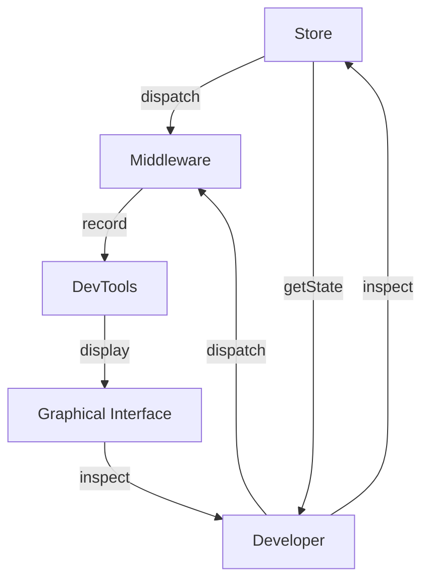

## Introduction
Redux DevTools is a set of tools that helps developers debug and optimize their Redux applications. It provides a graphical interface to inspect the state of the application, dispatch actions, and visualize the state changes over time. Redux DevTools is an essential tool for any React developer working with Redux, as it helps to identify and fix issues quickly and efficiently. In real-world applications, Redux DevTools is used by companies like Facebook, Twitter, and Airbnb to debug and optimize their complex React applications.

## Core Concepts
The core concepts of Redux DevTools include:
* **Store**: The central location that holds the entire state of the application.
* **Actions**: Payloads that are sent to the store to update the state.
* **Reducers**: Pure functions that take the current state and an action, and return a new state.
* **Middleware**: Functions that can intercept and modify actions before they reach the store.
* **Time Travel**: The ability to move back and forth through the state changes, inspecting the state at each point in time.

> **Note:** Understanding these core concepts is crucial to using Redux DevTools effectively.

## How It Works Internally
Redux DevTools works by instrumenting the Redux store with a special kind of middleware that records every state change. This middleware sends the state changes to the DevTools, which then displays them in a graphical interface. The DevTools also provides a set of APIs that allow developers to interact with the store, dispatch actions, and inspect the state.

Here is a high-level overview of the steps involved:
1. The developer sets up the Redux store with the DevTools middleware.
2. The middleware records every state change and sends it to the DevTools.
3. The DevTools displays the state changes in a graphical interface.
4. The developer can interact with the store using the DevTools APIs.

## Code Examples
### Example 1: Basic Usage
```javascript
// Import the Redux DevTools
import { createStore, applyMiddleware } from 'redux';
import { devToolsEnhancer } from 'redux-devtools-extension';

// Create the store with the DevTools middleware
const store = createStore(
  reducer,
  devToolsEnhancer()
);
```
This example shows how to set up the Redux store with the DevTools middleware.

### Example 2: Dispatching Actions
```javascript
// Import the Redux DevTools
import { createStore, applyMiddleware } from 'redux';
import { devToolsEnhancer } from 'redux-devtools-extension';

// Create the store with the DevTools middleware
const store = createStore(
  reducer,
  devToolsEnhancer()
);

// Dispatch an action
store.dispatch({
  type: 'ADD_ITEM',
  payload: 'New item'
});
```
This example shows how to dispatch an action using the store.

### Example 3: Inspecting State
```javascript
// Import the Redux DevTools
import { createStore, applyMiddleware } from 'redux';
import { devToolsEnhancer } from 'redux-devtools-extension';

// Create the store with the DevTools middleware
const store = createStore(
  reducer,
  devToolsEnhancer()
);

// Inspect the state
console.log(store.getState());
```
This example shows how to inspect the state using the `getState()` method.

## Visual Diagram

This diagram shows the flow of data between the store, middleware, DevTools, and graphical interface.

> **Tip:** Using the graphical interface to inspect the state changes over time can help identify issues that are difficult to reproduce.

## Comparison
| Tool | Time Complexity | Space Complexity | Pros | Cons | Best For |
| --- | --- | --- | --- | --- | --- |
| Redux DevTools | O(1) | O(n) | Graphical interface, time travel, inspection | Steep learning curve, resource-intensive | Complex React applications |
| React DevTools | O(1) | O(n) | Component tree, props, state | Limited functionality, not optimized for Redux | Simple React applications |
| Chrome DevTools | O(1) | O(n) | Network inspection, console logging | Not optimized for Redux, limited functionality | General web development |
| Redux Logger | O(1) | O(n) | Simple logging, easy to use | Limited functionality, not graphical | Small React applications |

## Real-world Use Cases
* Facebook: Uses Redux DevTools to debug and optimize their complex React applications.
* Twitter: Uses Redux DevTools to inspect and debug their state changes over time.
* Airbnb: Uses Redux DevTools to identify and fix issues in their complex React applications.

> **Warning:** Not using Redux DevTools can lead to difficult-to-debug issues and decreased productivity.

## Common Pitfalls
* Not setting up the DevTools middleware correctly.
* Not using the graphical interface to inspect state changes.
* Not dispatching actions correctly.
* Not using the `getState()` method to inspect the state.

Here is an example of the wrong way to set up the DevTools middleware:
```javascript
// Incorrectly setting up the DevTools middleware
const store = createStore(
  reducer,
  // Missing devToolsEnhancer()
);
```
And here is the correct way:
```javascript
// Correctly setting up the DevTools middleware
const store = createStore(
  reducer,
  devToolsEnhancer()
);
```
## Interview Tips
* What is the purpose of Redux DevTools? **Answer:** To debug and optimize Redux applications.
* How do you set up the DevTools middleware? **Answer:** By importing the `devToolsEnhancer` function and passing it to the `createStore` function.
* What is the time complexity of the DevTools middleware? **Answer:** O(1).

> **Interview:** Be prepared to explain the benefits and trade-offs of using Redux DevTools.

## Key Takeaways
* Redux DevTools is a set of tools that helps developers debug and optimize their Redux applications.
* The core concepts of Redux DevTools include store, actions, reducers, middleware, and time travel.
* The DevTools middleware records every state change and sends it to the graphical interface.
* The graphical interface provides a set of APIs that allow developers to interact with the store and inspect the state.
* The time complexity of the DevTools middleware is O(1).
* The space complexity of the DevTools middleware is O(n).
* Redux DevTools is best used for complex React applications.
* Not using Redux DevTools can lead to difficult-to-debug issues and decreased productivity.