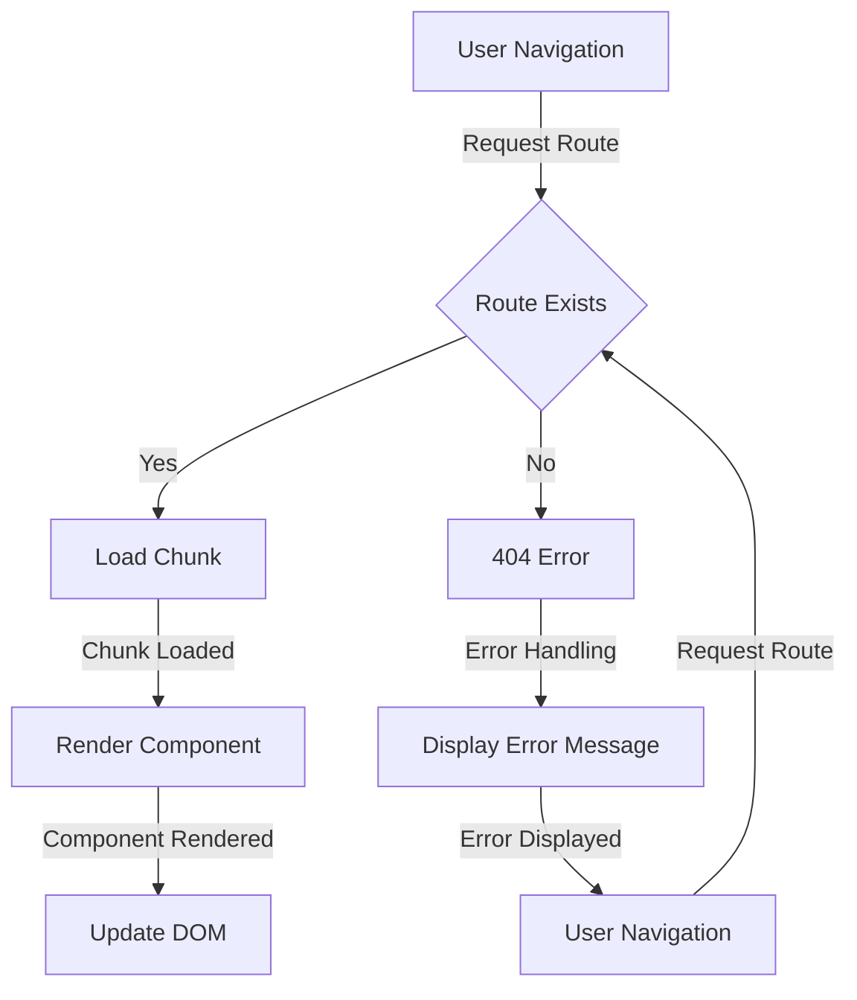

## Introduction
**Lazy loading routes** is a technique used in web development to improve the performance of single-page applications (SPAs) by loading routes or components on demand, rather than loading all of them upfront. This approach is particularly useful for large-scale applications with many routes, as it helps reduce the initial bundle size and improves the overall user experience. In this section, we will explore the concept of lazy loading routes, its importance, and its real-world relevance.

In real-world scenarios, lazy loading routes is commonly used in applications with a large number of routes, such as e-commerce websites, social media platforms, and online learning platforms. For example, a user may only need to access a specific section of the application, and loading all the routes upfront can be unnecessary and inefficient. By using lazy loading routes, developers can ensure that only the required routes are loaded, resulting in faster page loads and improved performance.

> **Note:** Lazy loading routes is not limited to React applications, but can be applied to other frameworks and libraries as well.

## Core Concepts
To understand lazy loading routes, it's essential to grasp the following core concepts:

* **Code splitting**: the process of splitting a large codebase into smaller, independent chunks that can be loaded on demand.
* **Route**: a specific path or URL that maps to a particular component or section of the application.
* **Component**: a self-contained piece of code that represents a specific part of the application's UI.
* **Lazy loading**: the technique of loading code or components only when they are needed, rather than loading them upfront.

Mental models and analogies can help make these concepts more accessible:

* Think of code splitting as organizing a large library into smaller, categorized sections. Each section can be accessed independently, without having to navigate through the entire library.
* Imagine a route as a specific address that leads to a particular component or section of the application. Just as a physical address can be used to navigate to a specific location, a route can be used to navigate to a specific part of the application.

Key terminology includes:

* **Bundle**: the compiled and optimized code that is loaded by the browser.
* **Chunk**: a smaller, independent piece of code that can be loaded on demand.
* **Loader**: a function or module that is responsible for loading a specific chunk or route.

## How It Works Internally
Lazy loading routes works by using a combination of code splitting and dynamic imports. Here's a step-by-step breakdown of the process:

1. **Code splitting**: the application's code is split into smaller chunks, each containing a specific set of routes or components.
2. **Dynamic imports**: when a user navigates to a specific route, the application uses dynamic imports to load the required chunk or component.
3. **Loader**: the loader function or module is responsible for loading the required chunk or component.
4. **Cache**: the loaded chunk or component is cached to prevent repeated loading.

Under-the-hood mechanics include:

* **Webpack**: a popular bundler that supports code splitting and dynamic imports.
* **React.lazy**: a built-in React function that enables lazy loading of components.
* **Suspense**: a React component that provides a fallback UI while the required chunk or component is being loaded.

> **Warning:** lazy loading routes can introduce additional complexity and may require careful optimization to ensure optimal performance.

## Code Examples
Here are three complete and runnable code examples that demonstrate lazy loading routes:

### Example 1: Basic Lazy Loading
```javascript
import React, { Suspense, lazy } from 'react';
import { BrowserRouter, Route, Switch } from 'react-router-dom';

const Home = lazy(() => import('./Home'));
const About = lazy(() => import('./About'));

function App() {
  return (
    <BrowserRouter>
      <Suspense fallback={<div>Loading...</div>}>
        <Switch>
          <Route path="/" exact component={Home} />
          <Route path="/about" component={About} />
        </Switch>
      </Suspense>
    </BrowserRouter>
  );
}
```
This example demonstrates basic lazy loading using React.lazy and Suspense.

### Example 2: Real-World Pattern
```javascript
import React, { Suspense, lazy } from 'react';
import { BrowserRouter, Route, Switch } from 'react-router-dom';
import { Container } from 'reactstrap';

const Home = lazy(() => import('./Home'));
const About = lazy(() => import('./About'));
const Contact = lazy(() => import('./Contact'));

function App() {
  return (
    <BrowserRouter>
      <Container>
        <Suspense fallback={<div>Loading...</div>}>
          <Switch>
            <Route path="/" exact component={Home} />
            <Route path="/about" component={About} />
            <Route path="/contact" component={Contact} />
          </Switch>
        </Suspense>
      </Container>
    </BrowserRouter>
  );
}
```
This example demonstrates a real-world pattern using lazy loading with multiple routes and a container component.

### Example 3: Advanced Usage
```javascript
import React, { Suspense, lazy } from 'react';
import { BrowserRouter, Route, Switch } from 'react-router-dom';
import { Container } from 'reactstrap';

const Home = lazy(() => import('./Home'));
const About = lazy(() => import('./About'));
const Contact = lazy(() => import('./Contact'));

const routes = [
  { path: '/', component: Home },
  { path: '/about', component: About },
  { path: '/contact', component: Contact },
];

function App() {
  return (
    <BrowserRouter>
      <Container>
        <Suspense fallback={<div>Loading...</div>}>
          <Switch>
            {routes.map((route, index) => (
              <Route key={index} path={route.path} component={route.component} />
            ))}
          </Switch>
        </Suspense>
      </Container>
    </BrowserRouter>
  );
}
```
This example demonstrates advanced usage of lazy loading with an array of routes.

## Visual Diagram

This diagram illustrates the lazy loading process, including user navigation, route checking, chunk loading, component rendering, and error handling.

> **Tip:** using a diagram can help visualize the lazy loading process and identify potential bottlenecks or areas for optimization.

## Comparison
| Approach | Time Complexity | Space Complexity | Pros | Cons | Best For |
| --- | --- | --- | --- | --- | --- |
| Lazy Loading | O(1) | O(n) | Improved performance, reduced bundle size | Increased complexity, potential for errors | Large-scale applications with many routes |
| Eager Loading | O(n) | O(n) | Simple implementation, easy to debug | Poor performance, large bundle size | Small-scale applications with few routes |
| Code Splitting | O(n) | O(n) | Improved performance, reduced bundle size | Increased complexity, potential for errors | Applications with complex routing logic |
| Server-Side Rendering | O(n) | O(n) | Improved SEO, faster page loads | Increased complexity, potential for errors | Applications with complex routing logic and SEO requirements |

> **Interview:** what is the time complexity of lazy loading routes, and how does it compare to eager loading?

## Real-world Use Cases
Here are three real-world examples of lazy loading routes:

* **Facebook**: uses lazy loading to load specific components and routes on demand, improving performance and reducing the initial bundle size.
* **Twitter**: uses code splitting and lazy loading to load tweets and other content on demand, improving performance and reducing the initial bundle size.
* **Netflix**: uses server-side rendering and lazy loading to load specific components and routes on demand, improving performance and reducing the initial bundle size.

## Common Pitfalls
Here are four common pitfalls to avoid when using lazy loading routes:

* **Incorrectly configured Webpack**: can lead to errors and poor performance.
* **Insufficient caching**: can lead to repeated loading of chunks and poor performance.
* **Incorrectly implemented Suspense**: can lead to errors and poor performance.
* **Insufficient testing**: can lead to errors and poor performance.

> **Warning:** lazy loading routes can introduce additional complexity and require careful optimization to ensure optimal performance.

## Interview Tips
Here are three common interview questions related to lazy loading routes, along with weak and strong answers:

* **Question:** what is the difference between lazy loading and eager loading?
* **Weak answer:** lazy loading is when you load something later, and eager loading is when you load something sooner.
* **Strong answer:** lazy loading is a technique used to improve performance by loading code or components on demand, whereas eager loading loads all code or components upfront. Lazy loading is particularly useful for large-scale applications with many routes.
* **Question:** how do you optimize lazy loading routes for performance?
* **Weak answer:** you can use caching and minimize the number of requests.
* **Strong answer:** to optimize lazy loading routes for performance, you can use caching, minimize the number of requests, and optimize the chunk size and loading order. Additionally, you can use tools like Webpack and React.lazy to simplify the process and improve performance.
* **Question:** what are some common pitfalls to avoid when using lazy loading routes?
* **Weak answer:** you should avoid loading too many chunks at once.
* **Strong answer:** some common pitfalls to avoid when using lazy loading routes include incorrectly configured Webpack, insufficient caching, incorrectly implemented Suspense, and insufficient testing. Additionally, you should avoid loading too many chunks at once and ensure that the chunk size and loading order are optimized for performance.

## Key Takeaways
Here are six key takeaways to remember when using lazy loading routes:

* **Lazy loading improves performance**: by loading code or components on demand, lazy loading can improve performance and reduce the initial bundle size.
* **Code splitting is essential**: code splitting is a critical component of lazy loading, as it allows you to split your code into smaller, independent chunks that can be loaded on demand.
* **Suspense is important**: Suspense is a React component that provides a fallback UI while the required chunk or component is being loaded.
* **Caching is crucial**: caching is essential for optimizing lazy loading routes, as it can reduce the number of requests and improve performance.
* **Webpack and React.lazy simplify the process**: Webpack and React.lazy are tools that can simplify the process of implementing lazy loading routes and improve performance.
* **Optimization is key**: optimization is critical for ensuring optimal performance when using lazy loading routes. This includes optimizing the chunk size and loading order, minimizing the number of requests, and using caching and other techniques to improve performance.